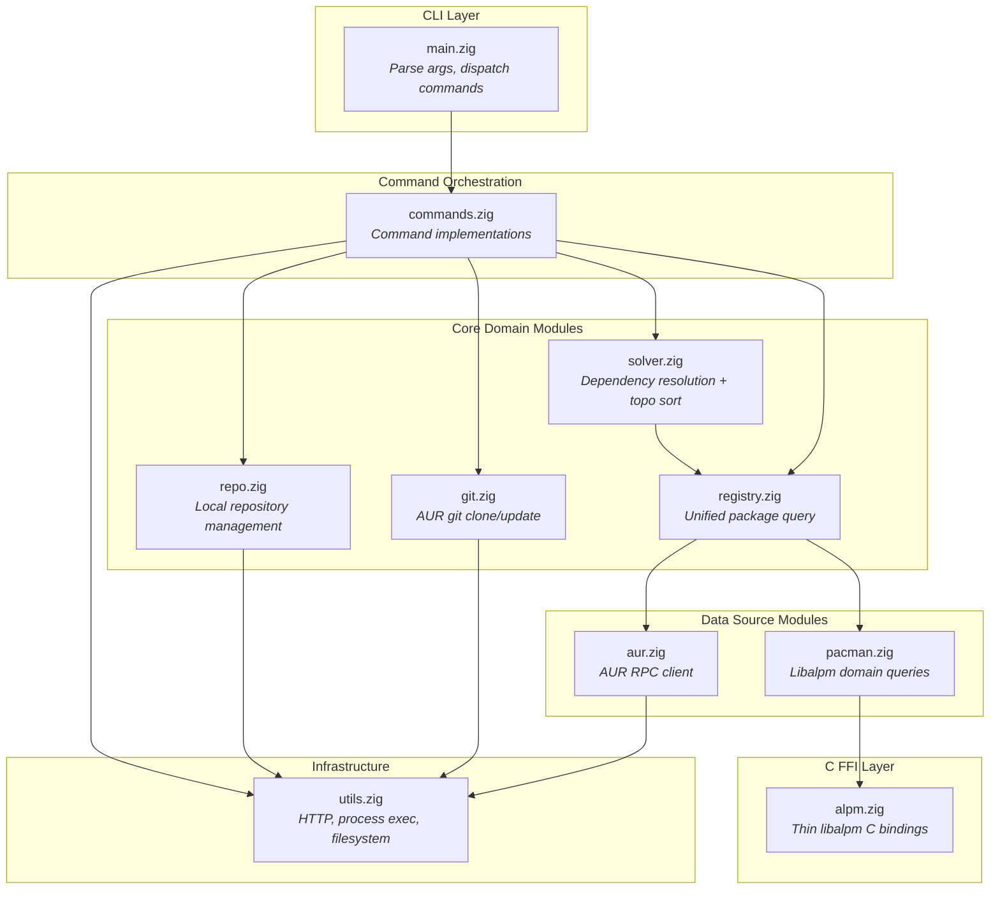
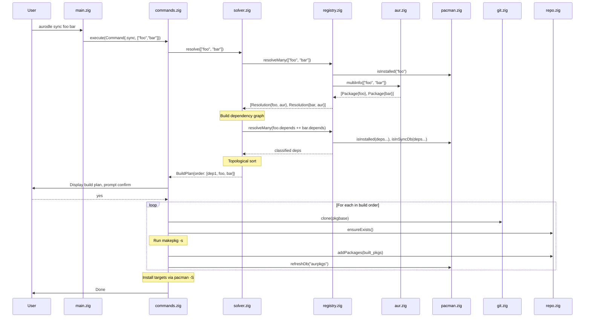
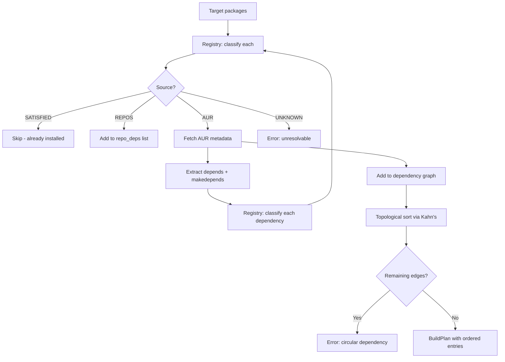

# Aurodle AUR Helper — Software Architecture

## Overview

Aurodle is a minimalist AUR helper written in Zig that builds AUR packages into a local pacman repository. The architecture is designed around **deep modules with simple interfaces** — each module hides significant complexity (C FFI, HTTP/JSON, graph algorithms, filesystem operations) behind narrow, Zig-idiomatic APIs.

The central architectural decision is the **Package Registry mediator**: rather than having the dependency resolver directly couple to both AUR and libalpm, a unified `PackageRegistry` module provides a single query interface. This pulls complexity downward — the resolver expresses intent ("find package X"), and the registry decides where and how to look. This also enables testing the resolver with a mock registry without standing up HTTP servers or libalpm databases.

The libalpm boundary uses a **two-layer design**: a thin C FFI wrapper (`alpm.zig`) that translates C types to Zig types with zero domain logic, consumed by a higher-level module (`pacman.zig`) that provides domain-meaningful operations like "is this dependency satisfied?" and "which repo owns this package?". This prevents C interop details from leaking into business logic.

The architecture is presented in three phases — initial (7 files), standard (12 files), and advanced (18+ files) — with explicit triggers for when to split. Each phase is a valid, complete architecture, not a half-finished version of the next.

## Design Principles Applied

### Deep Modules (Ousterhout Ch. 4)

Every module is designed to maximize the ratio of hidden complexity to interface surface area. The AUR client hides HTTP connection management, JSON parsing, response caching, batch request splitting, and error mapping behind three methods (`info`, `search`, `multiInfo`). The resolver hides graph construction, cycle detection, topological sorting, and dependency classification behind a single `resolve()` call.

### Information Hiding (Ousterhout Ch. 5)

Each module encapsulates decisions likely to change:
- `alpm.zig` hides the exact libalpm C API version and calling conventions
- `aur.zig` hides the AUR RPC protocol version, URL scheme, and JSON schema
- `repo.zig` hides the `repo-add` CLI interface and filesystem layout
- `git.zig` hides git CLI invocation details

If AUR switches to RPC v6, only `aur.zig` changes. If libalpm changes its `alpm_pkg_vercmp` signature, only `alpm.zig` changes.

### Different Layer, Different Abstraction (Ousterhout Ch. 7)

Each layer transforms the abstraction level:
1. **C FFI layer** (`alpm.zig`): Raw C pointers → Zig slices and optionals
2. **Domain layer** (`pacman.zig`): Zig types → domain queries ("is dependency satisfied?")
3. **Registry layer** (`registry.zig`): Domain queries → unified multi-source lookup
4. **Resolution layer** (`solver.zig`): Unified lookups → ordered build plan

A pass-through method at any layer signals a design problem.

### Pull Complexity Downward (Ousterhout Ch. 10)

The `PackageRegistry` absorbs the complexity of multi-source package resolution — checking installed packages first, then sync databases, then AUR — so the resolver's algorithm stays clean. Similarly, `repo.zig` absorbs the complexity of locating built packages (resolving `$PKGDEST`, handling split packages) so that command orchestration code stays simple.

### Define Errors Out of Existence (Ousterhout Ch. 10)

Where possible, modules eliminate error conditions rather than propagating them:
- `repo.zig` auto-creates the repository directory and database on first use (no "repository doesn't exist" error for the caller)
- `git.zig` treats "already cloned" as a success, not an error (idempotent clone)
- `aur.zig` caches results so duplicate queries within a session are free (no "duplicate request" concern)

## Module Structure



---

### Module: `main.zig`

- **Responsibility**: Parse CLI arguments, validate command structure, dispatch to command handlers, format top-level errors to stderr.
- **Interface**:
  ```zig
  pub fn main() u8  // returns exit code
  ```
- **Hidden Complexity**: Argument tokenization, flag validation, help text generation, exit code mapping from error types.
- **Depth Score**: **Medium** — Interface is trivially simple (it's `main`), but the internal complexity is moderate (CLI parsing, error formatting). This is acceptable for an entry point module.

---

### Module: `commands.zig`

- **Responsibility**: Implement all command workflows by orchestrating core modules. Each command is a function that coordinates the sequence: resolve → clone → review → build → install.
- **Interface**:
  ```zig
  pub const Command = struct {
      operation: Operation,
      targets: []const []const u8,
      flags: Flags,
  };

  pub fn execute(allocator: Allocator, cmd: Command) !void
  ```
- **Hidden Complexity**: Per-command workflow orchestration, user prompting (confirmation, review display), progress output, partial failure handling (continue building after one package fails), privilege escalation for pacman calls.
- **Depth Score**: **Medium → Deep** — Starts medium when there are few commands, becomes deep as workflows grow complex (sync, upgrade). This is the primary candidate for splitting (see Phase 2).

**Split trigger**: When `commands.zig` exceeds ~600 lines or when adding `upgrade`/`outdated`, split into:
- `commands/query.zig` — info, search, outdated
- `commands/build.zig` — clone, show, build, sync, upgrade
- `commands/analysis.zig` — resolve, buildorder

---

### Module: `aur.zig`

- **Responsibility**: All communication with the AUR RPC API. Handles HTTP requests, JSON parsing, response caching, request batching, and error mapping.
- **Interface**:
  ```zig
  pub const Client = struct {
      pub fn init(allocator: Allocator) Client
      pub fn deinit(self: *Client) void

      pub fn info(self: *Client, name: []const u8) !?Package
      pub fn multiInfo(self: *Client, names: []const []const u8) ![]Package
      pub fn search(self: *Client, query: []const u8, by: SearchField) ![]Package
  };

  pub const Package = struct {
      name: []const u8,
      pkgbase: []const u8,
      version: []const u8,
      description: ?[]const u8,
      depends: []const []const u8,
      makedepends: []const []const u8,
      checkdepends: []const []const u8,
      optdepends: []const []const u8,
      provides: []const []const u8,
      conflicts: []const []const u8,
      maintainer: ?[]const u8,
      votes: u32,
      popularity: f64,
      last_modified: i64,
      out_of_date: ?i64,
      url: ?[]const u8,
      licenses: []const []const u8,
      // ... other metadata
  };
  ```
- **Hidden Complexity**: HTTP connection management via `std.http.Client`, JSON parsing of AUR RPC v5 responses, in-memory `HashMap` cache keyed by package name, automatic batch splitting at AUR's 100-package limit for `multiInfo`, URL construction and encoding, rate-limit detection and clear error reporting, response validation.
- **Depth Score**: **Deep** — Three public methods hide ~400-500 lines of HTTP, JSON, caching, and batching logic. This is the ideal depth ratio.

---

### Module: `alpm.zig`

- **Responsibility**: Thin, mechanical translation of libalpm C API to Zig types. No domain logic. Translates `[*c]const u8` to `[]const u8`, null pointers to optionals, C error codes to Zig errors.
- **Interface**:
  ```zig
  pub const Handle = struct {
      pub fn init(root: []const u8, dbpath: []const u8) !Handle
      pub fn deinit(self: *Handle) void
      pub fn registerSyncDb(self: *Handle, name: []const u8, siglevel: SigLevel) !Database
      pub fn getLocalDb(self: *Handle) Database
  };

  pub const Database = struct {
      pub fn getPackage(self: Database, name: []const u8) ?AlpmPackage
      pub fn search(self: Database, needles: []const []const u8) !PackageList
      pub fn update(self: Database, force: bool) !void
  };

  pub const AlpmPackage = struct {
      pub fn getName(self: AlpmPackage) []const u8
      pub fn getVersion(self: AlpmPackage) []const u8
      pub fn getDepends(self: AlpmPackage) DependencyList
      pub fn getProvides(self: AlpmPackage) DependencyList
      // ...
  };

  pub fn vercmp(a: []const u8, b: []const u8) i32
  ```
- **Hidden Complexity**: All `@cImport` / C header inclusion, pointer arithmetic for libalpm linked lists (`alpm_list_t`), null-terminated string conversion, C error code translation, memory ownership boundaries (what libalpm owns vs. what we must free).
- **Depth Score**: **Deep** — Simple Zig-native interface hides the full complexity of C interop. Callers never see a C pointer.

---

### Module: `pacman.zig`

- **Responsibility**: High-level domain operations on local and sync databases. Answers domain questions: "Is this package installed?", "Which database provides this package?", "Does version X satisfy constraint Y?".
- **Interface**:
  ```zig
  pub const Pacman = struct {
      pub fn init(allocator: Allocator) !Pacman
      pub fn deinit(self: *Pacman) void

      pub fn isInstalled(self: *Pacman, name: []const u8) bool
      pub fn installedVersion(self: *Pacman, name: []const u8) ?[]const u8
      pub fn isInSyncDb(self: *Pacman, name: []const u8) bool
      pub fn satisfies(self: *Pacman, name: []const u8, constraint: VersionConstraint) bool
      pub fn findProvider(self: *Pacman, dep: []const u8) ?[]const u8
      pub fn refreshDb(self: *Pacman, dbname: []const u8) !void
  };

  pub const VersionConstraint = struct {
      op: enum { eq, ge, le, gt, lt },
      version: []const u8,
  };
  ```
- **Hidden Complexity**: libalpm handle initialization from `/etc/pacman.conf`, sync database registration, the distinction between local and sync databases, `alpm_pkg_vercmp` semantics, dependency string parsing (`pkg>=1.0` → name + constraint), provides/virtual package resolution through libalpm's dependency satisfaction API.
- **Depth Score**: **Deep** — Domain-meaningful methods hide the full libalpm query model. Callers ask "is this satisfied?" not "iterate the local database, find the package, extract its version, parse the constraint, call vercmp".

---

### Module: `registry.zig`

- **Responsibility**: Unified package lookup across all sources. Implements the lookup priority: installed → sync databases → AUR. Classifies each package by source.
- **Interface**:
  ```zig
  pub const Registry = struct {
      pub fn init(allocator: Allocator, pacman: *Pacman, aur: *aur.Client) Registry
      pub fn deinit(self: *Registry) void

      pub fn resolve(self: *Registry, name: []const u8) !Resolution
      pub fn resolveMany(self: *Registry, names: []const []const u8) ![]Resolution
      pub fn classify(self: *Registry, name: []const u8) !Source

      pub const Source = enum { satisfied, repos, aur, unknown };
      pub const Resolution = struct {
          name: []const u8,
          source: Source,
          version: ?[]const u8,
          aur_pkg: ?aur.Package,
      };
  };
  ```
- **Hidden Complexity**: Multi-source lookup ordering and short-circuiting, AUR batch query optimization (collects unknown packages and issues a single `multiInfo`), result caching across multiple calls within a session, version constraint satisfaction checking, provider resolution for virtual packages.
- **Depth Score**: **Deep** — The mediator pattern pays off here. The resolver calls `registry.resolve("libfoo>=2.0")` and gets back a classified result without knowing anything about libalpm queries, AUR HTTP calls, or caching strategies.

---

### Module: `solver.zig`

- **Responsibility**: Dependency resolution and build order generation. Builds a dependency graph, detects cycles, performs topological sort, classifies each node.
- **Interface**:
  ```zig
  pub const Solver = struct {
      pub fn init(allocator: Allocator, registry: *Registry) Solver
      pub fn deinit(self: *Solver) void

      pub fn resolve(self: *Solver, targets: []const []const u8) !BuildPlan

      pub const BuildPlan = struct {
          /// Packages in topological build order (AUR packages only)
          build_order: []const BuildEntry,
          /// All classified dependencies (for display)
          all_deps: []const DependencyEntry,
          /// Packages that need to be installed from repos first
          repo_deps: []const []const u8,
      };

      pub const BuildEntry = struct {
          name: []const u8,
          pkgbase: []const u8,
          version: []const u8,
          is_target: bool,
      };

      pub const DependencyEntry = struct {
          name: []const u8,
          source: Registry.Source,
          is_target: bool,
          depth: u32,
      };
  };
  ```
- **Hidden Complexity**: Recursive dependency graph construction with cycle detection (via coloring: white/gray/black), pkgname-to-pkgbase deduplication (multiple pkgnames may share a pkgbase — only build once), topological sort using Kahn's algorithm, dependency type handling (depends vs makedepends vs checkdepends), the distinction between "needed for build order" and "needed for display".
- **Depth Score**: **Deep** — A single `resolve()` call hides the entire graph algorithm pipeline. The caller gets a ready-to-execute build plan.

---

### Module: `repo.zig`

- **Responsibility**: Local pacman repository management. Creates the repository, adds built packages, maintains the database.
- **Interface**:
  ```zig
  pub const Repository = struct {
      pub fn init(allocator: Allocator) !Repository
      pub fn deinit(self: *Repository) void

      pub fn ensureExists(self: *Repository) !void
      pub fn addPackages(self: *Repository, pkg_paths: []const []const u8) !void
      pub fn isConfigured(self: *Repository) !bool
      pub fn configInstructions() []const u8
  };
  ```
- **Hidden Complexity**: Directory creation (`~/.cache/aurodle/aurpkgs/`), `repo-add -R` invocation, locating built packages by resolving `$PKGDEST` from makepkg.conf, copying packages to the repository directory, handling split packages (multiple `.pkg.tar.*` files from one build), database integrity, pacman.conf validation (checking `[aurpkgs]` section exists).
- **Depth Score**: **Deep** — Four methods hide all filesystem operations, external tool invocation, and configuration checking.

---

### Module: `git.zig`

- **Responsibility**: Clone and update AUR git repositories.
- **Interface**:
  ```zig
  pub fn clone(allocator: Allocator, pkgbase: []const u8) !CloneResult
  pub fn update(allocator: Allocator, pkgbase: []const u8) !UpdateResult

  pub const CloneResult = enum { cloned, already_exists };
  pub const UpdateResult = enum { updated, up_to_date };
  ```
- **Hidden Complexity**: URL construction (`https://aur.archlinux.org/{pkgbase}.git`), cache directory management, git CLI invocation, idempotent clone (existing directory is success, not error), git pull for updates.
- **Depth Score**: **Medium** — Simple operations but the interface is proportionally simple. Acceptable — not every module needs to be deep.

---

### Module: `utils.zig`

- **Responsibility**: Shared infrastructure — HTTP client, child process execution with output capture, filesystem helpers.
- **Interface**:
  ```zig
  pub fn httpGet(allocator: Allocator, url: []const u8) ![]u8
  pub fn runCommand(allocator: Allocator, argv: []const []const u8) !ProcessResult
  pub fn runCommandWithLog(allocator: Allocator, argv: []const []const u8, log_path: []const u8) !ProcessResult
  pub fn expandHome(allocator: Allocator, path: []const u8) ![]u8

  pub const ProcessResult = struct {
      exit_code: u8,
      stdout: []const u8,
      stderr: []const u8,
  };
  ```
- **Hidden Complexity**: `std.http.Client` lifecycle, TLS setup, child process spawning with pipe management, concurrent stdout/stderr capture, tee-to-log-file during real-time display, home directory expansion.
- **Depth Score**: **Medium** — Utility modules are inherently shallower (Ousterhout warns about this). Kept minimal to avoid becoming a dumping ground.

**Split trigger**: When `utils.zig` exceeds ~300 lines, split into `http.zig`, `process.zig`, `fs.zig`.

---

## Layer Architecture

```
┌─────────────────────────────────────────────────────┐
│  CLI Layer                                          │
│  main.zig — parse args, dispatch, format errors     │
├─────────────────────────────────────────────────────┤
│  Command Orchestration Layer                        │
│  commands.zig — workflow sequences, user I/O        │
├──────────────┬──────────────┬───────────────────────┤
│  Resolution  │  Operations  │  Repository           │
│  solver.zig  │  git.zig     │  repo.zig             │
├──────────────┴──────────────┴───────────────────────┤
│  Mediation Layer                                    │
│  registry.zig — unified multi-source package query  │
├────────────────────┬────────────────────────────────┤
│  AUR Data Source   │  Local Data Source              │
│  aur.zig           │  pacman.zig                     │
├────────────────────┴────────┬───────────────────────┤
│  C FFI Layer                │  Infrastructure        │
│  alpm.zig                   │  utils.zig             │
└─────────────────────────────┴───────────────────────┘
```

**Each layer provides a different abstraction level:**

1. **C FFI Layer**: Translates C memory model → Zig memory model (pointers → slices, nulls → optionals)
2. **Data Source Layer**: Translates raw data → domain answers ("is installed?", "what version?")
3. **Mediation Layer**: Translates domain answers → unified classified lookups
4. **Resolution Layer**: Translates classified lookups → ordered build plans
5. **Command Layer**: Translates build plans → user-visible workflows with I/O
6. **CLI Layer**: Translates user input → typed command structures

No layer is a pass-through. Each transforms the abstraction meaningfully.

## Phase Architecture

### Phase 1: Initial (9 files) — Core MVP

```
src/
├── main.zig          # CLI parsing, dispatch
├── commands.zig      # All command implementations
├── aur.zig           # AUR RPC client
├── alpm.zig          # Thin libalpm C FFI
├── pacman.zig        # High-level libalpm domain queries
├── registry.zig      # Unified package lookup
├── solver.zig        # Dependency resolution + topo sort
├── repo.zig          # Local repository management
├── git.zig           # Git clone operations
└── utils.zig         # HTTP, process, filesystem helpers
```

**Commands implemented**: info, search, clone, build, sync, resolve, buildorder

**Why 10 files, not 7**: The thin-wrapper + domain-module pattern for libalpm (alpm.zig + pacman.zig) and the mediator pattern (registry.zig) each add one file. This is justified because:
- `alpm.zig` vs `pacman.zig` prevents C types from leaking (information hiding)
- `registry.zig` makes the resolver testable without real data sources (design for testability)

### Phase 2: Standard (14 files) — Post-MVP

**Trigger**: `commands.zig` exceeds ~600 lines (adding upgrade, outdated, show workflows).

```
src/
├── main.zig
├── commands/
│   ├── query.zig       # info, search, outdated
│   ├── build.zig       # clone, show, build, sync, upgrade
│   └── analysis.zig    # resolve, buildorder
├── aur.zig
├── alpm.zig
├── pacman.zig
├── registry.zig
├── solver.zig
├── repo.zig
├── git.zig
├── utils/
│   ├── http.zig
│   ├── process.zig
│   └── fs.zig
└── config.zig          # Environment variable + makepkg.conf reading
```

**New capabilities**: outdated detection, upgrade workflow, show/review, `$PKGDEST`/`$AURDEST` support, pacman.conf Color/VerbosePkgLists.

### Phase 3: Advanced (18+ files) — Power User Features

**Trigger**: Provider resolution, conflict detection, or chroot builds needed.

```
src/
├── main.zig
├── commands/
│   ├── query.zig
│   ├── build.zig
│   └── analysis.zig
├── aur.zig
├── alpm.zig
├── pacman.zig
├── registry.zig
├── solver/
│   ├── resolver.zig     # Core resolution algorithm
│   ├── graph.zig        # Dependency graph data structure
│   └── providers.zig    # Virtual package + conflict resolution
├── repo.zig
├── git.zig
├── config.zig
├── cache.zig            # Cache cleanup operations
└── utils/
    ├── http.zig
    ├── process.zig
    └── fs.zig
```

## Design Decisions

| Decision | Options Considered | Choice | Rationale |
|----------|-------------------|--------|-----------|
| libalpm integration | (A) Single deep module (B) Thin wrapper + domain module (C) Auto-generated bindings | **(B) Thin wrapper + domain** | Prevents C type leakage. `alpm.zig` changes only for libalpm API changes; `pacman.zig` changes only for domain logic changes. Each has one reason to change (SRP). |
| Data source access from resolver | (A) Direct dependencies (B) Injected interfaces (C) Mediator (PackageRegistry) | **(C) Mediator** | Pulls lookup complexity downward. Resolver stays a pure graph algorithm. Registry absorbs source priority, batching, and caching. Easy to test resolver with mock registry. |
| CLI parsing | (A) Zig std arg iterator (B) Custom parser (C) Third-party library | **(A) Zig std** | No external dependencies constraint (NFR-6). `std.process.args` is sufficient for the command structure. Custom flag handling is ~100 lines. |
| JSON parsing | (A) Zig std.json (B) Custom streaming parser (C) Third-party | **(A) Zig std.json** | Sufficient for AUR RPC response sizes (typically <100KB). Streaming parser adds complexity without measurable benefit at this scale. |
| Error handling strategy | (A) Zig error unions only (B) Error unions + context struct (C) Error unions + error return trace | **(B) Error unions + context** | Zig error unions provide the mechanism; context structs provide the user-facing message. Commands catch errors and format them with category/context/solution structure per NFR-4. |
| Process execution | (A) Zig std.process.Child (B) libc fork/exec (C) posix_spawn | **(A) Zig std.process.Child** | Idiomatic Zig, handles pipe management, sufficient for makepkg/git/repo-add invocation. |
| Cache strategy | (A) No cache (B) In-memory per-session (C) Disk-persistent | **(B) In-memory per-session** | Requirements explicitly state no network caching across invocations (Technical Constraints). In-memory cache prevents duplicate AUR queries within a single `sync` or `upgrade` operation. |
| Topological sort algorithm | (A) DFS-based (B) Kahn's algorithm (BFS) | **(B) Kahn's algorithm** | Naturally produces a valid build order, detects cycles (remaining nodes with edges = cycle), and is iterative (no stack overflow risk on deep dependency chains). |
| Config file format | (A) Pacman.conf style (B) TOML (C) None initially | **(C) None initially** | Design constraint: no configuration file in v1. Hardcoded defaults → environment variables → config file is the phased approach. |
| Build log capture | (A) Pipe to file only (B) Tee to file + terminal (C) Terminal only with optional save | **(B) Tee** | FR-9 requires "captures makepkg output to log file while also displaying in real-time". Implemented in `utils.runCommandWithLog`. |

## Complexity Analysis

### Red Flags Avoided

- **Shallow modules**: No module exists purely to delegate to another. Every module transforms the abstraction level. The `registry.zig` mediator could be mistaken for a pass-through, but it adds source prioritization, batching, and caching — significant hidden value.
- **Information leakage**: C types from libalpm never appear outside `alpm.zig`. AUR JSON field names never appear outside `aur.zig`. Filesystem paths for the repository are encapsulated in `repo.zig`.
- **Temporal decomposition**: Commands are not split by "first clone, then build, then install" as separate modules. The temporal sequence lives in `commands.zig`; each module provides a capability, not a step.
- **Overexposure of internals**: `solver.zig` returns a `BuildPlan` struct, not the raw dependency graph. The graph is an internal detail. Commands don't need to understand graph nodes — they need a build order.

### Complexity Pulled Downward

| Complexity | Absorbed By | Instead Of |
|------------|-------------|------------|
| C pointer management, linked list traversal | `alpm.zig` | Every module that queries packages |
| HTTP lifecycle, JSON parsing, response caching | `aur.zig` | Resolver and commands |
| Multi-source lookup priority, batch optimization | `registry.zig` | Resolver |
| Cycle detection, topological sort, pkgbase dedup | `solver.zig` | Command orchestration |
| `$PKGDEST` resolution, `repo-add` invocation, split package handling | `repo.zig` | Build commands |
| makepkg output tee, process pipe management | `utils.zig` | Every module that runs external commands |

### Information Hiding Achieved

| Hidden Information | Module | Why It Might Change |
|-------------------|--------|---------------------|
| AUR RPC v5 protocol details | `aur.zig` | AUR may release v6 |
| libalpm C API signatures | `alpm.zig` | pacman updates may change API |
| Repository filesystem layout | `repo.zig` | Directory structure may change |
| Git URL pattern for AUR | `git.zig` | AUR may change hosting |
| Dependency graph representation | `solver.zig` | Algorithm improvements |
| Lookup priority ordering | `registry.zig` | Policy changes (e.g., prefer AUR over repos) |

## Data Flow Diagrams

### `sync` Command Flow (FR-10)



### Dependency Resolution Flow (FR-5, FR-7)



## Testing Architecture

### Test Strategy by Module

| Module | Test Approach | Mock Dependencies |
|--------|--------------|-------------------|
| `alpm.zig` | Integration test with real libalpm (or mock `.so`) | None (tests C FFI directly) |
| `pacman.zig` | Unit test with mock `alpm.zig` handle | Mock `alpm.Handle` |
| `aur.zig` | Unit test with recorded HTTP fixtures | Mock HTTP responses (fixture files) |
| `registry.zig` | Unit test with mock `Pacman` + mock `aur.Client` | Both data sources mocked |
| `solver.zig` | Unit test with mock `Registry` | Mock registry returning predetermined classifications |
| `repo.zig` | Integration test in temp directory | Real filesystem, mock `repo-add` |
| `git.zig` | Integration test with local git repo | Real git, test repository |
| `commands.zig` | Integration test (end-to-end with mocks) | Mock all core modules |

### Test Directory Structure

```
src/          # Zig convention: tests live alongside source in test blocks
tests/
├── fixtures/
│   ├── aur_responses/       # Recorded AUR RPC JSON responses
│   │   ├── info_single.json
│   │   ├── info_multi.json
│   │   ├── search_results.json
│   │   └── error_not_found.json
│   └── test_pkgbuilds/      # Minimal valid PKGBUILDs for build tests
│       └── trivial/PKGBUILD
└── integration/
    └── full_sync_test.zig   # End-to-end workflow test
```

## Class-Level Design: `registry.zig`

The `PackageRegistry` is the architectural linchpin — it sits between the solver (which thinks in dependency graphs) and the data sources (which think in database queries and HTTP requests). This section details its internal structure.

### Class Diagram

```mermaid
classDiagram
    class Registry {
        -allocator: Allocator
        -pacman: *Pacman
        -aur_client: *aur.Client
        -cache: StringHashMap(Resolution)
        -pending_aur: StringArrayHashMap(void)
        +init(Allocator, *Pacman, *aur.Client) Registry
        +deinit() void
        +resolve(dep_string: []const u8) !Resolution
        +resolveMany(dep_strings: [][]const u8) ![]Resolution
        +classify(name: []const u8) !Source
        -resolveFromCache(name: []const u8) ?Resolution
        -resolveLocal(name: []const u8, constraint: ?VersionConstraint) ?Resolution
        -resolveSync(name: []const u8, constraint: ?VersionConstraint) ?Resolution
        -resolveAur(name: []const u8) !?Resolution
        -flushPendingAur() !void
        -parseDep(dep_string: []const u8) DepSpec
    }

    class Resolution {
        +name: []const u8
        +source: Source
        +version: ?[]const u8
        +aur_pkg: ?aur.Package
        +provider: ?[]const u8
    }

    class Source {
        <<enumeration>>
        satisfied
        repos
        aur
        unknown
    }

    class DepSpec {
        +name: []const u8
        +constraint: ?VersionConstraint
    }

    class VersionConstraint {
        +op: CmpOp
        +version: []const u8
    }

    class CmpOp {
        <<enumeration>>
        eq
        ge
        le
        gt
        lt
    }

    Registry --> Resolution : produces
    Registry --> DepSpec : parses into
    Resolution --> Source : classified by
    DepSpec --> VersionConstraint : may contain
    VersionConstraint --> CmpOp : uses
    Registry ..> Pacman : queries local/sync
    Registry ..> "aur.Client" : queries AUR
```

### Internal Architecture

The registry's core operation is a **three-tier cascade with deferred batching**:

```
resolve("libfoo>=2.0")
  │
  ├─ 1. parseDep("libfoo>=2.0") → DepSpec{ name="libfoo", constraint={ge, "2.0"} }
  │
  ├─ 2. resolveFromCache("libfoo") → hit? return cached Resolution
  │
  ├─ 3. resolveLocal("libfoo", {ge, "2.0"})
  │     └─ pacman.isInstalled("libfoo") AND pacman.satisfies("libfoo", {ge, "2.0"})
  │     └─ hit? → return Resolution{ source=.satisfied }
  │
  ├─ 4. resolveSync("libfoo", {ge, "2.0"})
  │     └─ pacman.isInSyncDb("libfoo") AND version satisfies constraint
  │     └─ hit? → return Resolution{ source=.repos }
  │
  ├─ 5. resolveAur("libfoo")
  │     └─ aur_client.info("libfoo")
  │     └─ hit? → return Resolution{ source=.aur, aur_pkg=pkg }
  │
  └─ 6. return Resolution{ source=.unknown }
```

Each tier short-circuits: if the package is found at a higher-priority source, lower sources are never queried.

### Key Internal Types

```zig
const Registry = struct {
    allocator: Allocator,
    pacman: *pacman_mod.Pacman,
    aur_client: *aur.Client,

    /// Per-session cache: name → Resolution
    /// Prevents duplicate queries across multiple solver passes.
    /// Keyed by package *name* (not dep string), because the same package
    /// may appear with different constraints in different parts of the tree.
    /// The resolution records the source; constraint satisfaction is
    /// re-checked by the caller when needed.
    cache: std.StringHashMapUnmanaged(Resolution),

    /// Deferred AUR batch buffer for resolveMany().
    /// Names that weren't found locally or in sync DBs accumulate here,
    /// then get flushed as a single multiInfo call.
    pending_aur: std.StringArrayHashMapUnmanaged(void),
};
```

### Method Details

#### `resolve(dep_string: []const u8) !Resolution`

The single-package entry point. Parses the dependency string, checks the cache, then cascades through local → sync → AUR.

```zig
pub fn resolve(self: *Registry, dep_string: []const u8) !Resolution {
    const spec = parseDep(dep_string);

    // Cache check (by name, not full dep string)
    if (self.resolveFromCache(spec.name)) |cached| {
        // Re-verify constraint satisfaction for cached result
        if (spec.constraint) |c| {
            if (cached.version) |v| {
                if (!satisfiesConstraint(v, c)) {
                    // Cached version exists but doesn't satisfy THIS constraint.
                    // This is a version conflict — the solver will handle it.
                    return Resolution{
                        .name = spec.name,
                        .source = .unknown,
                        .version = cached.version,
                        .aur_pkg = cached.aur_pkg,
                        .provider = null,
                    };
                }
            }
        }
        return cached;
    }

    // Tier 1: Installed locally?
    if (self.resolveLocal(spec.name, spec.constraint)) |res| {
        try self.cacheResult(spec.name, res);
        return res;
    }

    // Tier 2: In sync databases?
    if (self.resolveSync(spec.name, spec.constraint)) |res| {
        try self.cacheResult(spec.name, res);
        return res;
    }

    // Tier 3: In AUR?
    if (try self.resolveAur(spec.name)) |res| {
        try self.cacheResult(spec.name, res);
        return res;
    }

    // Tier 4: Try provider resolution (Phase 2+)
    // pacman.findProvider checks if any installed/sync package
    // has a `provides` entry matching this dep string.

    // Not found anywhere
    const res = Resolution{
        .name = spec.name,
        .source = .unknown,
        .version = null,
        .aur_pkg = null,
        .provider = null,
    };
    try self.cacheResult(spec.name, res);
    return res;
}
```

#### `resolveMany(dep_strings: []const []const u8) ![]Resolution`

The batch entry point. This is where the **deferred AUR batching** strategy pays off. Instead of issuing one HTTP request per unknown package, it:

1. Runs tiers 1-2 (local + sync) for all packages — these are cheap local operations
2. Collects all packages that reach tier 3 into `pending_aur`
3. Flushes the entire batch as a single `aur.multiInfo()` call
4. Maps results back to individual resolutions

```zig
pub fn resolveMany(self: *Registry, dep_strings: []const []const u8) ![]Resolution {
    var results = try std.ArrayList(Resolution).initCapacity(self.allocator, dep_strings.len);

    // Pass 1: Resolve everything we can locally
    for (dep_strings) |dep_str| {
        const spec = parseDep(dep_str);

        if (self.resolveFromCache(spec.name)) |cached| {
            try results.append(cached);
            continue;
        }

        if (self.resolveLocal(spec.name, spec.constraint)) |res| {
            try self.cacheResult(spec.name, res);
            try results.append(res);
            continue;
        }

        if (self.resolveSync(spec.name, spec.constraint)) |res| {
            try self.cacheResult(spec.name, res);
            try results.append(res);
            continue;
        }

        // Mark for AUR batch query
        try self.pending_aur.put(self.allocator, spec.name, {});
        try results.append(.{  // placeholder — will be overwritten
            .name = spec.name,
            .source = .unknown,
            .version = null,
            .aur_pkg = null,
            .provider = null,
        });
    }

    // Pass 2: Flush all pending AUR lookups in one batch
    if (self.pending_aur.count() > 0) {
        try self.flushPendingAur();

        // Pass 3: Re-resolve placeholders from cache (now populated by flush)
        for (results.items, 0..) |*res, i| {
            if (res.source == .unknown) {
                if (self.resolveFromCache(res.name)) |cached| {
                    res.* = cached;
                }
            }
        }
    }

    return results.toOwnedSlice();
}
```

#### `flushPendingAur() !void`

Drains the `pending_aur` buffer into a single (or batched, if >100) `multiInfo` call.

```zig
fn flushPendingAur(self: *Registry) !void {
    const names = self.pending_aur.keys();
    if (names.len == 0) return;

    // aur.Client.multiInfo handles splitting at the 100-package AUR limit
    const packages = try self.aur_client.multiInfo(names);

    // Index results by name for O(1) lookup
    var by_name = std.StringHashMapUnmanaged(aur.Package){};
    defer by_name.deinit(self.allocator);
    for (packages) |pkg| {
        try by_name.put(self.allocator, pkg.name, pkg);
    }

    // Cache each result
    for (names) |name| {
        if (by_name.get(name)) |pkg| {
            try self.cacheResult(name, .{
                .name = name,
                .source = .aur,
                .version = pkg.version,
                .aur_pkg = pkg,
                .provider = null,
            });
        }
        // Names not in AUR response stay as .unknown in cache
    }

    self.pending_aur.clearRetainingCapacity();
}
```

#### `parseDep(dep_string: []const u8) DepSpec`

Parses pacman-style versioned dependency strings. This is a pure function — no state, no errors.

```zig
/// Parses "pkg>=1.0.0" → DepSpec{ .name = "pkg", .constraint = { .ge, "1.0.0" } }
/// Parses "pkg" → DepSpec{ .name = "pkg", .constraint = null }
/// Handles: =, >=, <=, >, <
fn parseDep(dep_string: []const u8) DepSpec {
    // Scan for first operator character
    const operators = [_]struct { str: []const u8, op: CmpOp }{
        .{ .str = ">=", .op = .ge },
        .{ .str = "<=", .op = .le },
        .{ .str = "=",  .op = .eq },
        .{ .str = ">",  .op = .gt },
        .{ .str = "<",  .op = .lt },
    };

    for (operators) |entry| {
        if (std.mem.indexOf(u8, dep_string, entry.str)) |pos| {
            return .{
                .name = dep_string[0..pos],
                .constraint = .{
                    .op = entry.op,
                    .version = dep_string[pos + entry.str.len ..],
                },
            };
        }
    }

    return .{ .name = dep_string, .constraint = null };
}
```

### State Machine: Resolution Lifecycle

A package name goes through the following states within a registry session:

```
                    ┌──────────┐
                    │  Unknown │ (not yet queried)
                    └────┬─────┘
                         │ resolve() or resolveMany() called
                         ▼
                ┌────────────────┐
                │  Check Cache   │
                └───┬────────┬───┘
              hit   │        │ miss
                    ▼        ▼
              ┌──────┐  ┌──────────┐
              │Return│  │Check     │
              │cached│  │local DB  │
              └──────┘  └───┬──┬───┘
                      found │  │ not found
                            ▼  ▼
                      ┌──────────┐
                      │Check     │
                      │sync DBs  │
                      └───┬──┬───┘
                    found │  │ not found
                          ▼  ▼
                    ┌──────────┐
                    │Query AUR │ (or batch via pending_aur)
                    └───┬──┬───┘
                  found │  │ not found
                        ▼  ▼
                  ┌──────────┐
                  │ Cached   │ (source = satisfied|repos|aur|unknown)
                  │ forever  │ (within this session)
                  └──────────┘
```

Once cached, a resolution is immutable for the session. This is safe because:
- Installed packages don't change during a single aurodle invocation
- Sync databases don't change (we only refresh `aurpkgs` between builds, and that's a deliberate invalidation point — see below)
- AUR metadata doesn't change within a session

### Cache Invalidation

The only time the cache needs invalidation is between builds in a multi-package `sync` workflow. After building package A and running `repo-add`, package A is now available in the `aurpkgs` sync database. The solver needs to see this for `makepkg -s` to work on package B that depends on A.

```zig
/// Called by commands.zig between builds in a multi-package sync.
/// Invalidates only specific entries that may have changed.
pub fn invalidate(self: *Registry, names: []const []const u8) void {
    for (names) |name| {
        _ = self.cache.remove(name);
    }
}
```

This is a surgical invalidation, not a full cache flush. Only the just-built packages are invalidated. Everything else (installed packages, repo packages, other AUR metadata) remains valid.

### Provider Resolution (Phase 2)

When a dependency like `java-runtime` isn't a real package name, it's a virtual dependency that other packages `provide`. Provider resolution adds a fourth tier before `.unknown`:

```zig
// Tier 4: Check if any installed/sync package provides this
if (self.pacman.findProvider(spec.name)) |provider_name| {
    const res = Resolution{
        .name = spec.name,
        .source = .repos, // or .satisfied if the provider is installed
        .version = null,
        .aur_pkg = null,
        .provider = provider_name,
    };
    try self.cacheResult(spec.name, res);
    return res;
}

// Tier 5: Search AUR for packages that provide this
// Uses aur.search(spec.name, .provides) — more expensive
```

The `provider` field in `Resolution` records which real package satisfies a virtual dependency. The solver uses this to ensure the provider is in the build plan if it's an AUR package.

### Error Semantics

The registry **does not error on "not found"** — it returns `Source.unknown`. This is a deliberate design choice (Ousterhout's "define errors out of existence"). The solver decides what to do with unknowns:

- For `depends`: unknown is a fatal error (can't build without it)
- For `makedepends`: unknown is a fatal error (can't build without it)
- For `optdepends`: unknown is a warning (skip and continue)
- For `checkdepends`: unknown may be acceptable (skip tests)

By pushing this policy to the solver, the registry stays a pure lookup mechanism with no domain policy embedded.

The registry **does** error on infrastructure failures:
- `error.NetworkError`: AUR HTTP request failed
- `error.RateLimited`: AUR returned rate-limit response
- `error.AlpmError`: libalpm query failed (database corruption, etc.)

These are genuine "can't proceed" situations, distinct from "package doesn't exist."

### Testing Strategy

The registry is designed for straightforward testing through constructor injection:

```zig
test "resolve classifies installed package as satisfied" {
    var mock_pacman = MockPacman.init();
    mock_pacman.addInstalled("zlib", "1.3.1");

    var mock_aur = MockAurClient.init();

    var reg = Registry.init(testing.allocator, &mock_pacman, &mock_aur);
    defer reg.deinit();

    const res = try reg.resolve("zlib>=1.0");
    try testing.expectEqual(.satisfied, res.source);
    try testing.expectEqualStrings("1.3.1", res.version.?);
}

test "resolveMany batches AUR queries" {
    var mock_pacman = MockPacman.init(); // nothing installed
    var mock_aur = MockAurClient.init();
    mock_aur.addPackage(.{ .name = "foo", .version = "1.0" });
    mock_aur.addPackage(.{ .name = "bar", .version = "2.0" });

    var reg = Registry.init(testing.allocator, &mock_pacman, &mock_aur);
    defer reg.deinit();

    const results = try reg.resolveMany(&.{ "foo", "bar" });
    defer testing.allocator.free(results);

    // Verify both resolved as AUR
    try testing.expectEqual(.aur, results[0].source);
    try testing.expectEqual(.aur, results[1].source);

    // Verify only ONE multiInfo call was made (batch)
    try testing.expectEqual(@as(usize, 1), mock_aur.multi_info_call_count);
}

test "cache prevents duplicate AUR queries" {
    var mock_pacman = MockPacman.init();
    var mock_aur = MockAurClient.init();
    mock_aur.addPackage(.{ .name = "foo", .version = "1.0" });

    var reg = Registry.init(testing.allocator, &mock_pacman, &mock_aur);
    defer reg.deinit();

    _ = try reg.resolve("foo");
    _ = try reg.resolve("foo"); // second call

    // AUR was only queried once
    try testing.expectEqual(@as(usize, 1), mock_aur.info_call_count);
}
```

The `MockPacman` and `MockAurClient` are test doubles that implement the same interface through Zig's duck typing (struct with matching method signatures). They don't need a formal interface/vtable — the registry calls methods by name, and Zig's comptime type checking ensures compatibility.

## Requirements Traceability

| Requirement | Implementing Module(s) |
|-------------|----------------------|
| FR-1: AUR RPC Integration | `aur.zig` |
| FR-2: Package Info Display | `commands.zig` → `aur.zig` |
| FR-3: Package Search | `commands.zig` → `aur.zig` |
| FR-4: Libalpm Database Integration | `alpm.zig`, `pacman.zig` |
| FR-5: Dependency Resolution | `solver.zig` → `registry.zig` → (`aur.zig`, `pacman.zig`) |
| FR-6: Dependency Provider Resolution | `registry.zig` → `pacman.zig` |
| FR-7: Build Order Generation | `solver.zig` |
| FR-8: Git Clone Management | `git.zig` |
| FR-9: Package Building | `commands.zig` → `repo.zig`, `utils.zig` |
| FR-10: Package Sync (Full Workflow) | `commands.zig` (orchestrates all modules) |
| FR-11: Package Show/Review | `commands.zig` → `git.zig` (read clone dir) |
| FR-12: Outdated Package Detection | `commands.zig` → `registry.zig`, `pacman.zig` |
| FR-13: Package Upgrade | `commands.zig` (orchestrates: outdated → sync workflow) |
| FR-14: Local Repository Management | `repo.zig` |
| FR-15: Global CLI Options | `main.zig` |
| FR-16: Privilege Escalation | `commands.zig` → `utils.zig` (sudo/run0 wrapper) |
| FR-17: Pacman Configuration Integration | `pacman.zig` (reads pacman.conf via libalpm), `config.zig` (Phase 2) |
| FR-18: Cache Cleanup | `commands.zig` → `repo.zig`, `git.zig` |
| NFR-1: Performance | `aur.zig` (caching, batching), `registry.zig` (short-circuit) |
| NFR-2: Reliability | `repo.zig` (atomic ops), `commands.zig` (partial failure handling) |
| NFR-3: Security | `commands.zig` (review enforcement), `aur.zig` (metadata-only resolution) |
| NFR-4: Usability | `main.zig` (error formatting), `commands.zig` (structured output) |
| NFR-5: Compatibility | `alpm.zig` (libalpm FFI), `utils.zig` (std.http) |
| NFR-6: Maintainability | Architecture-wide (modular design, no external deps) |
