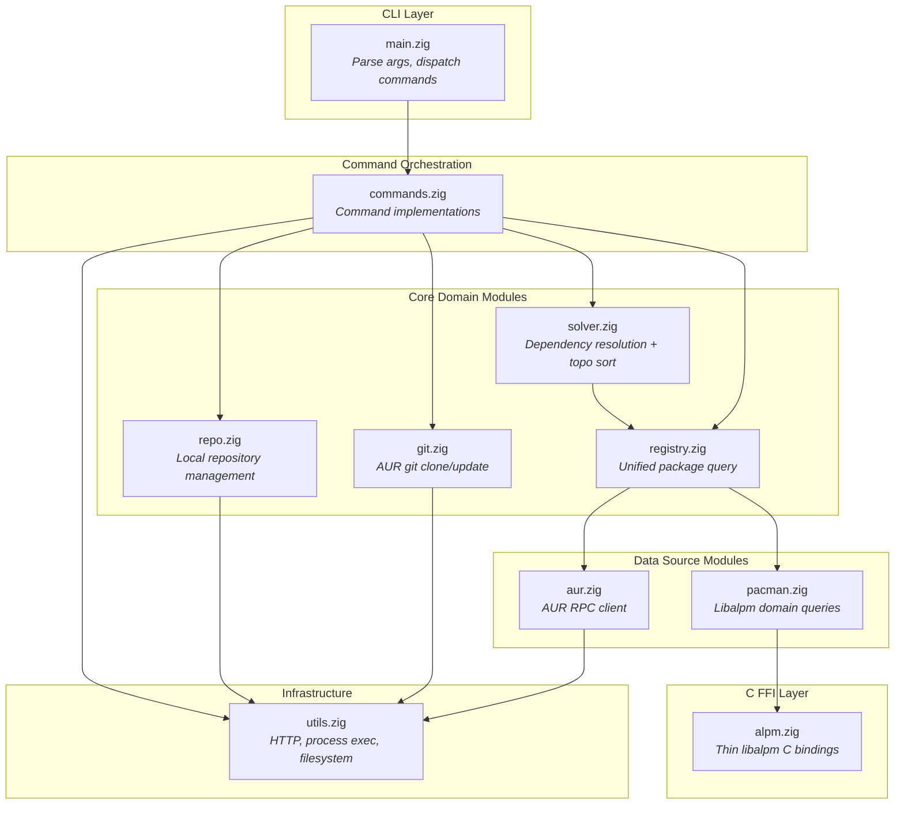
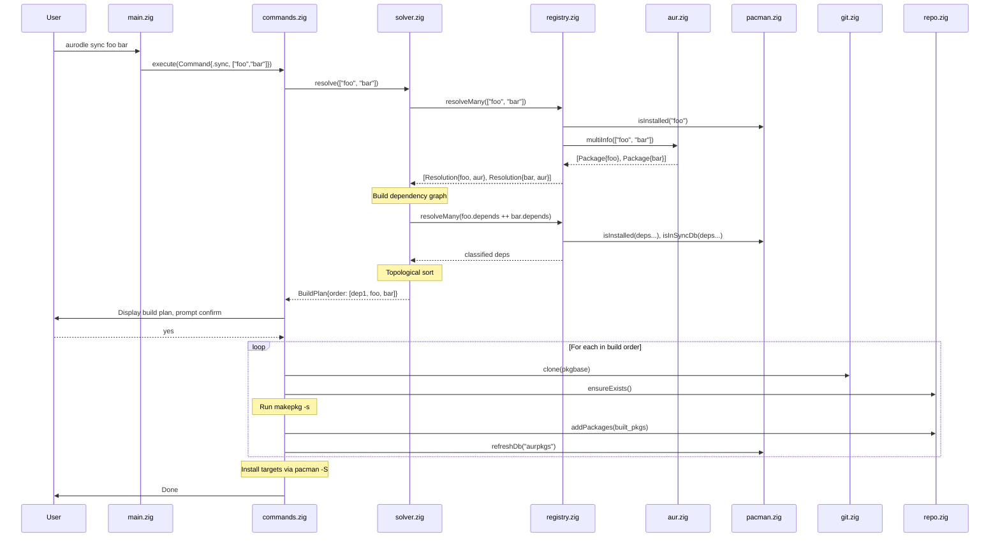
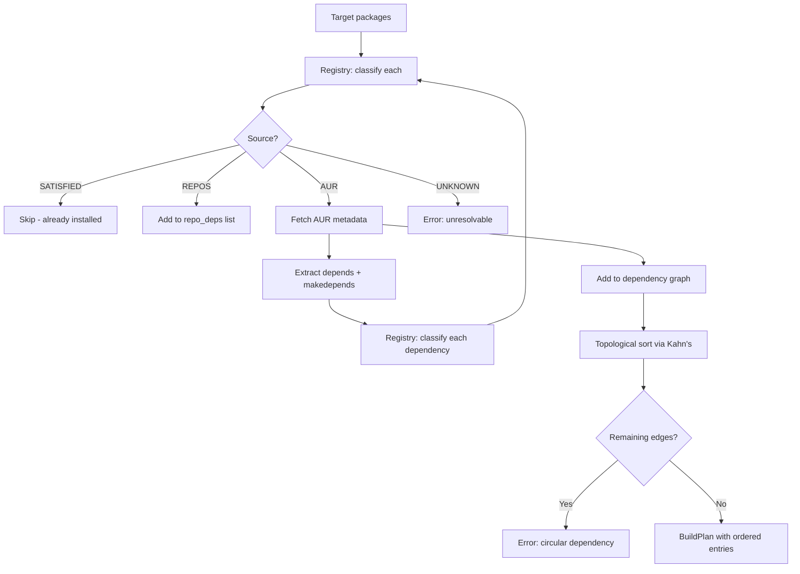
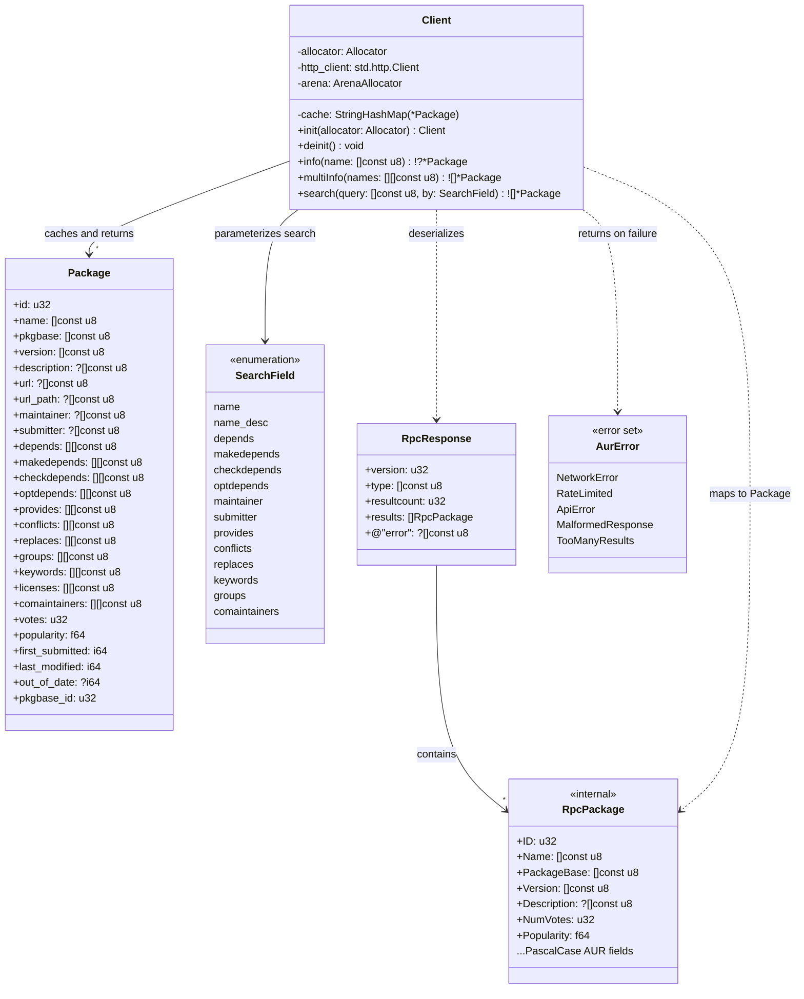

# Aurodle AUR Helper — Software Architecture

## Overview

Aurodle is a minimalist AUR helper written in Zig that builds AUR packages into a local pacman repository. The architecture is designed around **deep modules with simple interfaces** — each module hides significant complexity (C FFI, HTTP/JSON, graph algorithms, filesystem operations) behind narrow, Zig-idiomatic APIs.

The central architectural decision is the **Package Registry mediator**: rather than having the dependency resolver directly couple to both AUR and libalpm, a unified `PackageRegistry` module provides a single query interface. This pulls complexity downward — the resolver expresses intent ("find package X"), and the registry decides where and how to look. This also enables testing the resolver with a mock registry without standing up HTTP servers or libalpm databases.

The libalpm boundary uses a **two-layer design**: a thin C FFI wrapper (`alpm.zig`) that translates C types to Zig types with zero domain logic, consumed by a higher-level module (`pacman.zig`) that provides domain-meaningful operations like "is this dependency satisfied?" and "which repo owns this package?". This prevents C interop details from leaking into business logic.

The architecture is presented in three phases — initial (7 files), standard (12 files), and advanced (18+ files) — with explicit triggers for when to split. Each phase is a valid, complete architecture, not a half-finished version of the next.

## Design Principles Applied

### Deep Modules (Ousterhout Ch. 4)

Every module is designed to maximize the ratio of hidden complexity to interface surface area. The AUR client hides HTTP connection management, JSON parsing, response caching, batch request splitting, and error mapping behind three methods (`info`, `search`, `multiInfo`). The resolver hides graph construction, cycle detection, topological sorting, and dependency classification behind a single `resolve()` call.

### Information Hiding (Ousterhout Ch. 5)

Each module encapsulates decisions likely to change:
- `alpm.zig` hides the exact libalpm C API version and calling conventions
- `aur.zig` hides the AUR RPC protocol version, URL scheme, and JSON schema
- `repo.zig` hides the `repo-add` CLI interface and filesystem layout
- `git.zig` hides git CLI invocation details

If AUR switches to RPC v6, only `aur.zig` changes. If libalpm changes its `alpm_pkg_vercmp` signature, only `alpm.zig` changes.

### Different Layer, Different Abstraction (Ousterhout Ch. 7)

Each layer transforms the abstraction level:
1. **C FFI layer** (`alpm.zig`): Raw C pointers → Zig slices and optionals
2. **Domain layer** (`pacman.zig`): Zig types → domain queries ("is dependency satisfied?")
3. **Registry layer** (`registry.zig`): Domain queries → unified multi-source lookup
4. **Resolution layer** (`solver.zig`): Unified lookups → ordered build plan

A pass-through method at any layer signals a design problem.

### Pull Complexity Downward (Ousterhout Ch. 10)

The `PackageRegistry` absorbs the complexity of multi-source package resolution — checking installed packages first, then sync databases, then AUR — so the resolver's algorithm stays clean. Similarly, `repo.zig` absorbs the complexity of locating built packages (resolving `$PKGDEST`, handling split packages) so that command orchestration code stays simple.

### Define Errors Out of Existence (Ousterhout Ch. 10)

Where possible, modules eliminate error conditions rather than propagating them:
- `repo.zig` auto-creates the repository directory and database on first use (no "repository doesn't exist" error for the caller)
- `git.zig` treats "already cloned" as a success, not an error (idempotent clone)
- `aur.zig` caches results so duplicate queries within a session are free (no "duplicate request" concern)

## Module Structure



---

### Module: `main.zig`

- **Responsibility**: Parse CLI arguments, validate command structure, dispatch to command handlers, format top-level errors to stderr.
- **Interface**:
  ```zig
  pub fn main() u8  // returns exit code
  ```
- **Hidden Complexity**: Argument tokenization, flag validation, help text generation, exit code mapping from error types.
- **Depth Score**: **Medium** — Interface is trivially simple (it's `main`), but the internal complexity is moderate (CLI parsing, error formatting). This is acceptable for an entry point module.

---

### Module: `commands.zig`

- **Responsibility**: Implement all command workflows by orchestrating core modules. Each command is a function that coordinates the sequence: resolve → clone → review → build → install.
- **Interface**:
  ```zig
  pub const Command = struct {
      operation: Operation,
      targets: []const []const u8,
      flags: Flags,
  };

  pub fn execute(allocator: Allocator, cmd: Command) !void
  ```
- **Hidden Complexity**: Per-command workflow orchestration, user prompting (confirmation, review display), progress output, partial failure handling (continue building after one package fails), privilege escalation for pacman calls.
- **Depth Score**: **Medium → Deep** — Starts medium when there are few commands, becomes deep as workflows grow complex (sync, upgrade). This is the primary candidate for splitting (see Phase 2).

**Split trigger**: When `commands.zig` exceeds ~600 lines or when adding `upgrade`/`outdated`, split into:
- `commands/query.zig` — info, search, outdated
- `commands/build.zig` — clone, show, build, sync, upgrade
- `commands/analysis.zig` — resolve, buildorder

---

### Module: `aur.zig`

- **Responsibility**: All communication with the AUR RPC API. Handles HTTP requests, JSON parsing, response caching, request batching, and error mapping.
- **Interface**:
  ```zig
  pub const Client = struct {
      pub fn init(allocator: Allocator) Client
      pub fn deinit(self: *Client) void

      pub fn info(self: *Client, name: []const u8) !?Package
      pub fn multiInfo(self: *Client, names: []const []const u8) ![]Package
      pub fn search(self: *Client, query: []const u8, by: SearchField) ![]Package
  };

  pub const Package = struct {
      name: []const u8,
      pkgbase: []const u8,
      version: []const u8,
      description: ?[]const u8,
      depends: []const []const u8,
      makedepends: []const []const u8,
      checkdepends: []const []const u8,
      optdepends: []const []const u8,
      provides: []const []const u8,
      conflicts: []const []const u8,
      maintainer: ?[]const u8,
      votes: u32,
      popularity: f64,
      last_modified: i64,
      out_of_date: ?i64,
      url: ?[]const u8,
      licenses: []const []const u8,
      // ... other metadata
  };
  ```
- **Hidden Complexity**: HTTP connection management via `std.http.Client`, JSON parsing of AUR RPC v5 responses, in-memory `HashMap` cache keyed by package name, automatic batch splitting at AUR's 100-package limit for `multiInfo`, URL construction and encoding, rate-limit detection and clear error reporting, response validation.
- **Depth Score**: **Deep** — Three public methods hide ~400-500 lines of HTTP, JSON, caching, and batching logic. This is the ideal depth ratio.

---

### Module: `alpm.zig`

- **Responsibility**: Thin, mechanical translation of libalpm C API to Zig types. No domain logic. Translates `[*c]const u8` to `[]const u8`, null pointers to optionals, C error codes to Zig errors.
- **Interface**:
  ```zig
  pub const Handle = struct {
      pub fn init(root: []const u8, dbpath: []const u8) !Handle
      pub fn deinit(self: *Handle) void
      pub fn registerSyncDb(self: *Handle, name: []const u8, siglevel: SigLevel) !Database
      pub fn getLocalDb(self: *Handle) Database
  };

  pub const Database = struct {
      pub fn getPackage(self: Database, name: []const u8) ?AlpmPackage
      pub fn search(self: Database, needles: []const []const u8) !PackageList
      pub fn update(self: Database, force: bool) !void
  };

  pub const AlpmPackage = struct {
      pub fn getName(self: AlpmPackage) []const u8
      pub fn getVersion(self: AlpmPackage) []const u8
      pub fn getDepends(self: AlpmPackage) DependencyList
      pub fn getProvides(self: AlpmPackage) DependencyList
      // ...
  };

  pub fn vercmp(a: []const u8, b: []const u8) i32
  ```
- **Hidden Complexity**: All `@cImport` / C header inclusion, pointer arithmetic for libalpm linked lists (`alpm_list_t`), null-terminated string conversion, C error code translation, memory ownership boundaries (what libalpm owns vs. what we must free).
- **Depth Score**: **Deep** — Simple Zig-native interface hides the full complexity of C interop. Callers never see a C pointer.

---

### Module: `pacman.zig`

- **Responsibility**: High-level domain operations on local and sync databases. Answers domain questions: "Is this package installed?", "Which database provides this package?", "Does version X satisfy constraint Y?".
- **Interface**:
  ```zig
  pub const Pacman = struct {
      pub fn init(allocator: Allocator) !Pacman
      pub fn deinit(self: *Pacman) void

      pub fn isInstalled(self: *Pacman, name: []const u8) bool
      pub fn installedVersion(self: *Pacman, name: []const u8) ?[]const u8
      pub fn isInSyncDb(self: *Pacman, name: []const u8) bool
      pub fn satisfies(self: *Pacman, name: []const u8, constraint: VersionConstraint) bool
      pub fn findProvider(self: *Pacman, dep: []const u8) ?[]const u8
      pub fn refreshDb(self: *Pacman, dbname: []const u8) !void
  };

  pub const VersionConstraint = struct {
      op: enum { eq, ge, le, gt, lt },
      version: []const u8,
  };
  ```
- **Hidden Complexity**: libalpm handle initialization from `/etc/pacman.conf`, sync database registration, the distinction between local and sync databases, `alpm_pkg_vercmp` semantics, dependency string parsing (`pkg>=1.0` → name + constraint), provides/virtual package resolution through libalpm's dependency satisfaction API.
- **Depth Score**: **Deep** — Domain-meaningful methods hide the full libalpm query model. Callers ask "is this satisfied?" not "iterate the local database, find the package, extract its version, parse the constraint, call vercmp".

---

### Module: `registry.zig`

- **Responsibility**: Unified package lookup across all sources. Implements the lookup priority: installed → sync databases → AUR. Classifies each package by source.
- **Interface**:
  ```zig
  pub const Registry = struct {
      pub fn init(allocator: Allocator, pacman: *Pacman, aur: *aur.Client) Registry
      pub fn deinit(self: *Registry) void

      pub fn resolve(self: *Registry, name: []const u8) !Resolution
      pub fn resolveMany(self: *Registry, names: []const []const u8) ![]Resolution
      pub fn classify(self: *Registry, name: []const u8) !Source

      pub const Source = enum { satisfied, repos, aur, unknown };
      pub const Resolution = struct {
          name: []const u8,
          source: Source,
          version: ?[]const u8,
          aur_pkg: ?aur.Package,
      };
  };
  ```
- **Hidden Complexity**: Multi-source lookup ordering and short-circuiting, AUR batch query optimization (collects unknown packages and issues a single `multiInfo`), result caching across multiple calls within a session, version constraint satisfaction checking, provider resolution for virtual packages.
- **Depth Score**: **Deep** — The mediator pattern pays off here. The resolver calls `registry.resolve("libfoo>=2.0")` and gets back a classified result without knowing anything about libalpm queries, AUR HTTP calls, or caching strategies.

---

### Module: `solver.zig`

- **Responsibility**: Dependency resolution and build order generation. Builds a dependency graph, detects cycles, performs topological sort, classifies each node.
- **Interface**:
  ```zig
  pub const Solver = struct {
      pub fn init(allocator: Allocator, registry: *Registry) Solver
      pub fn deinit(self: *Solver) void

      pub fn resolve(self: *Solver, targets: []const []const u8) !BuildPlan

      pub const BuildPlan = struct {
          /// Packages in topological build order (AUR packages only)
          build_order: []const BuildEntry,
          /// All classified dependencies (for display)
          all_deps: []const DependencyEntry,
          /// Packages that need to be installed from repos first
          repo_deps: []const []const u8,
      };

      pub const BuildEntry = struct {
          name: []const u8,
          pkgbase: []const u8,
          version: []const u8,
          is_target: bool,
      };

      pub const DependencyEntry = struct {
          name: []const u8,
          source: Registry.Source,
          is_target: bool,
          depth: u32,
      };
  };
  ```
- **Hidden Complexity**: Recursive dependency graph construction with cycle detection (via coloring: white/gray/black), pkgname-to-pkgbase deduplication (multiple pkgnames may share a pkgbase — only build once), topological sort using Kahn's algorithm, dependency type handling (depends vs makedepends vs checkdepends), the distinction between "needed for build order" and "needed for display".
- **Depth Score**: **Deep** — A single `resolve()` call hides the entire graph algorithm pipeline. The caller gets a ready-to-execute build plan.

---

### Module: `repo.zig`

- **Responsibility**: Local pacman repository management. Creates the repository, adds built packages, maintains the database.
- **Interface**:
  ```zig
  pub const Repository = struct {
      pub fn init(allocator: Allocator) !Repository
      pub fn deinit(self: *Repository) void

      pub fn ensureExists(self: *Repository) !void
      pub fn addPackages(self: *Repository, pkg_paths: []const []const u8) !void
      pub fn isConfigured(self: *Repository) !bool
      pub fn configInstructions() []const u8
  };
  ```
- **Hidden Complexity**: Directory creation (`~/.cache/aurodle/aurpkgs/`), `repo-add -R` invocation, locating built packages by resolving `$PKGDEST` from makepkg.conf, copying packages to the repository directory, handling split packages (multiple `.pkg.tar.*` files from one build), database integrity, pacman.conf validation (checking `[aurpkgs]` section exists).
- **Depth Score**: **Deep** — Four methods hide all filesystem operations, external tool invocation, and configuration checking.

---

### Module: `git.zig`

- **Responsibility**: Clone and update AUR git repositories.
- **Interface**:
  ```zig
  pub fn clone(allocator: Allocator, pkgbase: []const u8) !CloneResult
  pub fn update(allocator: Allocator, pkgbase: []const u8) !UpdateResult

  pub const CloneResult = enum { cloned, already_exists };
  pub const UpdateResult = enum { updated, up_to_date };
  ```
- **Hidden Complexity**: URL construction (`https://aur.archlinux.org/{pkgbase}.git`), cache directory management, git CLI invocation, idempotent clone (existing directory is success, not error), git pull for updates.
- **Depth Score**: **Medium** — Simple operations but the interface is proportionally simple. Acceptable — not every module needs to be deep.

---

### Module: `utils.zig`

- **Responsibility**: Shared infrastructure — HTTP client, child process execution with output capture, filesystem helpers.
- **Interface**:
  ```zig
  pub fn httpGet(allocator: Allocator, url: []const u8) ![]u8
  pub fn runCommand(allocator: Allocator, argv: []const []const u8) !ProcessResult
  pub fn runCommandWithLog(allocator: Allocator, argv: []const []const u8, log_path: []const u8) !ProcessResult
  pub fn expandHome(allocator: Allocator, path: []const u8) ![]u8

  pub const ProcessResult = struct {
      exit_code: u8,
      stdout: []const u8,
      stderr: []const u8,
  };
  ```
- **Hidden Complexity**: `std.http.Client` lifecycle, TLS setup, child process spawning with pipe management, concurrent stdout/stderr capture, tee-to-log-file during real-time display, home directory expansion.
- **Depth Score**: **Medium** — Utility modules are inherently shallower (Ousterhout warns about this). Kept minimal to avoid becoming a dumping ground.

**Split trigger**: When `utils.zig` exceeds ~300 lines, split into `http.zig`, `process.zig`, `fs.zig`.

---

## Layer Architecture

```
┌─────────────────────────────────────────────────────┐
│  CLI Layer                                          │
│  main.zig — parse args, dispatch, format errors     │
├─────────────────────────────────────────────────────┤
│  Command Orchestration Layer                        │
│  commands.zig — workflow sequences, user I/O        │
├──────────────┬──────────────┬───────────────────────┤
│  Resolution  │  Operations  │  Repository           │
│  solver.zig  │  git.zig     │  repo.zig             │
├──────────────┴──────────────┴───────────────────────┤
│  Mediation Layer                                    │
│  registry.zig — unified multi-source package query  │
├────────────────────┬────────────────────────────────┤
│  AUR Data Source   │  Local Data Source              │
│  aur.zig           │  pacman.zig                     │
├────────────────────┴────────┬───────────────────────┤
│  C FFI Layer                │  Infrastructure        │
│  alpm.zig                   │  utils.zig             │
└─────────────────────────────┴───────────────────────┘
```

**Each layer provides a different abstraction level:**

1. **C FFI Layer**: Translates C memory model → Zig memory model (pointers → slices, nulls → optionals)
2. **Data Source Layer**: Translates raw data → domain answers ("is installed?", "what version?")
3. **Mediation Layer**: Translates domain answers → unified classified lookups
4. **Resolution Layer**: Translates classified lookups → ordered build plans
5. **Command Layer**: Translates build plans → user-visible workflows with I/O
6. **CLI Layer**: Translates user input → typed command structures

No layer is a pass-through. Each transforms the abstraction meaningfully.

## Phase Architecture

### Phase 1: Initial (9 files) — Core MVP

```
src/
├── main.zig          # CLI parsing, dispatch
├── commands.zig      # All command implementations
├── aur.zig           # AUR RPC client
├── alpm.zig          # Thin libalpm C FFI
├── pacman.zig        # High-level libalpm domain queries
├── registry.zig      # Unified package lookup
├── solver.zig        # Dependency resolution + topo sort
├── repo.zig          # Local repository management
├── git.zig           # Git clone operations
└── utils.zig         # HTTP, process, filesystem helpers
```

**Commands implemented**: info, search, clone, build, sync, resolve, buildorder

**Why 10 files, not 7**: The thin-wrapper + domain-module pattern for libalpm (alpm.zig + pacman.zig) and the mediator pattern (registry.zig) each add one file. This is justified because:
- `alpm.zig` vs `pacman.zig` prevents C types from leaking (information hiding)
- `registry.zig` makes the resolver testable without real data sources (design for testability)

### Phase 2: Standard (14 files) — Post-MVP

**Trigger**: `commands.zig` exceeds ~600 lines (adding upgrade, outdated, show workflows).

```
src/
├── main.zig
├── commands/
│   ├── query.zig       # info, search, outdated
│   ├── build.zig       # clone, show, build, sync, upgrade
│   └── analysis.zig    # resolve, buildorder
├── aur.zig
├── alpm.zig
├── pacman.zig
├── registry.zig
├── solver.zig
├── repo.zig
├── git.zig
├── utils/
│   ├── http.zig
│   ├── process.zig
│   └── fs.zig
└── config.zig          # Environment variable + makepkg.conf reading
```

**New capabilities**: outdated detection, upgrade workflow, show/review, `$PKGDEST`/`$AURDEST` support, pacman.conf Color/VerbosePkgLists.

### Phase 3: Advanced (18+ files) — Power User Features

**Trigger**: Provider resolution, conflict detection, or chroot builds needed.

```
src/
├── main.zig
├── commands/
│   ├── query.zig
│   ├── build.zig
│   └── analysis.zig
├── aur.zig
├── alpm.zig
├── pacman.zig
├── registry.zig
├── solver/
│   ├── resolver.zig     # Core resolution algorithm
│   ├── graph.zig        # Dependency graph data structure
│   └── providers.zig    # Virtual package + conflict resolution
├── repo.zig
├── git.zig
├── config.zig
├── cache.zig            # Cache cleanup operations
└── utils/
    ├── http.zig
    ├── process.zig
    └── fs.zig
```

## Design Decisions

| Decision | Options Considered | Choice | Rationale |
|----------|-------------------|--------|-----------|
| libalpm integration | (A) Single deep module (B) Thin wrapper + domain module (C) Auto-generated bindings | **(B) Thin wrapper + domain** | Prevents C type leakage. `alpm.zig` changes only for libalpm API changes; `pacman.zig` changes only for domain logic changes. Each has one reason to change (SRP). |
| Data source access from resolver | (A) Direct dependencies (B) Injected interfaces (C) Mediator (PackageRegistry) | **(C) Mediator** | Pulls lookup complexity downward. Resolver stays a pure graph algorithm. Registry absorbs source priority, batching, and caching. Easy to test resolver with mock registry. |
| CLI parsing | (A) Zig std arg iterator (B) Custom parser (C) Third-party library | **(A) Zig std** | No external dependencies constraint (NFR-6). `std.process.args` is sufficient for the command structure. Custom flag handling is ~100 lines. |
| JSON parsing | (A) Zig std.json (B) Custom streaming parser (C) Third-party | **(A) Zig std.json** | Sufficient for AUR RPC response sizes (typically <100KB). Streaming parser adds complexity without measurable benefit at this scale. |
| Error handling strategy | (A) Zig error unions only (B) Error unions + context struct (C) Error unions + error return trace | **(B) Error unions + context** | Zig error unions provide the mechanism; context structs provide the user-facing message. Commands catch errors and format them with category/context/solution structure per NFR-4. |
| Process execution | (A) Zig std.process.Child (B) libc fork/exec (C) posix_spawn | **(A) Zig std.process.Child** | Idiomatic Zig, handles pipe management, sufficient for makepkg/git/repo-add invocation. |
| Cache strategy | (A) No cache (B) In-memory per-session (C) Disk-persistent | **(B) In-memory per-session** | Requirements explicitly state no network caching across invocations (Technical Constraints). In-memory cache prevents duplicate AUR queries within a single `sync` or `upgrade` operation. |
| Topological sort algorithm | (A) DFS-based (B) Kahn's algorithm (BFS) | **(B) Kahn's algorithm** | Naturally produces a valid build order, detects cycles (remaining nodes with edges = cycle), and is iterative (no stack overflow risk on deep dependency chains). |
| Config file format | (A) Pacman.conf style (B) TOML (C) None initially | **(C) None initially** | Design constraint: no configuration file in v1. Hardcoded defaults → environment variables → config file is the phased approach. |
| Build log capture | (A) Pipe to file only (B) Tee to file + terminal (C) Terminal only with optional save | **(B) Tee** | FR-9 requires "captures makepkg output to log file while also displaying in real-time". Implemented in `utils.runCommandWithLog`. |

## Complexity Analysis

### Red Flags Avoided

- **Shallow modules**: No module exists purely to delegate to another. Every module transforms the abstraction level. The `registry.zig` mediator could be mistaken for a pass-through, but it adds source prioritization, batching, and caching — significant hidden value.
- **Information leakage**: C types from libalpm never appear outside `alpm.zig`. AUR JSON field names never appear outside `aur.zig`. Filesystem paths for the repository are encapsulated in `repo.zig`.
- **Temporal decomposition**: Commands are not split by "first clone, then build, then install" as separate modules. The temporal sequence lives in `commands.zig`; each module provides a capability, not a step.
- **Overexposure of internals**: `solver.zig` returns a `BuildPlan` struct, not the raw dependency graph. The graph is an internal detail. Commands don't need to understand graph nodes — they need a build order.

### Complexity Pulled Downward

| Complexity | Absorbed By | Instead Of |
|------------|-------------|------------|
| C pointer management, linked list traversal | `alpm.zig` | Every module that queries packages |
| HTTP lifecycle, JSON parsing, response caching | `aur.zig` | Resolver and commands |
| Multi-source lookup priority, batch optimization | `registry.zig` | Resolver |
| Cycle detection, topological sort, pkgbase dedup | `solver.zig` | Command orchestration |
| `$PKGDEST` resolution, `repo-add` invocation, split package handling | `repo.zig` | Build commands |
| makepkg output tee, process pipe management | `utils.zig` | Every module that runs external commands |

### Information Hiding Achieved

| Hidden Information | Module | Why It Might Change |
|-------------------|--------|---------------------|
| AUR RPC v5 protocol details | `aur.zig` | AUR may release v6 |
| libalpm C API signatures | `alpm.zig` | pacman updates may change API |
| Repository filesystem layout | `repo.zig` | Directory structure may change |
| Git URL pattern for AUR | `git.zig` | AUR may change hosting |
| Dependency graph representation | `solver.zig` | Algorithm improvements |
| Lookup priority ordering | `registry.zig` | Policy changes (e.g., prefer AUR over repos) |

## Data Flow Diagrams

### `sync` Command Flow (FR-10)



### Dependency Resolution Flow (FR-5, FR-7)



## Testing Architecture

### Test Strategy by Module

| Module | Test Approach | Mock Dependencies |
|--------|--------------|-------------------|
| `alpm.zig` | Integration test with real libalpm (or mock `.so`) | None (tests C FFI directly) |
| `pacman.zig` | Unit test with mock `alpm.zig` handle | Mock `alpm.Handle` |
| `aur.zig` | Unit test with recorded HTTP fixtures | Mock HTTP responses (fixture files) |
| `registry.zig` | Unit test with mock `Pacman` + mock `aur.Client` | Both data sources mocked |
| `solver.zig` | Unit test with mock `Registry` | Mock registry returning predetermined classifications |
| `repo.zig` | Integration test in temp directory | Real filesystem, mock `repo-add` |
| `git.zig` | Integration test with local git repo | Real git, test repository |
| `commands.zig` | Integration test (end-to-end with mocks) | Mock all core modules |

### Test Directory Structure

```
src/          # Zig convention: tests live alongside source in test blocks
tests/
├── fixtures/
│   ├── aur_responses/       # Recorded AUR RPC JSON responses
│   │   ├── info_single.json
│   │   ├── info_multi.json
│   │   ├── search_results.json
│   │   └── error_not_found.json
│   └── test_pkgbuilds/      # Minimal valid PKGBUILDs for build tests
│       └── trivial/PKGBUILD
└── integration/
    └── full_sync_test.zig   # End-to-end workflow test
```

## Class-Level Design: `registry.zig`

The `PackageRegistry` is the architectural linchpin — it sits between the solver (which thinks in dependency graphs) and the data sources (which think in database queries and HTTP requests). This section details its internal structure.

### Class Diagram

```mermaid
classDiagram
    class Registry {
        -allocator: Allocator
        -pacman: *Pacman
        -aur_client: *aur.Client
        -cache: StringHashMap(Resolution)
        -pending_aur: StringArrayHashMap(void)
        +init(Allocator, *Pacman, *aur.Client) Registry
        +deinit() void
        +resolve(dep_string: []const u8) !Resolution
        +resolveMany(dep_strings: [][]const u8) ![]Resolution
        +classify(name: []const u8) !Source
        -resolveFromCache(name: []const u8) ?Resolution
        -resolveLocal(name: []const u8, constraint: ?VersionConstraint) ?Resolution
        -resolveSync(name: []const u8, constraint: ?VersionConstraint) ?Resolution
        -resolveAur(name: []const u8) !?Resolution
        -flushPendingAur() !void
        -parseDep(dep_string: []const u8) DepSpec
    }

    class Resolution {
        +name: []const u8
        +source: Source
        +version: ?[]const u8
        +aur_pkg: ?aur.Package
        +provider: ?[]const u8
    }

    class Source {
        <<enumeration>>
        satisfied
        repos
        aur
        unknown
    }

    class DepSpec {
        +name: []const u8
        +constraint: ?VersionConstraint
    }

    class VersionConstraint {
        +op: CmpOp
        +version: []const u8
    }

    class CmpOp {
        <<enumeration>>
        eq
        ge
        le
        gt
        lt
    }

    Registry --> Resolution : produces
    Registry --> DepSpec : parses into
    Resolution --> Source : classified by
    DepSpec --> VersionConstraint : may contain
    VersionConstraint --> CmpOp : uses
    Registry ..> Pacman : queries local/sync
    Registry ..> "aur.Client" : queries AUR
```

### Internal Architecture

The registry's core operation is a **three-tier cascade with deferred batching**:

```
resolve("libfoo>=2.0")
  │
  ├─ 1. parseDep("libfoo>=2.0") → DepSpec{ name="libfoo", constraint={ge, "2.0"} }
  │
  ├─ 2. resolveFromCache("libfoo") → hit? return cached Resolution
  │
  ├─ 3. resolveLocal("libfoo", {ge, "2.0"})
  │     └─ pacman.isInstalled("libfoo") AND pacman.satisfies("libfoo", {ge, "2.0"})
  │     └─ hit? → return Resolution{ source=.satisfied }
  │
  ├─ 4. resolveSync("libfoo", {ge, "2.0"})
  │     └─ pacman.isInSyncDb("libfoo") AND version satisfies constraint
  │     └─ hit? → return Resolution{ source=.repos }
  │
  ├─ 5. resolveAur("libfoo")
  │     └─ aur_client.info("libfoo")
  │     └─ hit? → return Resolution{ source=.aur, aur_pkg=pkg }
  │
  └─ 6. return Resolution{ source=.unknown }
```

Each tier short-circuits: if the package is found at a higher-priority source, lower sources are never queried.

### Key Internal Types

```zig
const Registry = struct {
    allocator: Allocator,
    pacman: *pacman_mod.Pacman,
    aur_client: *aur.Client,

    /// Per-session cache: name → Resolution
    /// Prevents duplicate queries across multiple solver passes.
    /// Keyed by package *name* (not dep string), because the same package
    /// may appear with different constraints in different parts of the tree.
    /// The resolution records the source; constraint satisfaction is
    /// re-checked by the caller when needed.
    cache: std.StringHashMapUnmanaged(Resolution),

    /// Deferred AUR batch buffer for resolveMany().
    /// Names that weren't found locally or in sync DBs accumulate here,
    /// then get flushed as a single multiInfo call.
    pending_aur: std.StringArrayHashMapUnmanaged(void),
};
```

### Method Details

#### `resolve(dep_string: []const u8) !Resolution`

The single-package entry point. Parses the dependency string, checks the cache, then cascades through local → sync → AUR.

```zig
pub fn resolve(self: *Registry, dep_string: []const u8) !Resolution {
    const spec = parseDep(dep_string);

    // Cache check (by name, not full dep string)
    if (self.resolveFromCache(spec.name)) |cached| {
        // Re-verify constraint satisfaction for cached result
        if (spec.constraint) |c| {
            if (cached.version) |v| {
                if (!satisfiesConstraint(v, c)) {
                    // Cached version exists but doesn't satisfy THIS constraint.
                    // This is a version conflict — the solver will handle it.
                    return Resolution{
                        .name = spec.name,
                        .source = .unknown,
                        .version = cached.version,
                        .aur_pkg = cached.aur_pkg,
                        .provider = null,
                    };
                }
            }
        }
        return cached;
    }

    // Tier 1: Installed locally?
    if (self.resolveLocal(spec.name, spec.constraint)) |res| {
        try self.cacheResult(spec.name, res);
        return res;
    }

    // Tier 2: In sync databases?
    if (self.resolveSync(spec.name, spec.constraint)) |res| {
        try self.cacheResult(spec.name, res);
        return res;
    }

    // Tier 3: In AUR?
    if (try self.resolveAur(spec.name)) |res| {
        try self.cacheResult(spec.name, res);
        return res;
    }

    // Tier 4: Try provider resolution (Phase 2+)
    // pacman.findProvider checks if any installed/sync package
    // has a `provides` entry matching this dep string.

    // Not found anywhere
    const res = Resolution{
        .name = spec.name,
        .source = .unknown,
        .version = null,
        .aur_pkg = null,
        .provider = null,
    };
    try self.cacheResult(spec.name, res);
    return res;
}
```

#### `resolveMany(dep_strings: []const []const u8) ![]Resolution`

The batch entry point. This is where the **deferred AUR batching** strategy pays off. Instead of issuing one HTTP request per unknown package, it:

1. Runs tiers 1-2 (local + sync) for all packages — these are cheap local operations
2. Collects all packages that reach tier 3 into `pending_aur`
3. Flushes the entire batch as a single `aur.multiInfo()` call
4. Maps results back to individual resolutions

```zig
pub fn resolveMany(self: *Registry, dep_strings: []const []const u8) ![]Resolution {
    var results = try std.ArrayList(Resolution).initCapacity(self.allocator, dep_strings.len);

    // Pass 1: Resolve everything we can locally
    for (dep_strings) |dep_str| {
        const spec = parseDep(dep_str);

        if (self.resolveFromCache(spec.name)) |cached| {
            try results.append(cached);
            continue;
        }

        if (self.resolveLocal(spec.name, spec.constraint)) |res| {
            try self.cacheResult(spec.name, res);
            try results.append(res);
            continue;
        }

        if (self.resolveSync(spec.name, spec.constraint)) |res| {
            try self.cacheResult(spec.name, res);
            try results.append(res);
            continue;
        }

        // Mark for AUR batch query
        try self.pending_aur.put(self.allocator, spec.name, {});
        try results.append(.{  // placeholder — will be overwritten
            .name = spec.name,
            .source = .unknown,
            .version = null,
            .aur_pkg = null,
            .provider = null,
        });
    }

    // Pass 2: Flush all pending AUR lookups in one batch
    if (self.pending_aur.count() > 0) {
        try self.flushPendingAur();

        // Pass 3: Re-resolve placeholders from cache (now populated by flush)
        for (results.items, 0..) |*res, i| {
            if (res.source == .unknown) {
                if (self.resolveFromCache(res.name)) |cached| {
                    res.* = cached;
                }
            }
        }
    }

    return results.toOwnedSlice();
}
```

#### `flushPendingAur() !void`

Drains the `pending_aur` buffer into a single (or batched, if >100) `multiInfo` call.

```zig
fn flushPendingAur(self: *Registry) !void {
    const names = self.pending_aur.keys();
    if (names.len == 0) return;

    // aur.Client.multiInfo handles splitting at the 100-package AUR limit
    const packages = try self.aur_client.multiInfo(names);

    // Index results by name for O(1) lookup
    var by_name = std.StringHashMapUnmanaged(aur.Package){};
    defer by_name.deinit(self.allocator);
    for (packages) |pkg| {
        try by_name.put(self.allocator, pkg.name, pkg);
    }

    // Cache each result
    for (names) |name| {
        if (by_name.get(name)) |pkg| {
            try self.cacheResult(name, .{
                .name = name,
                .source = .aur,
                .version = pkg.version,
                .aur_pkg = pkg,
                .provider = null,
            });
        }
        // Names not in AUR response stay as .unknown in cache
    }

    self.pending_aur.clearRetainingCapacity();
}
```

#### `parseDep(dep_string: []const u8) DepSpec`

Parses pacman-style versioned dependency strings. This is a pure function — no state, no errors.

```zig
/// Parses "pkg>=1.0.0" → DepSpec{ .name = "pkg", .constraint = { .ge, "1.0.0" } }
/// Parses "pkg" → DepSpec{ .name = "pkg", .constraint = null }
/// Handles: =, >=, <=, >, <
fn parseDep(dep_string: []const u8) DepSpec {
    // Scan for first operator character
    const operators = [_]struct { str: []const u8, op: CmpOp }{
        .{ .str = ">=", .op = .ge },
        .{ .str = "<=", .op = .le },
        .{ .str = "=",  .op = .eq },
        .{ .str = ">",  .op = .gt },
        .{ .str = "<",  .op = .lt },
    };

    for (operators) |entry| {
        if (std.mem.indexOf(u8, dep_string, entry.str)) |pos| {
            return .{
                .name = dep_string[0..pos],
                .constraint = .{
                    .op = entry.op,
                    .version = dep_string[pos + entry.str.len ..],
                },
            };
        }
    }

    return .{ .name = dep_string, .constraint = null };
}
```

### State Machine: Resolution Lifecycle

A package name goes through the following states within a registry session:

```
                    ┌──────────┐
                    │  Unknown │ (not yet queried)
                    └────┬─────┘
                         │ resolve() or resolveMany() called
                         ▼
                ┌────────────────┐
                │  Check Cache   │
                └───┬────────┬───┘
              hit   │        │ miss
                    ▼        ▼
              ┌──────┐  ┌──────────┐
              │Return│  │Check     │
              │cached│  │local DB  │
              └──────┘  └───┬──┬───┘
                      found │  │ not found
                            ▼  ▼
                      ┌──────────┐
                      │Check     │
                      │sync DBs  │
                      └───┬──┬───┘
                    found │  │ not found
                          ▼  ▼
                    ┌──────────┐
                    │Query AUR │ (or batch via pending_aur)
                    └───┬──┬───┘
                  found │  │ not found
                        ▼  ▼
                  ┌──────────┐
                  │ Cached   │ (source = satisfied|repos|aur|unknown)
                  │ forever  │ (within this session)
                  └──────────┘
```

Once cached, a resolution is immutable for the session. This is safe because:
- Installed packages don't change during a single aurodle invocation
- Sync databases don't change (we only refresh `aurpkgs` between builds, and that's a deliberate invalidation point — see below)
- AUR metadata doesn't change within a session

### Cache Invalidation

The only time the cache needs invalidation is between builds in a multi-package `sync` workflow. After building package A and running `repo-add`, package A is now available in the `aurpkgs` sync database. The solver needs to see this for `makepkg -s` to work on package B that depends on A.

```zig
/// Called by commands.zig between builds in a multi-package sync.
/// Invalidates only specific entries that may have changed.
pub fn invalidate(self: *Registry, names: []const []const u8) void {
    for (names) |name| {
        _ = self.cache.remove(name);
    }
}
```

This is a surgical invalidation, not a full cache flush. Only the just-built packages are invalidated. Everything else (installed packages, repo packages, other AUR metadata) remains valid.

### Provider Resolution (Phase 2)

When a dependency like `java-runtime` isn't a real package name, it's a virtual dependency that other packages `provide`. Provider resolution adds a fourth tier before `.unknown`:

```zig
// Tier 4: Check if any installed/sync package provides this
if (self.pacman.findProvider(spec.name)) |provider_name| {
    const res = Resolution{
        .name = spec.name,
        .source = .repos, // or .satisfied if the provider is installed
        .version = null,
        .aur_pkg = null,
        .provider = provider_name,
    };
    try self.cacheResult(spec.name, res);
    return res;
}

// Tier 5: Search AUR for packages that provide this
// Uses aur.search(spec.name, .provides) — more expensive
```

The `provider` field in `Resolution` records which real package satisfies a virtual dependency. The solver uses this to ensure the provider is in the build plan if it's an AUR package.

### Error Semantics

The registry **does not error on "not found"** — it returns `Source.unknown`. This is a deliberate design choice (Ousterhout's "define errors out of existence"). The solver decides what to do with unknowns:

- For `depends`: unknown is a fatal error (can't build without it)
- For `makedepends`: unknown is a fatal error (can't build without it)
- For `optdepends`: unknown is a warning (skip and continue)
- For `checkdepends`: unknown may be acceptable (skip tests)

By pushing this policy to the solver, the registry stays a pure lookup mechanism with no domain policy embedded.

The registry **does** error on infrastructure failures:
- `error.NetworkError`: AUR HTTP request failed
- `error.RateLimited`: AUR returned rate-limit response
- `error.AlpmError`: libalpm query failed (database corruption, etc.)

These are genuine "can't proceed" situations, distinct from "package doesn't exist."

### Testing Strategy

The registry is designed for straightforward testing through constructor injection:

```zig
test "resolve classifies installed package as satisfied" {
    var mock_pacman = MockPacman.init();
    mock_pacman.addInstalled("zlib", "1.3.1");

    var mock_aur = MockAurClient.init();

    var reg = Registry.init(testing.allocator, &mock_pacman, &mock_aur);
    defer reg.deinit();

    const res = try reg.resolve("zlib>=1.0");
    try testing.expectEqual(.satisfied, res.source);
    try testing.expectEqualStrings("1.3.1", res.version.?);
}

test "resolveMany batches AUR queries" {
    var mock_pacman = MockPacman.init(); // nothing installed
    var mock_aur = MockAurClient.init();
    mock_aur.addPackage(.{ .name = "foo", .version = "1.0" });
    mock_aur.addPackage(.{ .name = "bar", .version = "2.0" });

    var reg = Registry.init(testing.allocator, &mock_pacman, &mock_aur);
    defer reg.deinit();

    const results = try reg.resolveMany(&.{ "foo", "bar" });
    defer testing.allocator.free(results);

    // Verify both resolved as AUR
    try testing.expectEqual(.aur, results[0].source);
    try testing.expectEqual(.aur, results[1].source);

    // Verify only ONE multiInfo call was made (batch)
    try testing.expectEqual(@as(usize, 1), mock_aur.multi_info_call_count);
}

test "cache prevents duplicate AUR queries" {
    var mock_pacman = MockPacman.init();
    var mock_aur = MockAurClient.init();
    mock_aur.addPackage(.{ .name = "foo", .version = "1.0" });

    var reg = Registry.init(testing.allocator, &mock_pacman, &mock_aur);
    defer reg.deinit();

    _ = try reg.resolve("foo");
    _ = try reg.resolve("foo"); // second call

    // AUR was only queried once
    try testing.expectEqual(@as(usize, 1), mock_aur.info_call_count);
}
```

The `MockPacman` and `MockAurClient` are test doubles that implement the same interface through Zig's duck typing (struct with matching method signatures). They don't need a formal interface/vtable — the registry calls methods by name, and Zig's comptime type checking ensures compatibility.

## Class-Level Design: `aur.zig`

The AUR client is the deepest module by complexity-to-interface ratio. Three public methods hide HTTP connection management, JSON deserialization, per-session caching, automatic batch splitting, URL encoding, and structured error mapping. This section details the internal design against the real AUR RPC v5 API.

### Class Diagram



### AUR RPC v5 Protocol Mapping

The AUR API uses PascalCase field names (`PackageBase`, `NumVotes`, `LastModified`). Zig idiom is snake_case. The client performs this mapping at the JSON deserialization boundary so that all downstream code uses Zig-idiomatic names.

| AUR RPC v5 Field | `Package` Field | Type | Notes |
|-----------------|-----------------|------|-------|
| `ID` | `id` | `u32` | |
| `Name` | `name` | `[]const u8` | |
| `PackageBase` | `pkgbase` | `[]const u8` | Critical for clone URLs |
| `PackageBaseID` | `pkgbase_id` | `u32` | |
| `Version` | `version` | `[]const u8` | `pkgver-pkgrel` format |
| `Description` | `description` | `?[]const u8` | Nullable |
| `URL` | `url` | `?[]const u8` | Upstream URL |
| `URLPath` | `url_path` | `?[]const u8` | Snapshot `.tar.gz` path |
| `Maintainer` | `maintainer` | `?[]const u8` | Null if orphaned |
| `Submitter` | `submitter` | `?[]const u8` | Only in detailed info |
| `NumVotes` | `votes` | `u32` | |
| `Popularity` | `popularity` | `f64` | |
| `FirstSubmitted` | `first_submitted` | `i64` | Unix timestamp |
| `LastModified` | `last_modified` | `i64` | Unix timestamp |
| `OutOfDate` | `out_of_date` | `?i64` | Null or unix timestamp |
| `Depends` | `depends` | `[][]const u8` | Only in detailed info |
| `MakeDepends` | `makedepends` | `[][]const u8` | Only in detailed info |
| `CheckDepends` | `checkdepends` | `[][]const u8` | Only in detailed info |
| `OptDepends` | `optdepends` | `[][]const u8` | Only in detailed info |
| `Provides` | `provides` | `[][]const u8` | Only in detailed info |
| `Conflicts` | `conflicts` | `[][]const u8` | Only in detailed info |
| `Replaces` | `replaces` | `[][]const u8` | Only in detailed info |
| `Groups` | `groups` | `[][]const u8` | Only in detailed info |
| `Keywords` | `keywords` | `[][]const u8` | Only in detailed info |
| `License` | `licenses` | `[][]const u8` | Only in detailed info |
| `CoMaintainers` | `comaintainers` | `[][]const u8` | Only in detailed info |

**Search results return `PackageBasic`** (no dependency arrays). **Info results return `PackageDetailed`** (all fields). The `Package` struct has all fields, with arrays defaulting to empty slices for search results.

### Memory Management Strategy

The AUR client faces a fundamental ownership question: who owns the `Package` data and the strings within it? JSON parsing with `std.json` produces heap-allocated strings, and packages are referenced by the cache, the registry, and the solver.

**Solution: Arena allocator.** The client owns an `ArenaAllocator` that backs all parsed package data. All strings inside `Package` structs point into this arena. When the client is deinitialized, the arena frees everything at once.

```zig
const Client = struct {
    allocator: Allocator,
    /// All Package data lives here. Freed in bulk on deinit().
    /// This means Package pointers are valid for the lifetime of the Client.
    arena: std.heap.ArenaAllocator,
    http_client: std.http.Client,
    cache: std.StringHashMapUnmanaged(*Package),

    pub fn init(allocator: Allocator) Client {
        return .{
            .allocator = allocator,
            .arena = std.heap.ArenaAllocator.init(allocator),
            .http_client = std.http.Client{ .allocator = allocator },
            .cache = .{},
        };
    }

    pub fn deinit(self: *Client) void {
        self.http_client.deinit();
        self.cache.deinit(self.allocator);
        // All Package data, all strings, all slices — freed in one call
        self.arena.deinit();
    }
};
```

**Why arena over per-package allocation:** AUR packages are immutable within a session (we never modify parsed data), and they all share the same lifetime (the client's lifetime). Per-package `allocator.free()` would require tracking every individual string allocation inside every Package — dozens of strings and arrays per package. The arena eliminates this bookkeeping entirely.

**Trade-off:** Memory is not freed until the client is deinitialized. For a CLI tool that runs a single operation and exits, this is ideal. For a long-running daemon (which aurodle is not), this would be a memory leak concern.

### Method Internals

#### `info(name: []const u8) !?*Package`

Single-package lookup. Checks cache first, then issues an HTTP request.

```zig
pub fn info(self: *Client, name: []const u8) !?*Package {
    // Cache hit
    if (self.cache.get(name)) |pkg| return pkg;

    // HTTP request
    const url = try std.fmt.allocPrint(
        self.allocator,
        "https://aur.archlinux.org/rpc/v5/info/{s}",
        .{name},
    );
    defer self.allocator.free(url);

    const response_body = try self.httpGet(url);
    defer self.allocator.free(response_body);

    // Parse and cache
    const response = try self.parseResponse(response_body);
    try self.checkError(response);

    if (response.resultcount == 0) return null;

    const pkg = try self.mapPackage(response.results[0]);
    try self.cache.put(self.allocator, pkg.name, pkg);
    return pkg;
}
```

#### `multiInfo(names: []const []const u8) ![]*Package`

The batch endpoint. This is where the AUR's limit on query size must be handled. The AUR API accepts `arg[]` parameters (GET or POST). In practice, very long GET URLs break, so we switch to POST for large batches.

```zig
pub fn multiInfo(self: *Client, names: []const []const u8) ![]*Package {
    const arena_alloc = self.arena.allocator();
    var results = std.ArrayList(*Package).init(self.allocator);
    defer results.deinit();

    // Filter out already-cached packages
    var uncached = std.ArrayList([]const u8).init(self.allocator);
    defer uncached.deinit();

    for (names) |name| {
        if (self.cache.get(name)) |pkg| {
            try results.append(pkg);
        } else {
            try uncached.append(name);
        }
    }

    // Batch uncached in chunks of MAX_BATCH_SIZE
    const MAX_BATCH_SIZE = 100;
    var i: usize = 0;
    while (i < uncached.items.len) {
        const end = @min(i + MAX_BATCH_SIZE, uncached.items.len);
        const batch = uncached.items[i..end];

        const batch_results = try self.fetchMultiInfo(batch);
        for (batch_results) |pkg| {
            try self.cache.put(self.allocator, pkg.name, pkg);
            try results.append(pkg);
        }

        i = end;
    }

    return try results.toOwnedSlice();
}

/// Issues a single multi-info request for a batch of names.
/// Uses POST with form-encoded body to avoid URL length limits.
fn fetchMultiInfo(self: *Client, names: []const []const u8) ![]*Package {
    const arena_alloc = self.arena.allocator();

    // Build form body: "arg[]=name1&arg[]=name2&..."
    var body = std.ArrayList(u8).init(self.allocator);
    defer body.deinit();

    for (names, 0..) |name, idx| {
        if (idx > 0) try body.append('&');
        try body.appendSlice("arg[]=");
        try appendUrlEncoded(&body, name);
    }

    const response_body = try self.httpPost(
        "https://aur.archlinux.org/rpc/v5/info",
        body.items,
    );
    defer self.allocator.free(response_body);

    const response = try self.parseResponse(response_body);
    try self.checkError(response);

    var results = try std.ArrayList(*Package).initCapacity(
        self.allocator,
        response.resultcount,
    );
    for (response.results) |rpc_pkg| {
        try results.append(try self.mapPackage(rpc_pkg));
    }

    return try results.toOwnedSlice();
}
```

**Why POST for multi-info:** The GET endpoint uses `?arg[]=foo&arg[]=bar&...` which can exceed URL length limits (typically 8KB) with 100 packages. The AUR v5 API explicitly supports POST with `application/x-www-form-urlencoded` body for the multi-info endpoint. POST has no practical body size limit.

**Why 100 as batch size:** The AUR wiki historically documents a soft limit of ~100 packages per request. Exceeding it may result in truncated results or timeouts. 100 is conservative and matches what aurutils and other AUR helpers use.

#### `search(query: []const u8, by: SearchField) ![]*Package`

Search is simpler — no batching, no caching (search results are context-dependent and not reusable for info lookups since they lack dependency arrays).

```zig
pub fn search(
    self: *Client,
    query: []const u8,
    by: SearchField,
) ![]*Package {
    const url = try std.fmt.allocPrint(
        self.allocator,
        "https://aur.archlinux.org/rpc/v5/search/{s}?by={s}",
        .{ query, by.toQueryParam() },
    );
    defer self.allocator.free(url);

    const response_body = try self.httpGet(url);
    defer self.allocator.free(response_body);

    const response = try self.parseResponse(response_body);
    try self.checkError(response);

    const arena_alloc = self.arena.allocator();
    var results = try std.ArrayList(*Package).initCapacity(
        self.allocator,
        response.resultcount,
    );
    for (response.results) |rpc_pkg| {
        try results.append(try self.mapPackage(rpc_pkg));
    }

    return try results.toOwnedSlice();
}
```

**Search results are NOT cached** because:
1. Search returns `PackageBasic` (no dependency arrays) — insufficient for dependency resolution
2. Search results depend on the query term — caching by package name would be incorrect
3. Users rarely search the same term twice in one session

### JSON Deserialization

The `parseResponse` and `mapPackage` methods handle the translation from AUR's PascalCase JSON to Zig's snake_case `Package` struct.

```zig
/// Raw AUR RPC response structure — matches the JSON exactly.
/// Field names use AUR's PascalCase convention for std.json compatibility.
const RpcResponse = struct {
    version: u32,
    type: []const u8,
    resultcount: u32,
    results: []const RpcPackage,
    @"error": ?[]const u8 = null,
};

/// Raw AUR package as it arrives from the API.
/// PascalCase field names match the JSON keys.
const RpcPackage = struct {
    ID: u32,
    Name: []const u8,
    PackageBase: []const u8,
    PackageBaseID: u32,
    Version: []const u8,
    Description: ?[]const u8 = null,
    URL: ?[]const u8 = null,
    URLPath: ?[]const u8 = null,
    Maintainer: ?[]const u8 = null,
    Submitter: ?[]const u8 = null,
    NumVotes: u32 = 0,
    Popularity: f64 = 0.0,
    FirstSubmitted: i64 = 0,
    LastModified: i64 = 0,
    OutOfDate: ?i64 = null,
    // Detailed fields — absent in search results
    Depends: ?[]const []const u8 = null,
    MakeDepends: ?[]const []const u8 = null,
    CheckDepends: ?[]const []const u8 = null,
    OptDepends: ?[]const []const u8 = null,
    Provides: ?[]const []const u8 = null,
    Conflicts: ?[]const []const u8 = null,
    Replaces: ?[]const []const u8 = null,
    Groups: ?[]const []const u8 = null,
    Keywords: ?[]const []const u8 = null,
    License: ?[]const []const u8 = null,
    CoMaintainers: ?[]const []const u8 = null,
};

fn parseResponse(self: *Client, body: []const u8) !RpcResponse {
    const parsed = std.json.parseFromSlice(
        RpcResponse,
        self.arena.allocator(),
        body,
        .{ .ignore_unknown_fields = true },
    ) catch return error.MalformedResponse;
    return parsed.value;
}
```

**Why `ignore_unknown_fields`:** The AUR API may add new fields in the future. Strict parsing would break the client on API additions. This follows Postel's law — be liberal in what you accept.

**Why `?[]const []const u8` for dependency arrays in `RpcPackage`:** Search results (`PackageBasic`) don't include dependency arrays at all. These fields are absent from the JSON, not present as empty arrays. Using `?` (optional) with a default of `null` handles this cleanly. The `mapPackage` function maps `null` to empty slices (`&.{}`) in the public `Package` type.

#### `mapPackage` — The Translation Boundary

```zig
/// Translate RpcPackage (PascalCase, nullable arrays) to Package (snake_case, non-null arrays).
/// Allocates the Package in the arena — it lives until Client.deinit().
fn mapPackage(self: *Client, rpc: RpcPackage) !*Package {
    const arena_alloc = self.arena.allocator();

    const pkg = try arena_alloc.create(Package);
    pkg.* = .{
        .id = rpc.ID,
        .name = rpc.Name,
        .pkgbase = rpc.PackageBase,
        .pkgbase_id = rpc.PackageBaseID,
        .version = rpc.Version,
        .description = rpc.Description,
        .url = rpc.URL,
        .url_path = rpc.URLPath,
        .maintainer = rpc.Maintainer,
        .submitter = rpc.Submitter,
        .votes = rpc.NumVotes,
        .popularity = rpc.Popularity,
        .first_submitted = rpc.FirstSubmitted,
        .last_modified = rpc.LastModified,
        .out_of_date = rpc.OutOfDate,
        .depends = rpc.Depends orelse &.{},
        .makedepends = rpc.MakeDepends orelse &.{},
        .checkdepends = rpc.CheckDepends orelse &.{},
        .optdepends = rpc.OptDepends orelse &.{},
        .provides = rpc.Provides orelse &.{},
        .conflicts = rpc.Conflicts orelse &.{},
        .replaces = rpc.Replaces orelse &.{},
        .groups = rpc.Groups orelse &.{},
        .keywords = rpc.Keywords orelse &.{},
        .licenses = rpc.License orelse &.{},
        .comaintainers = rpc.CoMaintainers orelse &.{},
    };
    return pkg;
}
```

The `orelse &.{}` pattern is the key normalization: callers never need to check for null arrays. If a search result has no `Depends` field, `pkg.depends` is an empty slice, not null. This eliminates an entire category of null checks downstream.

### Error Handling

The client maps protocol-level conditions to domain-meaningful errors:

```zig
pub const AurError = error{
    /// HTTP request failed (connection refused, DNS failure, timeout)
    NetworkError,
    /// AUR returned a rate-limit response (HTTP 429 or "Too many requests" error)
    RateLimited,
    /// AUR returned an error in the response body ({"error": "..."})
    ApiError,
    /// Response body is not valid JSON or doesn't match expected schema
    MalformedResponse,
};

fn checkError(self: *Client, response: RpcResponse) !void {
    if (response.@"error") |err_msg| {
        // The AUR uses the error field for rate limiting too
        if (std.mem.indexOf(u8, err_msg, "Too many requests") != null) {
            return error.RateLimited;
        }
        return error.ApiError;
    }
}
```

**Rate limiting is fail-fast by design** (per requirements — resolved design decision #5). No retries, no backoff. The error message at the command layer includes "wait and retry manually."

### HTTP Transport Layer

The HTTP methods are thin wrappers around `std.http.Client` that handle connection setup and response reading:

```zig
fn httpGet(self: *Client, url: []const u8) ![]u8 {
    const uri = try std.Uri.parse(url);

    var req = try self.http_client.open(.GET, uri, .{
        .server_header_buffer = &server_header_buf,
    });
    defer req.deinit();

    try req.send();
    try req.wait();

    if (req.response.status != .ok) {
        if (req.response.status == .too_many_requests) return error.RateLimited;
        return error.NetworkError;
    }

    return try req.reader().readAllAlloc(self.allocator, MAX_RESPONSE_SIZE);
}

fn httpPost(self: *Client, url: []const u8, body: []const u8) ![]u8 {
    const uri = try std.Uri.parse(url);

    var req = try self.http_client.open(.POST, uri, .{
        .server_header_buffer = &server_header_buf,
    });
    defer req.deinit();

    req.headers.content_type = .{ .override = "application/x-www-form-urlencoded" };
    req.transfer_encoding = .{ .content_length = body.len };
    try req.send();

    try req.writeAll(body);
    try req.finish();
    try req.wait();

    if (req.response.status != .ok) {
        if (req.response.status == .too_many_requests) return error.RateLimited;
        return error.NetworkError;
    }

    return try req.reader().readAllAlloc(self.allocator, MAX_RESPONSE_SIZE);
}

/// Guard against pathological responses. AUR responses are typically <100KB.
/// 10MB is generous enough for extreme multi-info results.
const MAX_RESPONSE_SIZE = 10 * 1024 * 1024;

/// Reusable buffer for HTTP server headers
var server_header_buf: [16 * 1024]u8 = undefined;
```

**`MAX_RESPONSE_SIZE`** prevents unbounded memory allocation if the server sends an unexpected payload. At 10MB, it's large enough for a 100-package multi-info response (each package is ~1-2KB JSON) but small enough to prevent OOM on malicious or broken responses.

### Testing Strategy

The AUR client is tested at two levels:

**1. JSON parsing tests** — Use recorded fixtures, no HTTP involved:

```zig
test "parse single info response" {
    const fixture = @embedFile("../../tests/fixtures/aur_responses/info_single.json");

    var client = Client.init(testing.allocator);
    defer client.deinit();

    const response = try client.parseResponse(fixture);
    try testing.expectEqual(@as(u32, 1), response.resultcount);
    try testing.expectEqualStrings("multiinfo", response.type);

    const pkg = try client.mapPackage(response.results[0]);
    try testing.expectEqualStrings("auracle-git", pkg.name);
    try testing.expectEqualStrings("auracle-git", pkg.pkgbase);
    try testing.expect(pkg.depends.len > 0);
}

test "parse search response has empty dependency arrays" {
    const fixture = @embedFile("../../tests/fixtures/aur_responses/search_results.json");

    var client = Client.init(testing.allocator);
    defer client.deinit();

    const response = try client.parseResponse(fixture);

    const pkg = try client.mapPackage(response.results[0]);
    // Search results have no dependency info — mapped to empty slices
    try testing.expectEqual(@as(usize, 0), pkg.depends.len);
    try testing.expectEqual(@as(usize, 0), pkg.makedepends.len);
}

test "parse error response returns ApiError" {
    const fixture =
        \\{"version":5,"type":"error","resultcount":0,"results":[],"error":"Incorrect request type specified."}
    ;

    var client = Client.init(testing.allocator);
    defer client.deinit();

    const response = try client.parseResponse(fixture);
    try testing.expectError(error.ApiError, client.checkError(response));
}

test "parse rate limit response returns RateLimited" {
    const fixture =
        \\{"version":5,"type":"error","resultcount":0,"results":[],"error":"Too many requests."}
    ;

    var client = Client.init(testing.allocator);
    defer client.deinit();

    const response = try client.parseResponse(fixture);
    try testing.expectError(error.RateLimited, client.checkError(response));
}

test "malformed JSON returns MalformedResponse" {
    var client = Client.init(testing.allocator);
    defer client.deinit();

    try testing.expectError(error.MalformedResponse, client.parseResponse("{invalid"));
}
```

**2. Cache behavior tests** — Verify caching and batch logic:

```zig
test "info caches result for subsequent calls" {
    // Uses a mock HTTP transport (injected via comptime or test-only field)
    var client = TestClient.initWithFixture("info_single.json");
    defer client.deinit();

    const pkg1 = try client.info("auracle-git");
    const pkg2 = try client.info("auracle-git");

    // Same pointer — served from cache
    try testing.expect(pkg1 == pkg2);
    // Only one HTTP request was made
    try testing.expectEqual(@as(usize, 1), client.request_count);
}

test "multiInfo splits batches at 100" {
    var client = TestClient.init();
    defer client.deinit();

    // Generate 250 package names
    var names: [250][]const u8 = undefined;
    for (&names, 0..) |*name, i| {
        name.* = try std.fmt.allocPrint(testing.allocator, "pkg{d}", .{i});
    }

    _ = try client.multiInfo(&names);

    // Should have made 3 HTTP requests (100 + 100 + 50)
    try testing.expectEqual(@as(usize, 3), client.request_count);
}

test "multiInfo skips cached packages" {
    var client = TestClient.initWithFixture("info_single.json");
    defer client.deinit();

    // Pre-populate cache
    _ = try client.info("auracle-git");
    try testing.expectEqual(@as(usize, 1), client.request_count);

    // multiInfo with one cached + one new
    _ = try client.multiInfo(&.{ "auracle-git", "yay" });

    // Only one additional request (for "yay"), not two
    try testing.expectEqual(@as(usize, 2), client.request_count);
}
```

### Complexity Budget

| Internal concern | Lines (est.) | Justification |
|-----------------|-------------|---------------|
| `Package` struct + `SearchField` enum | ~50 | 25+ fields from AUR API |
| `RpcResponse` + `RpcPackage` structs | ~45 | JSON-matching raw types |
| `parseResponse()` | ~10 | `std.json.parseFromSlice` wrapper |
| `mapPackage()` | ~35 | PascalCase → snake_case + null → empty |
| `info()` with cache check | ~25 | Cache + single HTTP + parse |
| `multiInfo()` with batch splitting | ~40 | Cache filter + chunk loop |
| `fetchMultiInfo()` with POST body | ~30 | Form encoding + HTTP POST |
| `search()` | ~20 | URL construction + HTTP GET |
| `httpGet()` / `httpPost()` | ~50 | `std.http.Client` lifecycle |
| `checkError()` + error types | ~20 | Response validation |
| `appendUrlEncoded()` | ~15 | Percent-encoding for form body |
| Tests | ~150 | Fixture-based + cache behavior |
| **Total** | **~490** | Deep module: 3 public methods, ~490 internal lines |

## Class-Level Design: `alpm.zig` + `pacman.zig`

These two modules form a **layered pair** that hides the entire libalpm C boundary. `alpm.zig` is a thin mechanical translation layer (C types → Zig types), while `pacman.zig` is a domain-rich layer that answers questions the rest of the codebase actually asks. This section covers both because they are designed together — the interface of `alpm.zig` is shaped by what `pacman.zig` needs, not by wrapping every libalpm function.

### Why Two Modules, Not One

A single "alpm wrapper" module would mix two distinct concerns:

1. **C interop mechanics**: null-terminated strings, `alpm_list_t` linked list traversal, `[*c]` pointer types, C error code mapping
2. **Domain semantics**: "is this dependency satisfied?", "which repo provides this?", "refresh only the aurpkgs database"

Mixing them creates a module that's hard to test (need real libalpm for domain logic tests) and hard to change (C API changes ripple into domain logic). The two-layer split means:
- `alpm.zig` tests verify C interop works correctly (integration tests with real libalpm)
- `pacman.zig` tests verify domain logic works correctly (unit tests with mock `alpm.Handle`)

### Class Diagram

```mermaid
classDiagram
    class Pacman {
        -allocator: Allocator
        -handle: alpm.Handle
        -local_db: alpm.Database
        -sync_dbs: []alpm.Database
        -aurpkgs_db: ?alpm.Database
        +init(allocator: Allocator) !Pacman
        +deinit() void
        +isInstalled(name: []const u8) bool
        +installedVersion(name: []const u8) ?[]const u8
        +isInSyncDb(name: []const u8) bool
        +syncDbFor(name: []const u8) ?[]const u8
        +satisfies(name: []const u8, constraint: VersionConstraint) bool
        +satisfiesDep(depstring: []const u8) bool
        +findProvider(dep: []const u8) ?ProviderMatch
        +findDbsSatisfier(dbs: DbSet, depstring: []const u8) ?[]const u8
        +refreshAurDb() !void
        +allForeignPackages() ![]InstalledPackage
    }

    class VersionConstraint {
        +op: CmpOp
        +version: []const u8
    }

    class CmpOp {
        <<enumeration>>
        eq
        ge
        le
        gt
        lt
    }

    class ProviderMatch {
        +provider_name: []const u8
        +provider_version: []const u8
        +db_name: []const u8
    }

    class InstalledPackage {
        +name: []const u8
        +version: []const u8
    }

    class DbSet {
        <<enumeration>>
        all_sync
        official_only
        aurpkgs_only
    }

    class "alpm.Handle" as AlpmHandle {
        -raw: *c.alpm_handle_t
        +init(root: []const u8, dbpath: []const u8) !Handle
        +deinit() void
        +getLocalDb() Database
        +registerSyncDb(name: []const u8, siglevel: SigLevel) !Database
        +getSyncDbs() []Database
    }

    class "alpm.Database" as AlpmDatabase {
        -raw: *c.alpm_db_t
        +getName() []const u8
        +getPackage(name: []const u8) ?AlpmPackage
        +getPkgcache() PackageIterator
        +update(handle: Handle, force: bool) !void
    }

    class "alpm.AlpmPackage" as AlpmPkg {
        -raw: *c.alpm_pkg_t
        +getName() []const u8
        +getVersion() []const u8
        +getBase() ?[]const u8
        +getDesc() ?[]const u8
        +getDepends() DepIterator
        +getMakedepends() DepIterator
        +getCheckdepends() DepIterator
        +getOptdepends() DepIterator
        +getProvides() DepIterator
        +getConflicts() DepIterator
    }

    class "alpm.Dependency" as AlpmDep {
        +name: []const u8
        +version: []const u8
        +desc: ?[]const u8
        +mod: DepMod
    }

    class "alpm.DepMod" as DepMod {
        <<enumeration>>
        any
        eq
        ge
        le
        gt
        lt
    }

    Pacman --> AlpmHandle : owns
    Pacman --> AlpmDatabase : queries
    Pacman --> VersionConstraint : uses
    Pacman --> ProviderMatch : returns
    Pacman --> InstalledPackage : returns
    AlpmHandle --> AlpmDatabase : creates
    AlpmDatabase --> AlpmPkg : contains
    AlpmPkg --> AlpmDep : has lists of
    AlpmDep --> DepMod : uses

    Pacman ..> "alpm (module)" : depends on
```

### `alpm.zig` — The C FFI Boundary

This module's job is purely mechanical: make libalpm callable from Zig without any C types leaking out. Every public type and function uses Zig-native types.

#### C Import and Opaque Wrappers

```zig
const c = @cImport({
    @cInclude("alpm.h");
    @cInclude("alpm_list.h");
});

/// Opaque wrapper around alpm_handle_t*.
/// Callers never see the C pointer.
pub const Handle = struct {
    raw: *c.alpm_handle_t,

    pub fn init(root: []const u8, dbpath: []const u8) !Handle {
        var err: c.alpm_errno_t = 0;

        // libalpm requires null-terminated strings
        const c_root = try toCString(root);
        const c_dbpath = try toCString(dbpath);

        const handle = c.alpm_initialize(c_root, c_dbpath, &err);
        if (handle == null) return mapAlpmError(err);

        return .{ .raw = handle.? };
    }

    pub fn deinit(self: *Handle) void {
        _ = c.alpm_release(self.raw);
    }

    pub fn getLocalDb(self: Handle) Database {
        return .{ .raw = c.alpm_get_localdb(self.raw).? };
    }

    pub fn registerSyncDb(self: Handle, name: []const u8, siglevel: SigLevel) !Database {
        const c_name = try toCString(name);
        const db = c.alpm_register_syncdb(self.raw, c_name, @intFromEnum(siglevel));
        if (db == null) return error.DatabaseRegistrationFailed;
        return .{ .raw = db.? };
    }
};
```

#### The `alpm_list_t` Iterator

This is the most important hidden complexity. libalpm uses a custom doubly-linked list (`alpm_list_t`) for every collection. Each node's `data` field is a `void*` that must be cast to the correct type. This is error-prone in C and completely alien to Zig.

The wrapper provides a type-safe Zig iterator:

```zig
/// Generic iterator over alpm_list_t, yielding typed Zig values.
/// Hides linked list traversal and void* casting.
pub fn AlpmListIterator(comptime T: type, comptime extractFn: fn (*c.alpm_list_t) T) type {
    return struct {
        current: ?*c.alpm_list_t,

        pub fn next(self: *@This()) ?T {
            const node = self.current orelse return null;
            self.current = node.next;
            return extractFn(node);
        }
    };
}

// Specialized iterators for common types:

pub const PackageIterator = AlpmListIterator(AlpmPackage, extractPackage);
pub const DepIterator = AlpmListIterator(Dependency, extractDependency);

fn extractPackage(node: *c.alpm_list_t) AlpmPackage {
    const raw: *c.alpm_pkg_t = @ptrCast(@alignCast(node.data));
    return .{ .raw = raw };
}

fn extractDependency(node: *c.alpm_list_t) Dependency {
    const raw: *c.alpm_depend_t = @ptrCast(@alignCast(node.data));
    return .{
        .name = std.mem.span(raw.name),
        .version = if (raw.version) |v| std.mem.span(v) else "",
        .desc = if (raw.desc) |d| std.mem.span(d) else null,
        .mod = @enumFromInt(raw.mod),
    };
}
```

**Why comptime generics here:** libalpm uses `void*` for everything in `alpm_list_t`. In C, you'd cast at every call site. In Zig, the `AlpmListIterator` is parameterized at compile time with the extraction function, so the cast happens once in the extractor and all iteration is type-safe. The compiler generates specialized code for each iterator type — zero runtime cost.

#### Null-Terminated String Conversion

libalpm functions accept `const char*` (null-terminated) but Zig strings are `[]const u8` (length-prefixed). The conversion must allocate a temporary null-terminated copy:

```zig
/// Convert Zig slice to null-terminated C string.
/// Uses a small stack buffer for short strings, heap for long ones.
fn toCString(s: []const u8) ![*:0]const u8 {
    // For strings that are already null-terminated in memory
    // (common with string literals), we can avoid allocation.
    if (s.len > 0 and s.ptr[s.len] == 0) {
        return s.ptr[0..s.len :0];
    }

    // Stack buffer for typical package names (< 128 bytes)
    var buf: [128]u8 = undefined;
    if (s.len < buf.len) {
        @memcpy(buf[0..s.len], s);
        buf[s.len] = 0;
        return buf[0..s.len :0];
    }

    // This path is unusual — package names are short
    @panic("package name exceeds 128 bytes");
}
```

**Note:** In practice, package names and database paths are always short (<128 bytes). The stack buffer avoids heap allocation for every libalpm call. If we needed longer strings (e.g., file paths), we'd use allocator-backed conversion with proper `defer free`.

#### Version Comparison — The Stateless Function

```zig
/// Compare two version strings using libalpm's semantics.
/// Returns: negative if a < b, 0 if equal, positive if a > b.
/// Handles epochs, pkgrel, and alpha/beta suffixes correctly.
pub fn vercmp(a: []const u8, b: []const u8) i32 {
    const c_a = toCString(a) catch return 0;
    const c_b = toCString(b) catch return 0;
    return c.alpm_pkg_vercmp(c_a, c_b);
}
```

This is exposed directly because version comparison is a pure function with no state — no handle needed, no database context. It's the only libalpm function that makes sense as a free function rather than a method.

### `pacman.zig` — The Domain Layer

`pacman.zig` consumes `alpm.zig` and provides the answers that the registry and commands actually need. It hides:
- Which database to check (local vs sync vs aurpkgs)
- How to iterate and filter package lists
- How to map `alpm.DepMod` to version constraint satisfaction
- The pacman.conf parsing needed to register sync databases

#### Initialization — The Hidden Configuration Dance

Initialization is the most complex hidden operation. The caller says `Pacman.init(allocator)`. Internally:

```zig
pub fn init(allocator: Allocator) !Pacman {
    // Step 1: Initialize libalpm with standard Arch paths
    var handle = try alpm.Handle.init("/", "/var/lib/pacman/");

    // Step 2: Register sync databases from pacman.conf
    // Parse [repo] sections to discover database names and servers.
    // This is where /etc/pacman.conf integration happens.
    const sync_dbs = try registerSyncDbs(allocator, &handle);

    // Step 3: Identify the aurpkgs database specifically
    // (needed for selective refresh in refreshAurDb)
    var aurpkgs_db: ?alpm.Database = null;
    for (sync_dbs) |db| {
        if (std.mem.eql(u8, db.getName(), "aurpkgs")) {
            aurpkgs_db = db;
            break;
        }
    }

    return .{
        .allocator = allocator,
        .handle = handle,
        .local_db = handle.getLocalDb(),
        .sync_dbs = sync_dbs,
        .aurpkgs_db = aurpkgs_db,
    };
}

/// Parse pacman.conf and register each [repo] section as a sync database.
/// This is a simplified parser — it handles the common case of:
///   [core]
///   Include = /etc/pacman.d/mirrorlist
///
/// Full pacman.conf parsing (SigLevel, Usage, etc.) is Phase 2+.
fn registerSyncDbs(allocator: Allocator, handle: *alpm.Handle) ![]alpm.Database {
    var dbs = std.ArrayList(alpm.Database).init(allocator);

    const conf = try std.fs.openFileAbsolute("/etc/pacman.conf", .{});
    defer conf.close();

    var buf_reader = std.io.bufferedReader(conf.reader());
    const reader = buf_reader.reader();

    var current_repo: ?[]const u8 = null;
    var line_buf: [1024]u8 = undefined;

    while (reader.readUntilDelimiter(&line_buf, '\n')) |line| {
        const trimmed = std.mem.trim(u8, line, " \t");

        // Skip comments and empty lines
        if (trimmed.len == 0 or trimmed[0] == '#') continue;

        // Section header: [reponame]
        if (trimmed[0] == '[' and trimmed[trimmed.len - 1] == ']') {
            const name = trimmed[1 .. trimmed.len - 1];
            if (std.mem.eql(u8, name, "options")) {
                current_repo = null;
                continue;
            }
            current_repo = name;

            // Register with default siglevel
            const db = try handle.registerSyncDb(name, .default);

            // Read Include/Server lines to add mirrors
            // (next iteration handles these)
            try dbs.append(db);
        }

        // Include directive: add mirror servers from file
        if (current_repo != null and std.mem.startsWith(u8, trimmed, "Include")) {
            const eq_pos = std.mem.indexOf(u8, trimmed, "=") orelse continue;
            const path = std.mem.trim(u8, trimmed[eq_pos + 1 ..], " \t");
            try addServersFromMirrorlist(&dbs.items[dbs.items.len - 1], path);
        }

        // Direct Server directive
        if (current_repo != null and std.mem.startsWith(u8, trimmed, "Server")) {
            const eq_pos = std.mem.indexOf(u8, trimmed, "=") orelse continue;
            const url = std.mem.trim(u8, trimmed[eq_pos + 1 ..], " \t");
            try dbs.items[dbs.items.len - 1].addServer(url);
        }
    } else |err| switch (err) {
        error.EndOfStream => {},
        else => return err,
    }

    return dbs.toOwnedSlice();
}
```

**Why parse pacman.conf ourselves instead of using libalpm:** libalpm doesn't provide a pacman.conf parser — that's pacman's job. The `pacman-conf` utility exists but shelling out to it adds a process spawn. A focused parser that handles `[section]`, `Include`, and `Server` covers 99% of real-world configs in ~60 lines. Full parsing (SigLevel per-repo, Usage flags) is deferred to Phase 2.

#### Domain Methods

Each method answers exactly one question. No method returns raw libalpm types.

```zig
/// Is this package installed on the system?
pub fn isInstalled(self: *Pacman, name: []const u8) bool {
    return self.local_db.getPackage(name) != null;
}

/// What version of this package is installed? Null if not installed.
pub fn installedVersion(self: *Pacman, name: []const u8) ?[]const u8 {
    const pkg = self.local_db.getPackage(name) orelse return null;
    return pkg.getVersion();
}

/// Is this package available in any sync database (including aurpkgs)?
pub fn isInSyncDb(self: *Pacman, name: []const u8) bool {
    for (self.sync_dbs) |db| {
        if (db.getPackage(name) != null) return true;
    }
    return false;
}

/// Which sync database provides this package? Returns db name or null.
pub fn syncDbFor(self: *Pacman, name: []const u8) ?[]const u8 {
    for (self.sync_dbs) |db| {
        if (db.getPackage(name) != null) return db.getName();
    }
    return null;
}
```

#### Version Satisfaction — The Core Domain Logic

This is the most nuanced method. It must handle: "is the installed version of package X at least Y?"

```zig
/// Does the installed version of `name` satisfy `constraint`?
/// Returns false if the package is not installed.
pub fn satisfies(self: *Pacman, name: []const u8, constraint: VersionConstraint) bool {
    const installed = self.installedVersion(name) orelse return false;
    return checkVersion(installed, constraint);
}

/// Check if `version` satisfies `constraint` using libalpm's vercmp.
fn checkVersion(version: []const u8, constraint: VersionConstraint) bool {
    const cmp = alpm.vercmp(version, constraint.version);
    return switch (constraint.op) {
        .eq => cmp == 0,
        .ge => cmp >= 0,
        .le => cmp <= 0,
        .gt => cmp > 0,
        .lt => cmp < 0,
    };
}

/// Does any installed or sync-db package satisfy this dependency string?
/// Handles both direct name matches and versioned constraints.
/// Uses libalpm's native satisfier search for provider resolution.
///
/// Example: satisfiesDep("libfoo>=2.0") checks if any package
/// is installed that either IS libfoo>=2.0 or PROVIDES libfoo>=2.0.
pub fn satisfiesDep(self: *Pacman, depstring: []const u8) bool {
    // libalpm's alpm_find_satisfier checks both name and provides
    const local_pkgs = self.local_db.getPkgcache();
    return alpm.findSatisfier(local_pkgs, depstring) != null;
}
```

**Why `satisfiesDep` wraps `alpm_find_satisfier`:** This libalpm function does something we can't easily replicate — it checks both the package name AND the `provides` array of every installed package against a dependency string. Writing this ourselves would mean iterating every installed package, parsing every `provides` entry, and doing version comparisons. libalpm already does this correctly and efficiently.

#### Provider Resolution

```zig
pub const ProviderMatch = struct {
    provider_name: []const u8,
    provider_version: []const u8,
    db_name: []const u8,
};

/// Find a package that provides the given dependency.
/// Checks sync databases (official repos first, then aurpkgs).
/// Returns null if no provider found.
pub fn findProvider(self: *Pacman, dep: []const u8) ?ProviderMatch {
    // Check official repos first (skip aurpkgs)
    for (self.sync_dbs) |db| {
        if (std.mem.eql(u8, db.getName(), "aurpkgs")) continue;

        var it = db.getPkgcache();
        while (it.next()) |pkg| {
            var dep_it = pkg.getProvides();
            while (dep_it.next()) |prov| {
                if (std.mem.eql(u8, prov.name, dep)) {
                    return .{
                        .provider_name = pkg.getName(),
                        .provider_version = pkg.getVersion(),
                        .db_name = db.getName(),
                    };
                }
            }
        }
    }

    // Then check aurpkgs
    if (self.aurpkgs_db) |aurdb| {
        var it = aurdb.getPkgcache();
        while (it.next()) |pkg| {
            var dep_it = pkg.getProvides();
            while (dep_it.next()) |prov| {
                if (std.mem.eql(u8, prov.name, dep)) {
                    return .{
                        .provider_name = pkg.getName(),
                        .provider_version = pkg.getVersion(),
                        .db_name = "aurpkgs",
                    };
                }
            }
        }
    }

    return null;
}
```

**Why official repos before aurpkgs:** The requirements specify "check installed first, then official repos, then AUR" (FR-5). If both `extra` and `aurpkgs` provide `java-runtime`, we prefer the official repo provider — it's more likely to be stable and correctly signed.

#### Selective Database Refresh

This is a critical safety operation. After building an AUR package and `repo-add`ing it, `makepkg -s` for the next package needs to see it. But we must NOT refresh official repo databases — that would be a partial system update (`pacman -Sy` without `-u`), which is dangerous on Arch.

```zig
/// Refresh only the aurpkgs database.
/// This is safe because aurpkgs is our local repo — refreshing it
/// cannot cause a partial system update.
///
/// Called between builds in a multi-package sync workflow so that
/// newly built packages are visible to subsequent makepkg -s calls.
pub fn refreshAurDb(self: *Pacman) !void {
    const db = self.aurpkgs_db orelse return error.AurDbNotConfigured;
    try db.update(self.handle, false); // force=false, normal refresh
}
```

#### Foreign Package Detection (for `outdated` command)

```zig
pub const InstalledPackage = struct {
    name: []const u8,
    version: []const u8,
};

/// List all installed packages that aren't in any official sync database.
/// These are "foreign" packages — typically AUR packages.
/// Used by the `outdated` command to know which packages to check against AUR.
pub fn allForeignPackages(self: *Pacman) ![]InstalledPackage {
    var foreign = std.ArrayList(InstalledPackage).init(self.allocator);

    var it = self.local_db.getPkgcache();
    while (it.next()) |pkg| {
        const name = pkg.getName();
        const in_official = blk: {
            for (self.sync_dbs) |db| {
                // Skip aurpkgs — we want packages NOT in official repos
                if (std.mem.eql(u8, db.getName(), "aurpkgs")) continue;
                if (db.getPackage(name) != null) break :blk true;
            }
            break :blk false;
        };

        if (!in_official) {
            try foreign.append(.{
                .name = name,
                .version = pkg.getVersion(),
            });
        }
    }

    return foreign.toOwnedSlice();
}
```

### Memory Ownership Rules

The two-layer design has a clear memory ownership boundary:

| Data | Owner | Lifetime | Zig Type |
|------|-------|----------|----------|
| `alpm_handle_t*` | `alpm.Handle` | Until `Handle.deinit()` | `*c.alpm_handle_t` (hidden) |
| `alpm_db_t*` | libalpm (via handle) | Until handle released | `*c.alpm_db_t` (hidden) |
| `alpm_pkg_t*` | libalpm (database cache) | Until db invalidated | `*c.alpm_pkg_t` (hidden) |
| Package name strings | libalpm (inside pkg) | Until pkg's db invalidated | `[]const u8` (borrowed) |
| `alpm_depend_t` fields | libalpm (inside pkg) | Until pkg's db invalidated | `[]const u8` (borrowed) |
| `InstalledPackage` list | Caller (via allocator) | Until caller frees | Owned slice |

**Key rule:** All strings returned by `alpm.zig` methods (`getName()`, `getVersion()`, etc.) are **borrowed** from libalpm's internal memory. They are valid as long as the database cache hasn't been invalidated. In practice, this means they're valid for the lifetime of the `Pacman` struct (which owns the `Handle`). The `Pacman` layer documents this: "returned strings are valid until `Pacman.deinit()`."

After `refreshAurDb()`, the aurpkgs database cache is invalidated. Any previously returned strings from aurpkgs packages are now dangling. This is safe because `refreshAurDb` is only called between build iterations in `commands.zig`, and the registry's `invalidate()` method clears its cache entries at the same time — so no stale string pointers persist.

### Testing Strategy

**`alpm.zig` tests** are integration tests — they need real libalpm:

```zig
test "Handle.init with standard Arch paths" {
    // This test only runs on a real Arch system
    if (!isArchLinux()) return error.SkipZigTest;

    var handle = try alpm.Handle.init("/", "/var/lib/pacman/");
    defer handle.deinit();

    const local_db = handle.getLocalDb();
    // Local db should have at least base packages
    const pacman_pkg = local_db.getPackage("pacman");
    try testing.expect(pacman_pkg != null);
}

test "vercmp handles epochs and pkgrel" {
    // Pure function — no libalpm handle needed
    try testing.expect(alpm.vercmp("1:1.0-1", "2.0-1") > 0);  // epoch wins
    try testing.expect(alpm.vercmp("1.0-1", "1.0-2") < 0);     // pkgrel
    try testing.expect(alpm.vercmp("1.0", "1.0") == 0);         // equal
    try testing.expect(alpm.vercmp("1.0alpha", "1.0beta") < 0); // alpha < beta
    try testing.expect(alpm.vercmp("1.0", "1.0.1") < 0);       // more specific
}
```

**`pacman.zig` tests** use a mock `alpm.Handle`:

```zig
test "isInstalled returns true for local package" {
    var mock = MockAlpmHandle.init();
    mock.localDb().addPackage("vim", "9.0.2-1");

    var pac = Pacman.initWithHandle(testing.allocator, mock);
    defer pac.deinit();

    try testing.expect(pac.isInstalled("vim"));
    try testing.expect(!pac.isInstalled("emacs"));
}

test "satisfies checks version constraint" {
    var mock = MockAlpmHandle.init();
    mock.localDb().addPackage("zlib", "1.3.1-1");

    var pac = Pacman.initWithHandle(testing.allocator, mock);
    defer pac.deinit();

    try testing.expect(pac.satisfies("zlib", .{ .op = .ge, .version = "1.3" }));
    try testing.expect(pac.satisfies("zlib", .{ .op = .eq, .version = "1.3.1-1" }));
    try testing.expect(!pac.satisfies("zlib", .{ .op = .ge, .version = "2.0" }));
}

test "syncDbFor returns correct database name" {
    var mock = MockAlpmHandle.init();
    mock.addSyncDb("core").addPackage("linux", "6.7-1");
    mock.addSyncDb("extra").addPackage("vim", "9.0.2-1");

    var pac = Pacman.initWithHandle(testing.allocator, mock);
    defer pac.deinit();

    try testing.expectEqualStrings("core", pac.syncDbFor("linux").?);
    try testing.expectEqualStrings("extra", pac.syncDbFor("vim").?);
    try testing.expect(pac.syncDbFor("nonexistent") == null);
}

test "allForeignPackages excludes official repo packages" {
    var mock = MockAlpmHandle.init();
    mock.addSyncDb("core").addPackage("linux", "6.7-1");
    mock.addSyncDb("extra").addPackage("vim", "9.0.2-1");
    mock.addSyncDb("aurpkgs").addPackage("yay", "12.0-1");

    // Installed packages
    mock.localDb().addPackage("linux", "6.7-1");   // in core → not foreign
    mock.localDb().addPackage("vim", "9.0.2-1");   // in extra → not foreign
    mock.localDb().addPackage("yay", "12.0-1");    // in aurpkgs only → foreign

    var pac = Pacman.initWithHandle(testing.allocator, mock);
    defer pac.deinit();

    const foreign = try pac.allForeignPackages();
    defer testing.allocator.free(foreign);

    try testing.expectEqual(@as(usize, 1), foreign.len);
    try testing.expectEqualStrings("yay", foreign[0].name);
}

test "refreshAurDb errors when aurpkgs not configured" {
    var mock = MockAlpmHandle.init();
    mock.addSyncDb("core"); // no aurpkgs section

    var pac = Pacman.initWithHandle(testing.allocator, mock);
    defer pac.deinit();

    try testing.expectError(error.AurDbNotConfigured, pac.refreshAurDb());
}
```

### Complexity Budget

| Internal concern | Module | Lines (est.) | Justification |
|-----------------|--------|-------------|---------------|
| C import + opaque types | `alpm.zig` | ~30 | `@cImport`, Handle/Database/AlpmPackage structs |
| `Handle` init/deinit/register | `alpm.zig` | ~40 | libalpm lifecycle + error mapping |
| `Database` methods | `alpm.zig` | ~30 | getPackage, getPkgcache, update |
| `AlpmPackage` accessors | `alpm.zig` | ~40 | getName, getVersion, getDepends... |
| `AlpmListIterator` generic | `alpm.zig` | ~35 | Comptime iterator + extractors |
| `Dependency` struct + `DepMod` | `alpm.zig` | ~20 | Mapped from `alpm_depend_t` |
| `toCString` + `vercmp` | `alpm.zig` | ~25 | Null termination + free function |
| Error mapping (`mapAlpmError`) | `alpm.zig` | ~20 | C error codes → Zig error set |
| **alpm.zig total** | | **~240** | Thin wrapper, proportional depth |
| `Pacman.init` + pacman.conf parse | `pacman.zig` | ~80 | Config parsing, db registration |
| Domain query methods | `pacman.zig` | ~60 | isInstalled, installedVersion, isInSyncDb, syncDbFor |
| Version satisfaction | `pacman.zig` | ~30 | satisfies, satisfiesDep, checkVersion |
| Provider resolution | `pacman.zig` | ~45 | findProvider with priority ordering |
| Foreign package detection | `pacman.zig` | ~30 | allForeignPackages |
| `refreshAurDb` | `pacman.zig` | ~10 | Selective db refresh |
| Types (VersionConstraint, etc.) | `pacman.zig` | ~25 | Public types + DbSet enum |
| Tests | `pacman.zig` | ~120 | Mock-based domain tests |
| **pacman.zig total** | | **~400** | Deep domain module |
| **Combined total** | | **~640** | 6 domain methods + 1 free function hide ~640 lines |

## Class-Level Design: `solver.zig`

The solver is aurodle's most algorithmically complex module. It takes a list of target package names and produces a ready-to-execute `BuildPlan` — an ordered sequence of packages to build, plus classified metadata for display. Internally, it runs a three-phase pipeline: **discovery → graph construction → topological sort**.

### Class Diagram



```mermaid
classDiagram
    class Solver {
        -allocator: Allocator
        -registry: *Registry
        -graph: DepGraph
        -targets: StringHashMap(void)
        -pkgbase_map: StringHashMap([]const u8)
        +init(Allocator, *Registry) Solver
        +deinit() void
        +resolve(targets: [][]const u8) !BuildPlan
        -discover(name: []const u8, depth: u32) !void
        -buildGraph() !void
        -topoSort() ![][]const u8
        -assemblePlan(order: [][]const u8) !BuildPlan
    }

    class DepGraph {
        -nodes: StringHashMap(Node)
        -allocator: Allocator
        +addNode(name: []const u8, meta: NodeMeta) !void
        +addEdge(from: []const u8, to: []const u8) !void
        +getNode(name: []const u8) ?*Node
        +nodeCount() usize
        +aurNodes() NodeIterator
    }

    class Node {
        +name: []const u8
        +meta: NodeMeta
        +edges: StringArrayHashMap(void)
        +in_degree: u32
    }

    class NodeMeta {
        +source: Registry.Source
        +version: ?[]const u8
        +pkgbase: ?[]const u8
        +aur_pkg: ?aur.Package
        +depth: u32
        +dep_type: DepType
    }

    class DepType {
        <<enumeration>>
        target
        depends
        makedepends
        checkdepends
    }

    class BuildPlan {
        +build_order: []BuildEntry
        +all_deps: []DependencyEntry
        +repo_deps: [][]const u8
        +deinit(allocator: Allocator) void
    }

    class BuildEntry {
        +name: []const u8
        +pkgbase: []const u8
        +version: []const u8
        +is_target: bool
    }

    class DependencyEntry {
        +name: []const u8
        +source: Registry.Source
        +is_target: bool
        +depth: u32
    }

    Solver --> DepGraph : owns
    Solver --> BuildPlan : produces
    DepGraph --> "*" Node : contains
    Node --> NodeMeta : has
    NodeMeta --> DepType : classified by
    BuildPlan --> "*" BuildEntry : ordered list
    BuildPlan --> "*" DependencyEntry : classified list
    Solver ..> Registry : queries via
```

### Three-Phase Pipeline

The solver's `resolve()` method is a pipeline of three distinct phases, each with a clear input/output boundary:

```
resolve(["foo", "bar"])
  │
  ├─ Phase 1: DISCOVERY ──────────────────────────────
  │   Input:  target names
  │   Output: populated DepGraph with all reachable nodes
  │   Method: recursive DFS with cycle detection
  │
  ├─ Phase 2: TOPOLOGICAL SORT ───────────────────────
  │   Input:  DepGraph (only AUR nodes + edges)
  │   Output: ordered list of package names
  │   Method: Kahn's algorithm (BFS-based)
  │
  └─ Phase 3: PLAN ASSEMBLY ──────────────────────────
      Input:  ordered names + graph metadata
      Output: BuildPlan struct
      Method: pkgbase deduplication, classification
```

### Phase 1: Discovery

Discovery is a depth-first traversal that starts from the targets and recursively follows `depends` and `makedepends` edges. Each discovered package is classified via the registry and added as a node in the dependency graph.

```zig
/// Recursively discover all dependencies for a package.
/// Uses gray/black coloring for cycle detection:
///   - absent = white (unvisited)
///   - in `visiting` set = gray (on current DFS path)
///   - in `graph.nodes` with edges populated = black (fully processed)
fn discover(self: *Solver, name: []const u8, depth: u32) !void {
    // Cycle detection: if we're already visiting this node, we have a cycle
    if (self.visiting.contains(name)) {
        return error.CircularDependency;
    }

    // Already fully processed
    if (self.graph.getNode(name)) |node| {
        if (node.meta.fully_resolved) return;
    }

    // Mark as visiting (gray)
    try self.visiting.put(name, {});
    defer _ = self.visiting.remove(name);

    // Classify via registry
    const resolution = try self.registry.resolve(name);

    const meta = NodeMeta{
        .source = resolution.source,
        .version = resolution.version,
        .pkgbase = if (resolution.aur_pkg) |p| p.pkgbase else null,
        .aur_pkg = resolution.aur_pkg,
        .depth = depth,
        .dep_type = if (self.targets.contains(name)) .target else .depends,
    };

    try self.graph.addNode(name, meta);

    // Only recurse into AUR packages — repo/satisfied packages
    // have their deps handled by pacman, not by us.
    if (resolution.source == .aur) {
        if (resolution.aur_pkg) |pkg| {
            // Follow depends
            for (pkg.depends) |dep| {
                const dep_name = parseName(dep);
                try self.discover(dep_name, depth + 1);
                try self.graph.addEdge(name, dep_name);
            }

            // Follow makedepends
            for (pkg.makedepends) |dep| {
                const dep_name = parseName(dep);
                try self.discover(dep_name, depth + 1);
                try self.graph.addEdge(name, dep_name);
            }
        }
    }

    if (resolution.source == .unknown) {
        // Fail fast: unknown dependency in a required position
        return error.UnresolvableDependency;
    }

    // Mark as fully resolved (black)
    if (self.graph.getNode(name)) |node| {
        node.meta.fully_resolved = true;
    }
}
```

**Key design decisions in discovery:**

1. **Only recurse into AUR packages.** If `libfoo` is in the official repos, we don't need to resolve *its* dependencies — pacman handles that transitively when `makepkg -s` installs it. This dramatically prunes the graph.

2. **Cycle detection uses the visiting set, not graph coloring.** The `visiting` set is a `StringHashMap` that tracks the current DFS path. This is more explicit than repurposing graph node states and doesn't leak algorithm concerns into the `DepGraph` data structure.

3. **Fail fast on unknown.** If a dependency can't be found anywhere, we error immediately during discovery rather than building a partial graph and discovering the problem later during sort. This gives the user the clearest error — "package X depends on Y, which isn't found" — with full context of where in the tree the failure occurred.

### Phase 2: Topological Sort (Kahn's Algorithm)

After discovery, the graph contains all reachable packages. The topological sort operates only on AUR nodes (repos/satisfied nodes have no build ordering requirements from our perspective).

```zig
/// Kahn's algorithm: BFS-based topological sort.
/// Returns AUR packages in build order (dependencies before dependents).
///
/// Algorithm:
///   1. Compute in-degree for each AUR node
///   2. Seed queue with zero in-degree nodes
///   3. Process queue: emit node, decrement neighbors' in-degree
///   4. If unprocessed nodes remain, they form a cycle
fn topoSort(self: *Solver) ![][]const u8 {
    var in_degree = std.StringHashMapUnmanaged(u32){};
    defer in_degree.deinit(self.allocator);

    var queue = std.ArrayList([]const u8).init(self.allocator);
    defer queue.deinit();

    var result = std.ArrayList([]const u8).init(self.allocator);

    // Step 1: Initialize in-degrees for AUR nodes only
    var it = self.graph.aurNodes();
    while (it.next()) |node| {
        var degree: u32 = 0;

        // Count incoming edges from other AUR nodes
        var all_nodes = self.graph.aurNodes();
        while (all_nodes.next()) |other| {
            if (other.edges.contains(node.name)) {
                degree += 1;
            }
        }

        try in_degree.put(self.allocator, node.name, degree);

        // Step 2: Seed queue with zero in-degree nodes
        if (degree == 0) {
            try queue.append(node.name);
        }
    }

    // Step 3: BFS — process zero in-degree nodes
    var head: usize = 0;
    while (head < queue.items.len) {
        const current = queue.items[head];
        head += 1;

        try result.append(current);

        // Decrement in-degree of all AUR neighbors
        const node = self.graph.getNode(current).?;
        for (node.edges.keys()) |neighbor| {
            if (in_degree.getPtr(neighbor)) |deg| {
                deg.* -= 1;
                if (deg.* == 0) {
                    try queue.append(neighbor);
                }
            }
        }
    }

    // Step 4: Cycle detection — if we didn't process all AUR nodes, there's a cycle
    const aur_count = blk: {
        var count: usize = 0;
        var counter = self.graph.aurNodes();
        while (counter.next()) |_| count += 1;
        break :blk count;
    };

    if (result.items.len != aur_count) {
        // Find the cycle for error reporting
        const cycle = try self.findCycle(in_degree);
        return ResolutionError.circularDependency(cycle);
    }

    return result.toOwnedSlice();
}
```

**Why Kahn's over DFS-based topological sort:**

Kahn's algorithm makes cycle detection a free byproduct — if the result has fewer nodes than the input, there's a cycle. No extra pass needed. DFS-based sort requires separate back-edge detection. For a build system where cycles are the most important error to report clearly, having the detection integrated into the primary algorithm simplifies the code.

### Phase 3: Plan Assembly

The final phase transforms the raw topological order into the `BuildPlan` struct that commands consume. This is where **pkgbase deduplication** happens.

```zig
/// Transform sorted node list into a BuildPlan.
///
/// Critical operation: pkgbase deduplication.
/// Multiple pkgnames can share a pkgbase (split packages).
/// Example: python-attrs and python-attrs-tests are both in pkgbase "python-attrs".
/// We only need to build the pkgbase once — both .pkg.tar files are produced.
fn assemblePlan(self: *Solver, order: []const []const u8) !BuildPlan {
    var build_order = std.ArrayList(BuildEntry).init(self.allocator);
    var all_deps = std.ArrayList(DependencyEntry).init(self.allocator);
    var repo_deps = std.ArrayList([]const u8).init(self.allocator);

    // Track seen pkgbases to avoid duplicate builds
    var seen_pkgbase = std.StringHashMapUnmanaged(void){};
    defer seen_pkgbase.deinit(self.allocator);

    // Build order: only AUR packages, deduplicated by pkgbase
    for (order) |name| {
        const node = self.graph.getNode(name).?;
        const pkgbase = node.meta.pkgbase orelse name;

        if (!seen_pkgbase.contains(pkgbase)) {
            try seen_pkgbase.put(self.allocator, pkgbase, {});
            try build_order.append(.{
                .name = name,
                .pkgbase = pkgbase,
                .version = node.meta.version orelse "unknown",
                .is_target = self.targets.contains(name),
            });
        }
    }

    // All deps: every node in the graph, for display purposes
    var node_it = self.graph.nodes.valueIterator();
    while (node_it.next()) |node| {
        try all_deps.append(.{
            .name = node.name,
            .source = node.meta.source,
            .is_target = self.targets.contains(node.name),
            .depth = node.meta.depth,
        });
    }

    // Repo deps: packages from sync DBs that makepkg -s will install
    node_it = self.graph.nodes.valueIterator();
    while (node_it.next()) |node| {
        if (node.meta.source == .repos) {
            try repo_deps.append(node.name);
        }
    }

    return BuildPlan{
        .build_order = try build_order.toOwnedSlice(),
        .all_deps = try all_deps.toOwnedSlice(),
        .repo_deps = try repo_deps.toOwnedSlice(),
    };
}
```

### DepGraph Data Structure

The dependency graph is a simple adjacency list representation using hash maps. Each node stores its outgoing edges (packages it depends on) and metadata from resolution.

```zig
const DepGraph = struct {
    nodes: std.StringHashMapUnmanaged(Node),
    allocator: Allocator,

    const Node = struct {
        name: []const u8,
        meta: NodeMeta,
        /// Outgoing edges: packages this node depends on.
        /// Stored as name → void for O(1) lookup.
        edges: std.StringArrayHashMapUnmanaged(void),
        fully_resolved: bool,
    };

    pub fn addNode(self: *DepGraph, name: []const u8, meta: NodeMeta) !void {
        const result = try self.nodes.getOrPut(self.allocator, name);
        if (!result.found_existing) {
            result.value_ptr.* = .{
                .name = name,
                .meta = meta,
                .edges = .{},
                .fully_resolved = false,
            };
        }
    }

    pub fn addEdge(self: *DepGraph, from: []const u8, to: []const u8) !void {
        if (self.nodes.getPtr(from)) |node| {
            try node.edges.put(self.allocator, to, {});
        }
    }

    /// Iterator over only AUR-source nodes (the ones we need to build).
    pub fn aurNodes(self: *DepGraph) AurNodeIterator {
        return .{ .inner = self.nodes.valueIterator() };
    }

    const AurNodeIterator = struct {
        inner: std.StringHashMapUnmanaged(Node).ValueIterator,

        pub fn next(self: *AurNodeIterator) ?*Node {
            while (self.inner.next()) |node| {
                if (node.meta.source == .aur) return node;
            }
            return null;
        }
    };
};
```

**Why `StringArrayHashMap` for edges:** Insertion-ordered iteration means the build order is deterministic for the same input. `StringHashMap` iterates in hash order, which varies across runs. Determinism matters for reproducible builds and testable output.

### Error Reporting

The solver produces rich, context-aware error messages. Each error type carries the information needed for an actionable message:

```zig
pub const ResolutionError = union(enum) {
    /// A required dependency wasn't found in any source.
    unresolvable: struct {
        dependency: []const u8,
        required_by: []const u8,
        dep_type: DepType,
    },

    /// A circular dependency was detected.
    circular: struct {
        /// The cycle path, e.g., ["A", "B", "C", "A"]
        cycle: []const []const u8,
    },

    pub fn format(self: ResolutionError, writer: anytype) !void {
        switch (self) {
            .unresolvable => |e| {
                try writer.print(
                    \\Error: Dependency Resolution: Unresolvable dependency
                    \\  Package '{s}' requires '{s}' ({s})
                    \\  Not found in: installed packages, official repositories, or AUR
                    \\  Solution: Check the package name or install the dependency manually
                , .{ e.required_by, e.dependency, @tagName(e.dep_type) });
            },
            .circular => |e| {
                try writer.writeAll("Error: Dependency Resolution: Circular dependency detected\n");
                try writer.writeAll("  Cycle: ");
                for (e.cycle, 0..) |name, i| {
                    if (i > 0) try writer.writeAll(" → ");
                    try writer.writeAll(name);
                }
                try writer.writeAll("\n  Solution: Report to package maintainer or use --nodeps\n");
            },
        }
    }
};
```

### Worked Example

To illustrate the full pipeline, consider `aurodle sync foo` where `foo` depends on `bar` (AUR) and `zlib` (repos), and `bar` depends on `baz` (AUR):

```
Phase 1: Discovery
──────────────────
discover("foo", depth=0)
  ├─ registry.resolve("foo") → { source=.aur, pkgbase="foo" }
  ├─ graph.addNode("foo", {aur, target, depth=0})
  ├─ foo.depends = ["bar", "zlib>=1.3"]
  │
  ├─ discover("bar", depth=1)
  │   ├─ registry.resolve("bar") → { source=.aur, pkgbase="bar" }
  │   ├─ graph.addNode("bar", {aur, depends, depth=1})
  │   ├─ bar.depends = ["baz"]
  │   │
  │   ├─ discover("baz", depth=2)
  │   │   ├─ registry.resolve("baz") → { source=.aur, pkgbase="baz" }
  │   │   ├─ graph.addNode("baz", {aur, depends, depth=2})
  │   │   ├─ baz.depends = ["glibc"]
  │   │   │
  │   │   ├─ discover("glibc", depth=3)
  │   │   │   ├─ registry.resolve("glibc") → { source=.satisfied }
  │   │   │   ├─ graph.addNode("glibc", {satisfied, depth=3})
  │   │   │   └─ (satisfied → don't recurse)
  │   │   │
  │   │   └─ graph.addEdge("baz", "glibc")
  │   │
  │   └─ graph.addEdge("bar", "baz")
  │
  ├─ discover("zlib", depth=1)
  │   ├─ registry.resolve("zlib>=1.3") → { source=.repos, version="1.3.1" }
  │   ├─ graph.addNode("zlib", {repos, depth=1})
  │   └─ (repos → don't recurse)
  │
  ├─ graph.addEdge("foo", "bar")
  └─ graph.addEdge("foo", "zlib")

Resulting graph (AUR nodes only for sort):
  baz → (no AUR deps)
  bar → baz
  foo → bar

Phase 2: Topological Sort (Kahn's)
───────────────────────────────────
In-degrees: baz=0, bar=1, foo=1
Queue seed: [baz]

Step 1: emit "baz", decrement bar → in_degree=0, queue=[bar]
Step 2: emit "bar", decrement foo → in_degree=0, queue=[foo]
Step 3: emit "foo"

Result: ["baz", "bar", "foo"]
All nodes processed → no cycle ✓

Phase 3: Plan Assembly
──────────────────────
build_order: [
  { name="baz", pkgbase="baz", version="0.1", is_target=false },
  { name="bar", pkgbase="bar", version="2.0", is_target=false },
  { name="foo", pkgbase="foo", version="1.5", is_target=true },
]
all_deps: [
  { name="foo",   source=.aur,       is_target=true,  depth=0 },
  { name="bar",   source=.aur,       is_target=false, depth=1 },
  { name="zlib",  source=.repos,     is_target=false, depth=1 },
  { name="baz",   source=.aur,       is_target=false, depth=2 },
  { name="glibc", source=.satisfied, is_target=false, depth=3 },
]
repo_deps: ["zlib"]
```

### pkgbase Deduplication Detail

Split packages are a subtle case that the plan assembly phase must handle. Consider `python-attrs` and `python-attrs-tests` — both live in pkgbase `python-attrs`. Building `python-attrs` produces *both* `.pkg.tar` files.

```
Scenario: foo depends on python-attrs, bar depends on python-attrs-tests

Discovery:
  python-attrs       → { source=.aur, pkgbase="python-attrs" }
  python-attrs-tests → { source=.aur, pkgbase="python-attrs" }

Topo sort:
  [..., "python-attrs", ..., "python-attrs-tests", ...]

Plan assembly (with pkgbase dedup):
  seen_pkgbase = {}
  "python-attrs"       → pkgbase "python-attrs" NOT seen → ADD to build_order, mark seen
  "python-attrs-tests"  → pkgbase "python-attrs" ALREADY seen → SKIP

build_order: [{ name="python-attrs", pkgbase="python-attrs", ... }]
  → One build invocation, both packages produced and added to repo via repo-add
```

Without this deduplication, aurodle would invoke `makepkg` twice in the same directory, wasting time and potentially causing conflicts.

### Testing Strategy

The solver is testable in isolation through mock registry injection:

```zig
test "linear dependency chain produces correct build order" {
    var mock_reg = MockRegistry.init(testing.allocator);
    defer mock_reg.deinit();

    // foo → bar → baz (all AUR)
    mock_reg.addAurPackage("foo", &.{"bar"}, &.{});
    mock_reg.addAurPackage("bar", &.{"baz"}, &.{});
    mock_reg.addAurPackage("baz", &.{}, &.{});

    var solver = Solver.init(testing.allocator, &mock_reg);
    defer solver.deinit();

    const plan = try solver.resolve(&.{"foo"});
    defer plan.deinit(testing.allocator);

    // Build order must be: baz, bar, foo (deps before dependents)
    try testing.expectEqual(@as(usize, 3), plan.build_order.len);
    try testing.expectEqualStrings("baz", plan.build_order[0].name);
    try testing.expectEqualStrings("bar", plan.build_order[1].name);
    try testing.expectEqualStrings("foo", plan.build_order[2].name);

    // foo is the only target
    try testing.expect(!plan.build_order[0].is_target);
    try testing.expect(!plan.build_order[1].is_target);
    try testing.expect(plan.build_order[2].is_target);
}

test "cycle detection reports clear error" {
    var mock_reg = MockRegistry.init(testing.allocator);
    defer mock_reg.deinit();

    // A → B → C → A (cycle)
    mock_reg.addAurPackage("A", &.{"B"}, &.{});
    mock_reg.addAurPackage("B", &.{"C"}, &.{});
    mock_reg.addAurPackage("C", &.{"A"}, &.{});

    var solver = Solver.init(testing.allocator, &mock_reg);
    defer solver.deinit();

    const result = solver.resolve(&.{"A"});
    try testing.expectError(error.CircularDependency, result);
}

test "repo dependencies are not recursed into" {
    var mock_reg = MockRegistry.init(testing.allocator);
    defer mock_reg.deinit();

    // foo (AUR) → zlib (repos)
    // zlib has its own deps, but we shouldn't resolve them
    mock_reg.addAurPackage("foo", &.{"zlib"}, &.{});
    mock_reg.addRepoPackage("zlib", "1.3.1");

    var solver = Solver.init(testing.allocator, &mock_reg);
    defer solver.deinit();

    const plan = try solver.resolve(&.{"foo"});
    defer plan.deinit(testing.allocator);

    // Only foo in build order (zlib is a repo dep)
    try testing.expectEqual(@as(usize, 1), plan.build_order.len);
    try testing.expectEqualStrings("foo", plan.build_order[0].name);

    // zlib appears in repo_deps
    try testing.expectEqual(@as(usize, 1), plan.repo_deps.len);
    try testing.expectEqualStrings("zlib", plan.repo_deps[0]);
}

test "split packages deduplicated by pkgbase" {
    var mock_reg = MockRegistry.init(testing.allocator);
    defer mock_reg.deinit();

    // Two pkgnames, same pkgbase
    mock_reg.addAurPackageWithBase("python-attrs", "python-attrs", &.{}, &.{});
    mock_reg.addAurPackageWithBase("python-attrs-tests", "python-attrs", &.{}, &.{});

    // target depends on both
    mock_reg.addAurPackage("foo", &.{ "python-attrs", "python-attrs-tests" }, &.{});

    var solver = Solver.init(testing.allocator, &mock_reg);
    defer solver.deinit();

    const plan = try solver.resolve(&.{"foo"});
    defer plan.deinit(testing.allocator);

    // Only one build entry for pkgbase "python-attrs", plus foo
    var pkgbase_count: usize = 0;
    for (plan.build_order) |entry| {
        if (std.mem.eql(u8, entry.pkgbase, "python-attrs")) pkgbase_count += 1;
    }
    try testing.expectEqual(@as(usize, 1), pkgbase_count);
}
```

### Complexity Budget

| Internal concern | Lines (est.) | Justification |
|-----------------|-------------|---------------|
| `DepGraph` data structure | ~80 | Adjacency list with typed nodes |
| `discover()` recursive DFS | ~60 | Core traversal with cycle check |
| `topoSort()` Kahn's algorithm | ~50 | Standard BFS topo sort |
| `assemblePlan()` with pkgbase dedup | ~50 | Transform + deduplication |
| `parseName()` dep string → name | ~15 | Strip version constraint (reuse from registry) |
| `ResolutionError` formatting | ~40 | Structured error messages |
| `resolve()` orchestrator | ~20 | Three-phase pipeline glue |
| Tests | ~150 | Comprehensive coverage |
| **Total** | **~465** | Deep module: 1 public method, ~465 internal lines |

This is a healthy depth ratio — one public method (`resolve`) hiding ~465 lines of graph algorithms, error handling, and deduplication logic.

## Requirements Traceability

| Requirement | Implementing Module(s) |
|-------------|----------------------|
| FR-1: AUR RPC Integration | `aur.zig` |
| FR-2: Package Info Display | `commands.zig` → `aur.zig` |
| FR-3: Package Search | `commands.zig` → `aur.zig` |
| FR-4: Libalpm Database Integration | `alpm.zig`, `pacman.zig` |
| FR-5: Dependency Resolution | `solver.zig` → `registry.zig` → (`aur.zig`, `pacman.zig`) |
| FR-6: Dependency Provider Resolution | `registry.zig` → `pacman.zig` |
| FR-7: Build Order Generation | `solver.zig` |
| FR-8: Git Clone Management | `git.zig` |
| FR-9: Package Building | `commands.zig` → `repo.zig`, `utils.zig` |
| FR-10: Package Sync (Full Workflow) | `commands.zig` (orchestrates all modules) |
| FR-11: Package Show/Review | `commands.zig` → `git.zig` (read clone dir) |
| FR-12: Outdated Package Detection | `commands.zig` → `registry.zig`, `pacman.zig` |
| FR-13: Package Upgrade | `commands.zig` (orchestrates: outdated → sync workflow) |
| FR-14: Local Repository Management | `repo.zig` |
| FR-15: Global CLI Options | `main.zig` |
| FR-16: Privilege Escalation | `commands.zig` → `utils.zig` (sudo/run0 wrapper) |
| FR-17: Pacman Configuration Integration | `pacman.zig` (reads pacman.conf via libalpm), `config.zig` (Phase 2) |
| FR-18: Cache Cleanup | `commands.zig` → `repo.zig`, `git.zig` |
| NFR-1: Performance | `aur.zig` (caching, batching), `registry.zig` (short-circuit) |
| NFR-2: Reliability | `repo.zig` (atomic ops), `commands.zig` (partial failure handling) |
| NFR-3: Security | `commands.zig` (review enforcement), `aur.zig` (metadata-only resolution) |
| NFR-4: Usability | `main.zig` (error formatting), `commands.zig` (structured output) |
| NFR-5: Compatibility | `alpm.zig` (libalpm FFI), `utils.zig` (std.http) |
| NFR-6: Maintainability | Architecture-wide (modular design, no external deps) |
