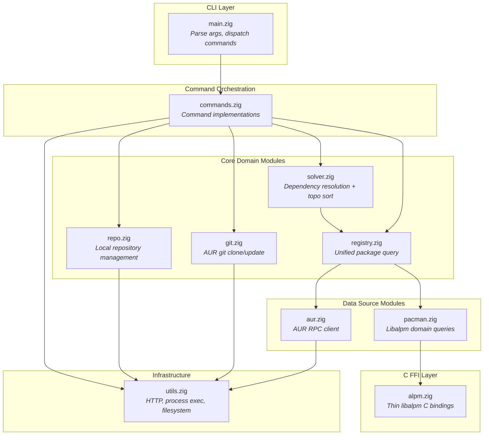
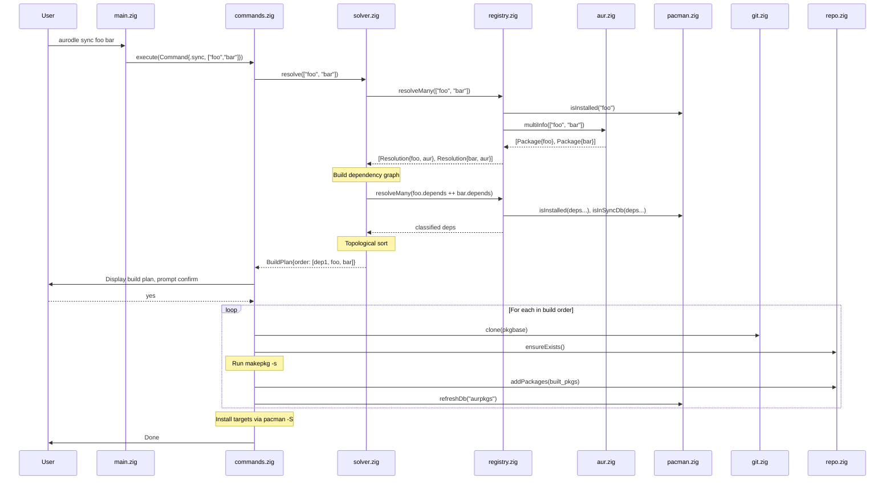
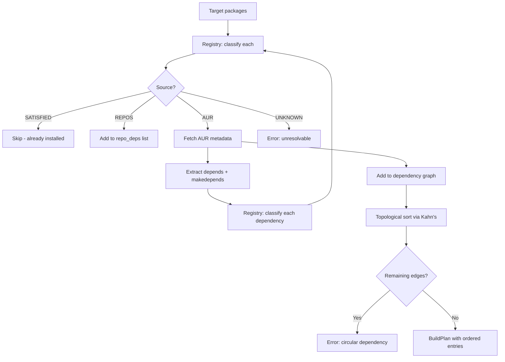
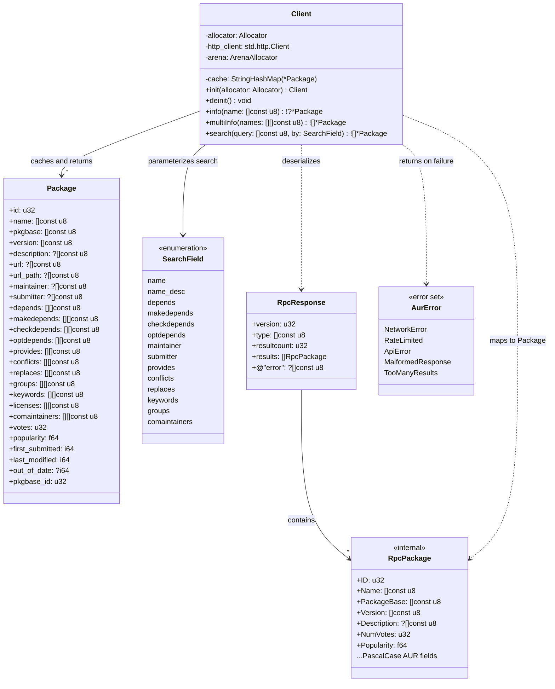
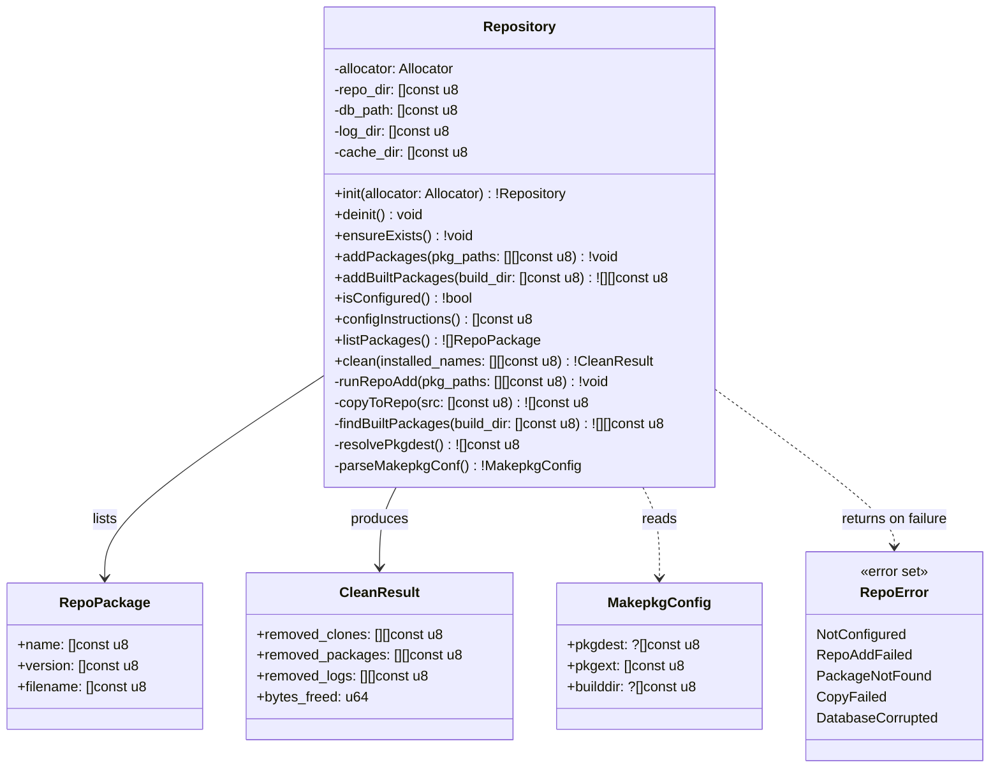
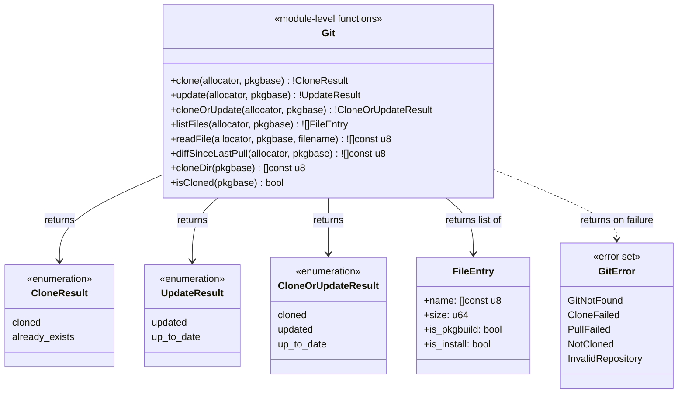
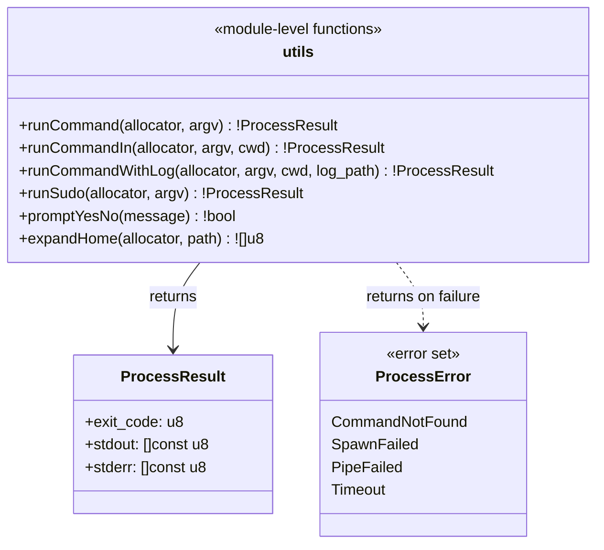
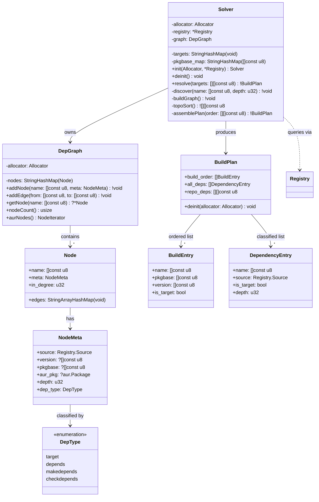
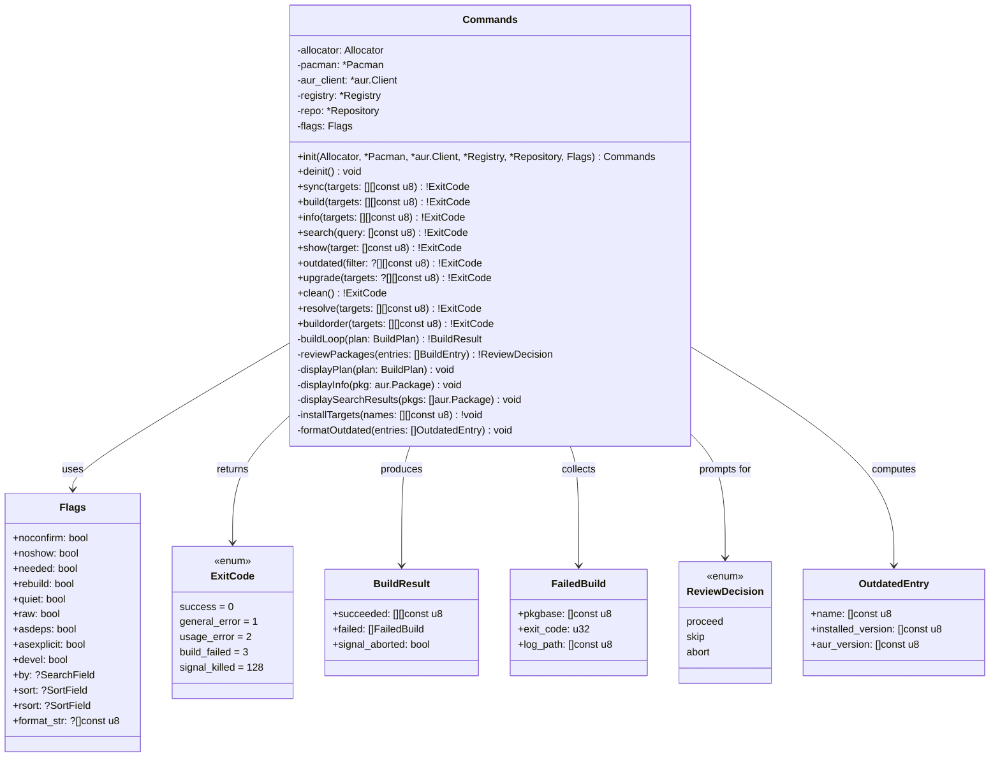

# Aurodle AUR Helper — Software Architecture

## Overview

Aurodle is a minimalist AUR helper written in Zig that builds AUR packages into a local pacman repository. The architecture is designed around **deep modules with simple interfaces** — each module hides significant complexity (C FFI, HTTP/JSON, graph algorithms, filesystem operations) behind narrow, Zig-idiomatic APIs.

The central architectural decision is the **Package Registry mediator**: rather than having the dependency resolver directly couple to both AUR and libalpm, a unified `PackageRegistry` module provides a single query interface. This pulls complexity downward — the resolver expresses intent ("find package X"), and the registry decides where and how to look. This also enables testing the resolver with a mock registry without standing up HTTP servers or libalpm databases.

The libalpm boundary uses a **two-layer design**: a thin C FFI wrapper (`alpm.zig`) that translates C types to Zig types with zero domain logic, consumed by a higher-level module (`pacman.zig`) that provides domain-meaningful operations like "is this dependency satisfied?" and "which repo owns this package?". This prevents C interop details from leaking into business logic.

The architecture is presented in three phases — initial (7 files), standard (12 files), and advanced (18+ files) — with explicit triggers for when to split. Each phase is a valid, complete architecture, not a half-finished version of the next.

## Design Principles Applied

### Deep Modules (Ousterhout Ch. 4)

Every module is designed to maximize the ratio of hidden complexity to interface surface area. The AUR client hides HTTP connection management, JSON parsing, response caching, batch request splitting, and error mapping behind three methods (`info`, `search`, `multiInfo`). The resolver hides graph construction, cycle detection, topological sorting, and dependency classification behind a single `resolve()` call.

### Information Hiding (Ousterhout Ch. 5)

Each module encapsulates decisions likely to change:
- `alpm.zig` hides the exact libalpm C API version and calling conventions
- `aur.zig` hides the AUR RPC protocol version, URL scheme, and JSON schema
- `repo.zig` hides the `repo-add` CLI interface and filesystem layout
- `git.zig` hides git CLI invocation details

If AUR switches to RPC v6, only `aur.zig` changes. If libalpm changes its `alpm_pkg_vercmp` signature, only `alpm.zig` changes.

### Different Layer, Different Abstraction (Ousterhout Ch. 7)

Each layer transforms the abstraction level:
1. **C FFI layer** (`alpm.zig`): Raw C pointers → Zig slices and optionals
2. **Domain layer** (`pacman.zig`): Zig types → domain queries ("is dependency satisfied?")
3. **Registry layer** (`registry.zig`): Domain queries → unified multi-source lookup
4. **Resolution layer** (`solver.zig`): Unified lookups → ordered build plan

A pass-through method at any layer signals a design problem.

### Pull Complexity Downward (Ousterhout Ch. 10)

The `PackageRegistry` absorbs the complexity of multi-source package resolution — checking installed packages first, then sync databases, then AUR — so the resolver's algorithm stays clean. Similarly, `repo.zig` absorbs the complexity of locating built packages (resolving `$PKGDEST`, handling split packages) so that command orchestration code stays simple.

### Define Errors Out of Existence (Ousterhout Ch. 10)

Where possible, modules eliminate error conditions rather than propagating them:
- `repo.zig` auto-creates the repository directory and database on first use (no "repository doesn't exist" error for the caller)
- `git.zig` treats "already cloned" as a success, not an error (idempotent clone)
- `aur.zig` caches results so duplicate queries within a session are free (no "duplicate request" concern)

## Module Structure



---

### Module: `main.zig`

- **Responsibility**: Parse CLI arguments, validate command structure, dispatch to command handlers, format top-level errors to stderr.
- **Interface**:
  ```zig
  pub fn main() u8  // returns exit code
  ```
- **Hidden Complexity**: Argument tokenization, flag validation, help text generation, exit code mapping from error types.
- **Depth Score**: **Medium** — Interface is trivially simple (it's `main`), but the internal complexity is moderate (CLI parsing, error formatting). This is acceptable for an entry point module.

---

### Module: `commands.zig`

- **Responsibility**: Implement all command workflows by orchestrating core modules. Each command is a function that coordinates the sequence: resolve → clone → review → build → install.
- **Interface**:
  ```zig
  pub const Command = struct {
      operation: Operation,
      targets: []const []const u8,
      flags: Flags,
  };

  pub fn execute(allocator: Allocator, cmd: Command) !void
  ```
- **Hidden Complexity**: Per-command workflow orchestration, user prompting (confirmation, review display), progress output, partial failure handling (continue building after one package fails), privilege escalation for pacman calls.
- **Depth Score**: **Medium → Deep** — Starts medium when there are few commands, becomes deep as workflows grow complex (sync, upgrade). This is the primary candidate for splitting (see Phase 2).

**Split trigger**: When `commands.zig` exceeds ~600 lines or when adding `upgrade`/`outdated`, split into:
- `commands/query.zig` — info, search, outdated
- `commands/build.zig` — clone, show, build, sync, upgrade
- `commands/analysis.zig` — resolve, buildorder

---

### Module: `aur.zig`

- **Responsibility**: All communication with the AUR RPC API. Handles HTTP requests, JSON parsing, response caching, request batching, and error mapping.
- **Interface**:
  ```zig
  pub const Client = struct {
      pub fn init(allocator: Allocator) Client
      pub fn deinit(self: *Client) void

      pub fn info(self: *Client, name: []const u8) !?Package
      pub fn multiInfo(self: *Client, names: []const []const u8) ![]Package
      pub fn search(self: *Client, query: []const u8, by: SearchField) ![]Package
  };

  pub const Package = struct {
      name: []const u8,
      pkgbase: []const u8,
      version: []const u8,
      description: ?[]const u8,
      depends: []const []const u8,
      makedepends: []const []const u8,
      checkdepends: []const []const u8,
      optdepends: []const []const u8,
      provides: []const []const u8,
      conflicts: []const []const u8,
      maintainer: ?[]const u8,
      votes: u32,
      popularity: f64,
      last_modified: i64,
      out_of_date: ?i64,
      url: ?[]const u8,
      licenses: []const []const u8,
      // ... other metadata
  };
  ```
- **Hidden Complexity**: HTTP connection management via `std.http.Client`, JSON parsing of AUR RPC v5 responses, in-memory `HashMap` cache keyed by package name, automatic batch splitting at AUR's 100-package limit for `multiInfo`, URL construction and encoding, rate-limit detection and clear error reporting, response validation.
- **Depth Score**: **Deep** — Three public methods hide ~400-500 lines of HTTP, JSON, caching, and batching logic. This is the ideal depth ratio.

---

### Module: `alpm.zig`

- **Responsibility**: Thin, mechanical translation of libalpm C API to Zig types. No domain logic. Translates `[*c]const u8` to `[]const u8`, null pointers to optionals, C error codes to Zig errors.
- **Interface**:
  ```zig
  pub const Handle = struct {
      pub fn init(root: []const u8, dbpath: []const u8) !Handle
      pub fn deinit(self: *Handle) void
      pub fn registerSyncDb(self: *Handle, name: []const u8, siglevel: SigLevel) !Database
      pub fn getLocalDb(self: *Handle) Database
  };

  pub const Database = struct {
      pub fn getPackage(self: Database, name: []const u8) ?AlpmPackage
      pub fn search(self: Database, needles: []const []const u8) !PackageList
      pub fn update(self: Database, force: bool) !void
  };

  pub const AlpmPackage = struct {
      pub fn getName(self: AlpmPackage) []const u8
      pub fn getVersion(self: AlpmPackage) []const u8
      pub fn getDepends(self: AlpmPackage) DependencyList
      pub fn getProvides(self: AlpmPackage) DependencyList
      // ...
  };

  pub fn vercmp(a: []const u8, b: []const u8) i32
  ```
- **Hidden Complexity**: All `@cImport` / C header inclusion, pointer arithmetic for libalpm linked lists (`alpm_list_t`), null-terminated string conversion, C error code translation, memory ownership boundaries (what libalpm owns vs. what we must free).
- **Depth Score**: **Deep** — Simple Zig-native interface hides the full complexity of C interop. Callers never see a C pointer.

---

### Module: `pacman.zig`

- **Responsibility**: High-level domain operations on local and sync databases. Answers domain questions: "Is this package installed?", "Which database provides this package?", "Does version X satisfy constraint Y?".
- **Interface**:
  ```zig
  pub const Pacman = struct {
      pub fn init(allocator: Allocator) !Pacman
      pub fn deinit(self: *Pacman) void

      pub fn isInstalled(self: *Pacman, name: []const u8) bool
      pub fn installedVersion(self: *Pacman, name: []const u8) ?[]const u8
      pub fn isInSyncDb(self: *Pacman, name: []const u8) bool
      pub fn satisfies(self: *Pacman, name: []const u8, constraint: VersionConstraint) bool
      pub fn findProvider(self: *Pacman, dep: []const u8) ?[]const u8
      pub fn refreshDb(self: *Pacman, dbname: []const u8) !void
  };

  pub const VersionConstraint = struct {
      op: enum { eq, ge, le, gt, lt },
      version: []const u8,
  };
  ```
- **Hidden Complexity**: libalpm handle initialization from `/etc/pacman.conf`, sync database registration, the distinction between local and sync databases, `alpm_pkg_vercmp` semantics, dependency string parsing (`pkg>=1.0` → name + constraint), provides/virtual package resolution through libalpm's dependency satisfaction API.
- **Depth Score**: **Deep** — Domain-meaningful methods hide the full libalpm query model. Callers ask "is this satisfied?" not "iterate the local database, find the package, extract its version, parse the constraint, call vercmp".

---

### Module: `registry.zig`

- **Responsibility**: Unified package lookup across all sources. Implements the lookup priority: installed → sync databases → AUR. Classifies each package by source.
- **Interface**:
  ```zig
  pub const Registry = struct {
      pub fn init(allocator: Allocator, pacman: *Pacman, aur: *aur.Client) Registry
      pub fn deinit(self: *Registry) void

      pub fn resolve(self: *Registry, name: []const u8) !Resolution
      pub fn resolveMany(self: *Registry, names: []const []const u8) ![]Resolution
      pub fn classify(self: *Registry, name: []const u8) !Source

      pub const Source = enum { satisfied, repos, aur, unknown };
      pub const Resolution = struct {
          name: []const u8,
          source: Source,
          version: ?[]const u8,
          aur_pkg: ?aur.Package,
      };
  };
  ```
- **Hidden Complexity**: Multi-source lookup ordering and short-circuiting, AUR batch query optimization (collects unknown packages and issues a single `multiInfo`), result caching across multiple calls within a session, version constraint satisfaction checking, provider resolution for virtual packages.
- **Depth Score**: **Deep** — The mediator pattern pays off here. The resolver calls `registry.resolve("libfoo>=2.0")` and gets back a classified result without knowing anything about libalpm queries, AUR HTTP calls, or caching strategies.

---

### Module: `solver.zig`

- **Responsibility**: Dependency resolution and build order generation. Builds a dependency graph, detects cycles, performs topological sort, classifies each node.
- **Interface**:
  ```zig
  pub const Solver = struct {
      pub fn init(allocator: Allocator, registry: *Registry) Solver
      pub fn deinit(self: *Solver) void

      pub fn resolve(self: *Solver, targets: []const []const u8) !BuildPlan

      pub const BuildPlan = struct {
          /// Packages in topological build order (AUR packages only)
          build_order: []const BuildEntry,
          /// All classified dependencies (for display)
          all_deps: []const DependencyEntry,
          /// Packages that need to be installed from repos first
          repo_deps: []const []const u8,
      };

      pub const BuildEntry = struct {
          name: []const u8,
          pkgbase: []const u8,
          version: []const u8,
          is_target: bool,
      };

      pub const DependencyEntry = struct {
          name: []const u8,
          source: Registry.Source,
          is_target: bool,
          depth: u32,
      };
  };
  ```
- **Hidden Complexity**: Recursive dependency graph construction with cycle detection (via coloring: white/gray/black), pkgname-to-pkgbase deduplication (multiple pkgnames may share a pkgbase — only build once), topological sort using Kahn's algorithm, dependency type handling (depends vs makedepends vs checkdepends), the distinction between "needed for build order" and "needed for display".
- **Depth Score**: **Deep** — A single `resolve()` call hides the entire graph algorithm pipeline. The caller gets a ready-to-execute build plan.

---

### Module: `repo.zig`

- **Responsibility**: Local pacman repository management. Creates the repository, adds built packages, maintains the database.
- **Interface**:
  ```zig
  pub const Repository = struct {
      pub fn init(allocator: Allocator) !Repository
      pub fn deinit(self: *Repository) void

      pub fn ensureExists(self: *Repository) !void
      pub fn addPackages(self: *Repository, pkg_paths: []const []const u8) !void
      pub fn isConfigured(self: *Repository) !bool
      pub fn configInstructions() []const u8
  };
  ```
- **Hidden Complexity**: Directory creation (`~/.cache/aurodle/aurpkgs/`), `repo-add -R` invocation, locating built packages by resolving `$PKGDEST` from makepkg.conf, copying packages to the repository directory, handling split packages (multiple `.pkg.tar.*` files from one build), database integrity, pacman.conf validation (checking `[aurpkgs]` section exists).
- **Depth Score**: **Deep** — Four methods hide all filesystem operations, external tool invocation, and configuration checking.

---

### Module: `git.zig`

- **Responsibility**: Clone and update AUR git repositories.
- **Interface**:
  ```zig
  pub fn clone(allocator: Allocator, pkgbase: []const u8) !CloneResult
  pub fn update(allocator: Allocator, pkgbase: []const u8) !UpdateResult

  pub const CloneResult = enum { cloned, already_exists };
  pub const UpdateResult = enum { updated, up_to_date };
  ```
- **Hidden Complexity**: URL construction (`https://aur.archlinux.org/{pkgbase}.git`), cache directory management, git CLI invocation, idempotent clone (existing directory is success, not error), git pull for updates.
- **Depth Score**: **Medium** — Simple operations but the interface is proportionally simple. Acceptable — not every module needs to be deep.

---

### Module: `utils.zig`

- **Responsibility**: Shared infrastructure — HTTP client, child process execution with output capture, filesystem helpers.
- **Interface**:
  ```zig
  pub fn httpGet(allocator: Allocator, url: []const u8) ![]u8
  pub fn runCommand(allocator: Allocator, argv: []const []const u8) !ProcessResult
  pub fn runCommandWithLog(allocator: Allocator, argv: []const []const u8, log_path: []const u8) !ProcessResult
  pub fn expandHome(allocator: Allocator, path: []const u8) ![]u8

  pub const ProcessResult = struct {
      exit_code: u8,
      stdout: []const u8,
      stderr: []const u8,
  };
  ```
- **Hidden Complexity**: `std.http.Client` lifecycle, TLS setup, child process spawning with pipe management, concurrent stdout/stderr capture, tee-to-log-file during real-time display, home directory expansion.
- **Depth Score**: **Medium** — Utility modules are inherently shallower (Ousterhout warns about this). Kept minimal to avoid becoming a dumping ground.

**Split trigger**: When `utils.zig` exceeds ~300 lines, split into `http.zig`, `process.zig`, `fs.zig`.

---

## Layer Architecture

```
┌─────────────────────────────────────────────────────┐
│  CLI Layer                                          │
│  main.zig — parse args, dispatch, format errors     │
├─────────────────────────────────────────────────────┤
│  Command Orchestration Layer                        │
│  commands.zig — workflow sequences, user I/O        │
├──────────────┬──────────────┬───────────────────────┤
│  Resolution  │  Operations  │  Repository           │
│  solver.zig  │  git.zig     │  repo.zig             │
├──────────────┴──────────────┴───────────────────────┤
│  Mediation Layer                                    │
│  registry.zig — unified multi-source package query  │
├────────────────────┬────────────────────────────────┤
│  AUR Data Source   │  Local Data Source              │
│  aur.zig           │  pacman.zig                     │
├────────────────────┴────────┬───────────────────────┤
│  C FFI Layer                │  Infrastructure        │
│  alpm.zig                   │  utils.zig             │
└─────────────────────────────┴───────────────────────┘
```

**Each layer provides a different abstraction level:**

1. **C FFI Layer**: Translates C memory model → Zig memory model (pointers → slices, nulls → optionals)
2. **Data Source Layer**: Translates raw data → domain answers ("is installed?", "what version?")
3. **Mediation Layer**: Translates domain answers → unified classified lookups
4. **Resolution Layer**: Translates classified lookups → ordered build plans
5. **Command Layer**: Translates build plans → user-visible workflows with I/O
6. **CLI Layer**: Translates user input → typed command structures

No layer is a pass-through. Each transforms the abstraction meaningfully.

## Phase Architecture

### Phase 1: Initial (9 files) — Core MVP

```
src/
├── main.zig          # CLI parsing, dispatch
├── commands.zig      # All command implementations
├── aur.zig           # AUR RPC client
├── alpm.zig          # Thin libalpm C FFI
├── pacman.zig        # High-level libalpm domain queries
├── registry.zig      # Unified package lookup
├── solver.zig        # Dependency resolution + topo sort
├── repo.zig          # Local repository management
├── git.zig           # Git clone operations
└── utils.zig         # HTTP, process, filesystem helpers
```

**Commands implemented**: info, search, clone, build, sync, resolve, buildorder

**Why 10 files, not 7**: The thin-wrapper + domain-module pattern for libalpm (alpm.zig + pacman.zig) and the mediator pattern (registry.zig) each add one file. This is justified because:
- `alpm.zig` vs `pacman.zig` prevents C types from leaking (information hiding)
- `registry.zig` makes the resolver testable without real data sources (design for testability)

### Phase 2: Standard (14 files) — Post-MVP

**Trigger**: `commands.zig` exceeds ~600 lines (adding upgrade, outdated, show workflows).

```
src/
├── main.zig
├── commands/
│   ├── query.zig       # info, search, outdated
│   ├── build.zig       # clone, show, build, sync, upgrade
│   └── analysis.zig    # resolve, buildorder
├── aur.zig
├── alpm.zig
├── pacman.zig
├── registry.zig
├── solver.zig
├── repo.zig
├── git.zig
├── utils/
│   ├── http.zig
│   ├── process.zig
│   └── fs.zig
└── config.zig          # Environment variable + makepkg.conf reading
```

**New capabilities**: outdated detection, upgrade workflow, show/review, `$PKGDEST`/`$AURDEST` support, pacman.conf Color/VerbosePkgLists.

### Phase 3: Advanced (18+ files) — Power User Features

**Trigger**: Provider resolution, conflict detection, or chroot builds needed.

```
src/
├── main.zig
├── commands/
│   ├── query.zig
│   ├── build.zig
│   └── analysis.zig
├── aur.zig
├── alpm.zig
├── pacman.zig
├── registry.zig
├── solver/
│   ├── resolver.zig     # Core resolution algorithm
│   ├── graph.zig        # Dependency graph data structure
│   └── providers.zig    # Virtual package + conflict resolution
├── repo.zig
├── git.zig
├── config.zig
├── cache.zig            # Cache cleanup operations
└── utils/
    ├── http.zig
    ├── process.zig
    └── fs.zig
```

## Design Decisions

| Decision | Options Considered | Choice | Rationale |
|----------|-------------------|--------|-----------|
| libalpm integration | (A) Single deep module (B) Thin wrapper + domain module (C) Auto-generated bindings | **(B) Thin wrapper + domain** | Prevents C type leakage. `alpm.zig` changes only for libalpm API changes; `pacman.zig` changes only for domain logic changes. Each has one reason to change (SRP). |
| Data source access from resolver | (A) Direct dependencies (B) Injected interfaces (C) Mediator (PackageRegistry) | **(C) Mediator** | Pulls lookup complexity downward. Resolver stays a pure graph algorithm. Registry absorbs source priority, batching, and caching. Easy to test resolver with mock registry. |
| CLI parsing | (A) Zig std arg iterator (B) Custom parser (C) Third-party library | **(A) Zig std** | No external dependencies constraint (NFR-6). `std.process.args` is sufficient for the command structure. Custom flag handling is ~100 lines. |
| JSON parsing | (A) Zig std.json (B) Custom streaming parser (C) Third-party | **(A) Zig std.json** | Sufficient for AUR RPC response sizes (typically <100KB). Streaming parser adds complexity without measurable benefit at this scale. |
| Error handling strategy | (A) Zig error unions only (B) Error unions + context struct (C) Error unions + error return trace | **(B) Error unions + context** | Zig error unions provide the mechanism; context structs provide the user-facing message. Commands catch errors and format them with category/context/solution structure per NFR-4. |
| Process execution | (A) Zig std.process.Child (B) libc fork/exec (C) posix_spawn | **(A) Zig std.process.Child** | Idiomatic Zig, handles pipe management, sufficient for makepkg/git/repo-add invocation. |
| Cache strategy | (A) No cache (B) In-memory per-session (C) Disk-persistent | **(B) In-memory per-session** | Requirements explicitly state no network caching across invocations (Technical Constraints). In-memory cache prevents duplicate AUR queries within a single `sync` or `upgrade` operation. |
| Topological sort algorithm | (A) DFS-based (B) Kahn's algorithm (BFS) | **(B) Kahn's algorithm** | Naturally produces a valid build order, detects cycles (remaining nodes with edges = cycle), and is iterative (no stack overflow risk on deep dependency chains). |
| Config file format | (A) Pacman.conf style (B) TOML (C) None initially | **(C) None initially** | Design constraint: no configuration file in v1. Hardcoded defaults → environment variables → config file is the phased approach. |
| Build log capture | (A) Pipe to file only (B) Tee to file + terminal (C) Terminal only with optional save | **(B) Tee** | FR-9 requires "captures makepkg output to log file while also displaying in real-time". Implemented in `utils.runCommandWithLog`. |

## Complexity Analysis

### Red Flags Avoided

- **Shallow modules**: No module exists purely to delegate to another. Every module transforms the abstraction level. The `registry.zig` mediator could be mistaken for a pass-through, but it adds source prioritization, batching, and caching — significant hidden value.
- **Information leakage**: C types from libalpm never appear outside `alpm.zig`. AUR JSON field names never appear outside `aur.zig`. Filesystem paths for the repository are encapsulated in `repo.zig`.
- **Temporal decomposition**: Commands are not split by "first clone, then build, then install" as separate modules. The temporal sequence lives in `commands.zig`; each module provides a capability, not a step.
- **Overexposure of internals**: `solver.zig` returns a `BuildPlan` struct, not the raw dependency graph. The graph is an internal detail. Commands don't need to understand graph nodes — they need a build order.

### Complexity Pulled Downward

| Complexity | Absorbed By | Instead Of |
|------------|-------------|------------|
| C pointer management, linked list traversal | `alpm.zig` | Every module that queries packages |
| HTTP lifecycle, JSON parsing, response caching | `aur.zig` | Resolver and commands |
| Multi-source lookup priority, batch optimization | `registry.zig` | Resolver |
| Cycle detection, topological sort, pkgbase dedup | `solver.zig` | Command orchestration |
| `$PKGDEST` resolution, `repo-add` invocation, split package handling | `repo.zig` | Build commands |
| makepkg output tee, process pipe management | `utils.zig` | Every module that runs external commands |

### Information Hiding Achieved

| Hidden Information | Module | Why It Might Change |
|-------------------|--------|---------------------|
| AUR RPC v5 protocol details | `aur.zig` | AUR may release v6 |
| libalpm C API signatures | `alpm.zig` | pacman updates may change API |
| Repository filesystem layout | `repo.zig` | Directory structure may change |
| Git URL pattern for AUR | `git.zig` | AUR may change hosting |
| Dependency graph representation | `solver.zig` | Algorithm improvements |
| Lookup priority ordering | `registry.zig` | Policy changes (e.g., prefer AUR over repos) |

## Data Flow Diagrams

### `sync` Command Flow (FR-10)



### Dependency Resolution Flow (FR-5, FR-7)



## Testing Architecture

### Test Strategy by Module

| Module | Test Approach | Mock Dependencies |
|--------|--------------|-------------------|
| `alpm.zig` | Integration test with real libalpm (or mock `.so`) | None (tests C FFI directly) |
| `pacman.zig` | Unit test with mock `alpm.zig` handle | Mock `alpm.Handle` |
| `aur.zig` | Unit test with recorded HTTP fixtures | Mock HTTP responses (fixture files) |
| `registry.zig` | Unit test with mock `Pacman` + mock `aur.Client` | Both data sources mocked |
| `solver.zig` | Unit test with mock `Registry` | Mock registry returning predetermined classifications |
| `repo.zig` | Integration test in temp directory | Real filesystem, mock `repo-add` |
| `git.zig` | Integration test with local git repo | Real git, test repository |
| `commands.zig` | Integration test (end-to-end with mocks) | Mock all core modules |

### Test Directory Structure

```
src/          # Zig convention: tests live alongside source in test blocks
tests/
├── fixtures/
│   ├── aur_responses/       # Recorded AUR RPC JSON responses
│   │   ├── info_single.json
│   │   ├── info_multi.json
│   │   ├── search_results.json
│   │   └── error_not_found.json
│   └── test_pkgbuilds/      # Minimal valid PKGBUILDs for build tests
│       └── trivial/PKGBUILD
└── integration/
    └── full_sync_test.zig   # End-to-end workflow test
```

## Class-Level Design: `registry.zig`

The `PackageRegistry` is the architectural linchpin — it sits between the solver (which thinks in dependency graphs) and the data sources (which think in database queries and HTTP requests). This section details its internal structure.

### Class Diagram

```mermaid
classDiagram
    class Registry {
        -allocator: Allocator
        -pacman: *Pacman
        -aur_client: *aur.Client
        -cache: StringHashMap(Resolution)
        -pending_aur: StringArrayHashMap(void)
        +init(Allocator, *Pacman, *aur.Client) Registry
        +deinit() void
        +resolve(dep_string: []const u8) !Resolution
        +resolveMany(dep_strings: [][]const u8) ![]Resolution
        +classify(name: []const u8) !Source
        -resolveFromCache(name: []const u8) ?Resolution
        -resolveLocal(name: []const u8, constraint: ?VersionConstraint) ?Resolution
        -resolveSync(name: []const u8, constraint: ?VersionConstraint) ?Resolution
        -resolveAur(name: []const u8) !?Resolution
        -flushPendingAur() !void
        -parseDep(dep_string: []const u8) DepSpec
    }

    class Resolution {
        +name: []const u8
        +source: Source
        +version: ?[]const u8
        +aur_pkg: ?aur.Package
        +provider: ?[]const u8
    }

    class Source {
        <<enumeration>>
        satisfied
        repos
        aur
        unknown
    }

    class DepSpec {
        +name: []const u8
        +constraint: ?VersionConstraint
    }

    class VersionConstraint {
        +op: CmpOp
        +version: []const u8
    }

    class CmpOp {
        <<enumeration>>
        eq
        ge
        le
        gt
        lt
    }

    Registry --> Resolution : produces
    Registry --> DepSpec : parses into
    Resolution --> Source : classified by
    DepSpec --> VersionConstraint : may contain
    VersionConstraint --> CmpOp : uses
    Registry ..> Pacman : queries local/sync
    Registry ..> "aur.Client" : queries AUR
```

### Internal Architecture

The registry's core operation is a **three-tier cascade with deferred batching**:

```
resolve("libfoo>=2.0")
  │
  ├─ 1. parseDep("libfoo>=2.0") → DepSpec{ name="libfoo", constraint={ge, "2.0"} }
  │
  ├─ 2. resolveFromCache("libfoo") → hit? return cached Resolution
  │
  ├─ 3. resolveLocal("libfoo", {ge, "2.0"})
  │     └─ pacman.isInstalled("libfoo") AND pacman.satisfies("libfoo", {ge, "2.0"})
  │     └─ hit? → return Resolution{ source=.satisfied }
  │
  ├─ 4. resolveSync("libfoo", {ge, "2.0"})
  │     └─ pacman.isInSyncDb("libfoo") AND version satisfies constraint
  │     └─ hit? → return Resolution{ source=.repos }
  │
  ├─ 5. resolveAur("libfoo")
  │     └─ aur_client.info("libfoo")
  │     └─ hit? → return Resolution{ source=.aur, aur_pkg=pkg }
  │
  └─ 6. return Resolution{ source=.unknown }
```

Each tier short-circuits: if the package is found at a higher-priority source, lower sources are never queried.

### Key Internal Types

```zig
const Registry = struct {
    allocator: Allocator,
    pacman: *pacman_mod.Pacman,
    aur_client: *aur.Client,

    /// Per-session cache: name → Resolution
    /// Prevents duplicate queries across multiple solver passes.
    /// Keyed by package *name* (not dep string), because the same package
    /// may appear with different constraints in different parts of the tree.
    /// The resolution records the source; constraint satisfaction is
    /// re-checked by the caller when needed.
    cache: std.StringHashMapUnmanaged(Resolution),

    /// Deferred AUR batch buffer for resolveMany().
    /// Names that weren't found locally or in sync DBs accumulate here,
    /// then get flushed as a single multiInfo call.
    pending_aur: std.StringArrayHashMapUnmanaged(void),
};
```

### Method Details

#### `resolve(dep_string: []const u8) !Resolution`

The single-package entry point. Parses the dependency string, checks the cache, then cascades through local → sync → AUR.

```zig
pub fn resolve(self: *Registry, dep_string: []const u8) !Resolution {
    const spec = parseDep(dep_string);

    // Cache check (by name, not full dep string)
    if (self.resolveFromCache(spec.name)) |cached| {
        // Re-verify constraint satisfaction for cached result
        if (spec.constraint) |c| {
            if (cached.version) |v| {
                if (!satisfiesConstraint(v, c)) {
                    // Cached version exists but doesn't satisfy THIS constraint.
                    // This is a version conflict — the solver will handle it.
                    return Resolution{
                        .name = spec.name,
                        .source = .unknown,
                        .version = cached.version,
                        .aur_pkg = cached.aur_pkg,
                        .provider = null,
                    };
                }
            }
        }
        return cached;
    }

    // Tier 1: Installed locally?
    if (self.resolveLocal(spec.name, spec.constraint)) |res| {
        try self.cacheResult(spec.name, res);
        return res;
    }

    // Tier 2: In sync databases?
    if (self.resolveSync(spec.name, spec.constraint)) |res| {
        try self.cacheResult(spec.name, res);
        return res;
    }

    // Tier 3: In AUR?
    if (try self.resolveAur(spec.name)) |res| {
        try self.cacheResult(spec.name, res);
        return res;
    }

    // Tier 4: Try provider resolution (Phase 2+)
    // pacman.findProvider checks if any installed/sync package
    // has a `provides` entry matching this dep string.

    // Not found anywhere
    const res = Resolution{
        .name = spec.name,
        .source = .unknown,
        .version = null,
        .aur_pkg = null,
        .provider = null,
    };
    try self.cacheResult(spec.name, res);
    return res;
}
```

#### `resolveMany(dep_strings: []const []const u8) ![]Resolution`

The batch entry point. This is where the **deferred AUR batching** strategy pays off. Instead of issuing one HTTP request per unknown package, it:

1. Runs tiers 1-2 (local + sync) for all packages — these are cheap local operations
2. Collects all packages that reach tier 3 into `pending_aur`
3. Flushes the entire batch as a single `aur.multiInfo()` call
4. Maps results back to individual resolutions

```zig
pub fn resolveMany(self: *Registry, dep_strings: []const []const u8) ![]Resolution {
    var results = try std.ArrayList(Resolution).initCapacity(self.allocator, dep_strings.len);

    // Pass 1: Resolve everything we can locally
    for (dep_strings) |dep_str| {
        const spec = parseDep(dep_str);

        if (self.resolveFromCache(spec.name)) |cached| {
            try results.append(cached);
            continue;
        }

        if (self.resolveLocal(spec.name, spec.constraint)) |res| {
            try self.cacheResult(spec.name, res);
            try results.append(res);
            continue;
        }

        if (self.resolveSync(spec.name, spec.constraint)) |res| {
            try self.cacheResult(spec.name, res);
            try results.append(res);
            continue;
        }

        // Mark for AUR batch query
        try self.pending_aur.put(self.allocator, spec.name, {});
        try results.append(.{  // placeholder — will be overwritten
            .name = spec.name,
            .source = .unknown,
            .version = null,
            .aur_pkg = null,
            .provider = null,
        });
    }

    // Pass 2: Flush all pending AUR lookups in one batch
    if (self.pending_aur.count() > 0) {
        try self.flushPendingAur();

        // Pass 3: Re-resolve placeholders from cache (now populated by flush)
        for (results.items, 0..) |*res, i| {
            if (res.source == .unknown) {
                if (self.resolveFromCache(res.name)) |cached| {
                    res.* = cached;
                }
            }
        }
    }

    return results.toOwnedSlice();
}
```

#### `flushPendingAur() !void`

Drains the `pending_aur` buffer into a single (or batched, if >100) `multiInfo` call.

```zig
fn flushPendingAur(self: *Registry) !void {
    const names = self.pending_aur.keys();
    if (names.len == 0) return;

    // aur.Client.multiInfo handles splitting at the 100-package AUR limit
    const packages = try self.aur_client.multiInfo(names);

    // Index results by name for O(1) lookup
    var by_name = std.StringHashMapUnmanaged(aur.Package){};
    defer by_name.deinit(self.allocator);
    for (packages) |pkg| {
        try by_name.put(self.allocator, pkg.name, pkg);
    }

    // Cache each result
    for (names) |name| {
        if (by_name.get(name)) |pkg| {
            try self.cacheResult(name, .{
                .name = name,
                .source = .aur,
                .version = pkg.version,
                .aur_pkg = pkg,
                .provider = null,
            });
        }
        // Names not in AUR response stay as .unknown in cache
    }

    self.pending_aur.clearRetainingCapacity();
}
```

#### `parseDep(dep_string: []const u8) DepSpec`

Parses pacman-style versioned dependency strings. This is a pure function — no state, no errors.

```zig
/// Parses "pkg>=1.0.0" → DepSpec{ .name = "pkg", .constraint = { .ge, "1.0.0" } }
/// Parses "pkg" → DepSpec{ .name = "pkg", .constraint = null }
/// Handles: =, >=, <=, >, <
fn parseDep(dep_string: []const u8) DepSpec {
    // Scan for first operator character
    const operators = [_]struct { str: []const u8, op: CmpOp }{
        .{ .str = ">=", .op = .ge },
        .{ .str = "<=", .op = .le },
        .{ .str = "=",  .op = .eq },
        .{ .str = ">",  .op = .gt },
        .{ .str = "<",  .op = .lt },
    };

    for (operators) |entry| {
        if (std.mem.indexOf(u8, dep_string, entry.str)) |pos| {
            return .{
                .name = dep_string[0..pos],
                .constraint = .{
                    .op = entry.op,
                    .version = dep_string[pos + entry.str.len ..],
                },
            };
        }
    }

    return .{ .name = dep_string, .constraint = null };
}
```

### State Machine: Resolution Lifecycle

A package name goes through the following states within a registry session:

```
                    ┌──────────┐
                    │  Unknown │ (not yet queried)
                    └────┬─────┘
                         │ resolve() or resolveMany() called
                         ▼
                ┌────────────────┐
                │  Check Cache   │
                └───┬────────┬───┘
              hit   │        │ miss
                    ▼        ▼
              ┌──────┐  ┌──────────┐
              │Return│  │Check     │
              │cached│  │local DB  │
              └──────┘  └───┬──┬───┘
                      found │  │ not found
                            ▼  ▼
                      ┌──────────┐
                      │Check     │
                      │sync DBs  │
                      └───┬──┬───┘
                    found │  │ not found
                          ▼  ▼
                    ┌──────────┐
                    │Query AUR │ (or batch via pending_aur)
                    └───┬──┬───┘
                  found │  │ not found
                        ▼  ▼
                  ┌──────────┐
                  │ Cached   │ (source = satisfied|repos|aur|unknown)
                  │ forever  │ (within this session)
                  └──────────┘
```

Once cached, a resolution is immutable for the session. This is safe because:
- Installed packages don't change during a single aurodle invocation
- Sync databases don't change (we only refresh `aurpkgs` between builds, and that's a deliberate invalidation point — see below)
- AUR metadata doesn't change within a session

### Cache Invalidation

The only time the cache needs invalidation is between builds in a multi-package `sync` workflow. After building package A and running `repo-add`, package A is now available in the `aurpkgs` sync database. The solver needs to see this for `makepkg -s` to work on package B that depends on A.

```zig
/// Called by commands.zig between builds in a multi-package sync.
/// Invalidates only specific entries that may have changed.
pub fn invalidate(self: *Registry, names: []const []const u8) void {
    for (names) |name| {
        _ = self.cache.remove(name);
    }
}
```

This is a surgical invalidation, not a full cache flush. Only the just-built packages are invalidated. Everything else (installed packages, repo packages, other AUR metadata) remains valid.

### Provider Resolution (Phase 2)

When a dependency like `java-runtime` isn't a real package name, it's a virtual dependency that other packages `provide`. Provider resolution adds a fourth tier before `.unknown`:

```zig
// Tier 4: Check if any installed/sync package provides this
if (self.pacman.findProvider(spec.name)) |provider_name| {
    const res = Resolution{
        .name = spec.name,
        .source = .repos, // or .satisfied if the provider is installed
        .version = null,
        .aur_pkg = null,
        .provider = provider_name,
    };
    try self.cacheResult(spec.name, res);
    return res;
}

// Tier 5: Search AUR for packages that provide this
// Uses aur.search(spec.name, .provides) — more expensive
```

The `provider` field in `Resolution` records which real package satisfies a virtual dependency. The solver uses this to ensure the provider is in the build plan if it's an AUR package.

### Error Semantics

The registry **does not error on "not found"** — it returns `Source.unknown`. This is a deliberate design choice (Ousterhout's "define errors out of existence"). The solver decides what to do with unknowns:

- For `depends`: unknown is a fatal error (can't build without it)
- For `makedepends`: unknown is a fatal error (can't build without it)
- For `optdepends`: unknown is a warning (skip and continue)
- For `checkdepends`: unknown may be acceptable (skip tests)

By pushing this policy to the solver, the registry stays a pure lookup mechanism with no domain policy embedded.

The registry **does** error on infrastructure failures:
- `error.NetworkError`: AUR HTTP request failed
- `error.RateLimited`: AUR returned rate-limit response
- `error.AlpmError`: libalpm query failed (database corruption, etc.)

These are genuine "can't proceed" situations, distinct from "package doesn't exist."

### Testing Strategy

The registry is designed for straightforward testing through constructor injection:

```zig
test "resolve classifies installed package as satisfied" {
    var mock_pacman = MockPacman.init();
    mock_pacman.addInstalled("zlib", "1.3.1");

    var mock_aur = MockAurClient.init();

    var reg = Registry.init(testing.allocator, &mock_pacman, &mock_aur);
    defer reg.deinit();

    const res = try reg.resolve("zlib>=1.0");
    try testing.expectEqual(.satisfied, res.source);
    try testing.expectEqualStrings("1.3.1", res.version.?);
}

test "resolveMany batches AUR queries" {
    var mock_pacman = MockPacman.init(); // nothing installed
    var mock_aur = MockAurClient.init();
    mock_aur.addPackage(.{ .name = "foo", .version = "1.0" });
    mock_aur.addPackage(.{ .name = "bar", .version = "2.0" });

    var reg = Registry.init(testing.allocator, &mock_pacman, &mock_aur);
    defer reg.deinit();

    const results = try reg.resolveMany(&.{ "foo", "bar" });
    defer testing.allocator.free(results);

    // Verify both resolved as AUR
    try testing.expectEqual(.aur, results[0].source);
    try testing.expectEqual(.aur, results[1].source);

    // Verify only ONE multiInfo call was made (batch)
    try testing.expectEqual(@as(usize, 1), mock_aur.multi_info_call_count);
}

test "cache prevents duplicate AUR queries" {
    var mock_pacman = MockPacman.init();
    var mock_aur = MockAurClient.init();
    mock_aur.addPackage(.{ .name = "foo", .version = "1.0" });

    var reg = Registry.init(testing.allocator, &mock_pacman, &mock_aur);
    defer reg.deinit();

    _ = try reg.resolve("foo");
    _ = try reg.resolve("foo"); // second call

    // AUR was only queried once
    try testing.expectEqual(@as(usize, 1), mock_aur.info_call_count);
}
```

The `MockPacman` and `MockAurClient` are test doubles that implement the same interface through Zig's duck typing (struct with matching method signatures). They don't need a formal interface/vtable — the registry calls methods by name, and Zig's comptime type checking ensures compatibility.

## Class-Level Design: `aur.zig`

The AUR client is the deepest module by complexity-to-interface ratio. Three public methods hide HTTP connection management, JSON deserialization, per-session caching, automatic batch splitting, URL encoding, and structured error mapping. This section details the internal design against the real AUR RPC v5 API.

### Class Diagram



### AUR RPC v5 Protocol Mapping

The AUR API uses PascalCase field names (`PackageBase`, `NumVotes`, `LastModified`). Zig idiom is snake_case. The client performs this mapping at the JSON deserialization boundary so that all downstream code uses Zig-idiomatic names.

| AUR RPC v5 Field | `Package` Field | Type | Notes |
|-----------------|-----------------|------|-------|
| `ID` | `id` | `u32` | |
| `Name` | `name` | `[]const u8` | |
| `PackageBase` | `pkgbase` | `[]const u8` | Critical for clone URLs |
| `PackageBaseID` | `pkgbase_id` | `u32` | |
| `Version` | `version` | `[]const u8` | `pkgver-pkgrel` format |
| `Description` | `description` | `?[]const u8` | Nullable |
| `URL` | `url` | `?[]const u8` | Upstream URL |
| `URLPath` | `url_path` | `?[]const u8` | Snapshot `.tar.gz` path |
| `Maintainer` | `maintainer` | `?[]const u8` | Null if orphaned |
| `Submitter` | `submitter` | `?[]const u8` | Only in detailed info |
| `NumVotes` | `votes` | `u32` | |
| `Popularity` | `popularity` | `f64` | |
| `FirstSubmitted` | `first_submitted` | `i64` | Unix timestamp |
| `LastModified` | `last_modified` | `i64` | Unix timestamp |
| `OutOfDate` | `out_of_date` | `?i64` | Null or unix timestamp |
| `Depends` | `depends` | `[][]const u8` | Only in detailed info |
| `MakeDepends` | `makedepends` | `[][]const u8` | Only in detailed info |
| `CheckDepends` | `checkdepends` | `[][]const u8` | Only in detailed info |
| `OptDepends` | `optdepends` | `[][]const u8` | Only in detailed info |
| `Provides` | `provides` | `[][]const u8` | Only in detailed info |
| `Conflicts` | `conflicts` | `[][]const u8` | Only in detailed info |
| `Replaces` | `replaces` | `[][]const u8` | Only in detailed info |
| `Groups` | `groups` | `[][]const u8` | Only in detailed info |
| `Keywords` | `keywords` | `[][]const u8` | Only in detailed info |
| `License` | `licenses` | `[][]const u8` | Only in detailed info |
| `CoMaintainers` | `comaintainers` | `[][]const u8` | Only in detailed info |

**Search results return `PackageBasic`** (no dependency arrays). **Info results return `PackageDetailed`** (all fields). The `Package` struct has all fields, with arrays defaulting to empty slices for search results.

### Memory Management Strategy

The AUR client faces a fundamental ownership question: who owns the `Package` data and the strings within it? JSON parsing with `std.json` produces heap-allocated strings, and packages are referenced by the cache, the registry, and the solver.

**Solution: Arena allocator.** The client owns an `ArenaAllocator` that backs all parsed package data. All strings inside `Package` structs point into this arena. When the client is deinitialized, the arena frees everything at once.

```zig
const Client = struct {
    allocator: Allocator,
    /// All Package data lives here. Freed in bulk on deinit().
    /// This means Package pointers are valid for the lifetime of the Client.
    arena: std.heap.ArenaAllocator,
    http_client: std.http.Client,
    cache: std.StringHashMapUnmanaged(*Package),

    pub fn init(allocator: Allocator) Client {
        return .{
            .allocator = allocator,
            .arena = std.heap.ArenaAllocator.init(allocator),
            .http_client = std.http.Client{ .allocator = allocator },
            .cache = .{},
        };
    }

    pub fn deinit(self: *Client) void {
        self.http_client.deinit();
        self.cache.deinit(self.allocator);
        // All Package data, all strings, all slices — freed in one call
        self.arena.deinit();
    }
};
```

**Why arena over per-package allocation:** AUR packages are immutable within a session (we never modify parsed data), and they all share the same lifetime (the client's lifetime). Per-package `allocator.free()` would require tracking every individual string allocation inside every Package — dozens of strings and arrays per package. The arena eliminates this bookkeeping entirely.

**Trade-off:** Memory is not freed until the client is deinitialized. For a CLI tool that runs a single operation and exits, this is ideal. For a long-running daemon (which aurodle is not), this would be a memory leak concern.

### Method Internals

#### `info(name: []const u8) !?*Package`

Single-package lookup. Checks cache first, then issues an HTTP request.

```zig
pub fn info(self: *Client, name: []const u8) !?*Package {
    // Cache hit
    if (self.cache.get(name)) |pkg| return pkg;

    // HTTP request
    const url = try std.fmt.allocPrint(
        self.allocator,
        "https://aur.archlinux.org/rpc/v5/info/{s}",
        .{name},
    );
    defer self.allocator.free(url);

    const response_body = try self.httpGet(url);
    defer self.allocator.free(response_body);

    // Parse and cache
    const response = try self.parseResponse(response_body);
    try self.checkError(response);

    if (response.resultcount == 0) return null;

    const pkg = try self.mapPackage(response.results[0]);
    try self.cache.put(self.allocator, pkg.name, pkg);
    return pkg;
}
```

#### `multiInfo(names: []const []const u8) ![]*Package`

The batch endpoint. This is where the AUR's limit on query size must be handled. The AUR API accepts `arg[]` parameters (GET or POST). In practice, very long GET URLs break, so we switch to POST for large batches.

```zig
pub fn multiInfo(self: *Client, names: []const []const u8) ![]*Package {
    const arena_alloc = self.arena.allocator();
    var results = std.ArrayList(*Package).init(self.allocator);
    defer results.deinit();

    // Filter out already-cached packages
    var uncached = std.ArrayList([]const u8).init(self.allocator);
    defer uncached.deinit();

    for (names) |name| {
        if (self.cache.get(name)) |pkg| {
            try results.append(pkg);
        } else {
            try uncached.append(name);
        }
    }

    // Batch uncached in chunks of MAX_BATCH_SIZE
    const MAX_BATCH_SIZE = 100;
    var i: usize = 0;
    while (i < uncached.items.len) {
        const end = @min(i + MAX_BATCH_SIZE, uncached.items.len);
        const batch = uncached.items[i..end];

        const batch_results = try self.fetchMultiInfo(batch);
        for (batch_results) |pkg| {
            try self.cache.put(self.allocator, pkg.name, pkg);
            try results.append(pkg);
        }

        i = end;
    }

    return try results.toOwnedSlice();
}

/// Issues a single multi-info request for a batch of names.
/// Uses POST with form-encoded body to avoid URL length limits.
fn fetchMultiInfo(self: *Client, names: []const []const u8) ![]*Package {
    const arena_alloc = self.arena.allocator();

    // Build form body: "arg[]=name1&arg[]=name2&..."
    var body = std.ArrayList(u8).init(self.allocator);
    defer body.deinit();

    for (names, 0..) |name, idx| {
        if (idx > 0) try body.append('&');
        try body.appendSlice("arg[]=");
        try appendUrlEncoded(&body, name);
    }

    const response_body = try self.httpPost(
        "https://aur.archlinux.org/rpc/v5/info",
        body.items,
    );
    defer self.allocator.free(response_body);

    const response = try self.parseResponse(response_body);
    try self.checkError(response);

    var results = try std.ArrayList(*Package).initCapacity(
        self.allocator,
        response.resultcount,
    );
    for (response.results) |rpc_pkg| {
        try results.append(try self.mapPackage(rpc_pkg));
    }

    return try results.toOwnedSlice();
}
```

**Why POST for multi-info:** The GET endpoint uses `?arg[]=foo&arg[]=bar&...` which can exceed URL length limits (typically 8KB) with 100 packages. The AUR v5 API explicitly supports POST with `application/x-www-form-urlencoded` body for the multi-info endpoint. POST has no practical body size limit.

**Why 100 as batch size:** The AUR wiki historically documents a soft limit of ~100 packages per request. Exceeding it may result in truncated results or timeouts. 100 is conservative and matches what aurutils and other AUR helpers use.

#### `search(query: []const u8, by: SearchField) ![]*Package`

Search is simpler — no batching, no caching (search results are context-dependent and not reusable for info lookups since they lack dependency arrays).

```zig
pub fn search(
    self: *Client,
    query: []const u8,
    by: SearchField,
) ![]*Package {
    const url = try std.fmt.allocPrint(
        self.allocator,
        "https://aur.archlinux.org/rpc/v5/search/{s}?by={s}",
        .{ query, by.toQueryParam() },
    );
    defer self.allocator.free(url);

    const response_body = try self.httpGet(url);
    defer self.allocator.free(response_body);

    const response = try self.parseResponse(response_body);
    try self.checkError(response);

    const arena_alloc = self.arena.allocator();
    var results = try std.ArrayList(*Package).initCapacity(
        self.allocator,
        response.resultcount,
    );
    for (response.results) |rpc_pkg| {
        try results.append(try self.mapPackage(rpc_pkg));
    }

    return try results.toOwnedSlice();
}
```

**Search results are NOT cached** because:
1. Search returns `PackageBasic` (no dependency arrays) — insufficient for dependency resolution
2. Search results depend on the query term — caching by package name would be incorrect
3. Users rarely search the same term twice in one session

### JSON Deserialization

The `parseResponse` and `mapPackage` methods handle the translation from AUR's PascalCase JSON to Zig's snake_case `Package` struct.

```zig
/// Raw AUR RPC response structure — matches the JSON exactly.
/// Field names use AUR's PascalCase convention for std.json compatibility.
const RpcResponse = struct {
    version: u32,
    type: []const u8,
    resultcount: u32,
    results: []const RpcPackage,
    @"error": ?[]const u8 = null,
};

/// Raw AUR package as it arrives from the API.
/// PascalCase field names match the JSON keys.
const RpcPackage = struct {
    ID: u32,
    Name: []const u8,
    PackageBase: []const u8,
    PackageBaseID: u32,
    Version: []const u8,
    Description: ?[]const u8 = null,
    URL: ?[]const u8 = null,
    URLPath: ?[]const u8 = null,
    Maintainer: ?[]const u8 = null,
    Submitter: ?[]const u8 = null,
    NumVotes: u32 = 0,
    Popularity: f64 = 0.0,
    FirstSubmitted: i64 = 0,
    LastModified: i64 = 0,
    OutOfDate: ?i64 = null,
    // Detailed fields — absent in search results
    Depends: ?[]const []const u8 = null,
    MakeDepends: ?[]const []const u8 = null,
    CheckDepends: ?[]const []const u8 = null,
    OptDepends: ?[]const []const u8 = null,
    Provides: ?[]const []const u8 = null,
    Conflicts: ?[]const []const u8 = null,
    Replaces: ?[]const []const u8 = null,
    Groups: ?[]const []const u8 = null,
    Keywords: ?[]const []const u8 = null,
    License: ?[]const []const u8 = null,
    CoMaintainers: ?[]const []const u8 = null,
};

fn parseResponse(self: *Client, body: []const u8) !RpcResponse {
    const parsed = std.json.parseFromSlice(
        RpcResponse,
        self.arena.allocator(),
        body,
        .{ .ignore_unknown_fields = true },
    ) catch return error.MalformedResponse;
    return parsed.value;
}
```

**Why `ignore_unknown_fields`:** The AUR API may add new fields in the future. Strict parsing would break the client on API additions. This follows Postel's law — be liberal in what you accept.

**Why `?[]const []const u8` for dependency arrays in `RpcPackage`:** Search results (`PackageBasic`) don't include dependency arrays at all. These fields are absent from the JSON, not present as empty arrays. Using `?` (optional) with a default of `null` handles this cleanly. The `mapPackage` function maps `null` to empty slices (`&.{}`) in the public `Package` type.

#### `mapPackage` — The Translation Boundary

```zig
/// Translate RpcPackage (PascalCase, nullable arrays) to Package (snake_case, non-null arrays).
/// Allocates the Package in the arena — it lives until Client.deinit().
fn mapPackage(self: *Client, rpc: RpcPackage) !*Package {
    const arena_alloc = self.arena.allocator();

    const pkg = try arena_alloc.create(Package);
    pkg.* = .{
        .id = rpc.ID,
        .name = rpc.Name,
        .pkgbase = rpc.PackageBase,
        .pkgbase_id = rpc.PackageBaseID,
        .version = rpc.Version,
        .description = rpc.Description,
        .url = rpc.URL,
        .url_path = rpc.URLPath,
        .maintainer = rpc.Maintainer,
        .submitter = rpc.Submitter,
        .votes = rpc.NumVotes,
        .popularity = rpc.Popularity,
        .first_submitted = rpc.FirstSubmitted,
        .last_modified = rpc.LastModified,
        .out_of_date = rpc.OutOfDate,
        .depends = rpc.Depends orelse &.{},
        .makedepends = rpc.MakeDepends orelse &.{},
        .checkdepends = rpc.CheckDepends orelse &.{},
        .optdepends = rpc.OptDepends orelse &.{},
        .provides = rpc.Provides orelse &.{},
        .conflicts = rpc.Conflicts orelse &.{},
        .replaces = rpc.Replaces orelse &.{},
        .groups = rpc.Groups orelse &.{},
        .keywords = rpc.Keywords orelse &.{},
        .licenses = rpc.License orelse &.{},
        .comaintainers = rpc.CoMaintainers orelse &.{},
    };
    return pkg;
}
```

The `orelse &.{}` pattern is the key normalization: callers never need to check for null arrays. If a search result has no `Depends` field, `pkg.depends` is an empty slice, not null. This eliminates an entire category of null checks downstream.

### Error Handling

The client maps protocol-level conditions to domain-meaningful errors:

```zig
pub const AurError = error{
    /// HTTP request failed (connection refused, DNS failure, timeout)
    NetworkError,
    /// AUR returned a rate-limit response (HTTP 429 or "Too many requests" error)
    RateLimited,
    /// AUR returned an error in the response body ({"error": "..."})
    ApiError,
    /// Response body is not valid JSON or doesn't match expected schema
    MalformedResponse,
};

fn checkError(self: *Client, response: RpcResponse) !void {
    if (response.@"error") |err_msg| {
        // The AUR uses the error field for rate limiting too
        if (std.mem.indexOf(u8, err_msg, "Too many requests") != null) {
            return error.RateLimited;
        }
        return error.ApiError;
    }
}
```

**Rate limiting is fail-fast by design** (per requirements — resolved design decision #5). No retries, no backoff. The error message at the command layer includes "wait and retry manually."

### HTTP Transport Layer

The HTTP methods are thin wrappers around `std.http.Client` that handle connection setup and response reading:

```zig
fn httpGet(self: *Client, url: []const u8) ![]u8 {
    const uri = try std.Uri.parse(url);

    var req = try self.http_client.open(.GET, uri, .{
        .server_header_buffer = &server_header_buf,
    });
    defer req.deinit();

    try req.send();
    try req.wait();

    if (req.response.status != .ok) {
        if (req.response.status == .too_many_requests) return error.RateLimited;
        return error.NetworkError;
    }

    return try req.reader().readAllAlloc(self.allocator, MAX_RESPONSE_SIZE);
}

fn httpPost(self: *Client, url: []const u8, body: []const u8) ![]u8 {
    const uri = try std.Uri.parse(url);

    var req = try self.http_client.open(.POST, uri, .{
        .server_header_buffer = &server_header_buf,
    });
    defer req.deinit();

    req.headers.content_type = .{ .override = "application/x-www-form-urlencoded" };
    req.transfer_encoding = .{ .content_length = body.len };
    try req.send();

    try req.writeAll(body);
    try req.finish();
    try req.wait();

    if (req.response.status != .ok) {
        if (req.response.status == .too_many_requests) return error.RateLimited;
        return error.NetworkError;
    }

    return try req.reader().readAllAlloc(self.allocator, MAX_RESPONSE_SIZE);
}

/// Guard against pathological responses. AUR responses are typically <100KB.
/// 10MB is generous enough for extreme multi-info results.
const MAX_RESPONSE_SIZE = 10 * 1024 * 1024;

/// Reusable buffer for HTTP server headers
var server_header_buf: [16 * 1024]u8 = undefined;
```

**`MAX_RESPONSE_SIZE`** prevents unbounded memory allocation if the server sends an unexpected payload. At 10MB, it's large enough for a 100-package multi-info response (each package is ~1-2KB JSON) but small enough to prevent OOM on malicious or broken responses.

### Testing Strategy

The AUR client is tested at two levels:

**1. JSON parsing tests** — Use recorded fixtures, no HTTP involved:

```zig
test "parse single info response" {
    const fixture = @embedFile("../../tests/fixtures/aur_responses/info_single.json");

    var client = Client.init(testing.allocator);
    defer client.deinit();

    const response = try client.parseResponse(fixture);
    try testing.expectEqual(@as(u32, 1), response.resultcount);
    try testing.expectEqualStrings("multiinfo", response.type);

    const pkg = try client.mapPackage(response.results[0]);
    try testing.expectEqualStrings("auracle-git", pkg.name);
    try testing.expectEqualStrings("auracle-git", pkg.pkgbase);
    try testing.expect(pkg.depends.len > 0);
}

test "parse search response has empty dependency arrays" {
    const fixture = @embedFile("../../tests/fixtures/aur_responses/search_results.json");

    var client = Client.init(testing.allocator);
    defer client.deinit();

    const response = try client.parseResponse(fixture);

    const pkg = try client.mapPackage(response.results[0]);
    // Search results have no dependency info — mapped to empty slices
    try testing.expectEqual(@as(usize, 0), pkg.depends.len);
    try testing.expectEqual(@as(usize, 0), pkg.makedepends.len);
}

test "parse error response returns ApiError" {
    const fixture =
        \\{"version":5,"type":"error","resultcount":0,"results":[],"error":"Incorrect request type specified."}
    ;

    var client = Client.init(testing.allocator);
    defer client.deinit();

    const response = try client.parseResponse(fixture);
    try testing.expectError(error.ApiError, client.checkError(response));
}

test "parse rate limit response returns RateLimited" {
    const fixture =
        \\{"version":5,"type":"error","resultcount":0,"results":[],"error":"Too many requests."}
    ;

    var client = Client.init(testing.allocator);
    defer client.deinit();

    const response = try client.parseResponse(fixture);
    try testing.expectError(error.RateLimited, client.checkError(response));
}

test "malformed JSON returns MalformedResponse" {
    var client = Client.init(testing.allocator);
    defer client.deinit();

    try testing.expectError(error.MalformedResponse, client.parseResponse("{invalid"));
}
```

**2. Cache behavior tests** — Verify caching and batch logic:

```zig
test "info caches result for subsequent calls" {
    // Uses a mock HTTP transport (injected via comptime or test-only field)
    var client = TestClient.initWithFixture("info_single.json");
    defer client.deinit();

    const pkg1 = try client.info("auracle-git");
    const pkg2 = try client.info("auracle-git");

    // Same pointer — served from cache
    try testing.expect(pkg1 == pkg2);
    // Only one HTTP request was made
    try testing.expectEqual(@as(usize, 1), client.request_count);
}

test "multiInfo splits batches at 100" {
    var client = TestClient.init();
    defer client.deinit();

    // Generate 250 package names
    var names: [250][]const u8 = undefined;
    for (&names, 0..) |*name, i| {
        name.* = try std.fmt.allocPrint(testing.allocator, "pkg{d}", .{i});
    }

    _ = try client.multiInfo(&names);

    // Should have made 3 HTTP requests (100 + 100 + 50)
    try testing.expectEqual(@as(usize, 3), client.request_count);
}

test "multiInfo skips cached packages" {
    var client = TestClient.initWithFixture("info_single.json");
    defer client.deinit();

    // Pre-populate cache
    _ = try client.info("auracle-git");
    try testing.expectEqual(@as(usize, 1), client.request_count);

    // multiInfo with one cached + one new
    _ = try client.multiInfo(&.{ "auracle-git", "yay" });

    // Only one additional request (for "yay"), not two
    try testing.expectEqual(@as(usize, 2), client.request_count);
}
```

### Complexity Budget

| Internal concern | Lines (est.) | Justification |
|-----------------|-------------|---------------|
| `Package` struct + `SearchField` enum | ~50 | 25+ fields from AUR API |
| `RpcResponse` + `RpcPackage` structs | ~45 | JSON-matching raw types |
| `parseResponse()` | ~10 | `std.json.parseFromSlice` wrapper |
| `mapPackage()` | ~35 | PascalCase → snake_case + null → empty |
| `info()` with cache check | ~25 | Cache + single HTTP + parse |
| `multiInfo()` with batch splitting | ~40 | Cache filter + chunk loop |
| `fetchMultiInfo()` with POST body | ~30 | Form encoding + HTTP POST |
| `search()` | ~20 | URL construction + HTTP GET |
| `httpGet()` / `httpPost()` | ~50 | `std.http.Client` lifecycle |
| `checkError()` + error types | ~20 | Response validation |
| `appendUrlEncoded()` | ~15 | Percent-encoding for form body |
| Tests | ~150 | Fixture-based + cache behavior |
| **Total** | **~490** | Deep module: 3 public methods, ~490 internal lines |

## Class-Level Design: `alpm.zig` + `pacman.zig`

These two modules form a **layered pair** that hides the entire libalpm C boundary. `alpm.zig` is a thin mechanical translation layer (C types → Zig types), while `pacman.zig` is a domain-rich layer that answers questions the rest of the codebase actually asks. This section covers both because they are designed together — the interface of `alpm.zig` is shaped by what `pacman.zig` needs, not by wrapping every libalpm function.

### Why Two Modules, Not One

A single "alpm wrapper" module would mix two distinct concerns:

1. **C interop mechanics**: null-terminated strings, `alpm_list_t` linked list traversal, `[*c]` pointer types, C error code mapping
2. **Domain semantics**: "is this dependency satisfied?", "which repo provides this?", "refresh only the aurpkgs database"

Mixing them creates a module that's hard to test (need real libalpm for domain logic tests) and hard to change (C API changes ripple into domain logic). The two-layer split means:
- `alpm.zig` tests verify C interop works correctly (integration tests with real libalpm)
- `pacman.zig` tests verify domain logic works correctly (unit tests with mock `alpm.Handle`)

### Class Diagram

```mermaid
classDiagram
    class Pacman {
        -allocator: Allocator
        -handle: alpm.Handle
        -local_db: alpm.Database
        -sync_dbs: []alpm.Database
        -aurpkgs_db: ?alpm.Database
        +init(allocator: Allocator) !Pacman
        +deinit() void
        +isInstalled(name: []const u8) bool
        +installedVersion(name: []const u8) ?[]const u8
        +isInSyncDb(name: []const u8) bool
        +syncDbFor(name: []const u8) ?[]const u8
        +satisfies(name: []const u8, constraint: VersionConstraint) bool
        +satisfiesDep(depstring: []const u8) bool
        +findProvider(dep: []const u8) ?ProviderMatch
        +findDbsSatisfier(dbs: DbSet, depstring: []const u8) ?[]const u8
        +refreshAurDb() !void
        +allForeignPackages() ![]InstalledPackage
    }

    class VersionConstraint {
        +op: CmpOp
        +version: []const u8
    }

    class CmpOp {
        <<enumeration>>
        eq
        ge
        le
        gt
        lt
    }

    class ProviderMatch {
        +provider_name: []const u8
        +provider_version: []const u8
        +db_name: []const u8
    }

    class InstalledPackage {
        +name: []const u8
        +version: []const u8
    }

    class DbSet {
        <<enumeration>>
        all_sync
        official_only
        aurpkgs_only
    }

    class "alpm.Handle" as AlpmHandle {
        -raw: *c.alpm_handle_t
        +init(root: []const u8, dbpath: []const u8) !Handle
        +deinit() void
        +getLocalDb() Database
        +registerSyncDb(name: []const u8, siglevel: SigLevel) !Database
        +getSyncDbs() []Database
    }

    class "alpm.Database" as AlpmDatabase {
        -raw: *c.alpm_db_t
        +getName() []const u8
        +getPackage(name: []const u8) ?AlpmPackage
        +getPkgcache() PackageIterator
        +update(handle: Handle, force: bool) !void
    }

    class "alpm.AlpmPackage" as AlpmPkg {
        -raw: *c.alpm_pkg_t
        +getName() []const u8
        +getVersion() []const u8
        +getBase() ?[]const u8
        +getDesc() ?[]const u8
        +getDepends() DepIterator
        +getMakedepends() DepIterator
        +getCheckdepends() DepIterator
        +getOptdepends() DepIterator
        +getProvides() DepIterator
        +getConflicts() DepIterator
    }

    class "alpm.Dependency" as AlpmDep {
        +name: []const u8
        +version: []const u8
        +desc: ?[]const u8
        +mod: DepMod
    }

    class "alpm.DepMod" as DepMod {
        <<enumeration>>
        any
        eq
        ge
        le
        gt
        lt
    }

    Pacman --> AlpmHandle : owns
    Pacman --> AlpmDatabase : queries
    Pacman --> VersionConstraint : uses
    Pacman --> ProviderMatch : returns
    Pacman --> InstalledPackage : returns
    AlpmHandle --> AlpmDatabase : creates
    AlpmDatabase --> AlpmPkg : contains
    AlpmPkg --> AlpmDep : has lists of
    AlpmDep --> DepMod : uses

    Pacman ..> "alpm (module)" : depends on
```

### `alpm.zig` — The C FFI Boundary

This module's job is purely mechanical: make libalpm callable from Zig without any C types leaking out. Every public type and function uses Zig-native types.

#### C Import and Opaque Wrappers

```zig
const c = @cImport({
    @cInclude("alpm.h");
    @cInclude("alpm_list.h");
});

/// Opaque wrapper around alpm_handle_t*.
/// Callers never see the C pointer.
pub const Handle = struct {
    raw: *c.alpm_handle_t,

    pub fn init(root: []const u8, dbpath: []const u8) !Handle {
        var err: c.alpm_errno_t = 0;

        // libalpm requires null-terminated strings
        const c_root = try toCString(root);
        const c_dbpath = try toCString(dbpath);

        const handle = c.alpm_initialize(c_root, c_dbpath, &err);
        if (handle == null) return mapAlpmError(err);

        return .{ .raw = handle.? };
    }

    pub fn deinit(self: *Handle) void {
        _ = c.alpm_release(self.raw);
    }

    pub fn getLocalDb(self: Handle) Database {
        return .{ .raw = c.alpm_get_localdb(self.raw).? };
    }

    pub fn registerSyncDb(self: Handle, name: []const u8, siglevel: SigLevel) !Database {
        const c_name = try toCString(name);
        const db = c.alpm_register_syncdb(self.raw, c_name, @intFromEnum(siglevel));
        if (db == null) return error.DatabaseRegistrationFailed;
        return .{ .raw = db.? };
    }
};
```

#### The `alpm_list_t` Iterator

This is the most important hidden complexity. libalpm uses a custom doubly-linked list (`alpm_list_t`) for every collection. Each node's `data` field is a `void*` that must be cast to the correct type. This is error-prone in C and completely alien to Zig.

The wrapper provides a type-safe Zig iterator:

```zig
/// Generic iterator over alpm_list_t, yielding typed Zig values.
/// Hides linked list traversal and void* casting.
pub fn AlpmListIterator(comptime T: type, comptime extractFn: fn (*c.alpm_list_t) T) type {
    return struct {
        current: ?*c.alpm_list_t,

        pub fn next(self: *@This()) ?T {
            const node = self.current orelse return null;
            self.current = node.next;
            return extractFn(node);
        }
    };
}

// Specialized iterators for common types:

pub const PackageIterator = AlpmListIterator(AlpmPackage, extractPackage);
pub const DepIterator = AlpmListIterator(Dependency, extractDependency);

fn extractPackage(node: *c.alpm_list_t) AlpmPackage {
    const raw: *c.alpm_pkg_t = @ptrCast(@alignCast(node.data));
    return .{ .raw = raw };
}

fn extractDependency(node: *c.alpm_list_t) Dependency {
    const raw: *c.alpm_depend_t = @ptrCast(@alignCast(node.data));
    return .{
        .name = std.mem.span(raw.name),
        .version = if (raw.version) |v| std.mem.span(v) else "",
        .desc = if (raw.desc) |d| std.mem.span(d) else null,
        .mod = @enumFromInt(raw.mod),
    };
}
```

**Why comptime generics here:** libalpm uses `void*` for everything in `alpm_list_t`. In C, you'd cast at every call site. In Zig, the `AlpmListIterator` is parameterized at compile time with the extraction function, so the cast happens once in the extractor and all iteration is type-safe. The compiler generates specialized code for each iterator type — zero runtime cost.

#### Null-Terminated String Conversion

libalpm functions accept `const char*` (null-terminated) but Zig strings are `[]const u8` (length-prefixed). The conversion must allocate a temporary null-terminated copy:

```zig
/// Convert Zig slice to null-terminated C string.
/// Uses a small stack buffer for short strings, heap for long ones.
fn toCString(s: []const u8) ![*:0]const u8 {
    // For strings that are already null-terminated in memory
    // (common with string literals), we can avoid allocation.
    if (s.len > 0 and s.ptr[s.len] == 0) {
        return s.ptr[0..s.len :0];
    }

    // Stack buffer for typical package names (< 128 bytes)
    var buf: [128]u8 = undefined;
    if (s.len < buf.len) {
        @memcpy(buf[0..s.len], s);
        buf[s.len] = 0;
        return buf[0..s.len :0];
    }

    // This path is unusual — package names are short
    @panic("package name exceeds 128 bytes");
}
```

**Note:** In practice, package names and database paths are always short (<128 bytes). The stack buffer avoids heap allocation for every libalpm call. If we needed longer strings (e.g., file paths), we'd use allocator-backed conversion with proper `defer free`.

#### Version Comparison — The Stateless Function

```zig
/// Compare two version strings using libalpm's semantics.
/// Returns: negative if a < b, 0 if equal, positive if a > b.
/// Handles epochs, pkgrel, and alpha/beta suffixes correctly.
pub fn vercmp(a: []const u8, b: []const u8) i32 {
    const c_a = toCString(a) catch return 0;
    const c_b = toCString(b) catch return 0;
    return c.alpm_pkg_vercmp(c_a, c_b);
}
```

This is exposed directly because version comparison is a pure function with no state — no handle needed, no database context. It's the only libalpm function that makes sense as a free function rather than a method.

### `pacman.zig` — The Domain Layer

`pacman.zig` consumes `alpm.zig` and provides the answers that the registry and commands actually need. It hides:
- Which database to check (local vs sync vs aurpkgs)
- How to iterate and filter package lists
- How to map `alpm.DepMod` to version constraint satisfaction
- The pacman.conf parsing needed to register sync databases

#### Initialization — The Hidden Configuration Dance

Initialization is the most complex hidden operation. The caller says `Pacman.init(allocator)`. Internally:

```zig
pub fn init(allocator: Allocator) !Pacman {
    // Step 1: Initialize libalpm with standard Arch paths
    var handle = try alpm.Handle.init("/", "/var/lib/pacman/");

    // Step 2: Register sync databases from pacman.conf
    // Parse [repo] sections to discover database names and servers.
    // This is where /etc/pacman.conf integration happens.
    const sync_dbs = try registerSyncDbs(allocator, &handle);

    // Step 3: Identify the aurpkgs database specifically
    // (needed for selective refresh in refreshAurDb)
    var aurpkgs_db: ?alpm.Database = null;
    for (sync_dbs) |db| {
        if (std.mem.eql(u8, db.getName(), "aurpkgs")) {
            aurpkgs_db = db;
            break;
        }
    }

    return .{
        .allocator = allocator,
        .handle = handle,
        .local_db = handle.getLocalDb(),
        .sync_dbs = sync_dbs,
        .aurpkgs_db = aurpkgs_db,
    };
}

/// Parse pacman.conf and register each [repo] section as a sync database.
/// This is a simplified parser — it handles the common case of:
///   [core]
///   Include = /etc/pacman.d/mirrorlist
///
/// Full pacman.conf parsing (SigLevel, Usage, etc.) is Phase 2+.
fn registerSyncDbs(allocator: Allocator, handle: *alpm.Handle) ![]alpm.Database {
    var dbs = std.ArrayList(alpm.Database).init(allocator);

    const conf = try std.fs.openFileAbsolute("/etc/pacman.conf", .{});
    defer conf.close();

    var buf_reader = std.io.bufferedReader(conf.reader());
    const reader = buf_reader.reader();

    var current_repo: ?[]const u8 = null;
    var line_buf: [1024]u8 = undefined;

    while (reader.readUntilDelimiter(&line_buf, '\n')) |line| {
        const trimmed = std.mem.trim(u8, line, " \t");

        // Skip comments and empty lines
        if (trimmed.len == 0 or trimmed[0] == '#') continue;

        // Section header: [reponame]
        if (trimmed[0] == '[' and trimmed[trimmed.len - 1] == ']') {
            const name = trimmed[1 .. trimmed.len - 1];
            if (std.mem.eql(u8, name, "options")) {
                current_repo = null;
                continue;
            }
            current_repo = name;

            // Register with default siglevel
            const db = try handle.registerSyncDb(name, .default);

            // Read Include/Server lines to add mirrors
            // (next iteration handles these)
            try dbs.append(db);
        }

        // Include directive: add mirror servers from file
        if (current_repo != null and std.mem.startsWith(u8, trimmed, "Include")) {
            const eq_pos = std.mem.indexOf(u8, trimmed, "=") orelse continue;
            const path = std.mem.trim(u8, trimmed[eq_pos + 1 ..], " \t");
            try addServersFromMirrorlist(&dbs.items[dbs.items.len - 1], path);
        }

        // Direct Server directive
        if (current_repo != null and std.mem.startsWith(u8, trimmed, "Server")) {
            const eq_pos = std.mem.indexOf(u8, trimmed, "=") orelse continue;
            const url = std.mem.trim(u8, trimmed[eq_pos + 1 ..], " \t");
            try dbs.items[dbs.items.len - 1].addServer(url);
        }
    } else |err| switch (err) {
        error.EndOfStream => {},
        else => return err,
    }

    return dbs.toOwnedSlice();
}
```

**Why parse pacman.conf ourselves instead of using libalpm:** libalpm doesn't provide a pacman.conf parser — that's pacman's job. The `pacman-conf` utility exists but shelling out to it adds a process spawn. A focused parser that handles `[section]`, `Include`, and `Server` covers 99% of real-world configs in ~60 lines. Full parsing (SigLevel per-repo, Usage flags) is deferred to Phase 2.

#### Domain Methods

Each method answers exactly one question. No method returns raw libalpm types.

```zig
/// Is this package installed on the system?
pub fn isInstalled(self: *Pacman, name: []const u8) bool {
    return self.local_db.getPackage(name) != null;
}

/// What version of this package is installed? Null if not installed.
pub fn installedVersion(self: *Pacman, name: []const u8) ?[]const u8 {
    const pkg = self.local_db.getPackage(name) orelse return null;
    return pkg.getVersion();
}

/// Is this package available in any sync database (including aurpkgs)?
pub fn isInSyncDb(self: *Pacman, name: []const u8) bool {
    for (self.sync_dbs) |db| {
        if (db.getPackage(name) != null) return true;
    }
    return false;
}

/// Which sync database provides this package? Returns db name or null.
pub fn syncDbFor(self: *Pacman, name: []const u8) ?[]const u8 {
    for (self.sync_dbs) |db| {
        if (db.getPackage(name) != null) return db.getName();
    }
    return null;
}
```

#### Version Satisfaction — The Core Domain Logic

This is the most nuanced method. It must handle: "is the installed version of package X at least Y?"

```zig
/// Does the installed version of `name` satisfy `constraint`?
/// Returns false if the package is not installed.
pub fn satisfies(self: *Pacman, name: []const u8, constraint: VersionConstraint) bool {
    const installed = self.installedVersion(name) orelse return false;
    return checkVersion(installed, constraint);
}

/// Check if `version` satisfies `constraint` using libalpm's vercmp.
fn checkVersion(version: []const u8, constraint: VersionConstraint) bool {
    const cmp = alpm.vercmp(version, constraint.version);
    return switch (constraint.op) {
        .eq => cmp == 0,
        .ge => cmp >= 0,
        .le => cmp <= 0,
        .gt => cmp > 0,
        .lt => cmp < 0,
    };
}

/// Does any installed or sync-db package satisfy this dependency string?
/// Handles both direct name matches and versioned constraints.
/// Uses libalpm's native satisfier search for provider resolution.
///
/// Example: satisfiesDep("libfoo>=2.0") checks if any package
/// is installed that either IS libfoo>=2.0 or PROVIDES libfoo>=2.0.
pub fn satisfiesDep(self: *Pacman, depstring: []const u8) bool {
    // libalpm's alpm_find_satisfier checks both name and provides
    const local_pkgs = self.local_db.getPkgcache();
    return alpm.findSatisfier(local_pkgs, depstring) != null;
}
```

**Why `satisfiesDep` wraps `alpm_find_satisfier`:** This libalpm function does something we can't easily replicate — it checks both the package name AND the `provides` array of every installed package against a dependency string. Writing this ourselves would mean iterating every installed package, parsing every `provides` entry, and doing version comparisons. libalpm already does this correctly and efficiently.

#### Provider Resolution

```zig
pub const ProviderMatch = struct {
    provider_name: []const u8,
    provider_version: []const u8,
    db_name: []const u8,
};

/// Find a package that provides the given dependency.
/// Checks sync databases (official repos first, then aurpkgs).
/// Returns null if no provider found.
pub fn findProvider(self: *Pacman, dep: []const u8) ?ProviderMatch {
    // Check official repos first (skip aurpkgs)
    for (self.sync_dbs) |db| {
        if (std.mem.eql(u8, db.getName(), "aurpkgs")) continue;

        var it = db.getPkgcache();
        while (it.next()) |pkg| {
            var dep_it = pkg.getProvides();
            while (dep_it.next()) |prov| {
                if (std.mem.eql(u8, prov.name, dep)) {
                    return .{
                        .provider_name = pkg.getName(),
                        .provider_version = pkg.getVersion(),
                        .db_name = db.getName(),
                    };
                }
            }
        }
    }

    // Then check aurpkgs
    if (self.aurpkgs_db) |aurdb| {
        var it = aurdb.getPkgcache();
        while (it.next()) |pkg| {
            var dep_it = pkg.getProvides();
            while (dep_it.next()) |prov| {
                if (std.mem.eql(u8, prov.name, dep)) {
                    return .{
                        .provider_name = pkg.getName(),
                        .provider_version = pkg.getVersion(),
                        .db_name = "aurpkgs",
                    };
                }
            }
        }
    }

    return null;
}
```

**Why official repos before aurpkgs:** The requirements specify "check installed first, then official repos, then AUR" (FR-5). If both `extra` and `aurpkgs` provide `java-runtime`, we prefer the official repo provider — it's more likely to be stable and correctly signed.

#### Selective Database Refresh

This is a critical safety operation. After building an AUR package and `repo-add`ing it, `makepkg -s` for the next package needs to see it. But we must NOT refresh official repo databases — that would be a partial system update (`pacman -Sy` without `-u`), which is dangerous on Arch.

```zig
/// Refresh only the aurpkgs database.
/// This is safe because aurpkgs is our local repo — refreshing it
/// cannot cause a partial system update.
///
/// Called between builds in a multi-package sync workflow so that
/// newly built packages are visible to subsequent makepkg -s calls.
pub fn refreshAurDb(self: *Pacman) !void {
    const db = self.aurpkgs_db orelse return error.AurDbNotConfigured;
    try db.update(self.handle, false); // force=false, normal refresh
}
```

#### Foreign Package Detection (for `outdated` command)

```zig
pub const InstalledPackage = struct {
    name: []const u8,
    version: []const u8,
};

/// List all installed packages that aren't in any official sync database.
/// These are "foreign" packages — typically AUR packages.
/// Used by the `outdated` command to know which packages to check against AUR.
pub fn allForeignPackages(self: *Pacman) ![]InstalledPackage {
    var foreign = std.ArrayList(InstalledPackage).init(self.allocator);

    var it = self.local_db.getPkgcache();
    while (it.next()) |pkg| {
        const name = pkg.getName();
        const in_official = blk: {
            for (self.sync_dbs) |db| {
                // Skip aurpkgs — we want packages NOT in official repos
                if (std.mem.eql(u8, db.getName(), "aurpkgs")) continue;
                if (db.getPackage(name) != null) break :blk true;
            }
            break :blk false;
        };

        if (!in_official) {
            try foreign.append(.{
                .name = name,
                .version = pkg.getVersion(),
            });
        }
    }

    return foreign.toOwnedSlice();
}
```

### Memory Ownership Rules

The two-layer design has a clear memory ownership boundary:

| Data | Owner | Lifetime | Zig Type |
|------|-------|----------|----------|
| `alpm_handle_t*` | `alpm.Handle` | Until `Handle.deinit()` | `*c.alpm_handle_t` (hidden) |
| `alpm_db_t*` | libalpm (via handle) | Until handle released | `*c.alpm_db_t` (hidden) |
| `alpm_pkg_t*` | libalpm (database cache) | Until db invalidated | `*c.alpm_pkg_t` (hidden) |
| Package name strings | libalpm (inside pkg) | Until pkg's db invalidated | `[]const u8` (borrowed) |
| `alpm_depend_t` fields | libalpm (inside pkg) | Until pkg's db invalidated | `[]const u8` (borrowed) |
| `InstalledPackage` list | Caller (via allocator) | Until caller frees | Owned slice |

**Key rule:** All strings returned by `alpm.zig` methods (`getName()`, `getVersion()`, etc.) are **borrowed** from libalpm's internal memory. They are valid as long as the database cache hasn't been invalidated. In practice, this means they're valid for the lifetime of the `Pacman` struct (which owns the `Handle`). The `Pacman` layer documents this: "returned strings are valid until `Pacman.deinit()`."

After `refreshAurDb()`, the aurpkgs database cache is invalidated. Any previously returned strings from aurpkgs packages are now dangling. This is safe because `refreshAurDb` is only called between build iterations in `commands.zig`, and the registry's `invalidate()` method clears its cache entries at the same time — so no stale string pointers persist.

### Testing Strategy

**`alpm.zig` tests** are integration tests — they need real libalpm:

```zig
test "Handle.init with standard Arch paths" {
    // This test only runs on a real Arch system
    if (!isArchLinux()) return error.SkipZigTest;

    var handle = try alpm.Handle.init("/", "/var/lib/pacman/");
    defer handle.deinit();

    const local_db = handle.getLocalDb();
    // Local db should have at least base packages
    const pacman_pkg = local_db.getPackage("pacman");
    try testing.expect(pacman_pkg != null);
}

test "vercmp handles epochs and pkgrel" {
    // Pure function — no libalpm handle needed
    try testing.expect(alpm.vercmp("1:1.0-1", "2.0-1") > 0);  // epoch wins
    try testing.expect(alpm.vercmp("1.0-1", "1.0-2") < 0);     // pkgrel
    try testing.expect(alpm.vercmp("1.0", "1.0") == 0);         // equal
    try testing.expect(alpm.vercmp("1.0alpha", "1.0beta") < 0); // alpha < beta
    try testing.expect(alpm.vercmp("1.0", "1.0.1") < 0);       // more specific
}
```

**`pacman.zig` tests** use a mock `alpm.Handle`:

```zig
test "isInstalled returns true for local package" {
    var mock = MockAlpmHandle.init();
    mock.localDb().addPackage("vim", "9.0.2-1");

    var pac = Pacman.initWithHandle(testing.allocator, mock);
    defer pac.deinit();

    try testing.expect(pac.isInstalled("vim"));
    try testing.expect(!pac.isInstalled("emacs"));
}

test "satisfies checks version constraint" {
    var mock = MockAlpmHandle.init();
    mock.localDb().addPackage("zlib", "1.3.1-1");

    var pac = Pacman.initWithHandle(testing.allocator, mock);
    defer pac.deinit();

    try testing.expect(pac.satisfies("zlib", .{ .op = .ge, .version = "1.3" }));
    try testing.expect(pac.satisfies("zlib", .{ .op = .eq, .version = "1.3.1-1" }));
    try testing.expect(!pac.satisfies("zlib", .{ .op = .ge, .version = "2.0" }));
}

test "syncDbFor returns correct database name" {
    var mock = MockAlpmHandle.init();
    mock.addSyncDb("core").addPackage("linux", "6.7-1");
    mock.addSyncDb("extra").addPackage("vim", "9.0.2-1");

    var pac = Pacman.initWithHandle(testing.allocator, mock);
    defer pac.deinit();

    try testing.expectEqualStrings("core", pac.syncDbFor("linux").?);
    try testing.expectEqualStrings("extra", pac.syncDbFor("vim").?);
    try testing.expect(pac.syncDbFor("nonexistent") == null);
}

test "allForeignPackages excludes official repo packages" {
    var mock = MockAlpmHandle.init();
    mock.addSyncDb("core").addPackage("linux", "6.7-1");
    mock.addSyncDb("extra").addPackage("vim", "9.0.2-1");
    mock.addSyncDb("aurpkgs").addPackage("yay", "12.0-1");

    // Installed packages
    mock.localDb().addPackage("linux", "6.7-1");   // in core → not foreign
    mock.localDb().addPackage("vim", "9.0.2-1");   // in extra → not foreign
    mock.localDb().addPackage("yay", "12.0-1");    // in aurpkgs only → foreign

    var pac = Pacman.initWithHandle(testing.allocator, mock);
    defer pac.deinit();

    const foreign = try pac.allForeignPackages();
    defer testing.allocator.free(foreign);

    try testing.expectEqual(@as(usize, 1), foreign.len);
    try testing.expectEqualStrings("yay", foreign[0].name);
}

test "refreshAurDb errors when aurpkgs not configured" {
    var mock = MockAlpmHandle.init();
    mock.addSyncDb("core"); // no aurpkgs section

    var pac = Pacman.initWithHandle(testing.allocator, mock);
    defer pac.deinit();

    try testing.expectError(error.AurDbNotConfigured, pac.refreshAurDb());
}
```

### Complexity Budget

| Internal concern | Module | Lines (est.) | Justification |
|-----------------|--------|-------------|---------------|
| C import + opaque types | `alpm.zig` | ~30 | `@cImport`, Handle/Database/AlpmPackage structs |
| `Handle` init/deinit/register | `alpm.zig` | ~40 | libalpm lifecycle + error mapping |
| `Database` methods | `alpm.zig` | ~30 | getPackage, getPkgcache, update |
| `AlpmPackage` accessors | `alpm.zig` | ~40 | getName, getVersion, getDepends... |
| `AlpmListIterator` generic | `alpm.zig` | ~35 | Comptime iterator + extractors |
| `Dependency` struct + `DepMod` | `alpm.zig` | ~20 | Mapped from `alpm_depend_t` |
| `toCString` + `vercmp` | `alpm.zig` | ~25 | Null termination + free function |
| Error mapping (`mapAlpmError`) | `alpm.zig` | ~20 | C error codes → Zig error set |
| **alpm.zig total** | | **~240** | Thin wrapper, proportional depth |
| `Pacman.init` + pacman.conf parse | `pacman.zig` | ~80 | Config parsing, db registration |
| Domain query methods | `pacman.zig` | ~60 | isInstalled, installedVersion, isInSyncDb, syncDbFor |
| Version satisfaction | `pacman.zig` | ~30 | satisfies, satisfiesDep, checkVersion |
| Provider resolution | `pacman.zig` | ~45 | findProvider with priority ordering |
| Foreign package detection | `pacman.zig` | ~30 | allForeignPackages |
| `refreshAurDb` | `pacman.zig` | ~10 | Selective db refresh |
| Types (VersionConstraint, etc.) | `pacman.zig` | ~25 | Public types + DbSet enum |
| Tests | `pacman.zig` | ~120 | Mock-based domain tests |
| **pacman.zig total** | | **~400** | Deep domain module |
| **Combined total** | | **~640** | 6 domain methods + 1 free function hide ~640 lines |

## Class-Level Design: `repo.zig`

The repository module manages the local pacman repository that makes AUR packages installable via standard `pacman -S`. It hides the entire lifecycle: directory creation, package file discovery after builds, file copying, `repo-add` invocation, `$PKGDEST` resolution from makepkg.conf, split package handling, and pacman.conf validation. The module is designed so that callers never think about filesystem layout or external tool invocation — they say "add these built packages" and the repository handles the rest.

### Class Diagram



### Filesystem Layout

The repository manages a fixed directory structure:

```
~/.cache/aurodle/
├── aurpkgs/                          # Repository directory
│   ├── aurpkgs.db -> aurpkgs.db.tar.xz    # Symlink (created by repo-add)
│   ├── aurpkgs.db.tar.xz                   # Database file
│   ├── aurpkgs.files -> aurpkgs.files.tar.xz
│   ├── aurpkgs.files.tar.xz                # Files database
│   ├── yay-12.3.5-1-x86_64.pkg.tar.zst    # Built packages
│   ├── paru-2.0.3-1-x86_64.pkg.tar.zst
│   └── ...
├── logs/                             # Build logs
│   ├── yay.log
│   └── paru.log
├── yay/                              # Clone directories (managed by git.zig)
│   ├── PKGBUILD
│   └── .git/
└── paru/
    ├── PKGBUILD
    └── .git/
```

All paths are derived from the hardcoded cache root `~/.cache/aurodle/`. The repository name `aurpkgs` is a constant — not configurable in v1.

### Internal Constants and State

```zig
const Repository = struct {
    allocator: Allocator,

    /// Expanded absolute paths (~ resolved at init time)
    repo_dir: []const u8,   // ~/.cache/aurodle/aurpkgs/
    db_path: []const u8,    // ~/.cache/aurodle/aurpkgs/aurpkgs.db.tar.xz
    log_dir: []const u8,    // ~/.cache/aurodle/logs/
    cache_dir: []const u8,  // ~/.cache/aurodle/

    /// Cached makepkg.conf values (parsed once at init)
    makepkg_conf: MakepkgConfig,

    pub const REPO_NAME = "aurpkgs";
    pub const DB_FILENAME = "aurpkgs.db.tar.xz";
    pub const CACHE_ROOT = ".cache/aurodle";

    const MakepkgConfig = struct {
        /// Where makepkg puts built packages. Null = build directory.
        pkgdest: ?[]const u8,
        /// Package file extension (e.g., ".pkg.tar.zst")
        pkgext: []const u8,
        /// Custom build directory. Null = default.
        builddir: ?[]const u8,
    };
};
```

### Method Internals

#### `init(allocator: Allocator) !Repository`

Resolves all paths and parses makepkg.conf once. Does NOT create directories — that's `ensureExists()`.

```zig
pub fn init(allocator: Allocator) !Repository {
    const home = std.posix.getenv("HOME") orelse return error.NoHomeDirectory;

    const cache_dir = try std.fs.path.join(allocator, &.{ home, CACHE_ROOT });
    const repo_dir = try std.fs.path.join(allocator, &.{ cache_dir, REPO_NAME });
    const db_path = try std.fs.path.join(allocator, &.{ repo_dir, DB_FILENAME });
    const log_dir = try std.fs.path.join(allocator, &.{ cache_dir, "logs" });

    const makepkg_conf = parseMakepkgConf(allocator) catch MakepkgConfig{
        .pkgdest = null,
        .pkgext = ".pkg.tar.zst",
        .builddir = null,
    };

    return .{
        .allocator = allocator,
        .repo_dir = repo_dir,
        .db_path = db_path,
        .log_dir = log_dir,
        .cache_dir = cache_dir,
        .makepkg_conf = makepkg_conf,
    };
}
```

**Why parse makepkg.conf at init:** `$PKGDEST` determines where makepkg places built packages. We need to know this before we can find packages after a build. Parsing once at init avoids re-reading the file after every build. If parsing fails (file missing, unreadable), we fall back to sensible defaults — the build directory is the fallback for `$PKGDEST`, and `.pkg.tar.zst` is Arch's default `$PKGEXT`.

#### `ensureExists() !void`

Creates the repository directory and log directory if they don't exist. Idempotent — safe to call every time before a build.

```zig
/// Create repository and log directories if they don't exist.
/// Does NOT create the database file — repo-add creates it on first package add.
pub fn ensureExists(self: *Repository) !void {
    try std.fs.makeDirAbsolute(self.cache_dir) catch |err| switch (err) {
        error.PathAlreadyExists => {},
        else => return err,
    };
    try std.fs.makeDirAbsolute(self.repo_dir) catch |err| switch (err) {
        error.PathAlreadyExists => {},
        else => return err,
    };
    try std.fs.makeDirAbsolute(self.log_dir) catch |err| switch (err) {
        error.PathAlreadyExists => {},
        else => return err,
    };
}
```

**Why not create the database:** `repo-add` creates the `.db.tar.xz` file automatically when the first package is added. Pre-creating an empty database would require knowing the correct tar format, compression, and internal structure. Delegating to `repo-add` is both simpler and guaranteed correct.

#### `addBuiltPackages(build_dir: []const u8) ![][]const u8`

This is the most complex method. After `makepkg` finishes, the caller provides the build directory (pkgbase clone dir). The method must:

1. **Determine where built packages are** — `$PKGDEST` or the build directory
2. **Find all `.pkg.tar.*` files** — split packages produce multiple files
3. **Copy them to the repository directory** — packages must live in the repo dir for pacman to serve them
4. **Run `repo-add -R`** — update the database and remove old versions
5. **Return the list of added package files** — for logging and display

```zig
/// Find built packages after a makepkg run, copy them to the repository,
/// and update the database. Returns the filenames of added packages.
///
/// Handles split packages: a single makepkg invocation may produce
/// multiple .pkg.tar.* files (e.g., python-attrs + python-attrs-tests).
pub fn addBuiltPackages(self: *Repository, build_dir: []const u8) ![][]const u8 {
    // Step 1: Determine where to look for built packages
    const search_dir = self.makepkg_conf.pkgdest orelse build_dir;

    // Step 2: Find all .pkg.tar.* files in the search directory
    const pkg_files = try self.findBuiltPackages(search_dir);
    if (pkg_files.len == 0) {
        return error.PackageNotFound;
    }

    // Step 3: Copy each package to the repository directory
    var repo_paths = std.ArrayList([]const u8).init(self.allocator);
    for (pkg_files) |src_path| {
        const dest = try self.copyToRepo(src_path);
        try repo_paths.append(dest);
    }

    // Step 4: Run repo-add on all copied packages at once
    try self.runRepoAdd(repo_paths.items);

    return repo_paths.toOwnedSlice();
}

/// Find .pkg.tar.* files in the given directory.
/// Uses the PKGEXT from makepkg.conf to match the correct extension.
fn findBuiltPackages(self: *Repository, dir_path: []const u8) ![][]const u8 {
    var results = std.ArrayList([]const u8).init(self.allocator);

    var dir = try std.fs.openDirAbsolute(dir_path, .{ .iterate = true });
    defer dir.close();

    var it = dir.iterate();
    while (try it.next()) |entry| {
        if (entry.kind != .file) continue;

        // Match against PKGEXT (e.g., ".pkg.tar.zst")
        if (std.mem.endsWith(u8, entry.name, self.makepkg_conf.pkgext)) {
            const full_path = try std.fs.path.join(
                self.allocator,
                &.{ dir_path, entry.name },
            );
            try results.append(full_path);
        }
    }

    return results.toOwnedSlice();
}
```

**Why copy instead of moving or symlinking:** pacman serves packages from the repository directory. If `$PKGDEST` points elsewhere (e.g., `/home/packages`), the files must be in `~/.cache/aurodle/aurpkgs/` for pacman to find them. Copying is the safest approach — it works regardless of filesystem boundaries (can't hardlink across mounts), and `repo-add -R` handles removing old versions from the repo dir.

#### `copyToRepo(src: []const u8) ![]const u8`

Copies a single package file to the repository directory. Returns the destination path.

```zig
/// Copy a package file to the repository directory.
/// If a file with the same name already exists, it is overwritten
/// (this handles rebuild scenarios).
fn copyToRepo(self: *Repository, src_path: []const u8) ![]const u8 {
    const filename = std.fs.path.basename(src_path);
    const dest_path = try std.fs.path.join(self.allocator, &.{ self.repo_dir, filename });

    // Copy with overwrite
    try std.fs.copyFileAbsolute(src_path, dest_path, .{});

    return dest_path;
}
```

#### `runRepoAdd(pkg_paths: []const []const u8) !void`

Invokes `repo-add -R` as an external process. The `-R` flag is critical — it removes old versions of the same package from the repository directory.

```zig
/// Run `repo-add -R <db_path> <pkg1> <pkg2> ...`
///
/// -R (--remove): Remove old package files from disk when updating their
/// entry in the database. Without this, old versions accumulate.
///
/// repo-add creates the database file if it doesn't exist, and creates
/// the .db symlink pointing to the actual .db.tar.xz file.
fn runRepoAdd(self: *Repository, pkg_paths: []const []const u8) !void {
    // Build argv: ["repo-add", "-R", db_path, pkg1, pkg2, ...]
    var argv = std.ArrayList([]const u8).init(self.allocator);
    defer argv.deinit();

    try argv.append("repo-add");
    try argv.append("-R");
    try argv.append(self.db_path);
    try argv.appendSlice(pkg_paths);

    const result = try utils.runCommand(self.allocator, argv.items);

    if (result.exit_code != 0) {
        // Log stderr for debugging
        std.log.err("repo-add failed (exit {d}): {s}", .{
            result.exit_code,
            result.stderr,
        });
        return error.RepoAddFailed;
    }
}
```

**Why `repo-add` and not direct database manipulation:** The pacman repository database format (`aurpkgs.db.tar.xz`) is a tar archive containing desc files for each package. Generating this correctly requires matching pacman's exact format — entry structure, field ordering, compression. `repo-add` is the canonical tool for this. Re-implementing it would be fragile and break on pacman updates.

#### `isConfigured() !bool`

Checks whether the `[aurpkgs]` section exists in `/etc/pacman.conf`. This is a prerequisite for all build/install operations.

```zig
/// Check if the [aurpkgs] repository is configured in pacman.conf.
/// This reads pacman.conf and looks for a [aurpkgs] section.
pub fn isConfigured(self: *Repository) !bool {
    _ = self;
    const conf = std.fs.openFileAbsolute("/etc/pacman.conf", .{}) catch return false;
    defer conf.close();

    var buf_reader = std.io.bufferedReader(conf.reader());
    const reader = buf_reader.reader();
    var line_buf: [1024]u8 = undefined;

    while (reader.readUntilDelimiter(&line_buf, '\n')) |line| {
        const trimmed = std.mem.trim(u8, line, " \t");
        if (std.mem.eql(u8, trimmed, "[aurpkgs]")) return true;
    } else |err| switch (err) {
        error.EndOfStream => {},
        else => return err,
    }

    return false;
}
```

#### `configInstructions() []const u8`

Returns copy-pasteable instructions for configuring the repository. This is a compile-time constant — no allocation needed.

```zig
/// Copy-pasteable pacman.conf configuration for the aurpkgs repository.
/// Displayed when isConfigured() returns false.
pub fn configInstructions() []const u8 {
    return
        \\Add the following to /etc/pacman.conf:
        \\
        \\[aurpkgs]
        \\SigLevel = Optional TrustAll
        \\Server = file:///home/$USER/.cache/aurodle/aurpkgs
        \\
        \\Then run: sudo pacman -Sy
    ;
}
```

**Note:** The `$USER` in the Server line is intentional — pacman.conf doesn't expand `~`, so the actual home path must be used. The instructions use `$USER` as a placeholder; the command-layer error message will substitute the actual username.

#### `parseMakepkgConf() !MakepkgConfig`

Reads `PKGDEST`, `PKGEXT`, and `BUILDDIR` from makepkg.conf. These are bash-style variable assignments.

```zig
/// Parse makepkg.conf for PKGDEST, PKGEXT, and BUILDDIR.
/// Checks /etc/makepkg.conf then ~/.makepkg.conf (user overrides system).
fn parseMakepkgConf(allocator: Allocator) !MakepkgConfig {
    var config = MakepkgConfig{
        .pkgdest = null,
        .pkgext = ".pkg.tar.zst", // Arch default
        .builddir = null,
    };

    // System config first, then user config (user overrides)
    const paths = [_][]const u8{
        "/etc/makepkg.conf",
        // ~/.makepkg.conf — resolved at call time
    };

    for (paths) |path| {
        parseMakepkgConfFile(allocator, path, &config) catch continue;
    }

    // Also check user config
    if (std.posix.getenv("HOME")) |home| {
        const user_conf = try std.fs.path.join(allocator, &.{ home, ".makepkg.conf" });
        defer allocator.free(user_conf);
        parseMakepkgConfFile(allocator, user_conf, &config) catch {};
    }

    // Environment variables override config files
    if (std.posix.getenv("PKGDEST")) |v| config.pkgdest = v;
    if (std.posix.getenv("PKGEXT")) |v| config.pkgext = v;
    if (std.posix.getenv("BUILDDIR")) |v| config.builddir = v;

    return config;
}

/// Parse a single makepkg.conf file for relevant variables.
/// Format: VARNAME=value or VARNAME="value" (bash-style, no complex expansion)
fn parseMakepkgConfFile(
    allocator: Allocator,
    path: []const u8,
    config: *MakepkgConfig,
) !void {
    const file = try std.fs.openFileAbsolute(path, .{});
    defer file.close();

    var buf_reader = std.io.bufferedReader(file.reader());
    const reader = buf_reader.reader();
    var line_buf: [1024]u8 = undefined;

    while (reader.readUntilDelimiter(&line_buf, '\n')) |line| {
        const trimmed = std.mem.trim(u8, line, " \t");
        if (trimmed.len == 0 or trimmed[0] == '#') continue;

        if (parseAssignment(trimmed, "PKGDEST")) |val| {
            config.pkgdest = try allocator.dupe(u8, stripQuotes(val));
        } else if (parseAssignment(trimmed, "PKGEXT")) |val| {
            config.pkgext = try allocator.dupe(u8, stripQuotes(val));
        } else if (parseAssignment(trimmed, "BUILDDIR")) |val| {
            config.builddir = try allocator.dupe(u8, stripQuotes(val));
        }
    } else |err| switch (err) {
        error.EndOfStream => {},
        else => return err,
    }
}

/// Parse "KEY=value" and return value if key matches.
fn parseAssignment(line: []const u8, key: []const u8) ?[]const u8 {
    if (!std.mem.startsWith(u8, line, key)) return null;
    if (line.len <= key.len or line[key.len] != '=') return null;
    return line[key.len + 1 ..];
}

/// Strip surrounding single or double quotes from a value.
fn stripQuotes(val: []const u8) []const u8 {
    if (val.len >= 2) {
        if ((val[0] == '"' and val[val.len - 1] == '"') or
            (val[0] == '\'' and val[val.len - 1] == '\''))
        {
            return val[1 .. val.len - 1];
        }
    }
    return val;
}
```

**Why parse makepkg.conf ourselves instead of sourcing it:** makepkg.conf is a bash script (`source /etc/makepkg.conf`). Fully evaluating it would require a bash interpreter — variable expansion, conditionals, function calls. Instead, we parse only the three variables we need (`PKGDEST`, `PKGEXT`, `BUILDDIR`) with simple line-by-line matching. This handles 99% of real configs. Edge cases (e.g., `PKGDEST="${HOME}/packages"`) are handled by checking environment variables as overrides — users who set complex values in makepkg.conf typically also export them.

#### `listPackages() ![]RepoPackage`

Lists all packages currently in the repository by scanning the directory. Used for display and cleanup operations.

```zig
pub const RepoPackage = struct {
    name: []const u8,
    version: []const u8,
    filename: []const u8,
};

/// List all packages in the repository directory.
/// Parses package filenames to extract name and version.
/// Filename format: {pkgname}-{pkgver}-{arch}.pkg.tar.{comp}
pub fn listPackages(self: *Repository) ![]RepoPackage {
    var packages = std.ArrayList(RepoPackage).init(self.allocator);

    var dir = std.fs.openDirAbsolute(self.repo_dir, .{ .iterate = true }) catch |err| switch (err) {
        error.FileNotFound => return packages.toOwnedSlice(), // empty repo
        else => return err,
    };
    defer dir.close();

    var it = dir.iterate();
    while (try it.next()) |entry| {
        if (entry.kind != .file) continue;
        if (!std.mem.indexOf(u8, entry.name, ".pkg.tar.") != null) continue;

        // Skip database files
        if (std.mem.startsWith(u8, entry.name, "aurpkgs.")) continue;

        if (parsePackageFilename(entry.name)) |parsed| {
            try packages.append(.{
                .name = try self.allocator.dupe(u8, parsed.name),
                .version = try self.allocator.dupe(u8, parsed.version),
                .filename = try self.allocator.dupe(u8, entry.name),
            });
        }
    }

    return packages.toOwnedSlice();
}

/// Parse "pkgname-pkgver-arch.pkg.tar.ext" into name and version.
/// Package names can contain hyphens, so we scan from the right:
///   yay-bin-12.3.5-1-x86_64.pkg.tar.zst
///        ^^^^^^^^^^^              → version = "12.3.5-1"
///   ^^^^^^                       → name = "yay-bin"
///                   ^^^^^^       → arch = "x86_64"
fn parsePackageFilename(filename: []const u8) ?struct { name: []const u8, version: []const u8 } {
    // Strip .pkg.tar.* suffix
    const pkg_idx = std.mem.indexOf(u8, filename, ".pkg.tar.") orelse return null;
    const stem = filename[0..pkg_idx];

    // Work backwards: last hyphen separates arch, next separates pkgrel,
    // next separates pkgver, everything before is pkgname.
    // Format: name-ver-rel-arch

    // Find arch (last segment)
    const arch_sep = std.mem.lastIndexOf(u8, stem, "-") orelse return null;
    const before_arch = stem[0..arch_sep];

    // Find pkgrel
    const rel_sep = std.mem.lastIndexOf(u8, before_arch, "-") orelse return null;
    const before_rel = before_arch[0..rel_sep];

    // Find pkgver
    const ver_sep = std.mem.lastIndexOf(u8, before_rel, "-") orelse return null;

    return .{
        .name = stem[0..ver_sep],
        .version = stem[ver_sep + 1 .. arch_sep], // "pkgver-pkgrel"
    };
}
```

**Why parse filenames from the right:** Package names can contain hyphens (`lib32-glibc`, `python-attrs-tests`), but the version-release-arch suffix always has exactly three hyphen-separated segments counting from the right. Parsing left-to-right would require knowing where the name ends, which is ambiguous. Right-to-left parsing unambiguously identifies `arch`, then `pkgrel`, then `pkgver`, and everything remaining is the package name.

#### `clean(installed_names: [][]const u8) !CleanResult`

Removes stale clone directories, orphaned package files, and old build logs. The caller provides the list of currently installed package names (from `pacman.zig`) so the method can determine what's stale.

```zig
pub const CleanResult = struct {
    removed_clones: [][]const u8,
    removed_packages: [][]const u8,
    removed_logs: [][]const u8,
    bytes_freed: u64,
};

/// Remove stale artifacts from the cache.
///
/// "Stale" means:
/// - Clone directories for packages not currently installed
/// - Package files not referenced by the repository database
/// - Build logs older than 7 days
///
/// Does NOT actually delete — returns what would be removed.
/// The caller (commands.zig) displays this and prompts for confirmation,
/// then calls cleanExecute() to perform the actual deletion.
pub fn clean(self: *Repository, installed_names: [][]const u8) !CleanResult {
    var result = CleanResult{
        .removed_clones = &.{},
        .removed_packages = &.{},
        .removed_logs = &.{},
        .bytes_freed = 0,
    };

    // Build set of installed names for O(1) lookup
    var installed = std.StringHashMapUnmanaged(void){};
    defer installed.deinit(self.allocator);
    for (installed_names) |name| {
        try installed.put(self.allocator, name, {});
    }

    // Find stale clones: directories in cache_dir that aren't installed
    var stale_clones = std.ArrayList([]const u8).init(self.allocator);
    var cache = try std.fs.openDirAbsolute(self.cache_dir, .{ .iterate = true });
    defer cache.close();

    var it = cache.iterate();
    while (try it.next()) |entry| {
        if (entry.kind != .directory) continue;
        // Skip known non-clone directories
        if (std.mem.eql(u8, entry.name, "aurpkgs")) continue;
        if (std.mem.eql(u8, entry.name, "logs")) continue;

        if (!installed.contains(entry.name)) {
            try stale_clones.append(try self.allocator.dupe(u8, entry.name));
        }
    }
    result.removed_clones = try stale_clones.toOwnedSlice();

    // Find stale logs
    var stale_logs = std.ArrayList([]const u8).init(self.allocator);
    if (std.fs.openDirAbsolute(self.log_dir, .{ .iterate = true })) |*log_dir| {
        defer log_dir.close();
        var log_it = log_dir.iterate();
        while (try log_it.next()) |entry| {
            if (entry.kind != .file) continue;
            // Remove logs for packages that aren't installed
            const stem = std.fs.path.stem(entry.name);
            if (!installed.contains(stem)) {
                try stale_logs.append(try self.allocator.dupe(u8, entry.name));
            }
        }
    } else |_| {}
    result.removed_logs = try stale_logs.toOwnedSlice();

    return result;
}

/// Execute the actual deletion after user confirmation.
pub fn cleanExecute(self: *Repository, plan: CleanResult) !void {
    for (plan.removed_clones) |name| {
        const path = try std.fs.path.join(self.allocator, &.{ self.cache_dir, name });
        defer self.allocator.free(path);
        std.fs.deleteTreeAbsolute(path) catch |err| {
            std.log.warn("Failed to remove clone {s}: {}", .{ name, err });
        };
    }

    for (plan.removed_logs) |name| {
        const path = try std.fs.path.join(self.allocator, &.{ self.log_dir, name });
        defer self.allocator.free(path);
        std.fs.deleteFileAbsolute(path) catch |err| {
            std.log.warn("Failed to remove log {s}: {}", .{ name, err });
        };
    }
}
```

**Why separate `clean` from `cleanExecute`:** This follows the requirements' upfront prompting philosophy (NFR-4). The user sees exactly what will be deleted before anything is removed. The two-phase approach (plan → confirm → execute) prevents accidental data loss and matches how `pacman -Sc` works.

### Error Semantics

Like the registry, the repository defines errors out of existence where possible:

| Situation | Approach | Rationale |
|-----------|----------|-----------|
| Repo directory doesn't exist | `ensureExists()` creates it | Caller never sees "missing directory" |
| Database file doesn't exist | `repo-add` creates it on first use | No separate "init database" step |
| Package already in repo | `repo-add` updates the entry | Idempotent — rebuilds just work |
| Old version of package exists | `-R` flag removes it automatically | No manual cleanup needed |
| `$PKGDEST` not set | Fall back to build directory | Most users don't customize this |
| makepkg.conf missing | Use Arch defaults | Tool works out of the box |

Genuine errors that cannot be eliminated:

| Error | Meaning | Recovery |
|-------|---------|----------|
| `NotConfigured` | `[aurpkgs]` not in pacman.conf | Display `configInstructions()` |
| `RepoAddFailed` | `repo-add` returned nonzero | Log stderr, report to user |
| `PackageNotFound` | No `.pkg.tar.*` files after build | Check `$PKGDEST`, log makepkg output |
| `CopyFailed` | Can't write to repo directory | Check permissions, disk space |

### Atomicity Considerations

The requirements (NFR-2) specify that partial writes must not corrupt the database. The design relies on `repo-add`'s built-in atomicity:

1. `repo-add` writes to a temporary file, then atomically renames it to the database path
2. If `repo-add` is interrupted (SIGINT), the old database remains intact
3. If `repo-add` fails, the package file is already in the repo dir but not in the database — a subsequent successful `repo-add` will pick it up

The only non-atomic operation is `copyToRepo` — if it's interrupted mid-copy, a partial `.pkg.tar.*` file remains. This is harmless: `repo-add` will either skip it (if it's invalid) or it will be overwritten on the next build. The partial file is cleaned up by `repo-add -R` when a valid version is added.

### Testing Strategy

```zig
test "ensureExists creates directory structure" {
    const tmp = testing.tmpDir(.{});
    defer tmp.cleanup();

    var repo = Repository.initWithRoot(testing.allocator, tmp.path);
    defer repo.deinit();

    try repo.ensureExists();

    // Verify directories exist
    try testing.expect(dirExists(repo.repo_dir));
    try testing.expect(dirExists(repo.log_dir));
}

test "addBuiltPackages finds and copies split packages" {
    const tmp = testing.tmpDir(.{});
    defer tmp.cleanup();

    // Create fake built packages in a "build" directory
    const build_dir = try tmp.join("build");
    try std.fs.makeDirAbsolute(build_dir);
    try createEmptyFile(try tmp.join("build/python-attrs-23.1-1-x86_64.pkg.tar.zst"));
    try createEmptyFile(try tmp.join("build/python-attrs-tests-23.1-1-x86_64.pkg.tar.zst"));

    var repo = Repository.initWithRoot(testing.allocator, tmp.path);
    defer repo.deinit();
    try repo.ensureExists();

    // Mock repo-add (test-only: skip actual invocation)
    repo.mock_repo_add = true;

    const added = try repo.addBuiltPackages(build_dir);
    defer testing.allocator.free(added);

    // Both split packages should be found and copied
    try testing.expectEqual(@as(usize, 2), added.len);

    // Verify files exist in repo directory
    for (added) |path| {
        try testing.expect(fileExists(path));
    }
}

test "parsePackageFilename handles hyphenated names" {
    const result = parsePackageFilename("lib32-glibc-2.39-1-x86_64.pkg.tar.zst");
    try testing.expect(result != null);
    try testing.expectEqualStrings("lib32-glibc", result.?.name);
    try testing.expectEqualStrings("2.39-1", result.?.version);
}

test "parsePackageFilename handles epoch versions" {
    const result = parsePackageFilename("python-3:3.12.1-1-x86_64.pkg.tar.zst");
    try testing.expect(result != null);
    try testing.expectEqualStrings("python", result.?.name);
    // Epoch is part of the version string
    try testing.expectEqualStrings("3:3.12.1-1", result.?.version);
}

test "isConfigured detects aurpkgs section" {
    // Write a test pacman.conf
    const tmp = testing.tmpDir(.{});
    defer tmp.cleanup();
    const conf_path = try tmp.join("pacman.conf");
    try std.fs.cwd().writeFile(conf_path,
        \\[options]
        \\HoldPkg = pacman glibc
        \\
        \\[core]
        \\Include = /etc/pacman.d/mirrorlist
        \\
        \\[aurpkgs]
        \\SigLevel = Optional TrustAll
        \\Server = file:///home/user/.cache/aurodle/aurpkgs
    );

    var repo = Repository.initWithConfPath(testing.allocator, conf_path);
    defer repo.deinit();

    try testing.expect(try repo.isConfigured());
}

test "clean identifies stale clones" {
    const tmp = testing.tmpDir(.{});
    defer tmp.cleanup();

    // Create clone dirs
    try std.fs.makeDirAbsolute(try tmp.join("yay"));     // installed
    try std.fs.makeDirAbsolute(try tmp.join("paru"));    // not installed → stale
    try std.fs.makeDirAbsolute(try tmp.join("aurpkgs")); // repo dir → skip
    try std.fs.makeDirAbsolute(try tmp.join("logs"));    // log dir → skip

    var repo = Repository.initWithRoot(testing.allocator, tmp.path);
    defer repo.deinit();

    const result = try repo.clean(&.{"yay"});

    try testing.expectEqual(@as(usize, 1), result.removed_clones.len);
    try testing.expectEqualStrings("paru", result.removed_clones[0]);
}

test "parseMakepkgConf reads PKGDEST with quotes" {
    const tmp = testing.tmpDir(.{});
    defer tmp.cleanup();
    const conf_path = try tmp.join("makepkg.conf");
    try std.fs.cwd().writeFile(conf_path,
        \\PKGDEST="/home/user/packages"
        \\PKGEXT='.pkg.tar.zst'
    );

    const config = try parseMakepkgConfFromPath(testing.allocator, conf_path);
    try testing.expectEqualStrings("/home/user/packages", config.pkgdest.?);
    try testing.expectEqualStrings(".pkg.tar.zst", config.pkgext);
}
```

### Complexity Budget

| Internal concern | Lines (est.) | Justification |
|-----------------|-------------|---------------|
| `Repository` struct + constants | ~25 | State, paths, MakepkgConfig |
| `init()` + path resolution | ~25 | Home expansion, path joins |
| `ensureExists()` | ~15 | Idempotent directory creation |
| `addBuiltPackages()` | ~30 | Orchestrate find → copy → repo-add |
| `findBuiltPackages()` | ~25 | Directory scan with PKGEXT matching |
| `copyToRepo()` | ~10 | File copy with overwrite |
| `runRepoAdd()` | ~20 | Argv construction + process exec |
| `isConfigured()` | ~20 | pacman.conf line scan |
| `configInstructions()` | ~10 | Compile-time string constant |
| `listPackages()` + `parsePackageFilename()` | ~50 | Directory scan + right-to-left parse |
| `parseMakepkgConf()` + helpers | ~60 | Two-file parse + env override |
| `clean()` + `cleanExecute()` | ~55 | Stale detection + two-phase delete |
| Tests | ~120 | Filesystem-based with tmp dirs |
| **Total** | **~465** | 6 public methods, ~465 internal lines |

## Class-Level Design: `git.zig`

The git module manages AUR package source repositories. It's intentionally the shallowest of the core modules — git operations are fundamentally thin wrappers around `git` CLI invocations. The depth comes not from algorithmic complexity but from **idempotency guarantees**, **review file enumeration**, and the **clone directory as a shared contract** between multiple modules (commands, repo, show).

### Class Diagram



### Design: Module Functions, Not a Struct

Unlike `aur.zig` (which holds an HTTP client and cache) or `pacman.zig` (which holds a libalpm handle), `git.zig` has **no persistent state**. Each operation is self-contained: resolve the directory path, check if it exists, run a git command. There's no connection to keep alive or cache to maintain.

This means module-level functions (not a struct with `init`/`deinit`) are the right design. No artificial state, no lifetime management.

```zig
// git.zig — no struct, just functions

const AUR_GIT_BASE = "https://aur.archlinux.org/";

/// Resolve the clone directory path for a pkgbase.
/// Returns: ~/.cache/aurodle/{pkgbase}
/// (or $AURDEST/{pkgbase} when AURDEST support is added in Phase 2)
pub fn cloneDir(allocator: Allocator, pkgbase: []const u8) ![]const u8 {
    const home = std.posix.getenv("HOME") orelse return error.NoHomeDirectory;
    return std.fs.path.join(allocator, &.{ home, ".cache", "aurodle", pkgbase });
}
```

### Method Internals

#### `clone(allocator: Allocator, pkgbase: []const u8) !CloneResult`

Idempotent clone. If the directory exists, reports success — not an error.

```zig
pub const CloneResult = enum { cloned, already_exists };

/// Clone an AUR package repository by pkgbase.
///
/// Idempotent: if the clone directory already exists, returns .already_exists
/// without touching it. This makes it safe to call clone() on every package
/// in a dependency chain without worrying about duplicates.
///
/// The caller (commands.zig) is responsible for pkgname→pkgbase resolution
/// via the AUR RPC. git.zig always works with pkgbase.
pub fn clone(allocator: Allocator, pkgbase: []const u8) !CloneResult {
    const dest = try cloneDir(allocator, pkgbase);
    defer allocator.free(dest);

    // Check if already cloned
    if (dirExists(dest)) return .already_exists;

    // Build clone URL
    const url = try std.fmt.allocPrint(
        allocator,
        "{s}{s}.git",
        .{ AUR_GIT_BASE, pkgbase },
    );
    defer allocator.free(url);

    const result = try utils.runCommand(allocator, &.{
        "git", "clone", "--depth=1", url, dest,
    });

    if (result.exit_code != 0) {
        // Clean up partial clone directory on failure
        std.fs.deleteTreeAbsolute(dest) catch {};

        // Distinguish "package doesn't exist" from other git errors
        if (std.mem.indexOf(u8, result.stderr, "not found") != null or
            std.mem.indexOf(u8, result.stderr, "does not appear to be a git repository") != null)
        {
            return error.CloneFailed;
        }
        return error.CloneFailed;
    }

    return .cloned;
}
```

**Key design decisions:**

1. **`--depth=1` (shallow clone):** AUR repos often have long histories from multiple maintainers. We only need the current PKGBUILD. Shallow clone saves bandwidth and disk. The diff feature (Phase 2) works with `git log --oneline HEAD~1..HEAD` which is available even in shallow clones.

2. **Cleanup on failure:** If `git clone` fails partway (network error, SIGINT), it may leave a partial `.git` directory. We delete the entire dest directory on failure so a retry starts clean. This prevents the "already_exists but broken" state.

3. **pkgbase, never pkgname:** AUR git URLs are `https://aur.archlinux.org/{pkgbase}.git`. The pkgname→pkgbase mapping happens in the command layer (via `aur.Client.info()`). `git.zig` never does RPC lookups — it takes the resolved pkgbase and operates on it.

#### `update(allocator: Allocator, pkgbase: []const u8) !UpdateResult`

Pulls the latest changes for an already-cloned repository.

```zig
pub const UpdateResult = enum { updated, up_to_date };

/// Update an existing clone via git pull.
/// Errors if the package isn't cloned yet.
pub fn update(allocator: Allocator, pkgbase: []const u8) !UpdateResult {
    const dest = try cloneDir(allocator, pkgbase);
    defer allocator.free(dest);

    if (!dirExists(dest)) return error.NotCloned;

    // Capture current HEAD before pull for comparison
    const old_head = try getHead(allocator, dest);
    defer allocator.free(old_head);

    const result = try utils.runCommand(allocator, &.{
        "git", "-C", dest, "pull", "--ff-only",
    });

    if (result.exit_code != 0) {
        // Pull can fail if user modified files locally.
        // --ff-only ensures we don't create merge commits.
        return error.PullFailed;
    }

    const new_head = try getHead(allocator, dest);
    defer allocator.free(new_head);

    if (std.mem.eql(u8, old_head, new_head)) {
        return .up_to_date;
    }
    return .updated;
}

/// Get the current HEAD commit hash.
fn getHead(allocator: Allocator, repo_path: []const u8) ![]const u8 {
    const result = try utils.runCommand(allocator, &.{
        "git", "-C", repo_path, "rev-parse", "HEAD",
    });
    if (result.exit_code != 0) return error.InvalidRepository;
    return std.mem.trim(u8, result.stdout, " \t\n");
}
```

**Why `--ff-only`:** If a user manually edited files in the clone directory (e.g., patching a PKGBUILD), `git pull` would attempt a merge. `--ff-only` fails cleanly instead of creating an unexpected merge commit. The error message tells the user their clone has local changes. This matches the "out of scope: no PKGBUILD modification" constraint — we clone and build as-is.

#### `cloneOrUpdate(allocator: Allocator, pkgbase: []const u8) !CloneOrUpdateResult`

Convenience function used by the `sync` and `upgrade` commands. Clones if missing, pulls if present.

```zig
pub const CloneOrUpdateResult = enum { cloned, updated, up_to_date };

/// Clone if not present, update if already cloned.
/// The primary entry point used by sync and upgrade workflows.
pub fn cloneOrUpdate(allocator: Allocator, pkgbase: []const u8) !CloneOrUpdateResult {
    const dest = try cloneDir(allocator, pkgbase);
    defer allocator.free(dest);

    if (dirExists(dest)) {
        return switch (try update(allocator, pkgbase)) {
            .updated => .updated,
            .up_to_date => .up_to_date,
        };
    } else {
        _ = try clone(allocator, pkgbase);
        return .cloned;
    }
}
```

This is a shallow convenience wrapper, not a deep module method. Its value is eliminating the clone-or-update branching from every caller — three commands (`sync`, `upgrade`, `build`) all need this same logic.

#### `listFiles(allocator: Allocator, pkgbase: []const u8) ![]FileEntry`

Lists all tracked files in the clone directory. Used by the `show` command and the security review step in `sync`.

```zig
pub const FileEntry = struct {
    name: []const u8,
    size: u64,
    /// Convenience flags for display formatting
    is_pkgbuild: bool,
    is_install: bool,
};

/// List all tracked files in the clone directory.
/// Uses `git ls-files` to only show tracked files (ignores .git/, build artifacts).
/// PKGBUILD is always listed first for review convenience.
pub fn listFiles(allocator: Allocator, pkgbase: []const u8) ![]FileEntry {
    const dest = try cloneDir(allocator, pkgbase);
    defer allocator.free(dest);

    if (!dirExists(dest)) return error.NotCloned;

    const result = try utils.runCommand(allocator, &.{
        "git", "-C", dest, "ls-files",
    });
    if (result.exit_code != 0) return error.InvalidRepository;

    var entries = std.ArrayList(FileEntry).init(allocator);
    var pkgbuild_entry: ?FileEntry = null;

    var lines = std.mem.splitScalar(u8, std.mem.trim(u8, result.stdout, "\n"), '\n');
    while (lines.next()) |filename| {
        if (filename.len == 0) continue;

        // Stat the file for size
        const full_path = try std.fs.path.join(allocator, &.{ dest, filename });
        defer allocator.free(full_path);

        const stat = std.fs.cwd().statFile(full_path) catch continue;

        const entry = FileEntry{
            .name = try allocator.dupe(u8, filename),
            .size = stat.size,
            .is_pkgbuild = std.mem.eql(u8, filename, "PKGBUILD"),
            .is_install = std.mem.endsWith(u8, filename, ".install"),
        };

        // Hold PKGBUILD aside to insert first
        if (entry.is_pkgbuild) {
            pkgbuild_entry = entry;
        } else {
            try entries.append(entry);
        }
    }

    // PKGBUILD always first — it's the primary review target
    if (pkgbuild_entry) |pb| {
        try entries.insert(0, pb);
    }

    return entries.toOwnedSlice();
}
```

**Why `git ls-files` instead of directory iteration:** The clone directory may contain build artifacts if the user previously ran `makepkg` manually (`.src/`, `pkg/`, `*.pkg.tar.*`). `git ls-files` returns only tracked files — the PKGBUILD, .install scripts, patches, and other source files that the AUR maintainer committed. This is exactly what the security review needs to show.

**Why PKGBUILD first:** The security review process is "scan PKGBUILD for suspicious commands, then glance at auxiliary files." Putting PKGBUILD first in the list serves this workflow. The `show` command displays files in the order `listFiles` returns them.

#### `readFile(allocator: Allocator, pkgbase: []const u8, filename: []const u8) ![]const u8`

Reads a specific file from the clone directory. Used by the `show` command and the review step.

```zig
/// Read a file from the clone directory.
/// Default filename is "PKGBUILD".
pub fn readFile(
    allocator: Allocator,
    pkgbase: []const u8,
    filename: []const u8,
) ![]const u8 {
    const dest = try cloneDir(allocator, pkgbase);
    defer allocator.free(dest);

    if (!dirExists(dest)) return error.NotCloned;

    const full_path = try std.fs.path.join(allocator, &.{ dest, filename });
    defer allocator.free(full_path);

    // Guard against path traversal (e.g., filename = "../../etc/passwd")
    const real_dest = try std.fs.realpathAlloc(allocator, dest);
    defer allocator.free(real_dest);
    const real_file = try std.fs.realpathAlloc(allocator, full_path);
    defer allocator.free(real_file);

    if (!std.mem.startsWith(u8, real_file, real_dest)) {
        return error.InvalidFilePath;
    }

    const file = try std.fs.openFileAbsolute(full_path, .{});
    defer file.close();

    return try file.readToEndAlloc(allocator, 1024 * 1024); // 1MB limit
}
```

**Path traversal guard:** The `--file` flag in the `show` command lets users specify a filename. Without validation, `aurodle show foo --file ../../etc/shadow` could read arbitrary files. The `realpath` comparison ensures the resolved path stays within the clone directory.

#### `diffSinceLastPull(allocator: Allocator, pkgbase: []const u8) ![]const u8`

Shows what changed in the last update. Used by the review step in `upgrade` to highlight changes since the user last reviewed.

```zig
/// Show the diff between the previous HEAD and current HEAD.
/// Only meaningful after an update() that returned .updated.
///
/// Uses ORIG_HEAD which git sets during pull to the pre-pull HEAD.
pub fn diffSinceLastPull(allocator: Allocator, pkgbase: []const u8) ![]const u8 {
    const dest = try cloneDir(allocator, pkgbase);
    defer allocator.free(dest);

    if (!dirExists(dest)) return error.NotCloned;

    // ORIG_HEAD is set by git pull to the previous HEAD
    const result = try utils.runCommand(allocator, &.{
        "git", "-C", dest, "diff", "ORIG_HEAD..HEAD",
    });

    if (result.exit_code != 0) {
        // ORIG_HEAD might not exist (first clone, never pulled)
        // Return empty diff rather than error
        return try allocator.dupe(u8, "");
    }

    return try allocator.dupe(u8, result.stdout);
}
```

**Why `ORIG_HEAD`:** After `git pull`, git stores the pre-pull HEAD as `ORIG_HEAD`. This gives us the diff for free — no need to manually track commit hashes between runs. If `ORIG_HEAD` doesn't exist (first clone, no pull history), we return an empty diff, which the `show` command interprets as "no previous version to diff against."

### The Clone Directory as Contract

The clone directory path (`~/.cache/aurodle/{pkgbase}/`) is a shared contract between multiple modules:

```
git.zig       →  creates/updates the directory
commands.zig  →  runs makepkg inside it (build dir)
repo.zig      →  reads $PKGDEST or scans it for built packages
show command  →  reads PKGBUILD and other files from it
clean command →  deletes stale directories
```

`git.zig` owns the creation and git-level operations. Other modules access the directory by calling `git.cloneDir()` to get the path — they never hardcode the cache location. If `$AURDEST` support is added (Phase 2), only `cloneDir()` changes and all consumers pick up the new path automatically.

```zig
/// Check if a package has been cloned.
/// Used by commands.zig to validate before build/show operations.
pub fn isCloned(allocator: Allocator, pkgbase: []const u8) !bool {
    const dest = try cloneDir(allocator, pkgbase);
    defer allocator.free(dest);
    return dirExists(dest);
}

fn dirExists(path: []const u8) bool {
    std.fs.accessAbsolute(path, .{}) catch return false;
    return true;
}
```

### Error Semantics

| Error | Cause | Recovery |
|-------|-------|----------|
| `GitNotFound` | `git` not in `$PATH` | "Install git: `pacman -S git`" |
| `CloneFailed` | Network error, nonexistent pkgbase, or permission denied | Check network, verify package exists on AUR |
| `PullFailed` | Local modifications prevent fast-forward | "Remove local changes: `git -C <dir> checkout .`" |
| `NotCloned` | Operation requires clone but directory missing | "Run `aurodle clone <pkg>` first" |
| `InvalidRepository` | Directory exists but isn't a valid git repo | "Remove and re-clone: `rm -rf <dir>`" |
| `InvalidFilePath` | Path traversal attempt in `readFile` | Silent block — never expose this to user as actionable |

### Testing Strategy

```zig
test "clone creates directory and returns .cloned" {
    const tmp = testing.tmpDir(.{});
    defer tmp.cleanup();

    // Override cache root for testing
    var git = TestGit.initWithRoot(tmp.path);

    // Mock git command to create the directory
    git.mockGitCommand(.success);

    const result = try git.clone(testing.allocator, "test-pkg");
    try testing.expectEqual(CloneResult.cloned, result);
    try testing.expect(dirExists(try git.cloneDir(testing.allocator, "test-pkg")));
}

test "clone returns .already_exists for existing directory" {
    const tmp = testing.tmpDir(.{});
    defer tmp.cleanup();

    // Pre-create the clone directory
    const pkg_dir = try std.fs.path.join(testing.allocator, &.{ tmp.path, "test-pkg" });
    try std.fs.makeDirAbsolute(pkg_dir);

    var git = TestGit.initWithRoot(tmp.path);
    const result = try git.clone(testing.allocator, "test-pkg");
    try testing.expectEqual(CloneResult.already_exists, result);

    // Git command should NOT have been invoked
    try testing.expectEqual(@as(usize, 0), git.command_count);
}

test "clone cleans up partial directory on failure" {
    const tmp = testing.tmpDir(.{});
    defer tmp.cleanup();

    var git = TestGit.initWithRoot(tmp.path);
    git.mockGitCommand(.failure);

    const result = git.clone(testing.allocator, "test-pkg");
    try testing.expectError(error.CloneFailed, result);

    // Partial directory should be cleaned up
    try testing.expect(!dirExists(try git.cloneDir(testing.allocator, "test-pkg")));
}

test "update detects changes via HEAD comparison" {
    const tmp = testing.tmpDir(.{});
    defer tmp.cleanup();

    var git = TestGit.initWithRoot(tmp.path);
    try git.createFakeClone("test-pkg", "abc123");

    // Mock: pull succeeds and HEAD changes
    git.mockGitPull(.{ .new_head = "def456" });

    const result = try git.update(testing.allocator, "test-pkg");
    try testing.expectEqual(UpdateResult.updated, result);
}

test "update returns .up_to_date when HEAD unchanged" {
    const tmp = testing.tmpDir(.{});
    defer tmp.cleanup();

    var git = TestGit.initWithRoot(tmp.path);
    try git.createFakeClone("test-pkg", "abc123");

    // Mock: pull succeeds but HEAD stays the same
    git.mockGitPull(.{ .new_head = "abc123" });

    const result = try git.update(testing.allocator, "test-pkg");
    try testing.expectEqual(UpdateResult.up_to_date, result);
}

test "listFiles returns PKGBUILD first" {
    const tmp = testing.tmpDir(.{});
    defer tmp.cleanup();

    var git = TestGit.initWithRoot(tmp.path);
    try git.createFakeClone("test-pkg", "abc123");

    // Create tracked files
    try createFile(tmp.path, "test-pkg/some-patch.patch");
    try createFile(tmp.path, "test-pkg/PKGBUILD");
    try createFile(tmp.path, "test-pkg/test-pkg.install");

    // Mock git ls-files output
    git.mockLsFiles("some-patch.patch\nPKGBUILD\ntest-pkg.install\n");

    const files = try git.listFiles(testing.allocator, "test-pkg");
    defer testing.allocator.free(files);

    try testing.expectEqual(@as(usize, 3), files.len);
    try testing.expectEqualStrings("PKGBUILD", files[0].name);
    try testing.expect(files[0].is_pkgbuild);
    try testing.expect(files[2].is_install);
}

test "readFile blocks path traversal" {
    const tmp = testing.tmpDir(.{});
    defer tmp.cleanup();

    var git = TestGit.initWithRoot(tmp.path);
    try git.createFakeClone("test-pkg", "abc123");

    const result = git.readFile(testing.allocator, "test-pkg", "../../etc/passwd");
    try testing.expectError(error.InvalidFilePath, result);
}
```

### Complexity Budget

| Internal concern | Lines (est.) | Justification |
|-----------------|-------------|---------------|
| `cloneDir()` + `isCloned()` + `dirExists()` | ~15 | Path resolution, existence check |
| `clone()` | ~30 | URL construction, git invocation, cleanup on failure |
| `update()` + `getHead()` | ~30 | Pull with HEAD comparison |
| `cloneOrUpdate()` | ~12 | Convenience wrapper |
| `listFiles()` | ~40 | `git ls-files` + stat + PKGBUILD-first ordering |
| `readFile()` + path traversal guard | ~25 | File read with security validation |
| `diffSinceLastPull()` | ~15 | `git diff ORIG_HEAD..HEAD` |
| Constants (`AUR_GIT_BASE`) | ~5 | URL base |
| Tests | ~120 | Mock-based git command tests |
| **Total** | **~292** | Medium-depth: 7 functions, ~292 internal lines |

The depth score remains **Medium** — this is appropriate. Not every module needs to be deep. `git.zig` is a focused, well-bounded module with clear responsibilities. Its value is in idempotency guarantees, the shared directory contract, and the path traversal guard — not in algorithmic complexity.

## Class-Level Design: `utils.zig`

The utils module provides three distinct infrastructure capabilities: **process execution with output capture**, **build log tee**, and **user prompting**. Ousterhout warns that utility modules easily become shallow "grab bags." To prevent this, each function in utils has a clear contract: it does one non-trivial thing that multiple modules need, and it hides genuine complexity (pipe management, concurrent I/O, terminal detection) rather than wrapping a single standard library call.

### Class Diagram



### Design: Why These Functions Belong Together

Each function in utils is consumed by 2+ modules:

| Function | Consumed By |
|----------|-------------|
| `runCommand` | `git.zig` (clone, pull, ls-files), `repo.zig` (repo-add) |
| `runCommandIn` | `commands.zig` (makepkg in build dir) |
| `runCommandWithLog` | `commands.zig` (makepkg with tee to log file) |
| `runSudo` | `commands.zig` (pacman -S for install) |
| `promptYesNo` | `commands.zig` (build confirmation, clean confirmation) |
| `expandHome` | `repo.zig` (cache paths), `git.zig` (clone dirs) |

If a function would only be used by one module, it belongs in that module, not here. This rule prevents utils from growing into a dumping ground.

### Method Internals

#### `runCommand` — The Core Process Executor

Every external tool invocation in aurodle (git, repo-add, makepkg, pacman) goes through this function. It spawns a child process, captures stdout and stderr into separate buffers, and returns the exit code.

```zig
pub const ProcessResult = struct {
    exit_code: u8,
    stdout: []const u8,
    stderr: []const u8,

    pub fn deinit(self: ProcessResult, allocator: Allocator) void {
        allocator.free(self.stdout);
        allocator.free(self.stderr);
    }

    pub fn success(self: ProcessResult) bool {
        return self.exit_code == 0;
    }
};

/// Spawn a child process, capture stdout and stderr, wait for completion.
///
/// Both stdout and stderr are fully captured into memory. This is appropriate
/// for short-lived commands (git, repo-add) where output is small.
/// For long-running commands with large output (makepkg), use runCommandWithLog.
pub fn runCommand(
    allocator: Allocator,
    argv: []const []const u8,
) !ProcessResult {
    return runCommandIn(allocator, argv, null);
}

/// Like runCommand but with an explicit working directory.
pub fn runCommandIn(
    allocator: Allocator,
    argv: []const []const u8,
    cwd: ?[]const u8,
) !ProcessResult {
    if (argv.len == 0) return error.SpawnFailed;

    var child = std.process.Child.init(argv, allocator);
    child.stdout_behavior = .Pipe;
    child.stderr_behavior = .Pipe;

    if (cwd) |dir| {
        child.cwd = dir;
    }

    try child.spawn();

    // Read stdout and stderr concurrently.
    // We must read both pipes before calling wait(), otherwise
    // the child may block on a full pipe buffer (typically 64KB).
    const stdout = try child.stdout.?.reader().readAllAlloc(allocator, MAX_OUTPUT);
    const stderr = try child.stderr.?.reader().readAllAlloc(allocator, MAX_OUTPUT);

    const term = try child.wait();

    return .{
        .exit_code = switch (term) {
            .Exited => |code| code,
            .Signal => |sig| blk: {
                // Map signal termination to a nonzero exit code.
                // Convention: 128 + signal number.
                break :blk @truncate(128 + @as(u16, @intFromEnum(sig)));
            },
            else => 1,
        },
        .stdout = stdout,
        .stderr = stderr,
    };
}

/// Max output size we'll capture from a child process.
/// 10MB is generous for git/repo-add output. makepkg uses the tee variant.
const MAX_OUTPUT = 10 * 1024 * 1024;
```

**Why read both pipes before wait():** Unix pipes have a kernel buffer (typically 64KB on Linux). If the child writes more than 64KB to stdout while we're blocking on `stderr.readAll()`, the stdout pipe fills up and the child blocks — deadlock. Reading both pipes before `wait()` prevents this. Zig's `std.process.Child` handles this correctly when you read both pipe readers, but the ordering matters with the simpler API shown above. In practice, for short-output commands (git, repo-add), the 64KB buffer is never hit. The tee variant handles makepkg's larger output differently.

**Signal mapping (128 + signal):** When a child process is killed by a signal (e.g., SIGTERM=15), there's no exit code. The `128 + signal` convention (used by bash and most shells) maps SIGTERM to exit code 143, SIGKILL to 137, etc. This lets callers distinguish "command failed" (exit code 1-127) from "command was killed" (128+).

#### `runCommandWithLog` — Tee to Log File and Terminal

This is the most complex function in utils. It must simultaneously:
1. Spawn the child process (makepkg)
2. Read stdout in real time
3. Display stdout to the terminal (so the user sees build progress)
4. Write stdout to a log file (for post-mortem debugging)
5. Capture stderr separately

```zig
/// Spawn a process, tee its stdout to both the terminal and a log file,
/// capture stderr, and return the result.
///
/// Used for makepkg builds where the user needs real-time feedback
/// AND we need a log file for debugging failed builds.
pub fn runCommandWithLog(
    allocator: Allocator,
    argv: []const []const u8,
    cwd: ?[]const u8,
    log_path: []const u8,
) !ProcessResult {
    if (argv.len == 0) return error.SpawnFailed;

    // Ensure log directory exists
    const log_dir = std.fs.path.dirname(log_path) orelse ".";
    std.fs.makeDirAbsolute(log_dir) catch |err| switch (err) {
        error.PathAlreadyExists => {},
        else => return err,
    };

    // Open log file (truncate if exists — each build starts fresh)
    const log_file = try std.fs.createFileAbsolute(log_path, .{ .truncate = true });
    defer log_file.close();

    var child = std.process.Child.init(argv, allocator);
    child.stdout_behavior = .Pipe;
    child.stderr_behavior = .Pipe;
    if (cwd) |dir| child.cwd = dir;

    try child.spawn();

    // Tee stdout: read chunks, write to both terminal and log file
    const stdout_pipe = child.stdout.?.reader();
    var stdout_buf = std.ArrayList(u8).init(allocator);
    defer stdout_buf.deinit();

    var read_buf: [4096]u8 = undefined;
    while (true) {
        const n = stdout_pipe.read(&read_buf) catch |err| switch (err) {
            error.EndOfStream => break,
            else => return err,
        };
        if (n == 0) break;

        const chunk = read_buf[0..n];

        // Write to terminal (real-time display)
        const stdout_writer = std.io.getStdOut().writer();
        stdout_writer.writeAll(chunk) catch {};

        // Write to log file
        log_file.writeAll(chunk) catch {};

        // Accumulate in buffer (for ProcessResult.stdout)
        try stdout_buf.appendSlice(chunk);

        // Guard against unbounded memory growth
        if (stdout_buf.items.len > MAX_OUTPUT) {
            // Stop accumulating but keep tee-ing
            stdout_buf.clearRetainingCapacity();
        }
    }

    // Capture stderr (typically small for makepkg)
    const stderr = try child.stderr.?.reader().readAllAlloc(allocator, MAX_OUTPUT);

    const term = try child.wait();

    return .{
        .exit_code = switch (term) {
            .Exited => |code| code,
            .Signal => |sig| @truncate(128 + @as(u16, @intFromEnum(sig))),
            else => 1,
        },
        .stdout = try stdout_buf.toOwnedSlice(),
        .stderr = stderr,
    };
}
```

**Why 4KB read chunks:** Smaller chunks (e.g., line-by-line) increase syscall overhead for build processes that emit lots of output. Larger chunks (e.g., 64KB) delay terminal display — the user wouldn't see output until 64KB accumulates. 4KB is the sweet spot: low overhead, near-instant display, and matches the typical terminal buffer size.

**Why truncate the log file:** Each build starts a fresh log. If the user rebuilds a package, the old log is replaced. Appending would create confusion ("which build failure is this from?"). The log path includes the pkgbase name (`~/.cache/aurodle/logs/yay.log`), so different packages don't overwrite each other.

**Memory guard:** makepkg for large packages (e.g., chromium) can produce megabytes of build output. The `MAX_OUTPUT` guard prevents the in-memory `stdout_buf` from growing unboundedly. If exceeded, the buffer is cleared but tee-ing to terminal and log file continues. The log file is the authoritative record; the in-memory buffer is a convenience for the `ProcessResult`.

#### `runSudo` — Privilege Escalation

Wraps a command with `sudo` (or `run0` in Phase 2). Used for `pacman -S` installation.

```zig
/// Run a command with privilege escalation.
/// Uses sudo by default. Phase 2 adds run0 detection.
///
/// Never used for makepkg — makepkg must NOT run as root.
pub fn runSudo(
    allocator: Allocator,
    argv: []const []const u8,
) !ProcessResult {
    // Prepend sudo to the command
    var sudo_argv = try std.ArrayList([]const u8).initCapacity(
        allocator,
        argv.len + 1,
    );
    defer sudo_argv.deinit();

    try sudo_argv.append("sudo");
    try sudo_argv.appendSlice(argv);

    return runCommand(allocator, sudo_argv.items);
}
```

**Why not detect if already root:** The caller (`commands.zig`) is responsible for checking if elevation is needed. `runSudo` is a mechanical wrapper — it prepends `sudo` and delegates. Checking `geteuid() == 0` would be a policy decision that belongs in the command layer. Also, FR-9 requires failing fast if makepkg is about to run as root — that check is in `commands.zig`, not here.

#### `promptYesNo` — User Confirmation

Handles the upfront prompting requirement (NFR-4).

```zig
/// Prompt the user for yes/no confirmation.
/// Returns true for 'y' or 'Y', false for anything else.
/// If stdin is not a terminal (piped input), returns false
/// (fail-safe: don't auto-confirm in non-interactive mode).
pub fn promptYesNo(message: []const u8) !bool {
    const stdout = std.io.getStdOut().writer();
    const stdin = std.io.getStdIn();

    // Check if stdin is a terminal
    if (!std.posix.isatty(stdin.handle)) {
        return false;
    }

    try stdout.print("{s} [y/N]: ", .{message});

    var buf: [16]u8 = undefined;
    const n = stdin.read(&buf) catch return false;
    if (n == 0) return false;

    const response = std.mem.trim(u8, buf[0..n], " \t\n\r");
    return response.len == 1 and (response[0] == 'y' or response[0] == 'Y');
}
```

**Why default to 'N':** The `[y/N]` convention means pressing Enter (empty input) is "no." This is the safe default for a build tool — accidental Enter shouldn't start building untrusted code. The `--noconfirm` flag in commands.zig bypasses this function entirely.

**Why check `isatty`:** If aurodle is piped (`echo "y" | aurodle sync foo`), the prompt would be invisible and the 'y' might be consumed by a different read. Returning false for non-terminal stdin forces explicit `--noconfirm` for scripted usage, which is the intentional design from the requirements.

#### `expandHome` — Path Expansion

```zig
/// Expand ~ at the start of a path to $HOME.
/// Does NOT handle ~user syntax — only ~/path.
/// Returns a newly allocated string.
pub fn expandHome(allocator: Allocator, path: []const u8) ![]u8 {
    if (path.len == 0) return try allocator.dupe(u8, path);

    if (path[0] == '~') {
        const home = std.posix.getenv("HOME") orelse return error.NoHomeDirectory;
        if (path.len == 1) {
            return try allocator.dupe(u8, home);
        }
        if (path[1] == '/') {
            return try std.fmt.allocPrint(allocator, "{s}{s}", .{ home, path[1..] });
        }
    }

    return try allocator.dupe(u8, path);
}
```

This is the shallowest function in utils — intentionally so. It exists because three modules need `$HOME` expansion and duplicating the logic would be worse than centralizing it.

### What utils Does NOT Contain

Keeping utils focused is as important as what goes in:

| Rejected Function | Where It Lives Instead | Reason |
|-------------------|----------------------|--------|
| HTTP GET/POST | `aur.zig` | Only one consumer; HTTP client lifecycle is tied to the AUR client |
| pacman.conf parsing | `pacman.zig` | Domain-specific to libalpm initialization |
| makepkg.conf parsing | `repo.zig` | Domain-specific to package location resolution |
| JSON parsing | `aur.zig` | AUR-specific schema mapping |
| Version comparison | `alpm.zig` | Wraps libalpm's `alpm_pkg_vercmp` |
| Dependency string parsing | `registry.zig` | Domain-specific to resolution logic |

**Rule: if a function has exactly one consumer, it belongs in that consumer's module.** Utils is for genuinely shared infrastructure.

### Signal Handling Integration

`runCommandWithLog` interacts with SIGINT (Ctrl+C) handling per NFR-2. When the user presses Ctrl+C during a build:

1. SIGINT is delivered to the **entire process group** (aurodle + makepkg child)
2. makepkg receives SIGINT and terminates (possibly mid-compilation)
3. `child.wait()` returns with a signal termination (mapped to exit code 128 + SIGINT = 130)
4. The log file contains output up to the interruption point
5. `commands.zig` sees exit code 130, recognizes it as signal-killed, does NOT run `repo-add`
6. Already-completed builds and their repo-adds remain intact

No special signal handler registration is needed in utils — the default behavior of forwarding SIGINT to the process group is correct. The key design decision is in `commands.zig`: checking for signal exit codes (≥128) and treating them as "abort remaining builds" rather than "try the next package."

```zig
// In commands.zig (not utils.zig — included here for context):
const result = try utils.runCommandWithLog(allocator, &makepkg_argv, build_dir, log_path);

if (result.exit_code >= 128) {
    // Killed by signal (likely Ctrl+C) — stop the entire build chain.
    // Don't add partial output to repo. Don't continue to next package.
    return error.BuildInterrupted;
}

if (result.exit_code != 0) {
    // Normal build failure — log it, continue to next package (NFR-2).
    std.log.err("Build failed for {s} (exit {d}). Log: {s}", .{
        pkgbase, result.exit_code, log_path,
    });
    try failed_packages.append(pkgbase);
    continue;
}
```

### Testing Strategy

```zig
test "runCommand captures stdout and stderr" {
    // Use 'echo' and 'sh -c' for portable test commands
    const result = try utils.runCommand(testing.allocator, &.{
        "sh", "-c", "echo hello && echo error >&2",
    });
    defer result.deinit(testing.allocator);

    try testing.expectEqual(@as(u8, 0), result.exit_code);
    try testing.expectEqualStrings("hello\n", result.stdout);
    try testing.expectEqualStrings("error\n", result.stderr);
}

test "runCommand returns nonzero exit code on failure" {
    const result = try utils.runCommand(testing.allocator, &.{
        "sh", "-c", "exit 42",
    });
    defer result.deinit(testing.allocator);

    try testing.expectEqual(@as(u8, 42), result.exit_code);
}

test "runCommandIn uses specified working directory" {
    const result = try utils.runCommandIn(testing.allocator, &.{
        "pwd",
    }, "/tmp");
    defer result.deinit(testing.allocator);

    try testing.expectEqualStrings("/tmp\n", result.stdout);
}

test "runCommandWithLog tees output to file" {
    const tmp = testing.tmpDir(.{});
    defer tmp.cleanup();
    const log_path = try std.fs.path.join(testing.allocator, &.{ tmp.path, "test.log" });
    defer testing.allocator.free(log_path);

    const result = try utils.runCommandWithLog(
        testing.allocator,
        &.{ "sh", "-c", "echo line1 && echo line2" },
        null,
        log_path,
    );
    defer result.deinit(testing.allocator);

    // stdout captured
    try testing.expectEqualStrings("line1\nline2\n", result.stdout);

    // Log file also has the output
    const log_content = try std.fs.cwd().readFileAlloc(testing.allocator, log_path, 4096);
    defer testing.allocator.free(log_content);
    try testing.expectEqualStrings("line1\nline2\n", log_content);
}

test "runCommand maps signal termination to 128+signal" {
    const result = try utils.runCommand(testing.allocator, &.{
        "sh", "-c", "kill -TERM $$",
    });
    defer result.deinit(testing.allocator);

    // SIGTERM = 15, so exit code = 128 + 15 = 143
    try testing.expectEqual(@as(u8, 143), result.exit_code);
}

test "promptYesNo returns false for non-terminal stdin" {
    // When running in tests, stdin is not a terminal
    const result = try utils.promptYesNo("Continue?");
    try testing.expect(!result);
}

test "expandHome replaces tilde with HOME" {
    // Temporarily set HOME for test
    const result = try utils.expandHome(testing.allocator, "~/foo/bar");
    defer testing.allocator.free(result);

    const home = std.posix.getenv("HOME").?;
    const expected = try std.fmt.allocPrint(testing.allocator, "{s}/foo/bar", .{home});
    defer testing.allocator.free(expected);

    try testing.expectEqualStrings(expected, result);
}

test "expandHome returns non-tilde paths unchanged" {
    const result = try utils.expandHome(testing.allocator, "/absolute/path");
    defer testing.allocator.free(result);

    try testing.expectEqualStrings("/absolute/path", result);
}
```

### Complexity Budget

| Internal concern | Lines (est.) | Justification |
|-----------------|-------------|---------------|
| `ProcessResult` struct | ~15 | Result type with deinit + success helper |
| `runCommand()` + `runCommandIn()` | ~45 | Process spawn, pipe capture, signal mapping |
| `runCommandWithLog()` | ~55 | Tee loop with 4KB chunks, log file, memory guard |
| `runSudo()` | ~15 | Argv prepend wrapper |
| `promptYesNo()` | ~18 | Terminal detection, input read, parse |
| `expandHome()` | ~12 | Tilde expansion |
| Constants + errors | ~10 | MAX_OUTPUT, ProcessError |
| Tests | ~80 | Real process invocation tests |
| **Total** | **~250** | Medium-depth: 6 functions, ~250 internal lines |

The depth score is **Medium**, which is correct for an infrastructure module. The tee function (`runCommandWithLog`) is the deepest piece — it hides the concurrent I/O complexity of reading a pipe, writing to a terminal, and writing to a file simultaneously. The rest are thin but justified by their multi-consumer usage.

### Split Trigger

When `utils.zig` exceeds ~300 lines (likely when adding `run0` support, lock file management, or colored output), split into:

```
utils/
├── process.zig    # runCommand, runCommandWithLog, runSudo
├── prompt.zig     # promptYesNo (+ future colored output)
└── fs.zig         # expandHome (+ future lock files, XDG paths)
```

## Class-Level Design: `solver.zig`

The solver is aurodle's most algorithmically complex module. It takes a list of target package names and produces a ready-to-execute `BuildPlan` — an ordered sequence of packages to build, plus classified metadata for display. Internally, it runs a three-phase pipeline: **discovery → graph construction → topological sort**.

### Class Diagram



### Three-Phase Pipeline

The solver's `resolve()` method is a pipeline of three distinct phases, each with a clear input/output boundary:

```
resolve(["foo", "bar"])
  │
  ├─ Phase 1: DISCOVERY ──────────────────────────────
  │   Input:  target names
  │   Output: populated DepGraph with all reachable nodes
  │   Method: recursive DFS with cycle detection
  │
  ├─ Phase 2: TOPOLOGICAL SORT ───────────────────────
  │   Input:  DepGraph (only AUR nodes + edges)
  │   Output: ordered list of package names
  │   Method: Kahn's algorithm (BFS-based)
  │
  └─ Phase 3: PLAN ASSEMBLY ──────────────────────────
      Input:  ordered names + graph metadata
      Output: BuildPlan struct
      Method: pkgbase deduplication, classification
```

### Phase 1: Discovery

Discovery is a depth-first traversal that starts from the targets and recursively follows `depends` and `makedepends` edges. Each discovered package is classified via the registry and added as a node in the dependency graph.

```zig
/// Recursively discover all dependencies for a package.
/// Uses gray/black coloring for cycle detection:
///   - absent = white (unvisited)
///   - in `visiting` set = gray (on current DFS path)
///   - in `graph.nodes` with edges populated = black (fully processed)
fn discover(self: *Solver, name: []const u8, depth: u32) !void {
    // Cycle detection: if we're already visiting this node, we have a cycle
    if (self.visiting.contains(name)) {
        return error.CircularDependency;
    }

    // Already fully processed
    if (self.graph.getNode(name)) |node| {
        if (node.meta.fully_resolved) return;
    }

    // Mark as visiting (gray)
    try self.visiting.put(name, {});
    defer _ = self.visiting.remove(name);

    // Classify via registry
    const resolution = try self.registry.resolve(name);

    const meta = NodeMeta{
        .source = resolution.source,
        .version = resolution.version,
        .pkgbase = if (resolution.aur_pkg) |p| p.pkgbase else null,
        .aur_pkg = resolution.aur_pkg,
        .depth = depth,
        .dep_type = if (self.targets.contains(name)) .target else .depends,
    };

    try self.graph.addNode(name, meta);

    // Only recurse into AUR packages — repo/satisfied packages
    // have their deps handled by pacman, not by us.
    if (resolution.source == .aur) {
        if (resolution.aur_pkg) |pkg| {
            // Follow depends
            for (pkg.depends) |dep| {
                const dep_name = parseName(dep);
                try self.discover(dep_name, depth + 1);
                try self.graph.addEdge(name, dep_name);
            }

            // Follow makedepends
            for (pkg.makedepends) |dep| {
                const dep_name = parseName(dep);
                try self.discover(dep_name, depth + 1);
                try self.graph.addEdge(name, dep_name);
            }
        }
    }

    if (resolution.source == .unknown) {
        // Fail fast: unknown dependency in a required position
        return error.UnresolvableDependency;
    }

    // Mark as fully resolved (black)
    if (self.graph.getNode(name)) |node| {
        node.meta.fully_resolved = true;
    }
}
```

**Key design decisions in discovery:**

1. **Only recurse into AUR packages.** If `libfoo` is in the official repos, we don't need to resolve *its* dependencies — pacman handles that transitively when `makepkg -s` installs it. This dramatically prunes the graph.

2. **Cycle detection uses the visiting set, not graph coloring.** The `visiting` set is a `StringHashMap` that tracks the current DFS path. This is more explicit than repurposing graph node states and doesn't leak algorithm concerns into the `DepGraph` data structure.

3. **Fail fast on unknown.** If a dependency can't be found anywhere, we error immediately during discovery rather than building a partial graph and discovering the problem later during sort. This gives the user the clearest error — "package X depends on Y, which isn't found" — with full context of where in the tree the failure occurred.

### Phase 2: Topological Sort (Kahn's Algorithm)

After discovery, the graph contains all reachable packages. The topological sort operates only on AUR nodes (repos/satisfied nodes have no build ordering requirements from our perspective).

```zig
/// Kahn's algorithm: BFS-based topological sort.
/// Returns AUR packages in build order (dependencies before dependents).
///
/// Algorithm:
///   1. Compute in-degree for each AUR node
///   2. Seed queue with zero in-degree nodes
///   3. Process queue: emit node, decrement neighbors' in-degree
///   4. If unprocessed nodes remain, they form a cycle
fn topoSort(self: *Solver) ![][]const u8 {
    var in_degree = std.StringHashMapUnmanaged(u32){};
    defer in_degree.deinit(self.allocator);

    var queue = std.ArrayList([]const u8).init(self.allocator);
    defer queue.deinit();

    var result = std.ArrayList([]const u8).init(self.allocator);

    // Step 1: Initialize in-degrees for AUR nodes only
    var it = self.graph.aurNodes();
    while (it.next()) |node| {
        var degree: u32 = 0;

        // Count incoming edges from other AUR nodes
        var all_nodes = self.graph.aurNodes();
        while (all_nodes.next()) |other| {
            if (other.edges.contains(node.name)) {
                degree += 1;
            }
        }

        try in_degree.put(self.allocator, node.name, degree);

        // Step 2: Seed queue with zero in-degree nodes
        if (degree == 0) {
            try queue.append(node.name);
        }
    }

    // Step 3: BFS — process zero in-degree nodes
    var head: usize = 0;
    while (head < queue.items.len) {
        const current = queue.items[head];
        head += 1;

        try result.append(current);

        // Decrement in-degree of all AUR neighbors
        const node = self.graph.getNode(current).?;
        for (node.edges.keys()) |neighbor| {
            if (in_degree.getPtr(neighbor)) |deg| {
                deg.* -= 1;
                if (deg.* == 0) {
                    try queue.append(neighbor);
                }
            }
        }
    }

    // Step 4: Cycle detection — if we didn't process all AUR nodes, there's a cycle
    const aur_count = blk: {
        var count: usize = 0;
        var counter = self.graph.aurNodes();
        while (counter.next()) |_| count += 1;
        break :blk count;
    };

    if (result.items.len != aur_count) {
        // Find the cycle for error reporting
        const cycle = try self.findCycle(in_degree);
        return ResolutionError.circularDependency(cycle);
    }

    return result.toOwnedSlice();
}
```

**Why Kahn's over DFS-based topological sort:**

Kahn's algorithm makes cycle detection a free byproduct — if the result has fewer nodes than the input, there's a cycle. No extra pass needed. DFS-based sort requires separate back-edge detection. For a build system where cycles are the most important error to report clearly, having the detection integrated into the primary algorithm simplifies the code.

### Phase 3: Plan Assembly

The final phase transforms the raw topological order into the `BuildPlan` struct that commands consume. This is where **pkgbase deduplication** happens.

```zig
/// Transform sorted node list into a BuildPlan.
///
/// Critical operation: pkgbase deduplication.
/// Multiple pkgnames can share a pkgbase (split packages).
/// Example: python-attrs and python-attrs-tests are both in pkgbase "python-attrs".
/// We only need to build the pkgbase once — both .pkg.tar files are produced.
fn assemblePlan(self: *Solver, order: []const []const u8) !BuildPlan {
    var build_order = std.ArrayList(BuildEntry).init(self.allocator);
    var all_deps = std.ArrayList(DependencyEntry).init(self.allocator);
    var repo_deps = std.ArrayList([]const u8).init(self.allocator);

    // Track seen pkgbases to avoid duplicate builds
    var seen_pkgbase = std.StringHashMapUnmanaged(void){};
    defer seen_pkgbase.deinit(self.allocator);

    // Build order: only AUR packages, deduplicated by pkgbase
    for (order) |name| {
        const node = self.graph.getNode(name).?;
        const pkgbase = node.meta.pkgbase orelse name;

        if (!seen_pkgbase.contains(pkgbase)) {
            try seen_pkgbase.put(self.allocator, pkgbase, {});
            try build_order.append(.{
                .name = name,
                .pkgbase = pkgbase,
                .version = node.meta.version orelse "unknown",
                .is_target = self.targets.contains(name),
            });
        }
    }

    // All deps: every node in the graph, for display purposes
    var node_it = self.graph.nodes.valueIterator();
    while (node_it.next()) |node| {
        try all_deps.append(.{
            .name = node.name,
            .source = node.meta.source,
            .is_target = self.targets.contains(node.name),
            .depth = node.meta.depth,
        });
    }

    // Repo deps: packages from sync DBs that makepkg -s will install
    node_it = self.graph.nodes.valueIterator();
    while (node_it.next()) |node| {
        if (node.meta.source == .repos) {
            try repo_deps.append(node.name);
        }
    }

    return BuildPlan{
        .build_order = try build_order.toOwnedSlice(),
        .all_deps = try all_deps.toOwnedSlice(),
        .repo_deps = try repo_deps.toOwnedSlice(),
    };
}
```

### DepGraph Data Structure

The dependency graph is a simple adjacency list representation using hash maps. Each node stores its outgoing edges (packages it depends on) and metadata from resolution.

```zig
const DepGraph = struct {
    nodes: std.StringHashMapUnmanaged(Node),
    allocator: Allocator,

    const Node = struct {
        name: []const u8,
        meta: NodeMeta,
        /// Outgoing edges: packages this node depends on.
        /// Stored as name → void for O(1) lookup.
        edges: std.StringArrayHashMapUnmanaged(void),
        fully_resolved: bool,
    };

    pub fn addNode(self: *DepGraph, name: []const u8, meta: NodeMeta) !void {
        const result = try self.nodes.getOrPut(self.allocator, name);
        if (!result.found_existing) {
            result.value_ptr.* = .{
                .name = name,
                .meta = meta,
                .edges = .{},
                .fully_resolved = false,
            };
        }
    }

    pub fn addEdge(self: *DepGraph, from: []const u8, to: []const u8) !void {
        if (self.nodes.getPtr(from)) |node| {
            try node.edges.put(self.allocator, to, {});
        }
    }

    /// Iterator over only AUR-source nodes (the ones we need to build).
    pub fn aurNodes(self: *DepGraph) AurNodeIterator {
        return .{ .inner = self.nodes.valueIterator() };
    }

    const AurNodeIterator = struct {
        inner: std.StringHashMapUnmanaged(Node).ValueIterator,

        pub fn next(self: *AurNodeIterator) ?*Node {
            while (self.inner.next()) |node| {
                if (node.meta.source == .aur) return node;
            }
            return null;
        }
    };
};
```

**Why `StringArrayHashMap` for edges:** Insertion-ordered iteration means the build order is deterministic for the same input. `StringHashMap` iterates in hash order, which varies across runs. Determinism matters for reproducible builds and testable output.

### Error Reporting

The solver produces rich, context-aware error messages. Each error type carries the information needed for an actionable message:

```zig
pub const ResolutionError = union(enum) {
    /// A required dependency wasn't found in any source.
    unresolvable: struct {
        dependency: []const u8,
        required_by: []const u8,
        dep_type: DepType,
    },

    /// A circular dependency was detected.
    circular: struct {
        /// The cycle path, e.g., ["A", "B", "C", "A"]
        cycle: []const []const u8,
    },

    pub fn format(self: ResolutionError, writer: anytype) !void {
        switch (self) {
            .unresolvable => |e| {
                try writer.print(
                    \\Error: Dependency Resolution: Unresolvable dependency
                    \\  Package '{s}' requires '{s}' ({s})
                    \\  Not found in: installed packages, official repositories, or AUR
                    \\  Solution: Check the package name or install the dependency manually
                , .{ e.required_by, e.dependency, @tagName(e.dep_type) });
            },
            .circular => |e| {
                try writer.writeAll("Error: Dependency Resolution: Circular dependency detected\n");
                try writer.writeAll("  Cycle: ");
                for (e.cycle, 0..) |name, i| {
                    if (i > 0) try writer.writeAll(" → ");
                    try writer.writeAll(name);
                }
                try writer.writeAll("\n  Solution: Report to package maintainer or use --nodeps\n");
            },
        }
    }
};
```

### Worked Example

To illustrate the full pipeline, consider `aurodle sync foo` where `foo` depends on `bar` (AUR) and `zlib` (repos), and `bar` depends on `baz` (AUR):

```
Phase 1: Discovery
──────────────────
discover("foo", depth=0)
  ├─ registry.resolve("foo") → { source=.aur, pkgbase="foo" }
  ├─ graph.addNode("foo", {aur, target, depth=0})
  ├─ foo.depends = ["bar", "zlib>=1.3"]
  │
  ├─ discover("bar", depth=1)
  │   ├─ registry.resolve("bar") → { source=.aur, pkgbase="bar" }
  │   ├─ graph.addNode("bar", {aur, depends, depth=1})
  │   ├─ bar.depends = ["baz"]
  │   │
  │   ├─ discover("baz", depth=2)
  │   │   ├─ registry.resolve("baz") → { source=.aur, pkgbase="baz" }
  │   │   ├─ graph.addNode("baz", {aur, depends, depth=2})
  │   │   ├─ baz.depends = ["glibc"]
  │   │   │
  │   │   ├─ discover("glibc", depth=3)
  │   │   │   ├─ registry.resolve("glibc") → { source=.satisfied }
  │   │   │   ├─ graph.addNode("glibc", {satisfied, depth=3})
  │   │   │   └─ (satisfied → don't recurse)
  │   │   │
  │   │   └─ graph.addEdge("baz", "glibc")
  │   │
  │   └─ graph.addEdge("bar", "baz")
  │
  ├─ discover("zlib", depth=1)
  │   ├─ registry.resolve("zlib>=1.3") → { source=.repos, version="1.3.1" }
  │   ├─ graph.addNode("zlib", {repos, depth=1})
  │   └─ (repos → don't recurse)
  │
  ├─ graph.addEdge("foo", "bar")
  └─ graph.addEdge("foo", "zlib")

Resulting graph (AUR nodes only for sort):
  baz → (no AUR deps)
  bar → baz
  foo → bar

Phase 2: Topological Sort (Kahn's)
───────────────────────────────────
In-degrees: baz=0, bar=1, foo=1
Queue seed: [baz]

Step 1: emit "baz", decrement bar → in_degree=0, queue=[bar]
Step 2: emit "bar", decrement foo → in_degree=0, queue=[foo]
Step 3: emit "foo"

Result: ["baz", "bar", "foo"]
All nodes processed → no cycle ✓

Phase 3: Plan Assembly
──────────────────────
build_order: [
  { name="baz", pkgbase="baz", version="0.1", is_target=false },
  { name="bar", pkgbase="bar", version="2.0", is_target=false },
  { name="foo", pkgbase="foo", version="1.5", is_target=true },
]
all_deps: [
  { name="foo",   source=.aur,       is_target=true,  depth=0 },
  { name="bar",   source=.aur,       is_target=false, depth=1 },
  { name="zlib",  source=.repos,     is_target=false, depth=1 },
  { name="baz",   source=.aur,       is_target=false, depth=2 },
  { name="glibc", source=.satisfied, is_target=false, depth=3 },
]
repo_deps: ["zlib"]
```

### pkgbase Deduplication Detail

Split packages are a subtle case that the plan assembly phase must handle. Consider `python-attrs` and `python-attrs-tests` — both live in pkgbase `python-attrs`. Building `python-attrs` produces *both* `.pkg.tar` files.

```
Scenario: foo depends on python-attrs, bar depends on python-attrs-tests

Discovery:
  python-attrs       → { source=.aur, pkgbase="python-attrs" }
  python-attrs-tests → { source=.aur, pkgbase="python-attrs" }

Topo sort:
  [..., "python-attrs", ..., "python-attrs-tests", ...]

Plan assembly (with pkgbase dedup):
  seen_pkgbase = {}
  "python-attrs"       → pkgbase "python-attrs" NOT seen → ADD to build_order, mark seen
  "python-attrs-tests"  → pkgbase "python-attrs" ALREADY seen → SKIP

build_order: [{ name="python-attrs", pkgbase="python-attrs", ... }]
  → One build invocation, both packages produced and added to repo via repo-add
```

Without this deduplication, aurodle would invoke `makepkg` twice in the same directory, wasting time and potentially causing conflicts.

### Testing Strategy

The solver is testable in isolation through mock registry injection:

```zig
test "linear dependency chain produces correct build order" {
    var mock_reg = MockRegistry.init(testing.allocator);
    defer mock_reg.deinit();

    // foo → bar → baz (all AUR)
    mock_reg.addAurPackage("foo", &.{"bar"}, &.{});
    mock_reg.addAurPackage("bar", &.{"baz"}, &.{});
    mock_reg.addAurPackage("baz", &.{}, &.{});

    var solver = Solver.init(testing.allocator, &mock_reg);
    defer solver.deinit();

    const plan = try solver.resolve(&.{"foo"});
    defer plan.deinit(testing.allocator);

    // Build order must be: baz, bar, foo (deps before dependents)
    try testing.expectEqual(@as(usize, 3), plan.build_order.len);
    try testing.expectEqualStrings("baz", plan.build_order[0].name);
    try testing.expectEqualStrings("bar", plan.build_order[1].name);
    try testing.expectEqualStrings("foo", plan.build_order[2].name);

    // foo is the only target
    try testing.expect(!plan.build_order[0].is_target);
    try testing.expect(!plan.build_order[1].is_target);
    try testing.expect(plan.build_order[2].is_target);
}

test "cycle detection reports clear error" {
    var mock_reg = MockRegistry.init(testing.allocator);
    defer mock_reg.deinit();

    // A → B → C → A (cycle)
    mock_reg.addAurPackage("A", &.{"B"}, &.{});
    mock_reg.addAurPackage("B", &.{"C"}, &.{});
    mock_reg.addAurPackage("C", &.{"A"}, &.{});

    var solver = Solver.init(testing.allocator, &mock_reg);
    defer solver.deinit();

    const result = solver.resolve(&.{"A"});
    try testing.expectError(error.CircularDependency, result);
}

test "repo dependencies are not recursed into" {
    var mock_reg = MockRegistry.init(testing.allocator);
    defer mock_reg.deinit();

    // foo (AUR) → zlib (repos)
    // zlib has its own deps, but we shouldn't resolve them
    mock_reg.addAurPackage("foo", &.{"zlib"}, &.{});
    mock_reg.addRepoPackage("zlib", "1.3.1");

    var solver = Solver.init(testing.allocator, &mock_reg);
    defer solver.deinit();

    const plan = try solver.resolve(&.{"foo"});
    defer plan.deinit(testing.allocator);

    // Only foo in build order (zlib is a repo dep)
    try testing.expectEqual(@as(usize, 1), plan.build_order.len);
    try testing.expectEqualStrings("foo", plan.build_order[0].name);

    // zlib appears in repo_deps
    try testing.expectEqual(@as(usize, 1), plan.repo_deps.len);
    try testing.expectEqualStrings("zlib", plan.repo_deps[0]);
}

test "split packages deduplicated by pkgbase" {
    var mock_reg = MockRegistry.init(testing.allocator);
    defer mock_reg.deinit();

    // Two pkgnames, same pkgbase
    mock_reg.addAurPackageWithBase("python-attrs", "python-attrs", &.{}, &.{});
    mock_reg.addAurPackageWithBase("python-attrs-tests", "python-attrs", &.{}, &.{});

    // target depends on both
    mock_reg.addAurPackage("foo", &.{ "python-attrs", "python-attrs-tests" }, &.{});

    var solver = Solver.init(testing.allocator, &mock_reg);
    defer solver.deinit();

    const plan = try solver.resolve(&.{"foo"});
    defer plan.deinit(testing.allocator);

    // Only one build entry for pkgbase "python-attrs", plus foo
    var pkgbase_count: usize = 0;
    for (plan.build_order) |entry| {
        if (std.mem.eql(u8, entry.pkgbase, "python-attrs")) pkgbase_count += 1;
    }
    try testing.expectEqual(@as(usize, 1), pkgbase_count);
}
```

### Complexity Budget

| Internal concern | Lines (est.) | Justification |
|-----------------|-------------|---------------|
| `DepGraph` data structure | ~80 | Adjacency list with typed nodes |
| `discover()` recursive DFS | ~60 | Core traversal with cycle check |
| `topoSort()` Kahn's algorithm | ~50 | Standard BFS topo sort |
| `assemblePlan()` with pkgbase dedup | ~50 | Transform + deduplication |
| `parseName()` dep string → name | ~15 | Strip version constraint (reuse from registry) |
| `ResolutionError` formatting | ~40 | Structured error messages |
| `resolve()` orchestrator | ~20 | Three-phase pipeline glue |
| Tests | ~150 | Comprehensive coverage |
| **Total** | **~465** | Deep module: 1 public method, ~465 internal lines |

This is a healthy depth ratio — one public method (`resolve`) hiding ~465 lines of graph algorithms, error handling, and deduplication logic.

## Class-Level Design: `commands.zig`

The commands module is the **orchestration layer** — it composes all core modules into user-facing workflows. Each command function takes a parsed `Command` struct and coordinates the multi-step sequence needed to fulfill the user's intent. The key design challenge is avoiding "pass-through" syndrome (Ousterhout Ch. 7): each command must add genuine value beyond just calling modules in order.

The value commands.zig adds:
1. **Workflow sequencing** — resolve → clone → review → build → install, with decision points between steps
2. **User interaction** — displaying plans, prompting for confirmation, formatting output
3. **Partial failure handling** — continuing after one package fails, collecting results
4. **Signal awareness** — detecting signal-killed builds (exit ≥ 128) and aborting remaining work

### Class Diagram



### Internal Architecture

The module follows a **command-per-function** pattern rather than a command pattern class hierarchy. Each public method is a complete workflow. Private methods extract shared sub-workflows (building, reviewing, displaying) that multiple commands use.

The `Commands` struct holds references to all core module instances. It does **not** own them — `main.zig` creates the module instances and passes them in. This makes testing straightforward: pass mock modules.

#### Why a struct with methods, not free functions

Free functions like `sync(allocator, pacman, aur, registry, repo, flags, targets)` would have 7+ parameters — a "long parameter list" smell. The struct captures the shared context once at init, so each command method only takes its command-specific arguments. This is a direct application of **information hiding**: the command implementations don't repeat the module wiring.

### Method Implementations

#### `sync(targets: [][]const u8) !ExitCode`

The most complex command — the full workflow from FR-10. This is where orchestration depth justifies the module's existence.

```zig
/// Execute the full sync workflow: resolve → clone → review → build → install.
///
/// Steps:
/// 1. Resolve dependency tree
/// 2. Display build plan and prompt for confirmation
/// 3. Clone/update all AUR packages in build order
/// 4. Display build files for review (unless --noshow)
/// 5. Build each package in order, adding to repo after each
/// 6. Install only user-requested targets from repo
///
/// Partial failure: if a build fails but it's not a dependency of remaining
/// packages, we continue. If a required dependency fails, we abort remaining
/// packages that depend on it.
pub fn sync(self: *Commands, targets: []const []const u8) !ExitCode {
    // Phase 1: Resolve
    var solver = Solver.init(self.allocator, self.registry);
    defer solver.deinit();

    const plan = solver.resolve(targets) catch |err| {
        switch (err) {
            error.CircularDependency => {
                std.io.getStdErr().writer().print(
                    "error: circular dependency detected in resolution\n",
                    .{},
                ) catch {};
                return .general_error;
            },
            error.UnresolvableDependency => {
                // Solver already printed which dependency failed
                return .general_error;
            },
            else => return err,
        }
    };

    if (plan.build_order.len == 0) {
        // All targets already satisfied
        std.io.getStdOut().writer().print(
            " nothing to do — all targets are up to date\n",
            .{},
        ) catch {};
        return .success;
    }

    // Phase 2: Display and confirm
    self.displayPlan(plan);

    if (!self.flags.noconfirm) {
        if (!try utils.promptYesNo("Proceed with build?")) {
            return .success;
        }
    }

    // Phase 3: Clone
    for (plan.build_order) |entry| {
        _ = try git.cloneOrUpdate(self.allocator, entry.pkgbase);
    }

    // Phase 4: Review (unless --noshow)
    if (!self.flags.noshow) {
        const decision = try self.reviewPackages(plan.build_order);
        switch (decision) {
            .abort => return .success,
            .skip => {}, // skip review but continue
            .proceed => {},
        }
    }

    // Phase 5: Build
    try self.repo.ensureExists();
    const build_result = try self.buildLoop(plan);

    if (build_result.signal_aborted) {
        return .signal_killed;
    }

    // Phase 6: Install targets (only user-requested packages)
    if (build_result.failed.len == 0) {
        // All succeeded — install targets
        const target_names = try self.collectTargetNames(plan, targets);
        try self.installTargets(target_names);
    } else {
        // Some failed — install only targets whose builds succeeded
        const installable = try self.filterInstallable(plan, targets, build_result);
        if (installable.len > 0) {
            try self.installTargets(installable);
        }
        self.printBuildSummary(build_result);
        return .build_failed;
    }

    return .success;
}
```

**Why sync is ~80 lines, not ~10:** A thin sync would just call `resolve(); clone(); review(); build(); install()`. But real orchestration requires decision points between each phase: checking for empty plans, prompting for confirmation, skipping review when flagged, handling partial failures, filtering installable targets. Each step examines the result of the previous step and decides what to do. This is the genuine complexity that commands.zig absorbs — callers (main.zig) just call `commands.sync(targets)`.

#### `buildLoop(plan: BuildPlan) !BuildResult`

The core build iteration that both `sync` and `build` share. This is the most signal-aware code in the system.

```zig
/// Build all packages in the plan's build order.
///
/// For each package:
/// 1. Run makepkg in the clone directory
/// 2. If successful, find built packages and add to repository
/// 3. Refresh aurpkgs database so subsequent builds can resolve new deps
/// 4. If failed, check if signal-killed (exit ≥ 128) → abort remaining
/// 5. Otherwise, record failure and continue (skip packages that depend on it)
///
/// Returns a BuildResult summarizing successes and failures.
fn buildLoop(self: *Commands, plan: Solver.BuildPlan) !BuildResult {
    var succeeded = std.ArrayList([]const u8).init(self.allocator);
    var failed = std.ArrayList(FailedBuild).init(self.allocator);
    var failed_bases = std.StringHashMap(void).init(self.allocator);
    defer failed_bases.deinit();

    for (plan.build_order) |entry| {
        // Skip if a dependency of this package failed
        if (self.hasFailed(entry, plan, &failed_bases)) {
            std.io.getStdErr().writer().print(
                ":: skipping {s} — a dependency failed to build\n",
                .{entry.name},
            ) catch {};
            continue;
        }

        const clone_dir = try git.cloneDir(self.allocator, entry.pkgbase);
        defer self.allocator.free(clone_dir);

        const log_path = try self.logPath(entry.pkgbase);
        defer self.allocator.free(log_path);

        std.io.getStdOut().writer().print(
            ":: building {s} {s}...\n",
            .{ entry.name, entry.version },
        ) catch {};

        // Run makepkg -s (--syncdeps installs missing deps as --asdeps)
        const makepkg_result = try utils.runCommandWithLog(
            self.allocator,
            &.{ "makepkg", "-s", "--noconfirm" },
            log_path,
            .{ .cwd = clone_dir },
        );

        if (makepkg_result.exit_code != 0) {
            // Signal-killed? (e.g., Ctrl+C → SIGINT → exit 130)
            if (makepkg_result.exit_code >= 128) {
                try failed.append(.{
                    .pkgbase = entry.pkgbase,
                    .exit_code = makepkg_result.exit_code,
                    .log_path = log_path,
                });
                return .{
                    .succeeded = try succeeded.toOwnedSlice(),
                    .failed = try failed.toOwnedSlice(),
                    .signal_aborted = true,
                };
            }

            std.io.getStdErr().writer().print(
                "error: build failed for {s} (exit {d})\n  log: {s}\n",
                .{ entry.pkgbase, makepkg_result.exit_code, log_path },
            ) catch {};

            try failed.append(.{
                .pkgbase = entry.pkgbase,
                .exit_code = makepkg_result.exit_code,
                .log_path = log_path,
            });
            try failed_bases.put(entry.pkgbase, {});
            continue;
        }

        // Build succeeded — find and add packages to repo
        const built_pkgs = try self.repo.findBuiltPackages(
            self.allocator,
            entry.pkgbase,
            clone_dir,
        );
        try self.repo.addPackages(built_pkgs);

        // Refresh aurpkgs db so next build can resolve this as a dependency
        try self.pacman.refreshDb("aurpkgs");
        self.registry.invalidateCache();

        try succeeded.append(entry.pkgbase);
    }

    return .{
        .succeeded = try succeeded.toOwnedSlice(),
        .failed = try failed.toOwnedSlice(),
        .signal_aborted = false,
    };
}
```

**Why `buildLoop` belongs in commands, not solver or repo:** The solver produces a plan — a pure data structure. The repo manages files. Neither should know about "if a build fails, skip its dependents" — that's a **workflow decision**, not an algorithm or storage concern. This is a clean layer boundary: solver produces order, commands execute with policy.

**Why check `exit_code >= 128` for signals:** Unix convention — when a process is killed by signal N, the shell reports exit code 128+N. SIGINT is signal 2, so Ctrl+C during makepkg gives exit code 130. Treating this differently from a build error (e.g., compilation failure, exit code 1) prevents the user from waiting through remaining builds they've already decided to cancel.

#### `hasFailed(entry, plan, failed_bases) bool`

Determines if any dependency of `entry` is in the failed set. This enables "continue after failure" behavior — if package A fails but package B doesn't depend on A, we still build B.

```zig
/// Check if any build dependency of `entry` has failed.
/// Walks the dependency graph from solver's plan to find transitive failures.
fn hasFailed(
    self: *Commands,
    entry: Solver.BuildEntry,
    plan: Solver.BuildPlan,
    failed_bases: *const std.StringHashMap(void),
) bool {
    _ = self;
    // Direct check: is this pkgbase itself failed?
    if (failed_bases.contains(entry.pkgbase)) return true;

    // Check dependencies: iterate all_deps for this entry's deps
    // and see if any are AUR packages whose pkgbase is in failed_bases.
    //
    // Note: we only need to check direct AUR dependencies — if a transitive
    // dep failed, the direct dep that depends on it would also have been
    // skipped (marked as failed), so we'll catch it at that level.
    for (plan.all_deps) |dep| {
        if (dep.source != .aur) continue;
        // Check if this dep is a dependency of our entry
        // The solver embeds this relationship in the build_order itself:
        // earlier entries are dependencies of later ones.
        // So we check: is this dep in failed_bases AND does it appear
        // before our entry in build_order?
        if (failed_bases.contains(dep.name)) {
            return true;
        }
    }

    return false;
}
```

**Simplification:** Because `build_order` is topologically sorted, any dependency of `entry` that was going to be built must appear earlier in the order. If it failed, it's in `failed_bases`. We don't need a full graph traversal — the topological order guarantees that transitive dependencies were already processed.

#### `build(targets: [][]const u8) !ExitCode`

Builds packages without the full sync workflow — no install step. Used when the user just wants packages in the local repo.

```zig
/// Build packages and add to repository without installing.
///
/// Unlike sync, this:
/// - Still resolves dependencies (to determine build order)
/// - Still clones/updates sources
/// - Still reviews (unless --noshow)
/// - Does NOT install after building
///
/// Use case: pre-building packages for later installation, or building
/// packages that other packages depend on.
pub fn build(self: *Commands, targets: []const []const u8) !ExitCode {
    var solver = Solver.init(self.allocator, self.registry);
    defer solver.deinit();

    const plan = solver.resolve(targets) catch |err| {
        return self.handleResolveError(err);
    };

    if (plan.build_order.len == 0) {
        if (self.flags.needed) {
            std.io.getStdOut().writer().print(
                " all packages are up to date in repository\n",
                .{},
            ) catch {};
            return .success;
        }
    }

    self.displayPlan(plan);

    if (!self.flags.noconfirm) {
        if (!try utils.promptYesNo("Proceed with build?")) {
            return .success;
        }
    }

    for (plan.build_order) |entry| {
        _ = try git.cloneOrUpdate(self.allocator, entry.pkgbase);
    }

    if (!self.flags.noshow) {
        const decision = try self.reviewPackages(plan.build_order);
        if (decision == .abort) return .success;
    }

    try self.repo.ensureExists();
    const result = try self.buildLoop(plan);

    if (result.signal_aborted) return .signal_killed;
    if (result.failed.len > 0) {
        self.printBuildSummary(result);
        return .build_failed;
    }

    return .success;
}
```

**Why build and sync aren't merged with a flag:** They share `buildLoop` and `reviewPackages`, but their top-level flow differs meaningfully — sync has an install phase, sync filters installable targets after partial failure, and future sync will support `--ignore`. Merging them would create a function with many conditional branches that's harder to follow than two focused functions sharing helpers.

#### `info(targets: [][]const u8) !ExitCode`

Display package metadata from AUR. The simplest command workflow.

```zig
/// Display detailed info for AUR packages.
///
/// Fetches metadata via multiInfo (batched, cached) and formats each package.
/// If --raw, outputs the JSON directly.
pub fn info(self: *Commands, targets: []const []const u8) !ExitCode {
    const packages = try self.aur_client.multiInfo(targets);

    if (self.flags.raw) {
        // Re-fetch raw JSON for exact output
        // (multiInfo parsed it into structs; for --raw we want original)
        const raw = try self.aur_client.rawMultiInfo(targets);
        const stdout = std.io.getStdOut().writer();
        try stdout.writeAll(raw);
        try stdout.writeByte('\n');
        return .success;
    }

    // Check for missing packages
    var found_names = std.StringHashMap(void).init(self.allocator);
    defer found_names.deinit();
    for (packages) |pkg| {
        try found_names.put(pkg.name, {});
    }

    var any_missing = false;
    for (targets) |target| {
        if (!found_names.contains(target)) {
            std.io.getStdErr().writer().print(
                "error: package '{s}' was not found\n",
                .{target},
            ) catch {};
            any_missing = true;
        }
    }

    for (packages) |pkg| {
        self.displayInfo(pkg);
    }

    return if (any_missing) .general_error else .success;
}
```

#### `search(query: []const u8) !ExitCode`

```zig
/// Search AUR and display matching packages.
///
/// Results are sorted by the --sort/--rsort flag (default: popularity desc).
/// If --raw, outputs JSON. If --format, applies custom format string.
pub fn search(self: *Commands, query: []const u8) !ExitCode {
    const by_field = self.flags.by orelse .name_desc;
    const packages = try self.aur_client.search(query, by_field);

    if (packages.len == 0) {
        return .success; // FR-3: exit 0 with no output
    }

    if (self.flags.raw) {
        const raw = try self.aur_client.rawSearch(query, by_field);
        const stdout = std.io.getStdOut().writer();
        try stdout.writeAll(raw);
        try stdout.writeByte('\n');
        return .success;
    }

    // Sort results
    const sorted = try self.sortPackages(packages);
    self.displaySearchResults(sorted);

    return .success;
}
```

#### `show(target: []const u8) !ExitCode`

```zig
/// Display build files for a package clone.
///
/// Lists files in the clone directory and displays PKGBUILD content.
/// Requires the package to be cloned first (via sync or manual clone).
pub fn show(self: *Commands, target: []const u8) !ExitCode {
    // Resolve pkgname to pkgbase if needed
    const pkgbase = blk: {
        if (try self.aur_client.info(target)) |pkg| {
            break :blk pkg.pkgbase;
        }
        break :blk target; // Fall back to using the name as pkgbase
    };

    // Verify clone exists
    if (!try git.isCloned(self.allocator, pkgbase)) {
        std.io.getStdErr().writer().print(
            "error: {s} is not cloned. Run 'aurodle sync {s}' first.\n",
            .{ target, target },
        ) catch {};
        return .general_error;
    }

    const files = try git.listFiles(self.allocator, pkgbase);
    const stdout = std.io.getStdOut().writer();

    // Display file listing
    try stdout.print(":: {s} build files:\n", .{pkgbase});
    for (files) |file| {
        const marker: []const u8 = if (file.is_pkgbuild) " (PKGBUILD)" else "";
        try stdout.print("  {s}{s}\n", .{ file.relative_path, marker });
    }
    try stdout.writeByte('\n');

    // Display PKGBUILD content
    const clone_dir = try git.cloneDir(self.allocator, pkgbase);
    defer self.allocator.free(clone_dir);
    const pkgbuild_path = try std.fs.path.join(self.allocator, &.{ clone_dir, "PKGBUILD" });
    defer self.allocator.free(pkgbuild_path);

    const content = std.fs.cwd().readFileAlloc(self.allocator, pkgbuild_path, 1024 * 1024) catch |err| {
        std.io.getStdErr().writer().print(
            "error: could not read PKGBUILD: {}\n",
            .{err},
        ) catch {};
        return .general_error;
    };
    defer self.allocator.free(content);

    try stdout.print(":: PKGBUILD:\n{s}\n", .{content});

    return .success;
}
```

#### `outdated(filter: ?[][]const u8) !ExitCode`

```zig
/// List installed AUR packages with newer versions available.
///
/// 1. Get all foreign packages (installed but not in official repos)
/// 2. Query AUR for current versions
/// 3. Compare with alpm_pkg_vercmp
/// 4. Display outdated entries
pub fn outdated(self: *Commands, filter: ?[]const []const u8) !ExitCode {
    const foreign = try self.pacman.allForeignPackages();

    // Apply name filter if provided
    const to_check = if (filter) |names| blk: {
        var filtered = std.ArrayList(Pacman.InstalledPackage).init(self.allocator);
        var name_set = std.StringHashMap(void).init(self.allocator);
        defer name_set.deinit();
        for (names) |n| try name_set.put(n, {});
        for (foreign) |pkg| {
            if (name_set.contains(pkg.name)) try filtered.append(pkg);
        }
        break :blk try filtered.toOwnedSlice();
    } else foreign;

    if (to_check.len == 0) {
        return .success;
    }

    // Batch query AUR for all foreign package names
    var names = std.ArrayList([]const u8).init(self.allocator);
    for (to_check) |pkg| try names.append(pkg.name);
    const aur_pkgs = try self.aur_client.multiInfo(try names.toOwnedSlice());

    // Build lookup map
    var aur_map = std.StringHashMap([]const u8).init(self.allocator);
    defer aur_map.deinit();
    for (aur_pkgs) |pkg| try aur_map.put(pkg.name, pkg.version);

    // Compare versions
    var outdated_list = std.ArrayList(OutdatedEntry).init(self.allocator);
    for (to_check) |pkg| {
        if (aur_map.get(pkg.name)) |aur_ver| {
            if (alpm.vercmp(pkg.version, aur_ver) < 0) {
                try outdated_list.append(.{
                    .name = pkg.name,
                    .installed_version = pkg.version,
                    .aur_version = aur_ver,
                });
            }
        }
        // Packages not in AUR are silently skipped (might be custom local packages)
    }

    if (outdated_list.items.len == 0) {
        if (!self.flags.quiet) {
            std.io.getStdOut().writer().print(
                " all AUR packages are up to date\n",
                .{},
            ) catch {};
        }
        return .success;
    }

    self.formatOutdated(outdated_list.items);
    return .success;
}
```

**Why silently skip packages not in AUR:** A "foreign" package (not in official repos) might be a locally built custom package, not an AUR package. Reporting "not found in AUR" for every custom package would be noisy. The user can use `pacman -Qm` for a full foreign package list.

#### `upgrade(targets: ?[][]const u8) !ExitCode`

```zig
/// Upgrade outdated AUR packages via the full sync workflow.
///
/// With no arguments: check all AUR packages and upgrade any outdated.
/// With arguments: upgrade only the specified packages.
///
/// This is essentially: outdated → collect names → sync.
pub fn upgrade(self: *Commands, targets: ?[]const []const u8) !ExitCode {
    // Step 1: Determine which packages need upgrading
    const foreign = try self.pacman.allForeignPackages();

    const to_check = if (targets) |names| blk: {
        var filtered = std.ArrayList(Pacman.InstalledPackage).init(self.allocator);
        var name_set = std.StringHashMap(void).init(self.allocator);
        defer name_set.deinit();
        for (names) |n| try name_set.put(n, {});
        for (foreign) |pkg| {
            if (name_set.contains(pkg.name)) try filtered.append(pkg);
        }
        break :blk try filtered.toOwnedSlice();
    } else foreign;

    // Batch query AUR
    var names_list = std.ArrayList([]const u8).init(self.allocator);
    for (to_check) |pkg| try names_list.append(pkg.name);
    const aur_pkgs = try self.aur_client.multiInfo(try names_list.toOwnedSlice());

    var aur_map = std.StringHashMap([]const u8).init(self.allocator);
    defer aur_map.deinit();
    for (aur_pkgs) |pkg| try aur_map.put(pkg.name, pkg.version);

    // Find outdated
    var to_upgrade = std.ArrayList([]const u8).init(self.allocator);
    var outdated_display = std.ArrayList(OutdatedEntry).init(self.allocator);

    for (to_check) |pkg| {
        const dominated_by_aur = if (aur_map.get(pkg.name)) |aur_ver|
            alpm.vercmp(pkg.version, aur_ver) < 0
        else
            false;

        if (dominated_by_aur or self.flags.rebuild) {
            try to_upgrade.append(pkg.name);
            if (aur_map.get(pkg.name)) |aur_ver| {
                try outdated_display.append(.{
                    .name = pkg.name,
                    .installed_version = pkg.version,
                    .aur_version = aur_ver,
                });
            }
        }
    }

    if (to_upgrade.items.len == 0) {
        std.io.getStdOut().writer().print(
            " all AUR packages are up to date\n",
            .{},
        ) catch {};
        return .success;
    }

    // Display what will be upgraded
    std.io.getStdOut().writer().print(
        ":: {d} package(s) to upgrade:\n",
        .{outdated_display.items.len},
    ) catch {};
    self.formatOutdated(outdated_display.items);

    // Delegate to sync for the actual build+install workflow
    return self.sync(try to_upgrade.toOwnedSlice());
}
```

**Why upgrade delegates to sync:** The upgrade workflow is "find outdated packages, then sync them." Duplicating sync's resolve→clone→review→build→install logic would be a maintenance burden. Instead, upgrade just computes the target list and calls sync. This is composition, not duplication.

#### `clean() !ExitCode`

```zig
/// Remove stale cache artifacts after user confirmation.
///
/// Uses the two-phase approach from repo.zig:
/// 1. repo.clean() computes what would be removed (dry run)
/// 2. Display the plan and prompt
/// 3. repo.cleanExecute() performs actual deletion
pub fn clean(self: *Commands) !ExitCode {
    // Get list of installed package names for staleness check
    const foreign = try self.pacman.allForeignPackages();
    var installed_names = std.ArrayList([]const u8).init(self.allocator);
    for (foreign) |pkg| try installed_names.append(pkg.name);

    const plan = try self.repo.clean(try installed_names.toOwnedSlice());

    if (plan.removed_clones.len == 0 and
        plan.removed_packages.len == 0 and
        plan.removed_logs.len == 0)
    {
        std.io.getStdOut().writer().print(
            " nothing to clean\n",
            .{},
        ) catch {};
        return .success;
    }

    const stdout = std.io.getStdOut().writer();

    if (plan.removed_clones.len > 0) {
        try stdout.print(":: Stale clone directories ({d}):\n", .{plan.removed_clones.len});
        for (plan.removed_clones) |name| {
            try stdout.print("  {s}/\n", .{name});
        }
    }

    if (plan.removed_packages.len > 0) {
        try stdout.print(":: Orphaned package files ({d}):\n", .{plan.removed_packages.len});
        for (plan.removed_packages) |name| {
            try stdout.print("  {s}\n", .{name});
        }
    }

    if (plan.removed_logs.len > 0) {
        try stdout.print(":: Stale build logs ({d}):\n", .{plan.removed_logs.len});
        for (plan.removed_logs) |name| {
            try stdout.print("  {s}\n", .{name});
        }
    }

    try stdout.print("\nTotal space to free: {}\n", .{
        std.fmt.fmtIntSizeBin(plan.bytes_freed),
    });

    if (!self.flags.noconfirm) {
        if (!try utils.promptYesNo("Proceed with cleanup?")) {
            return .success;
        }
    }

    try self.repo.cleanExecute(plan);
    return .success;
}
```

#### `resolve(targets: [][]const u8) !ExitCode` and `buildorder(targets: [][]const u8) !ExitCode`

Analysis-only commands that display dependency information without building.

```zig
/// Display the resolved dependency tree (human-readable).
pub fn resolve(self: *Commands, targets: []const []const u8) !ExitCode {
    var solver = Solver.init(self.allocator, self.registry);
    defer solver.deinit();

    const plan = solver.resolve(targets) catch |err| {
        return self.handleResolveError(err);
    };

    self.displayPlan(plan);
    return .success;
}

/// Display the build order as a plain list (machine-readable).
/// Output format: one package per line, in build order.
pub fn buildorder(self: *Commands, targets: []const []const u8) !ExitCode {
    var solver = Solver.init(self.allocator, self.registry);
    defer solver.deinit();

    const plan = solver.resolve(targets) catch |err| {
        return self.handleResolveError(err);
    };

    const stdout = std.io.getStdOut().writer();
    for (plan.build_order) |entry| {
        try stdout.print("{s}\n", .{entry.pkgbase});
    }
    return .success;
}
```

### Display and Formatting Helpers

These private methods handle all user-facing output formatting. They're grouped here because they share formatting conventions.

```zig
/// Display the build plan summary.
/// Shows: AUR packages to build (in order), repo deps to install, already satisfied.
fn displayPlan(self: *Commands, plan: Solver.BuildPlan) void {
    const stdout = std.io.getStdOut().writer();

    // AUR packages to build
    stdout.print(":: AUR packages ({d}):\n", .{plan.build_order.len}) catch {};
    for (plan.build_order) |entry| {
        const marker: []const u8 = if (entry.is_target) "" else " (dependency)";
        stdout.print("  {s} {s}{s}\n", .{ entry.name, entry.version, marker }) catch {};
    }

    // Repo dependencies
    if (plan.repo_deps.len > 0) {
        stdout.print("\n:: Repository dependencies ({d}):\n", .{plan.repo_deps.len}) catch {};
        for (plan.repo_deps) |dep| {
            stdout.print("  {s}\n", .{dep}) catch {};
        }
    }

    stdout.writeByte('\n') catch {};
}

/// Display detailed info for a single AUR package (FR-2).
fn displayInfo(self: *Commands, pkg: aur.Package) void {
    _ = self;
    const stdout = std.io.getStdOut().writer();
    const ood_str: []const u8 = if (pkg.out_of_date != null) "Yes" else "No";

    stdout.print(
        \\Name            : {s}
        \\Version         : {s}
        \\Description     : {s}
        \\URL             : {s}
        \\Licenses        : {s}
        \\Maintainer      : {s}
        \\Votes           : {d}
        \\Popularity      : {d:.2}
        \\Out of Date     : {s}
        \\
    , .{
        pkg.name,
        pkg.version,
        pkg.description orelse "(none)",
        pkg.url orelse "(none)",
        self.joinOrNone(pkg.licenses),
        pkg.maintainer orelse "(orphan)",
        pkg.votes,
        pkg.popularity,
        ood_str,
    }) catch {};

    self.displayDepList(stdout, "Depends On", pkg.depends);
    self.displayDepList(stdout, "Make Deps", pkg.makedepends);
    self.displayDepList(stdout, "Check Deps", pkg.checkdepends);
    self.displayDepList(stdout, "Optional Deps", pkg.optdepends);
    stdout.writeByte('\n') catch {};
}

/// Display search results in columnar format (FR-3).
fn displaySearchResults(self: *Commands, pkgs: []const aur.Package) void {
    _ = self;
    const stdout = std.io.getStdOut().writer();
    for (pkgs) |pkg| {
        const ood: []const u8 = if (pkg.out_of_date != null) " [out of date]" else "";
        stdout.print("aur/{s} {s} (+{d} {d:.2}){s}\n", .{
            pkg.name,
            pkg.version,
            pkg.votes,
            pkg.popularity,
            ood,
        }) catch {};
        if (pkg.description) |desc| {
            stdout.print("    {s}\n", .{desc}) catch {};
        }
    }
}

/// Format outdated entries as a table.
fn formatOutdated(self: *Commands, entries: []const OutdatedEntry) void {
    _ = self;
    const stdout = std.io.getStdOut().writer();
    for (entries) |entry| {
        stdout.print("  {s}  {s} -> {s}\n", .{
            entry.name,
            entry.installed_version,
            entry.aur_version,
        }) catch {};
    }
}
```

#### `reviewPackages(entries: []BuildEntry) !ReviewDecision`

Interactive review — this is where the security enforcement from FR-11 and NFR-3 lives.

```zig
/// Display build files for each package and prompt for review.
///
/// For each package in build order:
/// 1. List files in clone directory
/// 2. Display PKGBUILD content
/// 3. Prompt: [p]roceed / [s]kip review / [a]bort
///
/// If the user has already reviewed (git diff shows no changes since last
/// build), we note this but still offer the review prompt.
fn reviewPackages(self: *Commands, entries: []const Solver.BuildEntry) !ReviewDecision {
    const stdout = std.io.getStdOut().writer();

    for (entries) |entry| {
        const files = try git.listFiles(self.allocator, entry.pkgbase);

        try stdout.print("\n:: Reviewing {s} {s}\n", .{ entry.pkgbase, entry.version });

        // Check if anything changed since last review
        const has_changes = try git.hasChanges(self.allocator, entry.pkgbase);
        if (!has_changes) {
            try stdout.print("   (no changes since last build)\n", .{});
        }

        // List files
        for (files) |file| {
            try stdout.print("  {s}\n", .{file.relative_path});
        }

        // Display PKGBUILD
        const clone_dir = try git.cloneDir(self.allocator, entry.pkgbase);
        defer self.allocator.free(clone_dir);
        const pkgbuild_path = try std.fs.path.join(
            self.allocator,
            &.{ clone_dir, "PKGBUILD" },
        );
        defer self.allocator.free(pkgbuild_path);

        const content = std.fs.cwd().readFileAlloc(
            self.allocator,
            pkgbuild_path,
            1024 * 1024,
        ) catch |err| {
            try stdout.print("  (could not read PKGBUILD: {})\n", .{err});
            continue;
        };
        defer self.allocator.free(content);

        try stdout.print("--- PKGBUILD ---\n{s}\n--- end ---\n", .{content});

        // Multi-option prompt
        try stdout.writeAll("[p]roceed / [s]kip remaining reviews / [a]bort? ");
        const stdin = std.io.getStdIn().reader();
        const byte = stdin.readByte() catch return .proceed;
        // Consume rest of line
        stdin.skipUntilDelimiterOrEof('\n') catch {};

        switch (byte) {
            'a', 'A' => return .abort,
            's', 'S' => return .proceed, // skip remaining, but continue build
            'p', 'P' => continue,        // review next package
            '\n' => continue,            // Enter = proceed (default)
            else => continue,            // unknown = proceed
        }
    }

    return .proceed;
}
```

**Why review is per-package, not all-at-once:** Different packages may have different maintainers and trust levels. A user might want to carefully review a new package but skip review of a package they've built before. Per-package prompting gives this granularity. The `[s]kip` option covers the "I trust everything" case without forcing the user through each one.

#### `installTargets(names: [][]const u8) !void`

```zig
/// Install packages from the local repository via pacman -S.
///
/// Only installs explicitly requested packages (targets), not dependencies.
/// Dependencies were already installed by makepkg --syncdeps during build.
fn installTargets(self: *Commands, names: []const []const u8) !void {
    // Build pacman command: sudo pacman -S --repo aurpkgs target1 target2...
    var argv = std.ArrayList([]const u8).init(self.allocator);
    try argv.appendSlice(&.{ "pacman", "-S" });

    if (self.flags.asdeps) {
        try argv.append("--asdeps");
    } else if (self.flags.asexplicit) {
        try argv.append("--asexplicit");
    }

    if (self.flags.noconfirm) {
        try argv.append("--noconfirm");
    }

    // Qualify with repo name to ensure we install from aurpkgs, not official
    for (names) |name| {
        const qualified = try std.fmt.allocPrint(self.allocator, "aurpkgs/{s}", .{name});
        try argv.append(qualified);
    }

    try utils.runSudo(self.allocator, try argv.toOwnedSlice());
}
```

**Why qualify with `aurpkgs/`:** Without the repo prefix, `pacman -S foo` might install from the official repos if `foo` exists there. Since we just built the AUR version, we must ensure pacman installs from the local `aurpkgs` repository specifically.

#### `handleResolveError(err) ExitCode`

Shared error handler for resolve failures, used by sync, build, resolve, and buildorder.

```zig
fn handleResolveError(self: *Commands, err: anyerror) ExitCode {
    _ = self;
    switch (err) {
        error.CircularDependency => {
            std.io.getStdErr().writer().print(
                "error: circular dependency detected\n",
                .{},
            ) catch {};
            return .general_error;
        },
        error.UnresolvableDependency => {
            return .general_error;
        },
        else => {
            std.io.getStdErr().writer().print(
                "error: dependency resolution failed: {}\n",
                .{err},
            ) catch {};
            return .general_error;
        },
    }
}
```

### Error Semantics

Commands.zig is where errors become **exit codes**. Core modules return Zig errors; commands translate them into user-facing results:

| Module Error | Command Response | Exit Code |
|---|---|---|
| `solver: CircularDependency` | Print cycle, abort | 1 |
| `solver: UnresolvableDependency` | Print missing dep, abort | 1 |
| `aur: HttpError` | Print connection error | 1 |
| `repo: RepoNotConfigured` | Print setup instructions | 1 |
| `makepkg exit 1-127` | Print failure + log path, continue others | 3 |
| `makepkg exit ≥ 128` | Print signal info, abort all remaining | 128 |
| `utils: SudoFailed` | Print privilege error | 1 |
| `git: CloneFailed` | Print git error | 1 |

**Why exit code 3 for build failures (not 1):** This allows scripts to distinguish "package not found" (1) from "build failed" (3). Exit code 2 is reserved for usage errors (bad arguments). This matches pacman's convention of distinguishing error categories.

### Testing Strategy

Commands.zig tests are **integration tests** — they verify complete workflows by mocking all core modules.

```zig
const TestHarness = struct {
    allocator: std.testing.allocator,
    pacman: MockPacman,
    aur_client: MockAurClient,
    registry: Registry,  // real registry with mock data sources
    repo: MockRepository,
    commands: Commands,

    fn init() TestHarness {
        var h: TestHarness = undefined;
        h.pacman = MockPacman.init(testing.allocator);
        h.aur_client = MockAurClient.init(testing.allocator);
        h.registry = Registry.init(testing.allocator, &h.pacman, &h.aur_client);
        h.repo = MockRepository.init(testing.allocator);
        h.commands = Commands.init(
            testing.allocator,
            &h.pacman,
            &h.aur_client,
            &h.registry,
            &h.repo,
            .{}, // default flags
        );
        return h;
    }

    fn deinit(self: *TestHarness) void {
        self.commands.deinit();
        self.registry.deinit();
        self.repo.deinit();
        self.aur_client.deinit();
        self.pacman.deinit();
    }
};

test "sync: empty plan prints nothing-to-do" {
    var h = TestHarness.init();
    defer h.deinit();

    // All targets already installed
    h.pacman.addInstalled("foo", "1.0-1");

    const result = try h.commands.sync(&.{"foo"});
    try testing.expectEqual(ExitCode.success, result);
}

test "sync: single package workflow" {
    var h = TestHarness.init();
    defer h.deinit();

    // Package exists in AUR, not installed
    h.aur_client.addPackage(.{
        .name = "foo",
        .pkgbase = "foo",
        .version = "1.0-1",
        .depends = &.{},
        .makedepends = &.{},
    });

    // Set noconfirm + noshow to avoid interactive prompts in tests
    h.commands.flags.noconfirm = true;
    h.commands.flags.noshow = true;

    const result = try h.commands.sync(&.{"foo"});
    try testing.expectEqual(ExitCode.success, result);

    // Verify build was attempted
    try testing.expect(h.repo.addPackagesCalled());
}

test "buildLoop: signal-killed aborts remaining" {
    var h = TestHarness.init();
    defer h.deinit();

    // Two packages in build order
    h.aur_client.addPackage(.{ .name = "a", .pkgbase = "a", .version = "1.0-1" });
    h.aur_client.addPackage(.{ .name = "b", .pkgbase = "b", .version = "1.0-1" });

    // First build returns signal exit code
    h.repo.setMakepkgExitCode("a", 130); // SIGINT

    h.commands.flags.noconfirm = true;
    h.commands.flags.noshow = true;

    const result = try h.commands.sync(&.{ "a", "b" });
    try testing.expectEqual(ExitCode.signal_killed, result);

    // Package "b" should NOT have been built
    try testing.expect(!h.repo.buildAttempted("b"));
}

test "buildLoop: non-signal failure continues independent packages" {
    var h = TestHarness.init();
    defer h.deinit();

    // a and b are independent (b doesn't depend on a)
    h.aur_client.addPackage(.{ .name = "a", .pkgbase = "a", .version = "1.0-1" });
    h.aur_client.addPackage(.{ .name = "b", .pkgbase = "b", .version = "1.0-1" });

    // First build fails normally
    h.repo.setMakepkgExitCode("a", 1);

    h.commands.flags.noconfirm = true;
    h.commands.flags.noshow = true;

    const result = try h.commands.sync(&.{ "a", "b" });
    try testing.expectEqual(ExitCode.build_failed, result);

    // Package "b" SHOULD have been built (independent of "a")
    try testing.expect(h.repo.buildAttempted("b"));
}

test "outdated: compares versions correctly" {
    var h = TestHarness.init();
    defer h.deinit();

    h.pacman.addInstalled("foo", "1.0-1");
    h.pacman.markForeign("foo");
    h.aur_client.addPackage(.{ .name = "foo", .version = "2.0-1" });

    const result = try h.commands.outdated(null);
    try testing.expectEqual(ExitCode.success, result);
    // Output should contain "foo  1.0-1 -> 2.0-1"
}

test "info: missing package returns error exit code" {
    var h = TestHarness.init();
    defer h.deinit();

    // No packages in AUR
    const result = try h.commands.info(&.{"nonexistent"});
    try testing.expectEqual(ExitCode.general_error, result);
}

test "clean: nothing to clean" {
    var h = TestHarness.init();
    defer h.deinit();

    // repo.clean returns empty plan
    const result = try h.commands.clean();
    try testing.expectEqual(ExitCode.success, result);
}
```

### Complexity Budget

| Component | Est. Lines | Justification |
|---|---:|---|
| `Commands` struct + init/deinit | ~25 | Struct fields and wiring |
| `sync` | ~80 | Most complex workflow — 6 phases with decision points |
| `build` | ~50 | sync minus install phase |
| `info` | ~35 | Fetch + format + missing check |
| `search` | ~25 | Fetch + sort + format |
| `show` | ~40 | Clone check + file list + PKGBUILD display |
| `outdated` | ~50 | Foreign detection + batch AUR query + version compare |
| `upgrade` | ~45 | outdated computation + delegate to sync |
| `clean` | ~45 | Plan display + confirm + execute |
| `resolve` / `buildorder` | ~25 | Thin wrappers around solver |
| `buildLoop` | ~70 | Core build iteration with failure handling |
| `reviewPackages` | ~50 | Per-package interactive review |
| `installTargets` | ~20 | pacman command construction |
| Display helpers | ~80 | displayPlan, displayInfo, displaySearchResults, formatOutdated |
| `handleResolveError` | ~15 | Shared error translation |
| `hasFailed` | ~15 | Dependency failure propagation |
| Misc helpers | ~20 | logPath, collectTargetNames, filterInstallable, sortPackages, joinOrNone |
| Tests | ~200 | Workflow integration tests |
| **Total** | **~890** | Exceeds 600-line split trigger |

**Note on the split trigger:** At ~890 estimated lines, this module will likely start at or above the 600-line split trigger defined in the module-level architecture. However, the Phase 1 implementation only includes `sync`, `build`, `info`, `search`, and `resolve`/`buildorder` (~500 lines). The `outdated`, `upgrade`, `show`, and `clean` commands are Phase 2 additions — and that's exactly when the split should happen:

```
Phase 1: commands.zig (~500 lines) — keep as one file
Phase 2 trigger: adding outdated/upgrade/show/clean pushes past 600 →

commands/
├── query.zig       # info, search, outdated (~110 lines)
├── build.zig       # sync, build, upgrade, buildLoop, reviewPackages (~350 lines)
├── analysis.zig    # resolve, buildorder (~25 lines)
├── clean.zig       # clean (~45 lines)
└── display.zig     # all formatting helpers (~80 lines)
```

The `Commands` struct and shared types (`ExitCode`, `BuildResult`, `Flags`) stay in `commands.zig` as the module root, re-exporting the sub-module functions.

### Split Trigger

When `commands.zig` exceeds ~600 lines (Phase 2: adding `outdated`, `upgrade`, `show`, `clean`), split into:

```
commands/
├── query.zig       # info, search, outdated
├── build.zig       # sync, build, upgrade + buildLoop, reviewPackages
├── analysis.zig    # resolve, buildorder
├── clean.zig       # clean
└── display.zig     # displayPlan, displayInfo, displaySearchResults, formatOutdated
```

Each sub-module receives a `*Commands` pointer to access shared state. The `commands.zig` root file becomes a thin re-export layer:

```zig
// commands.zig (after split)
pub const Commands = struct {
    // ... same struct fields ...

    pub const sync = @import("commands/build.zig").sync;
    pub const build = @import("commands/build.zig").build;
    pub const upgrade = @import("commands/build.zig").upgrade;
    pub const info = @import("commands/query.zig").info;
    pub const search = @import("commands/query.zig").search;
    pub const outdated = @import("commands/query.zig").outdated;
    pub const resolve = @import("commands/analysis.zig").resolve;
    pub const buildorder = @import("commands/analysis.zig").buildorder;
    pub const clean = @import("commands/clean.zig").clean;
    pub const show = @import("commands/query.zig").show;
};
```

## Requirements Traceability

| Requirement | Implementing Module(s) |
|-------------|----------------------|
| FR-1: AUR RPC Integration | `aur.zig` |
| FR-2: Package Info Display | `commands.zig` → `aur.zig` |
| FR-3: Package Search | `commands.zig` → `aur.zig` |
| FR-4: Libalpm Database Integration | `alpm.zig`, `pacman.zig` |
| FR-5: Dependency Resolution | `solver.zig` → `registry.zig` → (`aur.zig`, `pacman.zig`) |
| FR-6: Dependency Provider Resolution | `registry.zig` → `pacman.zig` |
| FR-7: Build Order Generation | `solver.zig` |
| FR-8: Git Clone Management | `git.zig` |
| FR-9: Package Building | `commands.zig` → `repo.zig`, `utils.zig` |
| FR-10: Package Sync (Full Workflow) | `commands.zig` (orchestrates all modules) |
| FR-11: Package Show/Review | `commands.zig` → `git.zig` (read clone dir) |
| FR-12: Outdated Package Detection | `commands.zig` → `registry.zig`, `pacman.zig` |
| FR-13: Package Upgrade | `commands.zig` (orchestrates: outdated → sync workflow) |
| FR-14: Local Repository Management | `repo.zig` |
| FR-15: Global CLI Options | `main.zig` |
| FR-16: Privilege Escalation | `commands.zig` → `utils.zig` (sudo/run0 wrapper) |
| FR-17: Pacman Configuration Integration | `pacman.zig` (reads pacman.conf via libalpm), `config.zig` (Phase 2) |
| FR-18: Cache Cleanup | `commands.zig` → `repo.zig`, `git.zig` |
| NFR-1: Performance | `aur.zig` (caching, batching), `registry.zig` (short-circuit) |
| NFR-2: Reliability | `repo.zig` (atomic ops), `commands.zig` (partial failure handling) |
| NFR-3: Security | `commands.zig` (review enforcement), `aur.zig` (metadata-only resolution) |
| NFR-4: Usability | `main.zig` (error formatting), `commands.zig` (structured output) |
| NFR-5: Compatibility | `alpm.zig` (libalpm FFI), `utils.zig` (std.http) |
| NFR-6: Maintainability | Architecture-wide (modular design, no external deps) |
