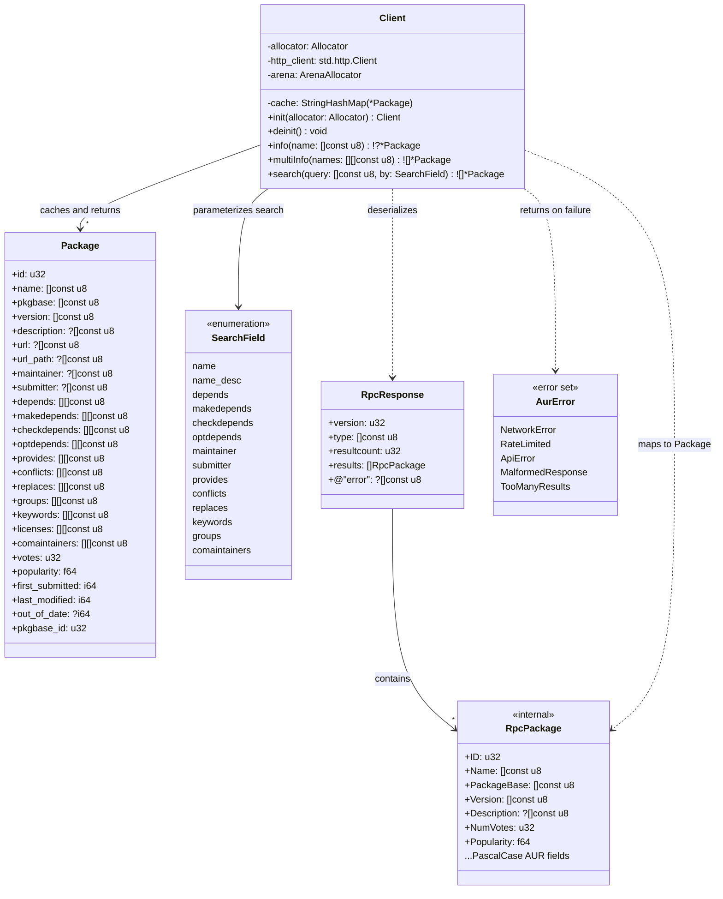

## Class-Level Design: `aur.zig`

The AUR client is the deepest module by complexity-to-interface ratio. Three public methods hide HTTP connection management, JSON deserialization, per-session caching, automatic batch splitting, URL encoding, and structured error mapping. This section details the internal design against the real AUR RPC v5 API.

### Class Diagram



### AUR RPC v5 Protocol Mapping

The AUR API uses PascalCase field names (`PackageBase`, `NumVotes`, `LastModified`). Zig idiom is snake_case. The client performs this mapping at the JSON deserialization boundary so that all downstream code uses Zig-idiomatic names.

| AUR RPC v5 Field | `Package` Field | Type | Notes |
|-----------------|-----------------|------|-------|
| `ID` | `id` | `u32` | |
| `Name` | `name` | `[]const u8` | |
| `PackageBase` | `pkgbase` | `[]const u8` | Critical for clone URLs |
| `PackageBaseID` | `pkgbase_id` | `u32` | |
| `Version` | `version` | `[]const u8` | `pkgver-pkgrel` format |
| `Description` | `description` | `?[]const u8` | Nullable |
| `URL` | `url` | `?[]const u8` | Upstream URL |
| `URLPath` | `url_path` | `?[]const u8` | Snapshot `.tar.gz` path |
| `Maintainer` | `maintainer` | `?[]const u8` | Null if orphaned |
| `Submitter` | `submitter` | `?[]const u8` | Only in detailed info |
| `NumVotes` | `votes` | `u32` | |
| `Popularity` | `popularity` | `f64` | |
| `FirstSubmitted` | `first_submitted` | `i64` | Unix timestamp |
| `LastModified` | `last_modified` | `i64` | Unix timestamp |
| `OutOfDate` | `out_of_date` | `?i64` | Null or unix timestamp |
| `Depends` | `depends` | `[][]const u8` | Only in detailed info |
| `MakeDepends` | `makedepends` | `[][]const u8` | Only in detailed info |
| `CheckDepends` | `checkdepends` | `[][]const u8` | Only in detailed info |
| `OptDepends` | `optdepends` | `[][]const u8` | Only in detailed info |
| `Provides` | `provides` | `[][]const u8` | Only in detailed info |
| `Conflicts` | `conflicts` | `[][]const u8` | Only in detailed info |
| `Replaces` | `replaces` | `[][]const u8` | Only in detailed info |
| `Groups` | `groups` | `[][]const u8` | Only in detailed info |
| `Keywords` | `keywords` | `[][]const u8` | Only in detailed info |
| `License` | `licenses` | `[][]const u8` | Only in detailed info |
| `CoMaintainers` | `comaintainers` | `[][]const u8` | Only in detailed info |

**Search results return `PackageBasic`** (no dependency arrays). **Info results return `PackageDetailed`** (all fields). The `Package` struct has all fields, with arrays defaulting to empty slices for search results.

### Memory Management Strategy

The AUR client faces a fundamental ownership question: who owns the `Package` data and the strings within it? JSON parsing with `std.json` produces heap-allocated strings, and packages are referenced by the cache, the registry, and the solver.

**Solution: Arena allocator.** The client owns an `ArenaAllocator` that backs all parsed package data. All strings inside `Package` structs point into this arena. When the client is deinitialized, the arena frees everything at once.

```zig
const Client = struct {
    allocator: Allocator,
    /// All Package data lives here. Freed in bulk on deinit().
    /// This means Package pointers are valid for the lifetime of the Client.
    arena: std.heap.ArenaAllocator,
    http_client: std.http.Client,
    cache: std.StringHashMapUnmanaged(*Package),

    pub fn init(allocator: Allocator) Client {
        return .{
            .allocator = allocator,
            .arena = std.heap.ArenaAllocator.init(allocator),
            .http_client = std.http.Client{ .allocator = allocator },
            .cache = .{},
        };
    }

    pub fn deinit(self: *Client) void {
        self.http_client.deinit();
        self.cache.deinit(self.allocator);
        // All Package data, all strings, all slices — freed in one call
        self.arena.deinit();
    }
};
```

**Why arena over per-package allocation:** AUR packages are immutable within a session (we never modify parsed data), and they all share the same lifetime (the client's lifetime). Per-package `allocator.free()` would require tracking every individual string allocation inside every Package — dozens of strings and arrays per package. The arena eliminates this bookkeeping entirely.

**Trade-off:** Memory is not freed until the client is deinitialized. For a CLI tool that runs a single operation and exits, this is ideal. For a long-running daemon (which aurodle is not), this would be a memory leak concern.

### Method Internals

#### `info(name: []const u8) !?*Package`

Single-package lookup. Checks cache first, then issues an HTTP request.

```zig
pub fn info(self: *Client, name: []const u8) !?*Package {
    // Cache hit
    if (self.cache.get(name)) |pkg| return pkg;

    // HTTP request
    const url = try std.fmt.allocPrint(
        self.allocator,
        "https://aur.archlinux.org/rpc/v5/info/{s}",
        .{name},
    );
    defer self.allocator.free(url);

    const response_body = try self.httpGet(url);
    defer self.allocator.free(response_body);

    // Parse and cache
    const response = try self.parseResponse(response_body);
    try self.checkError(response);

    if (response.resultcount == 0) return null;

    const pkg = try self.mapPackage(response.results[0]);
    try self.cache.put(self.allocator, pkg.name, pkg);
    return pkg;
}
```

#### `multiInfo(names: []const []const u8) ![]*Package`

The batch endpoint. This is where the AUR's limit on query size must be handled. The AUR API accepts `arg[]` parameters (GET or POST). In practice, very long GET URLs break, so we switch to POST for large batches.

```zig
pub fn multiInfo(self: *Client, names: []const []const u8) ![]*Package {
    const arena_alloc = self.arena.allocator();
    var results = std.ArrayList(*Package).init(self.allocator);
    defer results.deinit();

    // Filter out already-cached packages
    var uncached = std.ArrayList([]const u8).init(self.allocator);
    defer uncached.deinit();

    for (names) |name| {
        if (self.cache.get(name)) |pkg| {
            try results.append(pkg);
        } else {
            try uncached.append(name);
        }
    }

    // Batch uncached in chunks of MAX_BATCH_SIZE
    const MAX_BATCH_SIZE = 100;
    var i: usize = 0;
    while (i < uncached.items.len) {
        const end = @min(i + MAX_BATCH_SIZE, uncached.items.len);
        const batch = uncached.items[i..end];

        const batch_results = try self.fetchMultiInfo(batch);
        for (batch_results) |pkg| {
            try self.cache.put(self.allocator, pkg.name, pkg);
            try results.append(pkg);
        }

        i = end;
    }

    return try results.toOwnedSlice();
}

/// Issues a single multi-info request for a batch of names.
/// Uses POST with form-encoded body to avoid URL length limits.
fn fetchMultiInfo(self: *Client, names: []const []const u8) ![]*Package {
    const arena_alloc = self.arena.allocator();

    // Build form body: "arg[]=name1&arg[]=name2&..."
    var body = std.ArrayList(u8).init(self.allocator);
    defer body.deinit();

    for (names, 0..) |name, idx| {
        if (idx > 0) try body.append('&');
        try body.appendSlice("arg[]=");
        try appendUrlEncoded(&body, name);
    }

    const response_body = try self.httpPost(
        "https://aur.archlinux.org/rpc/v5/info",
        body.items,
    );
    defer self.allocator.free(response_body);

    const response = try self.parseResponse(response_body);
    try self.checkError(response);

    var results = try std.ArrayList(*Package).initCapacity(
        self.allocator,
        response.resultcount,
    );
    for (response.results) |rpc_pkg| {
        try results.append(try self.mapPackage(rpc_pkg));
    }

    return try results.toOwnedSlice();
}
```

**Why POST for multi-info:** The GET endpoint uses `?arg[]=foo&arg[]=bar&...` which can exceed URL length limits (typically 8KB) with 100 packages. The AUR v5 API explicitly supports POST with `application/x-www-form-urlencoded` body for the multi-info endpoint. POST has no practical body size limit.

**Why 100 as batch size:** The AUR wiki historically documents a soft limit of ~100 packages per request. Exceeding it may result in truncated results or timeouts. 100 is conservative and matches what aurutils and other AUR helpers use.

#### `search(query: []const u8, by: SearchField) ![]*Package`

Search is simpler — no batching, no caching (search results are context-dependent and not reusable for info lookups since they lack dependency arrays).

```zig
pub fn search(
    self: *Client,
    query: []const u8,
    by: SearchField,
) ![]*Package {
    const url = try std.fmt.allocPrint(
        self.allocator,
        "https://aur.archlinux.org/rpc/v5/search/{s}?by={s}",
        .{ query, by.toQueryParam() },
    );
    defer self.allocator.free(url);

    const response_body = try self.httpGet(url);
    defer self.allocator.free(response_body);

    const response = try self.parseResponse(response_body);
    try self.checkError(response);

    const arena_alloc = self.arena.allocator();
    var results = try std.ArrayList(*Package).initCapacity(
        self.allocator,
        response.resultcount,
    );
    for (response.results) |rpc_pkg| {
        try results.append(try self.mapPackage(rpc_pkg));
    }

    return try results.toOwnedSlice();
}
```

**Search results are NOT cached** because:
1. Search returns `PackageBasic` (no dependency arrays) — insufficient for dependency resolution
2. Search results depend on the query term — caching by package name would be incorrect
3. Users rarely search the same term twice in one session

### JSON Deserialization

The `parseResponse` and `mapPackage` methods handle the translation from AUR's PascalCase JSON to Zig's snake_case `Package` struct.

```zig
/// Raw AUR RPC response structure — matches the JSON exactly.
/// Field names use AUR's PascalCase convention for std.json compatibility.
const RpcResponse = struct {
    version: u32,
    type: []const u8,
    resultcount: u32,
    results: []const RpcPackage,
    @"error": ?[]const u8 = null,
};

/// Raw AUR package as it arrives from the API.
/// PascalCase field names match the JSON keys.
const RpcPackage = struct {
    ID: u32,
    Name: []const u8,
    PackageBase: []const u8,
    PackageBaseID: u32,
    Version: []const u8,
    Description: ?[]const u8 = null,
    URL: ?[]const u8 = null,
    URLPath: ?[]const u8 = null,
    Maintainer: ?[]const u8 = null,
    Submitter: ?[]const u8 = null,
    NumVotes: u32 = 0,
    Popularity: f64 = 0.0,
    FirstSubmitted: i64 = 0,
    LastModified: i64 = 0,
    OutOfDate: ?i64 = null,
    // Detailed fields — absent in search results
    Depends: ?[]const []const u8 = null,
    MakeDepends: ?[]const []const u8 = null,
    CheckDepends: ?[]const []const u8 = null,
    OptDepends: ?[]const []const u8 = null,
    Provides: ?[]const []const u8 = null,
    Conflicts: ?[]const []const u8 = null,
    Replaces: ?[]const []const u8 = null,
    Groups: ?[]const []const u8 = null,
    Keywords: ?[]const []const u8 = null,
    License: ?[]const []const u8 = null,
    CoMaintainers: ?[]const []const u8 = null,
};

fn parseResponse(self: *Client, body: []const u8) !RpcResponse {
    const parsed = std.json.parseFromSlice(
        RpcResponse,
        self.arena.allocator(),
        body,
        .{ .ignore_unknown_fields = true },
    ) catch return error.MalformedResponse;
    return parsed.value;
}
```

**Why `ignore_unknown_fields`:** The AUR API may add new fields in the future. Strict parsing would break the client on API additions. This follows Postel's law — be liberal in what you accept.

**Why `?[]const []const u8` for dependency arrays in `RpcPackage`:** Search results (`PackageBasic`) don't include dependency arrays at all. These fields are absent from the JSON, not present as empty arrays. Using `?` (optional) with a default of `null` handles this cleanly. The `mapPackage` function maps `null` to empty slices (`&.{}`) in the public `Package` type.

#### `mapPackage` — The Translation Boundary

```zig
/// Translate RpcPackage (PascalCase, nullable arrays) to Package (snake_case, non-null arrays).
/// Allocates the Package in the arena — it lives until Client.deinit().
fn mapPackage(self: *Client, rpc: RpcPackage) !*Package {
    const arena_alloc = self.arena.allocator();

    const pkg = try arena_alloc.create(Package);
    pkg.* = .{
        .id = rpc.ID,
        .name = rpc.Name,
        .pkgbase = rpc.PackageBase,
        .pkgbase_id = rpc.PackageBaseID,
        .version = rpc.Version,
        .description = rpc.Description,
        .url = rpc.URL,
        .url_path = rpc.URLPath,
        .maintainer = rpc.Maintainer,
        .submitter = rpc.Submitter,
        .votes = rpc.NumVotes,
        .popularity = rpc.Popularity,
        .first_submitted = rpc.FirstSubmitted,
        .last_modified = rpc.LastModified,
        .out_of_date = rpc.OutOfDate,
        .depends = rpc.Depends orelse &.{},
        .makedepends = rpc.MakeDepends orelse &.{},
        .checkdepends = rpc.CheckDepends orelse &.{},
        .optdepends = rpc.OptDepends orelse &.{},
        .provides = rpc.Provides orelse &.{},
        .conflicts = rpc.Conflicts orelse &.{},
        .replaces = rpc.Replaces orelse &.{},
        .groups = rpc.Groups orelse &.{},
        .keywords = rpc.Keywords orelse &.{},
        .licenses = rpc.License orelse &.{},
        .comaintainers = rpc.CoMaintainers orelse &.{},
    };
    return pkg;
}
```

The `orelse &.{}` pattern is the key normalization: callers never need to check for null arrays. If a search result has no `Depends` field, `pkg.depends` is an empty slice, not null. This eliminates an entire category of null checks downstream.

### Error Handling

The client maps protocol-level conditions to domain-meaningful errors:

```zig
pub const AurError = error{
    /// HTTP request failed (connection refused, DNS failure, timeout)
    NetworkError,
    /// AUR returned a rate-limit response (HTTP 429 or "Too many requests" error)
    RateLimited,
    /// AUR returned an error in the response body ({"error": "..."})
    ApiError,
    /// Response body is not valid JSON or doesn't match expected schema
    MalformedResponse,
};

fn checkError(self: *Client, response: RpcResponse) !void {
    if (response.@"error") |err_msg| {
        // The AUR uses the error field for rate limiting too
        if (std.mem.indexOf(u8, err_msg, "Too many requests") != null) {
            return error.RateLimited;
        }
        return error.ApiError;
    }
}
```

**Rate limiting is fail-fast by design** (per requirements — resolved design decision #5). No retries, no backoff. The error message at the command layer includes "wait and retry manually."

### HTTP Transport Layer

The HTTP methods are thin wrappers around `std.http.Client` that handle connection setup and response reading:

```zig
fn httpGet(self: *Client, url: []const u8) ![]u8 {
    const uri = try std.Uri.parse(url);

    var req = try self.http_client.open(.GET, uri, .{
        .server_header_buffer = &server_header_buf,
    });
    defer req.deinit();

    try req.send();
    try req.wait();

    if (req.response.status != .ok) {
        if (req.response.status == .too_many_requests) return error.RateLimited;
        return error.NetworkError;
    }

    return try req.reader().readAllAlloc(self.allocator, MAX_RESPONSE_SIZE);
}

fn httpPost(self: *Client, url: []const u8, body: []const u8) ![]u8 {
    const uri = try std.Uri.parse(url);

    var req = try self.http_client.open(.POST, uri, .{
        .server_header_buffer = &server_header_buf,
    });
    defer req.deinit();

    req.headers.content_type = .{ .override = "application/x-www-form-urlencoded" };
    req.transfer_encoding = .{ .content_length = body.len };
    try req.send();

    try req.writeAll(body);
    try req.finish();
    try req.wait();

    if (req.response.status != .ok) {
        if (req.response.status == .too_many_requests) return error.RateLimited;
        return error.NetworkError;
    }

    return try req.reader().readAllAlloc(self.allocator, MAX_RESPONSE_SIZE);
}

/// Guard against pathological responses. AUR responses are typically <100KB.
/// 10MB is generous enough for extreme multi-info results.
const MAX_RESPONSE_SIZE = 10 * 1024 * 1024;

/// Reusable buffer for HTTP server headers
var server_header_buf: [16 * 1024]u8 = undefined;
```

**`MAX_RESPONSE_SIZE`** prevents unbounded memory allocation if the server sends an unexpected payload. At 10MB, it's large enough for a 100-package multi-info response (each package is ~1-2KB JSON) but small enough to prevent OOM on malicious or broken responses.

### Testing Strategy

The AUR client is tested at two levels:

**1. JSON parsing tests** — Use recorded fixtures, no HTTP involved:

```zig
test "parse single info response" {
    const fixture = @embedFile("../../tests/fixtures/aur_responses/info_single.json");

    var client = Client.init(testing.allocator);
    defer client.deinit();

    const response = try client.parseResponse(fixture);
    try testing.expectEqual(@as(u32, 1), response.resultcount);
    try testing.expectEqualStrings("multiinfo", response.type);

    const pkg = try client.mapPackage(response.results[0]);
    try testing.expectEqualStrings("auracle-git", pkg.name);
    try testing.expectEqualStrings("auracle-git", pkg.pkgbase);
    try testing.expect(pkg.depends.len > 0);
}

test "parse search response has empty dependency arrays" {
    const fixture = @embedFile("../../tests/fixtures/aur_responses/search_results.json");

    var client = Client.init(testing.allocator);
    defer client.deinit();

    const response = try client.parseResponse(fixture);

    const pkg = try client.mapPackage(response.results[0]);
    // Search results have no dependency info — mapped to empty slices
    try testing.expectEqual(@as(usize, 0), pkg.depends.len);
    try testing.expectEqual(@as(usize, 0), pkg.makedepends.len);
}

test "parse error response returns ApiError" {
    const fixture =
        \\{"version":5,"type":"error","resultcount":0,"results":[],"error":"Incorrect request type specified."}
    ;

    var client = Client.init(testing.allocator);
    defer client.deinit();

    const response = try client.parseResponse(fixture);
    try testing.expectError(error.ApiError, client.checkError(response));
}

test "parse rate limit response returns RateLimited" {
    const fixture =
        \\{"version":5,"type":"error","resultcount":0,"results":[],"error":"Too many requests."}
    ;

    var client = Client.init(testing.allocator);
    defer client.deinit();

    const response = try client.parseResponse(fixture);
    try testing.expectError(error.RateLimited, client.checkError(response));
}

test "malformed JSON returns MalformedResponse" {
    var client = Client.init(testing.allocator);
    defer client.deinit();

    try testing.expectError(error.MalformedResponse, client.parseResponse("{invalid"));
}
```

**2. Cache behavior tests** — Verify caching and batch logic:

```zig
test "info caches result for subsequent calls" {
    // Uses a mock HTTP transport (injected via comptime or test-only field)
    var client = TestClient.initWithFixture("info_single.json");
    defer client.deinit();

    const pkg1 = try client.info("auracle-git");
    const pkg2 = try client.info("auracle-git");

    // Same pointer — served from cache
    try testing.expect(pkg1 == pkg2);
    // Only one HTTP request was made
    try testing.expectEqual(@as(usize, 1), client.request_count);
}

test "multiInfo splits batches at 100" {
    var client = TestClient.init();
    defer client.deinit();

    // Generate 250 package names
    var names: [250][]const u8 = undefined;
    for (&names, 0..) |*name, i| {
        name.* = try std.fmt.allocPrint(testing.allocator, "pkg{d}", .{i});
    }

    _ = try client.multiInfo(&names);

    // Should have made 3 HTTP requests (100 + 100 + 50)
    try testing.expectEqual(@as(usize, 3), client.request_count);
}

test "multiInfo skips cached packages" {
    var client = TestClient.initWithFixture("info_single.json");
    defer client.deinit();

    // Pre-populate cache
    _ = try client.info("auracle-git");
    try testing.expectEqual(@as(usize, 1), client.request_count);

    // multiInfo with one cached + one new
    _ = try client.multiInfo(&.{ "auracle-git", "yay" });

    // Only one additional request (for "yay"), not two
    try testing.expectEqual(@as(usize, 2), client.request_count);
}
```

### Complexity Budget

| Internal concern | Lines (est.) | Justification |
|-----------------|-------------|---------------|
| `Package` struct + `SearchField` enum | ~50 | 25+ fields from AUR API |
| `RpcResponse` + `RpcPackage` structs | ~45 | JSON-matching raw types |
| `parseResponse()` | ~10 | `std.json.parseFromSlice` wrapper |
| `mapPackage()` | ~35 | PascalCase → snake_case + null → empty |
| `info()` with cache check | ~25 | Cache + single HTTP + parse |
| `multiInfo()` with batch splitting | ~40 | Cache filter + chunk loop |
| `fetchMultiInfo()` with POST body | ~30 | Form encoding + HTTP POST |
| `search()` | ~20 | URL construction + HTTP GET |
| `httpGet()` / `httpPost()` | ~50 | `std.http.Client` lifecycle |
| `checkError()` + error types | ~20 | Response validation |
| `appendUrlEncoded()` | ~15 | Percent-encoding for form body |
| Tests | ~150 | Fixture-based + cache behavior |
| **Total** | **~490** | Deep module: 3 public methods, ~490 internal lines |

