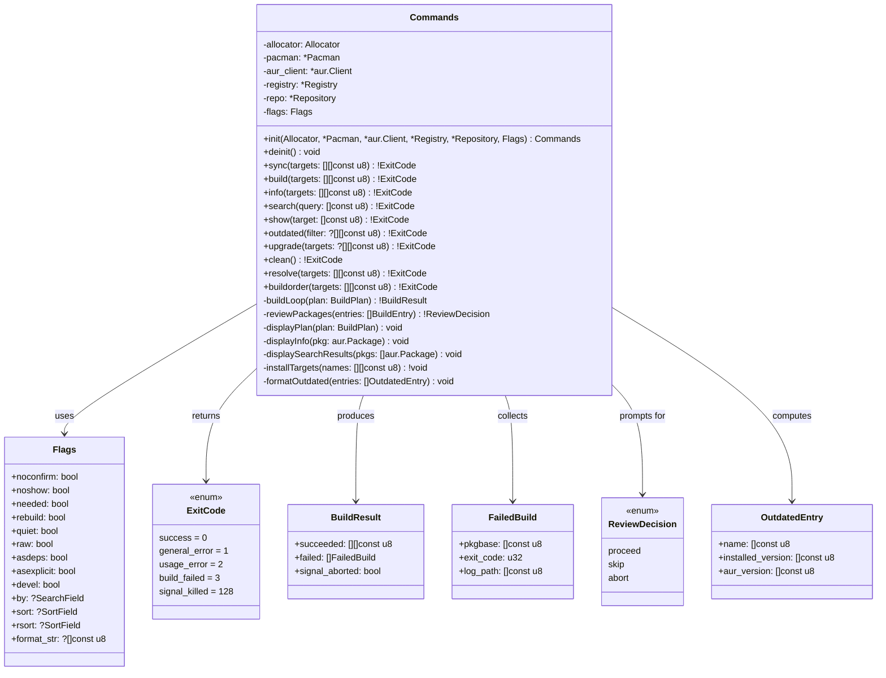

## Class-Level Design: `commands.zig`

The commands module is the **orchestration layer** — it composes all core modules into user-facing workflows. Each command function takes a parsed `Command` struct and coordinates the multi-step sequence needed to fulfill the user's intent. The key design challenge is avoiding "pass-through" syndrome (Ousterhout Ch. 7): each command must add genuine value beyond just calling modules in order.

The value commands.zig adds:
1. **Workflow sequencing** — resolve → clone → review → build → install, with decision points between steps
2. **User interaction** — displaying plans, prompting for confirmation, formatting output
3. **Partial failure handling** — continuing after one package fails, collecting results
4. **Signal awareness** — detecting signal-killed builds (exit ≥ 128) and aborting remaining work

### Class Diagram



### Internal Architecture

The module follows a **command-per-function** pattern rather than a command pattern class hierarchy. Each public method is a complete workflow. Private methods extract shared sub-workflows (building, reviewing, displaying) that multiple commands use.

The `Commands` struct holds references to all core module instances. It does **not** own them — `main.zig` creates the module instances and passes them in. This makes testing straightforward: pass mock modules.

#### Why a struct with methods, not free functions

Free functions like `sync(allocator, pacman, aur, registry, repo, flags, targets)` would have 7+ parameters — a "long parameter list" smell. The struct captures the shared context once at init, so each command method only takes its command-specific arguments. This is a direct application of **information hiding**: the command implementations don't repeat the module wiring.

### Method Implementations

#### `sync(targets: [][]const u8) !ExitCode`

The most complex command — the full workflow from FR-10. This is where orchestration depth justifies the module's existence.

```zig
/// Execute the full sync workflow: resolve → clone → review → build → install.
///
/// Steps:
/// 1. Resolve dependency tree
/// 2. Display build plan and prompt for confirmation
/// 3. Clone/update all AUR packages in build order
/// 4. Display build files for review (unless --noshow)
/// 5. Build each package in order, adding to repo after each
/// 6. Install only user-requested targets from repo
///
/// Partial failure: if a build fails but it's not a dependency of remaining
/// packages, we continue. If a required dependency fails, we abort remaining
/// packages that depend on it.
pub fn sync(self: *Commands, targets: []const []const u8) !ExitCode {
    // Phase 1: Resolve
    var solver = Solver.init(self.allocator, self.registry);
    defer solver.deinit();

    const plan = solver.resolve(targets) catch |err| {
        switch (err) {
            error.CircularDependency => {
                std.io.getStdErr().writer().print(
                    "error: circular dependency detected in resolution\n",
                    .{},
                ) catch {};
                return .general_error;
            },
            error.UnresolvableDependency => {
                // Solver already printed which dependency failed
                return .general_error;
            },
            else => return err,
        }
    };

    if (plan.build_order.len == 0) {
        // All targets already satisfied
        std.io.getStdOut().writer().print(
            " nothing to do — all targets are up to date\n",
            .{},
        ) catch {};
        return .success;
    }

    // Phase 2: Display and confirm
    self.displayPlan(plan);

    if (!self.flags.noconfirm) {
        if (!try utils.promptYesNo("Proceed with build?")) {
            return .success;
        }
    }

    // Phase 3: Clone
    for (plan.build_order) |entry| {
        _ = try git.cloneOrUpdate(self.allocator, entry.pkgbase);
    }

    // Phase 4: Review (unless --noshow)
    if (!self.flags.noshow) {
        const decision = try self.reviewPackages(plan.build_order);
        switch (decision) {
            .abort => return .success,
            .skip => {}, // skip review but continue
            .proceed => {},
        }
    }

    // Phase 5: Build
    try self.repo.ensureExists();
    const build_result = try self.buildLoop(plan);

    if (build_result.signal_aborted) {
        return .signal_killed;
    }

    // Phase 6: Install targets (only user-requested packages)
    if (build_result.failed.len == 0) {
        // All succeeded — install targets
        const target_names = try self.collectTargetNames(plan, targets);
        try self.installTargets(target_names);
    } else {
        // Some failed — install only targets whose builds succeeded
        const installable = try self.filterInstallable(plan, targets, build_result);
        if (installable.len > 0) {
            try self.installTargets(installable);
        }
        self.printBuildSummary(build_result);
        return .build_failed;
    }

    return .success;
}
```

**Why sync is ~80 lines, not ~10:** A thin sync would just call `resolve(); clone(); review(); build(); install()`. But real orchestration requires decision points between each phase: checking for empty plans, prompting for confirmation, skipping review when flagged, handling partial failures, filtering installable targets. Each step examines the result of the previous step and decides what to do. This is the genuine complexity that commands.zig absorbs — callers (main.zig) just call `commands.sync(targets)`.

#### `buildLoop(plan: BuildPlan) !BuildResult`

The core build iteration that both `sync` and `build` share. This is the most signal-aware code in the system.

```zig
/// Build all packages in the plan's build order.
///
/// For each package:
/// 1. Run makepkg in the clone directory
/// 2. If successful, find built packages and add to repository
/// 3. Refresh aurpkgs database so subsequent builds can resolve new deps
/// 4. If failed, check if signal-killed (exit ≥ 128) → abort remaining
/// 5. Otherwise, record failure and continue (skip packages that depend on it)
///
/// Returns a BuildResult summarizing successes and failures.
fn buildLoop(self: *Commands, plan: Solver.BuildPlan) !BuildResult {
    var succeeded = std.ArrayList([]const u8).init(self.allocator);
    var failed = std.ArrayList(FailedBuild).init(self.allocator);
    var failed_bases = std.StringHashMap(void).init(self.allocator);
    defer failed_bases.deinit();

    for (plan.build_order) |entry| {
        // Skip if a dependency of this package failed
        if (self.hasFailed(entry, plan, &failed_bases)) {
            std.io.getStdErr().writer().print(
                ":: skipping {s} — a dependency failed to build\n",
                .{entry.name},
            ) catch {};
            continue;
        }

        const clone_dir = try git.cloneDir(self.allocator, entry.pkgbase);
        defer self.allocator.free(clone_dir);

        const log_path = try self.logPath(entry.pkgbase);
        defer self.allocator.free(log_path);

        std.io.getStdOut().writer().print(
            ":: building {s} {s}...\n",
            .{ entry.name, entry.version },
        ) catch {};

        // Run makepkg -s (--syncdeps installs missing deps as --asdeps)
        const makepkg_result = try utils.runCommandWithLog(
            self.allocator,
            &.{ "makepkg", "-s", "--noconfirm" },
            log_path,
            .{ .cwd = clone_dir },
        );

        if (makepkg_result.exit_code != 0) {
            // Signal-killed? (e.g., Ctrl+C → SIGINT → exit 130)
            if (makepkg_result.exit_code >= 128) {
                try failed.append(.{
                    .pkgbase = entry.pkgbase,
                    .exit_code = makepkg_result.exit_code,
                    .log_path = log_path,
                });
                return .{
                    .succeeded = try succeeded.toOwnedSlice(),
                    .failed = try failed.toOwnedSlice(),
                    .signal_aborted = true,
                };
            }

            std.io.getStdErr().writer().print(
                "error: build failed for {s} (exit {d})\n  log: {s}\n",
                .{ entry.pkgbase, makepkg_result.exit_code, log_path },
            ) catch {};

            try failed.append(.{
                .pkgbase = entry.pkgbase,
                .exit_code = makepkg_result.exit_code,
                .log_path = log_path,
            });
            try failed_bases.put(entry.pkgbase, {});
            continue;
        }

        // Build succeeded — find and add packages to repo
        const built_pkgs = try self.repo.findBuiltPackages(
            self.allocator,
            entry.pkgbase,
            clone_dir,
        );
        try self.repo.addPackages(built_pkgs);

        // Refresh aurpkgs db so next build can resolve this as a dependency
        try self.pacman.refreshDb("aurpkgs");
        self.registry.invalidateCache();

        try succeeded.append(entry.pkgbase);
    }

    return .{
        .succeeded = try succeeded.toOwnedSlice(),
        .failed = try failed.toOwnedSlice(),
        .signal_aborted = false,
    };
}
```

**Why `buildLoop` belongs in commands, not solver or repo:** The solver produces a plan — a pure data structure. The repo manages files. Neither should know about "if a build fails, skip its dependents" — that's a **workflow decision**, not an algorithm or storage concern. This is a clean layer boundary: solver produces order, commands execute with policy.

**Why check `exit_code >= 128` for signals:** Unix convention — when a process is killed by signal N, the shell reports exit code 128+N. SIGINT is signal 2, so Ctrl+C during makepkg gives exit code 130. Treating this differently from a build error (e.g., compilation failure, exit code 1) prevents the user from waiting through remaining builds they've already decided to cancel.

#### `hasFailed(entry, plan, failed_bases) bool`

Determines if any dependency of `entry` is in the failed set. This enables "continue after failure" behavior — if package A fails but package B doesn't depend on A, we still build B.

```zig
/// Check if any build dependency of `entry` has failed.
/// Walks the dependency graph from solver's plan to find transitive failures.
fn hasFailed(
    self: *Commands,
    entry: Solver.BuildEntry,
    plan: Solver.BuildPlan,
    failed_bases: *const std.StringHashMap(void),
) bool {
    _ = self;
    // Direct check: is this pkgbase itself failed?
    if (failed_bases.contains(entry.pkgbase)) return true;

    // Check dependencies: iterate all_deps for this entry's deps
    // and see if any are AUR packages whose pkgbase is in failed_bases.
    //
    // Note: we only need to check direct AUR dependencies — if a transitive
    // dep failed, the direct dep that depends on it would also have been
    // skipped (marked as failed), so we'll catch it at that level.
    for (plan.all_deps) |dep| {
        if (dep.source != .aur) continue;
        // Check if this dep is a dependency of our entry
        // The solver embeds this relationship in the build_order itself:
        // earlier entries are dependencies of later ones.
        // So we check: is this dep in failed_bases AND does it appear
        // before our entry in build_order?
        if (failed_bases.contains(dep.name)) {
            return true;
        }
    }

    return false;
}
```

**Simplification:** Because `build_order` is topologically sorted, any dependency of `entry` that was going to be built must appear earlier in the order. If it failed, it's in `failed_bases`. We don't need a full graph traversal — the topological order guarantees that transitive dependencies were already processed.

#### `build(targets: [][]const u8) !ExitCode`

Builds packages without the full sync workflow — no install step. Used when the user just wants packages in the local repo.

```zig
/// Build packages and add to repository without installing.
///
/// Unlike sync, this:
/// - Still resolves dependencies (to determine build order)
/// - Still clones/updates sources
/// - Still reviews (unless --noshow)
/// - Does NOT install after building
///
/// Use case: pre-building packages for later installation, or building
/// packages that other packages depend on.
pub fn build(self: *Commands, targets: []const []const u8) !ExitCode {
    var solver = Solver.init(self.allocator, self.registry);
    defer solver.deinit();

    const plan = solver.resolve(targets) catch |err| {
        return self.handleResolveError(err);
    };

    if (plan.build_order.len == 0) {
        if (self.flags.needed) {
            std.io.getStdOut().writer().print(
                " all packages are up to date in repository\n",
                .{},
            ) catch {};
            return .success;
        }
    }

    self.displayPlan(plan);

    if (!self.flags.noconfirm) {
        if (!try utils.promptYesNo("Proceed with build?")) {
            return .success;
        }
    }

    for (plan.build_order) |entry| {
        _ = try git.cloneOrUpdate(self.allocator, entry.pkgbase);
    }

    if (!self.flags.noshow) {
        const decision = try self.reviewPackages(plan.build_order);
        if (decision == .abort) return .success;
    }

    try self.repo.ensureExists();
    const result = try self.buildLoop(plan);

    if (result.signal_aborted) return .signal_killed;
    if (result.failed.len > 0) {
        self.printBuildSummary(result);
        return .build_failed;
    }

    return .success;
}
```

**Why build and sync aren't merged with a flag:** They share `buildLoop` and `reviewPackages`, but their top-level flow differs meaningfully — sync has an install phase, sync filters installable targets after partial failure, and future sync will support `--ignore`. Merging them would create a function with many conditional branches that's harder to follow than two focused functions sharing helpers.

#### `info(targets: [][]const u8) !ExitCode`

Display package metadata from AUR. The simplest command workflow.

```zig
/// Display detailed info for AUR packages.
///
/// Fetches metadata via multiInfo (batched, cached) and formats each package.
/// If --raw, outputs the JSON directly.
pub fn info(self: *Commands, targets: []const []const u8) !ExitCode {
    const packages = try self.aur_client.multiInfo(targets);

    if (self.flags.raw) {
        // Re-fetch raw JSON for exact output
        // (multiInfo parsed it into structs; for --raw we want original)
        const raw = try self.aur_client.rawMultiInfo(targets);
        const stdout = std.io.getStdOut().writer();
        try stdout.writeAll(raw);
        try stdout.writeByte('\n');
        return .success;
    }

    // Check for missing packages
    var found_names = std.StringHashMap(void).init(self.allocator);
    defer found_names.deinit();
    for (packages) |pkg| {
        try found_names.put(pkg.name, {});
    }

    var any_missing = false;
    for (targets) |target| {
        if (!found_names.contains(target)) {
            std.io.getStdErr().writer().print(
                "error: package '{s}' was not found\n",
                .{target},
            ) catch {};
            any_missing = true;
        }
    }

    for (packages) |pkg| {
        self.displayInfo(pkg);
    }

    return if (any_missing) .general_error else .success;
}
```

#### `search(query: []const u8) !ExitCode`

```zig
/// Search AUR and display matching packages.
///
/// Results are sorted by the --sort/--rsort flag (default: popularity desc).
/// If --raw, outputs JSON. If --format, applies custom format string.
pub fn search(self: *Commands, query: []const u8) !ExitCode {
    const by_field = self.flags.by orelse .name_desc;
    const packages = try self.aur_client.search(query, by_field);

    if (packages.len == 0) {
        return .success; // FR-3: exit 0 with no output
    }

    if (self.flags.raw) {
        const raw = try self.aur_client.rawSearch(query, by_field);
        const stdout = std.io.getStdOut().writer();
        try stdout.writeAll(raw);
        try stdout.writeByte('\n');
        return .success;
    }

    // Sort results
    const sorted = try self.sortPackages(packages);
    self.displaySearchResults(sorted);

    return .success;
}
```

#### `show(target: []const u8) !ExitCode`

```zig
/// Display build files for a package clone.
///
/// Lists files in the clone directory and displays PKGBUILD content.
/// Requires the package to be cloned first (via sync or manual clone).
pub fn show(self: *Commands, target: []const u8) !ExitCode {
    // Resolve pkgname to pkgbase if needed
    const pkgbase = blk: {
        if (try self.aur_client.info(target)) |pkg| {
            break :blk pkg.pkgbase;
        }
        break :blk target; // Fall back to using the name as pkgbase
    };

    // Verify clone exists
    if (!try git.isCloned(self.allocator, pkgbase)) {
        std.io.getStdErr().writer().print(
            "error: {s} is not cloned. Run 'aurodle sync {s}' first.\n",
            .{ target, target },
        ) catch {};
        return .general_error;
    }

    const files = try git.listFiles(self.allocator, pkgbase);
    const stdout = std.io.getStdOut().writer();

    // Display file listing
    try stdout.print(":: {s} build files:\n", .{pkgbase});
    for (files) |file| {
        const marker: []const u8 = if (file.is_pkgbuild) " (PKGBUILD)" else "";
        try stdout.print("  {s}{s}\n", .{ file.relative_path, marker });
    }
    try stdout.writeByte('\n');

    // Display PKGBUILD content
    const clone_dir = try git.cloneDir(self.allocator, pkgbase);
    defer self.allocator.free(clone_dir);
    const pkgbuild_path = try std.fs.path.join(self.allocator, &.{ clone_dir, "PKGBUILD" });
    defer self.allocator.free(pkgbuild_path);

    const content = std.fs.cwd().readFileAlloc(self.allocator, pkgbuild_path, 1024 * 1024) catch |err| {
        std.io.getStdErr().writer().print(
            "error: could not read PKGBUILD: {}\n",
            .{err},
        ) catch {};
        return .general_error;
    };
    defer self.allocator.free(content);

    try stdout.print(":: PKGBUILD:\n{s}\n", .{content});

    return .success;
}
```

#### `outdated(filter: ?[][]const u8) !ExitCode`

```zig
/// List installed AUR packages with newer versions available.
///
/// 1. Get all foreign packages (installed but not in official repos)
/// 2. Query AUR for current versions
/// 3. Compare with alpm_pkg_vercmp
/// 4. Display outdated entries
pub fn outdated(self: *Commands, filter: ?[]const []const u8) !ExitCode {
    const foreign = try self.pacman.allForeignPackages();

    // Apply name filter if provided
    const to_check = if (filter) |names| blk: {
        var filtered = std.ArrayList(Pacman.InstalledPackage).init(self.allocator);
        var name_set = std.StringHashMap(void).init(self.allocator);
        defer name_set.deinit();
        for (names) |n| try name_set.put(n, {});
        for (foreign) |pkg| {
            if (name_set.contains(pkg.name)) try filtered.append(pkg);
        }
        break :blk try filtered.toOwnedSlice();
    } else foreign;

    if (to_check.len == 0) {
        return .success;
    }

    // Batch query AUR for all foreign package names
    var names = std.ArrayList([]const u8).init(self.allocator);
    for (to_check) |pkg| try names.append(pkg.name);
    const aur_pkgs = try self.aur_client.multiInfo(try names.toOwnedSlice());

    // Build lookup map
    var aur_map = std.StringHashMap([]const u8).init(self.allocator);
    defer aur_map.deinit();
    for (aur_pkgs) |pkg| try aur_map.put(pkg.name, pkg.version);

    // Compare versions
    var outdated_list = std.ArrayList(OutdatedEntry).init(self.allocator);
    for (to_check) |pkg| {
        if (aur_map.get(pkg.name)) |aur_ver| {
            if (alpm.vercmp(pkg.version, aur_ver) < 0) {
                try outdated_list.append(.{
                    .name = pkg.name,
                    .installed_version = pkg.version,
                    .aur_version = aur_ver,
                });
            }
        }
        // Packages not in AUR are silently skipped (might be custom local packages)
    }

    if (outdated_list.items.len == 0) {
        if (!self.flags.quiet) {
            std.io.getStdOut().writer().print(
                " all AUR packages are up to date\n",
                .{},
            ) catch {};
        }
        return .success;
    }

    self.formatOutdated(outdated_list.items);
    return .success;
}
```

**Why silently skip packages not in AUR:** A "foreign" package (not in official repos) might be a locally built custom package, not an AUR package. Reporting "not found in AUR" for every custom package would be noisy. The user can use `pacman -Qm` for a full foreign package list.

#### `upgrade(targets: ?[][]const u8) !ExitCode`

```zig
/// Upgrade outdated AUR packages via the full sync workflow.
///
/// With no arguments: check all AUR packages and upgrade any outdated.
/// With arguments: upgrade only the specified packages.
///
/// This is essentially: outdated → collect names → sync.
pub fn upgrade(self: *Commands, targets: ?[]const []const u8) !ExitCode {
    // Step 1: Determine which packages need upgrading
    const foreign = try self.pacman.allForeignPackages();

    const to_check = if (targets) |names| blk: {
        var filtered = std.ArrayList(Pacman.InstalledPackage).init(self.allocator);
        var name_set = std.StringHashMap(void).init(self.allocator);
        defer name_set.deinit();
        for (names) |n| try name_set.put(n, {});
        for (foreign) |pkg| {
            if (name_set.contains(pkg.name)) try filtered.append(pkg);
        }
        break :blk try filtered.toOwnedSlice();
    } else foreign;

    // Batch query AUR
    var names_list = std.ArrayList([]const u8).init(self.allocator);
    for (to_check) |pkg| try names_list.append(pkg.name);
    const aur_pkgs = try self.aur_client.multiInfo(try names_list.toOwnedSlice());

    var aur_map = std.StringHashMap([]const u8).init(self.allocator);
    defer aur_map.deinit();
    for (aur_pkgs) |pkg| try aur_map.put(pkg.name, pkg.version);

    // Find outdated
    var to_upgrade = std.ArrayList([]const u8).init(self.allocator);
    var outdated_display = std.ArrayList(OutdatedEntry).init(self.allocator);

    for (to_check) |pkg| {
        const dominated_by_aur = if (aur_map.get(pkg.name)) |aur_ver|
            alpm.vercmp(pkg.version, aur_ver) < 0
        else
            false;

        if (dominated_by_aur or self.flags.rebuild) {
            try to_upgrade.append(pkg.name);
            if (aur_map.get(pkg.name)) |aur_ver| {
                try outdated_display.append(.{
                    .name = pkg.name,
                    .installed_version = pkg.version,
                    .aur_version = aur_ver,
                });
            }
        }
    }

    if (to_upgrade.items.len == 0) {
        std.io.getStdOut().writer().print(
            " all AUR packages are up to date\n",
            .{},
        ) catch {};
        return .success;
    }

    // Display what will be upgraded
    std.io.getStdOut().writer().print(
        ":: {d} package(s) to upgrade:\n",
        .{outdated_display.items.len},
    ) catch {};
    self.formatOutdated(outdated_display.items);

    // Delegate to sync for the actual build+install workflow
    return self.sync(try to_upgrade.toOwnedSlice());
}
```

**Why upgrade delegates to sync:** The upgrade workflow is "find outdated packages, then sync them." Duplicating sync's resolve→clone→review→build→install logic would be a maintenance burden. Instead, upgrade just computes the target list and calls sync. This is composition, not duplication.

#### `clean() !ExitCode`

```zig
/// Remove stale cache artifacts after user confirmation.
///
/// Uses the two-phase approach from repo.zig:
/// 1. repo.clean() computes what would be removed (dry run)
/// 2. Display the plan and prompt
/// 3. repo.cleanExecute() performs actual deletion
pub fn clean(self: *Commands) !ExitCode {
    // Get list of installed package names for staleness check
    const foreign = try self.pacman.allForeignPackages();
    var installed_names = std.ArrayList([]const u8).init(self.allocator);
    for (foreign) |pkg| try installed_names.append(pkg.name);

    const plan = try self.repo.clean(try installed_names.toOwnedSlice());

    if (plan.removed_clones.len == 0 and
        plan.removed_packages.len == 0 and
        plan.removed_logs.len == 0)
    {
        std.io.getStdOut().writer().print(
            " nothing to clean\n",
            .{},
        ) catch {};
        return .success;
    }

    const stdout = std.io.getStdOut().writer();

    if (plan.removed_clones.len > 0) {
        try stdout.print(":: Stale clone directories ({d}):\n", .{plan.removed_clones.len});
        for (plan.removed_clones) |name| {
            try stdout.print("  {s}/\n", .{name});
        }
    }

    if (plan.removed_packages.len > 0) {
        try stdout.print(":: Orphaned package files ({d}):\n", .{plan.removed_packages.len});
        for (plan.removed_packages) |name| {
            try stdout.print("  {s}\n", .{name});
        }
    }

    if (plan.removed_logs.len > 0) {
        try stdout.print(":: Stale build logs ({d}):\n", .{plan.removed_logs.len});
        for (plan.removed_logs) |name| {
            try stdout.print("  {s}\n", .{name});
        }
    }

    try stdout.print("\nTotal space to free: {}\n", .{
        std.fmt.fmtIntSizeBin(plan.bytes_freed),
    });

    if (!self.flags.noconfirm) {
        if (!try utils.promptYesNo("Proceed with cleanup?")) {
            return .success;
        }
    }

    try self.repo.cleanExecute(plan);
    return .success;
}
```

#### `resolve(targets: [][]const u8) !ExitCode` and `buildorder(targets: [][]const u8) !ExitCode`

Analysis-only commands that display dependency information without building.

```zig
/// Display the resolved dependency tree (human-readable).
pub fn resolve(self: *Commands, targets: []const []const u8) !ExitCode {
    var solver = Solver.init(self.allocator, self.registry);
    defer solver.deinit();

    const plan = solver.resolve(targets) catch |err| {
        return self.handleResolveError(err);
    };

    self.displayPlan(plan);
    return .success;
}

/// Display the build order as a plain list (machine-readable).
/// Output format: one package per line, in build order.
pub fn buildorder(self: *Commands, targets: []const []const u8) !ExitCode {
    var solver = Solver.init(self.allocator, self.registry);
    defer solver.deinit();

    const plan = solver.resolve(targets) catch |err| {
        return self.handleResolveError(err);
    };

    const stdout = std.io.getStdOut().writer();
    for (plan.build_order) |entry| {
        try stdout.print("{s}\n", .{entry.pkgbase});
    }
    return .success;
}
```

### Display and Formatting Helpers

These private methods handle all user-facing output formatting. They're grouped here because they share formatting conventions.

```zig
/// Display the build plan summary.
/// Shows: AUR packages to build (in order), repo deps to install, already satisfied.
fn displayPlan(self: *Commands, plan: Solver.BuildPlan) void {
    const stdout = std.io.getStdOut().writer();

    // AUR packages to build
    stdout.print(":: AUR packages ({d}):\n", .{plan.build_order.len}) catch {};
    for (plan.build_order) |entry| {
        const marker: []const u8 = if (entry.is_target) "" else " (dependency)";
        stdout.print("  {s} {s}{s}\n", .{ entry.name, entry.version, marker }) catch {};
    }

    // Repo dependencies
    if (plan.repo_deps.len > 0) {
        stdout.print("\n:: Repository dependencies ({d}):\n", .{plan.repo_deps.len}) catch {};
        for (plan.repo_deps) |dep| {
            stdout.print("  {s}\n", .{dep}) catch {};
        }
    }

    stdout.writeByte('\n') catch {};
}

/// Display detailed info for a single AUR package (FR-2).
fn displayInfo(self: *Commands, pkg: aur.Package) void {
    _ = self;
    const stdout = std.io.getStdOut().writer();
    const ood_str: []const u8 = if (pkg.out_of_date != null) "Yes" else "No";

    stdout.print(
        \\Name            : {s}
        \\Version         : {s}
        \\Description     : {s}
        \\URL             : {s}
        \\Licenses        : {s}
        \\Maintainer      : {s}
        \\Votes           : {d}
        \\Popularity      : {d:.2}
        \\Out of Date     : {s}
        \\
    , .{
        pkg.name,
        pkg.version,
        pkg.description orelse "(none)",
        pkg.url orelse "(none)",
        self.joinOrNone(pkg.licenses),
        pkg.maintainer orelse "(orphan)",
        pkg.votes,
        pkg.popularity,
        ood_str,
    }) catch {};

    self.displayDepList(stdout, "Depends On", pkg.depends);
    self.displayDepList(stdout, "Make Deps", pkg.makedepends);
    self.displayDepList(stdout, "Check Deps", pkg.checkdepends);
    self.displayDepList(stdout, "Optional Deps", pkg.optdepends);
    stdout.writeByte('\n') catch {};
}

/// Display search results in columnar format (FR-3).
fn displaySearchResults(self: *Commands, pkgs: []const aur.Package) void {
    _ = self;
    const stdout = std.io.getStdOut().writer();
    for (pkgs) |pkg| {
        const ood: []const u8 = if (pkg.out_of_date != null) " [out of date]" else "";
        stdout.print("aur/{s} {s} (+{d} {d:.2}){s}\n", .{
            pkg.name,
            pkg.version,
            pkg.votes,
            pkg.popularity,
            ood,
        }) catch {};
        if (pkg.description) |desc| {
            stdout.print("    {s}\n", .{desc}) catch {};
        }
    }
}

/// Format outdated entries as a table.
fn formatOutdated(self: *Commands, entries: []const OutdatedEntry) void {
    _ = self;
    const stdout = std.io.getStdOut().writer();
    for (entries) |entry| {
        stdout.print("  {s}  {s} -> {s}\n", .{
            entry.name,
            entry.installed_version,
            entry.aur_version,
        }) catch {};
    }
}
```

#### `reviewPackages(entries: []BuildEntry) !ReviewDecision`

Interactive review — this is where the security enforcement from FR-11 and NFR-3 lives.

```zig
/// Display build files for each package and prompt for review.
///
/// For each package in build order:
/// 1. List files in clone directory
/// 2. Display PKGBUILD content
/// 3. Prompt: [p]roceed / [s]kip review / [a]bort
///
/// If the user has already reviewed (git diff shows no changes since last
/// build), we note this but still offer the review prompt.
fn reviewPackages(self: *Commands, entries: []const Solver.BuildEntry) !ReviewDecision {
    const stdout = std.io.getStdOut().writer();

    for (entries) |entry| {
        const files = try git.listFiles(self.allocator, entry.pkgbase);

        try stdout.print("\n:: Reviewing {s} {s}\n", .{ entry.pkgbase, entry.version });

        // Check if anything changed since last review
        const has_changes = try git.hasChanges(self.allocator, entry.pkgbase);
        if (!has_changes) {
            try stdout.print("   (no changes since last build)\n", .{});
        }

        // List files
        for (files) |file| {
            try stdout.print("  {s}\n", .{file.relative_path});
        }

        // Display PKGBUILD
        const clone_dir = try git.cloneDir(self.allocator, entry.pkgbase);
        defer self.allocator.free(clone_dir);
        const pkgbuild_path = try std.fs.path.join(
            self.allocator,
            &.{ clone_dir, "PKGBUILD" },
        );
        defer self.allocator.free(pkgbuild_path);

        const content = std.fs.cwd().readFileAlloc(
            self.allocator,
            pkgbuild_path,
            1024 * 1024,
        ) catch |err| {
            try stdout.print("  (could not read PKGBUILD: {})\n", .{err});
            continue;
        };
        defer self.allocator.free(content);

        try stdout.print("--- PKGBUILD ---\n{s}\n--- end ---\n", .{content});

        // Multi-option prompt
        try stdout.writeAll("[p]roceed / [s]kip remaining reviews / [a]bort? ");
        const stdin = std.io.getStdIn().reader();
        const byte = stdin.readByte() catch return .proceed;
        // Consume rest of line
        stdin.skipUntilDelimiterOrEof('\n') catch {};

        switch (byte) {
            'a', 'A' => return .abort,
            's', 'S' => return .proceed, // skip remaining, but continue build
            'p', 'P' => continue,        // review next package
            '\n' => continue,            // Enter = proceed (default)
            else => continue,            // unknown = proceed
        }
    }

    return .proceed;
}
```

**Why review is per-package, not all-at-once:** Different packages may have different maintainers and trust levels. A user might want to carefully review a new package but skip review of a package they've built before. Per-package prompting gives this granularity. The `[s]kip` option covers the "I trust everything" case without forcing the user through each one.

#### `installTargets(names: [][]const u8) !void`

```zig
/// Install packages from the local repository via pacman -S.
///
/// Only installs explicitly requested packages (targets), not dependencies.
/// Dependencies were already installed by makepkg --syncdeps during build.
fn installTargets(self: *Commands, names: []const []const u8) !void {
    // Build pacman command: sudo pacman -S --repo aurpkgs target1 target2...
    var argv = std.ArrayList([]const u8).init(self.allocator);
    try argv.appendSlice(&.{ "pacman", "-S" });

    if (self.flags.asdeps) {
        try argv.append("--asdeps");
    } else if (self.flags.asexplicit) {
        try argv.append("--asexplicit");
    }

    if (self.flags.noconfirm) {
        try argv.append("--noconfirm");
    }

    // Qualify with repo name to ensure we install from aurpkgs, not official
    for (names) |name| {
        const qualified = try std.fmt.allocPrint(self.allocator, "aurpkgs/{s}", .{name});
        try argv.append(qualified);
    }

    try utils.runSudo(self.allocator, try argv.toOwnedSlice());
}
```

**Why qualify with `aurpkgs/`:** Without the repo prefix, `pacman -S foo` might install from the official repos if `foo` exists there. Since we just built the AUR version, we must ensure pacman installs from the local `aurpkgs` repository specifically.

#### `handleResolveError(err) ExitCode`

Shared error handler for resolve failures, used by sync, build, resolve, and buildorder.

```zig
fn handleResolveError(self: *Commands, err: anyerror) ExitCode {
    _ = self;
    switch (err) {
        error.CircularDependency => {
            std.io.getStdErr().writer().print(
                "error: circular dependency detected\n",
                .{},
            ) catch {};
            return .general_error;
        },
        error.UnresolvableDependency => {
            return .general_error;
        },
        else => {
            std.io.getStdErr().writer().print(
                "error: dependency resolution failed: {}\n",
                .{err},
            ) catch {};
            return .general_error;
        },
    }
}
```

### Error Semantics

Commands.zig is where errors become **exit codes**. Core modules return Zig errors; commands translate them into user-facing results:

| Module Error | Command Response | Exit Code |
|---|---|---|
| `solver: CircularDependency` | Print cycle, abort | 1 |
| `solver: UnresolvableDependency` | Print missing dep, abort | 1 |
| `aur: HttpError` | Print connection error | 1 |
| `repo: RepoNotConfigured` | Print setup instructions | 1 |
| `makepkg exit 1-127` | Print failure + log path, continue others | 3 |
| `makepkg exit ≥ 128` | Print signal info, abort all remaining | 128 |
| `utils: SudoFailed` | Print privilege error | 1 |
| `git: CloneFailed` | Print git error | 1 |

**Why exit code 3 for build failures (not 1):** This allows scripts to distinguish "package not found" (1) from "build failed" (3). Exit code 2 is reserved for usage errors (bad arguments). This matches pacman's convention of distinguishing error categories.

### Testing Strategy

Commands.zig tests are **integration tests** — they verify complete workflows by mocking all core modules.

```zig
const TestHarness = struct {
    allocator: std.testing.allocator,
    pacman: MockPacman,
    aur_client: MockAurClient,
    registry: Registry,  // real registry with mock data sources
    repo: MockRepository,
    commands: Commands,

    fn init() TestHarness {
        var h: TestHarness = undefined;
        h.pacman = MockPacman.init(testing.allocator);
        h.aur_client = MockAurClient.init(testing.allocator);
        h.registry = Registry.init(testing.allocator, &h.pacman, &h.aur_client);
        h.repo = MockRepository.init(testing.allocator);
        h.commands = Commands.init(
            testing.allocator,
            &h.pacman,
            &h.aur_client,
            &h.registry,
            &h.repo,
            .{}, // default flags
        );
        return h;
    }

    fn deinit(self: *TestHarness) void {
        self.commands.deinit();
        self.registry.deinit();
        self.repo.deinit();
        self.aur_client.deinit();
        self.pacman.deinit();
    }
};

test "sync: empty plan prints nothing-to-do" {
    var h = TestHarness.init();
    defer h.deinit();

    // All targets already installed
    h.pacman.addInstalled("foo", "1.0-1");

    const result = try h.commands.sync(&.{"foo"});
    try testing.expectEqual(ExitCode.success, result);
}

test "sync: single package workflow" {
    var h = TestHarness.init();
    defer h.deinit();

    // Package exists in AUR, not installed
    h.aur_client.addPackage(.{
        .name = "foo",
        .pkgbase = "foo",
        .version = "1.0-1",
        .depends = &.{},
        .makedepends = &.{},
    });

    // Set noconfirm + noshow to avoid interactive prompts in tests
    h.commands.flags.noconfirm = true;
    h.commands.flags.noshow = true;

    const result = try h.commands.sync(&.{"foo"});
    try testing.expectEqual(ExitCode.success, result);

    // Verify build was attempted
    try testing.expect(h.repo.addPackagesCalled());
}

test "buildLoop: signal-killed aborts remaining" {
    var h = TestHarness.init();
    defer h.deinit();

    // Two packages in build order
    h.aur_client.addPackage(.{ .name = "a", .pkgbase = "a", .version = "1.0-1" });
    h.aur_client.addPackage(.{ .name = "b", .pkgbase = "b", .version = "1.0-1" });

    // First build returns signal exit code
    h.repo.setMakepkgExitCode("a", 130); // SIGINT

    h.commands.flags.noconfirm = true;
    h.commands.flags.noshow = true;

    const result = try h.commands.sync(&.{ "a", "b" });
    try testing.expectEqual(ExitCode.signal_killed, result);

    // Package "b" should NOT have been built
    try testing.expect(!h.repo.buildAttempted("b"));
}

test "buildLoop: non-signal failure continues independent packages" {
    var h = TestHarness.init();
    defer h.deinit();

    // a and b are independent (b doesn't depend on a)
    h.aur_client.addPackage(.{ .name = "a", .pkgbase = "a", .version = "1.0-1" });
    h.aur_client.addPackage(.{ .name = "b", .pkgbase = "b", .version = "1.0-1" });

    // First build fails normally
    h.repo.setMakepkgExitCode("a", 1);

    h.commands.flags.noconfirm = true;
    h.commands.flags.noshow = true;

    const result = try h.commands.sync(&.{ "a", "b" });
    try testing.expectEqual(ExitCode.build_failed, result);

    // Package "b" SHOULD have been built (independent of "a")
    try testing.expect(h.repo.buildAttempted("b"));
}

test "outdated: compares versions correctly" {
    var h = TestHarness.init();
    defer h.deinit();

    h.pacman.addInstalled("foo", "1.0-1");
    h.pacman.markForeign("foo");
    h.aur_client.addPackage(.{ .name = "foo", .version = "2.0-1" });

    const result = try h.commands.outdated(null);
    try testing.expectEqual(ExitCode.success, result);
    // Output should contain "foo  1.0-1 -> 2.0-1"
}

test "info: missing package returns error exit code" {
    var h = TestHarness.init();
    defer h.deinit();

    // No packages in AUR
    const result = try h.commands.info(&.{"nonexistent"});
    try testing.expectEqual(ExitCode.general_error, result);
}

test "clean: nothing to clean" {
    var h = TestHarness.init();
    defer h.deinit();

    // repo.clean returns empty plan
    const result = try h.commands.clean();
    try testing.expectEqual(ExitCode.success, result);
}
```

### Complexity Budget

| Component | Est. Lines | Justification |
|---|---:|---|
| `Commands` struct + init/deinit | ~25 | Struct fields and wiring |
| `sync` | ~80 | Most complex workflow — 6 phases with decision points |
| `build` | ~50 | sync minus install phase |
| `info` | ~35 | Fetch + format + missing check |
| `search` | ~25 | Fetch + sort + format |
| `show` | ~40 | Clone check + file list + PKGBUILD display |
| `outdated` | ~50 | Foreign detection + batch AUR query + version compare |
| `upgrade` | ~45 | outdated computation + delegate to sync |
| `clean` | ~45 | Plan display + confirm + execute |
| `resolve` / `buildorder` | ~25 | Thin wrappers around solver |
| `buildLoop` | ~70 | Core build iteration with failure handling |
| `reviewPackages` | ~50 | Per-package interactive review |
| `installTargets` | ~20 | pacman command construction |
| Display helpers | ~80 | displayPlan, displayInfo, displaySearchResults, formatOutdated |
| `handleResolveError` | ~15 | Shared error translation |
| `hasFailed` | ~15 | Dependency failure propagation |
| Misc helpers | ~20 | logPath, collectTargetNames, filterInstallable, sortPackages, joinOrNone |
| Tests | ~200 | Workflow integration tests |
| **Total** | **~890** | Exceeds 600-line split trigger |

**Note on the split trigger:** At ~890 estimated lines, this module will likely start at or above the 600-line split trigger defined in the module-level architecture. However, the Phase 1 implementation only includes `sync`, `build`, `info`, `search`, and `resolve`/`buildorder` (~500 lines). The `outdated`, `upgrade`, `show`, and `clean` commands are Phase 2 additions — and that's exactly when the split should happen:

```
Phase 1: commands.zig (~500 lines) — keep as one file
Phase 2 trigger: adding outdated/upgrade/show/clean pushes past 600 →

commands/
├── query.zig       # info, search, outdated (~110 lines)
├── build.zig       # sync, build, upgrade, buildLoop, reviewPackages (~350 lines)
├── analysis.zig    # resolve, buildorder (~25 lines)
├── clean.zig       # clean (~45 lines)
└── display.zig     # all formatting helpers (~80 lines)
```

The `Commands` struct and shared types (`ExitCode`, `BuildResult`, `Flags`) stay in `commands.zig` as the module root, re-exporting the sub-module functions.

### Split Trigger

When `commands.zig` exceeds ~600 lines (Phase 2: adding `outdated`, `upgrade`, `show`, `clean`), split into:

```
commands/
├── query.zig       # info, search, outdated
├── build.zig       # sync, build, upgrade + buildLoop, reviewPackages
├── analysis.zig    # resolve, buildorder
├── clean.zig       # clean
└── display.zig     # displayPlan, displayInfo, displaySearchResults, formatOutdated
```

Each sub-module receives a `*Commands` pointer to access shared state. The `commands.zig` root file becomes a thin re-export layer:

```zig
// commands.zig (after split)
pub const Commands = struct {
    // ... same struct fields ...

    pub const sync = @import("commands/build.zig").sync;
    pub const build = @import("commands/build.zig").build;
    pub const upgrade = @import("commands/build.zig").upgrade;
    pub const info = @import("commands/query.zig").info;
    pub const search = @import("commands/query.zig").search;
    pub const outdated = @import("commands/query.zig").outdated;
    pub const resolve = @import("commands/analysis.zig").resolve;
    pub const buildorder = @import("commands/analysis.zig").buildorder;
    pub const clean = @import("commands/clean.zig").clean;
    pub const show = @import("commands/query.zig").show;
};
```

