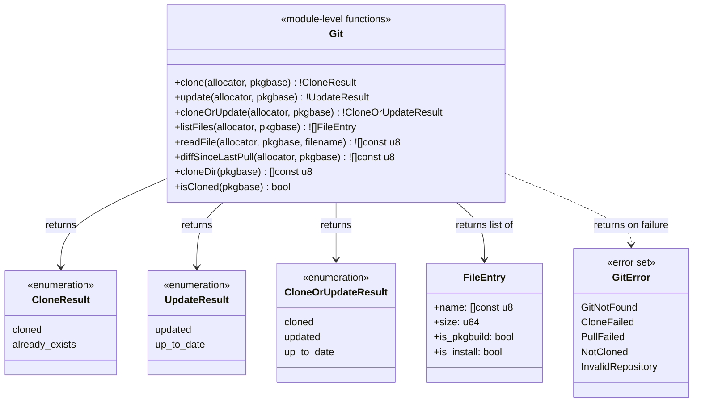

## Class-Level Design: `git.zig`

The git module manages AUR package source repositories. It's intentionally the shallowest of the core modules — git operations are fundamentally thin wrappers around `git` CLI invocations. The depth comes not from algorithmic complexity but from **idempotency guarantees**, **review file enumeration**, and the **clone directory as a shared contract** between multiple modules (commands, repo, show).

### Class Diagram



### Design: Module Functions, Not a Struct

Unlike `aur.zig` (which holds an HTTP client and cache) or `pacman.zig` (which holds a libalpm handle), `git.zig` has **no persistent state**. Each operation is self-contained: resolve the directory path, check if it exists, run a git command. There's no connection to keep alive or cache to maintain.

This means module-level functions (not a struct with `init`/`deinit`) are the right design. No artificial state, no lifetime management.

```zig
// git.zig — no struct, just functions

const AUR_GIT_BASE = "https://aur.archlinux.org/";

/// Resolve the clone directory path for a pkgbase.
/// Returns: ~/.cache/aurodle/{pkgbase}
/// (or $AURDEST/{pkgbase} when AURDEST support is added in Phase 2)
pub fn cloneDir(allocator: Allocator, pkgbase: []const u8) ![]const u8 {
    const home = std.posix.getenv("HOME") orelse return error.NoHomeDirectory;
    return std.fs.path.join(allocator, &.{ home, ".cache", "aurodle", pkgbase });
}
```

### Method Internals

#### `clone(allocator: Allocator, pkgbase: []const u8) !CloneResult`

Idempotent clone. If the directory exists, reports success — not an error.

```zig
pub const CloneResult = enum { cloned, already_exists };

/// Clone an AUR package repository by pkgbase.
///
/// Idempotent: if the clone directory already exists, returns .already_exists
/// without touching it. This makes it safe to call clone() on every package
/// in a dependency chain without worrying about duplicates.
///
/// The caller (commands.zig) is responsible for pkgname→pkgbase resolution
/// via the AUR RPC. git.zig always works with pkgbase.
pub fn clone(allocator: Allocator, pkgbase: []const u8) !CloneResult {
    const dest = try cloneDir(allocator, pkgbase);
    defer allocator.free(dest);

    // Check if already cloned
    if (dirExists(dest)) return .already_exists;

    // Build clone URL
    const url = try std.fmt.allocPrint(
        allocator,
        "{s}{s}.git",
        .{ AUR_GIT_BASE, pkgbase },
    );
    defer allocator.free(url);

    const result = try utils.runCommand(allocator, &.{
        "git", "clone", "--depth=1", url, dest,
    });

    if (result.exit_code != 0) {
        // Clean up partial clone directory on failure
        std.fs.deleteTreeAbsolute(dest) catch {};

        // Distinguish "package doesn't exist" from other git errors
        if (std.mem.indexOf(u8, result.stderr, "not found") != null or
            std.mem.indexOf(u8, result.stderr, "does not appear to be a git repository") != null)
        {
            return error.CloneFailed;
        }
        return error.CloneFailed;
    }

    return .cloned;
}
```

**Key design decisions:**

1. **`--depth=1` (shallow clone):** AUR repos often have long histories from multiple maintainers. We only need the current PKGBUILD. Shallow clone saves bandwidth and disk. The diff feature (Phase 2) works with `git log --oneline HEAD~1..HEAD` which is available even in shallow clones.

2. **Cleanup on failure:** If `git clone` fails partway (network error, SIGINT), it may leave a partial `.git` directory. We delete the entire dest directory on failure so a retry starts clean. This prevents the "already_exists but broken" state.

3. **pkgbase, never pkgname:** AUR git URLs are `https://aur.archlinux.org/{pkgbase}.git`. The pkgname→pkgbase mapping happens in the command layer (via `aur.Client.info()`). `git.zig` never does RPC lookups — it takes the resolved pkgbase and operates on it.

#### `update(allocator: Allocator, pkgbase: []const u8) !UpdateResult`

Pulls the latest changes for an already-cloned repository.

```zig
pub const UpdateResult = enum { updated, up_to_date };

/// Update an existing clone via git pull.
/// Errors if the package isn't cloned yet.
pub fn update(allocator: Allocator, pkgbase: []const u8) !UpdateResult {
    const dest = try cloneDir(allocator, pkgbase);
    defer allocator.free(dest);

    if (!dirExists(dest)) return error.NotCloned;

    // Capture current HEAD before pull for comparison
    const old_head = try getHead(allocator, dest);
    defer allocator.free(old_head);

    const result = try utils.runCommand(allocator, &.{
        "git", "-C", dest, "pull", "--ff-only",
    });

    if (result.exit_code != 0) {
        // Pull can fail if user modified files locally.
        // --ff-only ensures we don't create merge commits.
        return error.PullFailed;
    }

    const new_head = try getHead(allocator, dest);
    defer allocator.free(new_head);

    if (std.mem.eql(u8, old_head, new_head)) {
        return .up_to_date;
    }
    return .updated;
}

/// Get the current HEAD commit hash.
fn getHead(allocator: Allocator, repo_path: []const u8) ![]const u8 {
    const result = try utils.runCommand(allocator, &.{
        "git", "-C", repo_path, "rev-parse", "HEAD",
    });
    if (result.exit_code != 0) return error.InvalidRepository;
    return std.mem.trim(u8, result.stdout, " \t\n");
}
```

**Why `--ff-only`:** If a user manually edited files in the clone directory (e.g., patching a PKGBUILD), `git pull` would attempt a merge. `--ff-only` fails cleanly instead of creating an unexpected merge commit. The error message tells the user their clone has local changes. This matches the "out of scope: no PKGBUILD modification" constraint — we clone and build as-is.

#### `cloneOrUpdate(allocator: Allocator, pkgbase: []const u8) !CloneOrUpdateResult`

Convenience function used by the `sync` and `upgrade` commands. Clones if missing, pulls if present.

```zig
pub const CloneOrUpdateResult = enum { cloned, updated, up_to_date };

/// Clone if not present, update if already cloned.
/// The primary entry point used by sync and upgrade workflows.
pub fn cloneOrUpdate(allocator: Allocator, pkgbase: []const u8) !CloneOrUpdateResult {
    const dest = try cloneDir(allocator, pkgbase);
    defer allocator.free(dest);

    if (dirExists(dest)) {
        return switch (try update(allocator, pkgbase)) {
            .updated => .updated,
            .up_to_date => .up_to_date,
        };
    } else {
        _ = try clone(allocator, pkgbase);
        return .cloned;
    }
}
```

This is a shallow convenience wrapper, not a deep module method. Its value is eliminating the clone-or-update branching from every caller — three commands (`sync`, `upgrade`, `build`) all need this same logic.

#### `listFiles(allocator: Allocator, pkgbase: []const u8) ![]FileEntry`

Lists all tracked files in the clone directory. Used by the `show` command and the security review step in `sync`.

```zig
pub const FileEntry = struct {
    name: []const u8,
    size: u64,
    /// Convenience flags for display formatting
    is_pkgbuild: bool,
    is_install: bool,
};

/// List all tracked files in the clone directory.
/// Uses `git ls-files` to only show tracked files (ignores .git/, build artifacts).
/// PKGBUILD is always listed first for review convenience.
pub fn listFiles(allocator: Allocator, pkgbase: []const u8) ![]FileEntry {
    const dest = try cloneDir(allocator, pkgbase);
    defer allocator.free(dest);

    if (!dirExists(dest)) return error.NotCloned;

    const result = try utils.runCommand(allocator, &.{
        "git", "-C", dest, "ls-files",
    });
    if (result.exit_code != 0) return error.InvalidRepository;

    var entries = std.ArrayList(FileEntry).init(allocator);
    var pkgbuild_entry: ?FileEntry = null;

    var lines = std.mem.splitScalar(u8, std.mem.trim(u8, result.stdout, "\n"), '\n');
    while (lines.next()) |filename| {
        if (filename.len == 0) continue;

        // Stat the file for size
        const full_path = try std.fs.path.join(allocator, &.{ dest, filename });
        defer allocator.free(full_path);

        const stat = std.fs.cwd().statFile(full_path) catch continue;

        const entry = FileEntry{
            .name = try allocator.dupe(u8, filename),
            .size = stat.size,
            .is_pkgbuild = std.mem.eql(u8, filename, "PKGBUILD"),
            .is_install = std.mem.endsWith(u8, filename, ".install"),
        };

        // Hold PKGBUILD aside to insert first
        if (entry.is_pkgbuild) {
            pkgbuild_entry = entry;
        } else {
            try entries.append(entry);
        }
    }

    // PKGBUILD always first — it's the primary review target
    if (pkgbuild_entry) |pb| {
        try entries.insert(0, pb);
    }

    return entries.toOwnedSlice();
}
```

**Why `git ls-files` instead of directory iteration:** The clone directory may contain build artifacts if the user previously ran `makepkg` manually (`.src/`, `pkg/`, `*.pkg.tar.*`). `git ls-files` returns only tracked files — the PKGBUILD, .install scripts, patches, and other source files that the AUR maintainer committed. This is exactly what the security review needs to show.

**Why PKGBUILD first:** The security review process is "scan PKGBUILD for suspicious commands, then glance at auxiliary files." Putting PKGBUILD first in the list serves this workflow. The `show` command displays files in the order `listFiles` returns them.

#### `readFile(allocator: Allocator, pkgbase: []const u8, filename: []const u8) ![]const u8`

Reads a specific file from the clone directory. Used by the `show` command and the review step.

```zig
/// Read a file from the clone directory.
/// Default filename is "PKGBUILD".
pub fn readFile(
    allocator: Allocator,
    pkgbase: []const u8,
    filename: []const u8,
) ![]const u8 {
    const dest = try cloneDir(allocator, pkgbase);
    defer allocator.free(dest);

    if (!dirExists(dest)) return error.NotCloned;

    const full_path = try std.fs.path.join(allocator, &.{ dest, filename });
    defer allocator.free(full_path);

    // Guard against path traversal (e.g., filename = "../../etc/passwd")
    const real_dest = try std.fs.realpathAlloc(allocator, dest);
    defer allocator.free(real_dest);
    const real_file = try std.fs.realpathAlloc(allocator, full_path);
    defer allocator.free(real_file);

    if (!std.mem.startsWith(u8, real_file, real_dest)) {
        return error.InvalidFilePath;
    }

    const file = try std.fs.openFileAbsolute(full_path, .{});
    defer file.close();

    return try file.readToEndAlloc(allocator, 1024 * 1024); // 1MB limit
}
```

**Path traversal guard:** The `--file` flag in the `show` command lets users specify a filename. Without validation, `aurodle show foo --file ../../etc/shadow` could read arbitrary files. The `realpath` comparison ensures the resolved path stays within the clone directory.

#### `diffSinceLastPull(allocator: Allocator, pkgbase: []const u8) ![]const u8`

Shows what changed in the last update. Used by the review step in `upgrade` to highlight changes since the user last reviewed.

```zig
/// Show the diff between the previous HEAD and current HEAD.
/// Only meaningful after an update() that returned .updated.
///
/// Uses ORIG_HEAD which git sets during pull to the pre-pull HEAD.
pub fn diffSinceLastPull(allocator: Allocator, pkgbase: []const u8) ![]const u8 {
    const dest = try cloneDir(allocator, pkgbase);
    defer allocator.free(dest);

    if (!dirExists(dest)) return error.NotCloned;

    // ORIG_HEAD is set by git pull to the previous HEAD
    const result = try utils.runCommand(allocator, &.{
        "git", "-C", dest, "diff", "ORIG_HEAD..HEAD",
    });

    if (result.exit_code != 0) {
        // ORIG_HEAD might not exist (first clone, never pulled)
        // Return empty diff rather than error
        return try allocator.dupe(u8, "");
    }

    return try allocator.dupe(u8, result.stdout);
}
```

**Why `ORIG_HEAD`:** After `git pull`, git stores the pre-pull HEAD as `ORIG_HEAD`. This gives us the diff for free — no need to manually track commit hashes between runs. If `ORIG_HEAD` doesn't exist (first clone, no pull history), we return an empty diff, which the `show` command interprets as "no previous version to diff against."

### The Clone Directory as Contract

The clone directory path (`~/.cache/aurodle/{pkgbase}/`) is a shared contract between multiple modules:

```
git.zig       →  creates/updates the directory
commands.zig  →  runs makepkg inside it (build dir)
repo.zig      →  reads $PKGDEST or scans it for built packages
show command  →  reads PKGBUILD and other files from it
clean command →  deletes stale directories
```

`git.zig` owns the creation and git-level operations. Other modules access the directory by calling `git.cloneDir()` to get the path — they never hardcode the cache location. If `$AURDEST` support is added (Phase 2), only `cloneDir()` changes and all consumers pick up the new path automatically.

```zig
/// Check if a package has been cloned.
/// Used by commands.zig to validate before build/show operations.
pub fn isCloned(allocator: Allocator, pkgbase: []const u8) !bool {
    const dest = try cloneDir(allocator, pkgbase);
    defer allocator.free(dest);
    return dirExists(dest);
}

fn dirExists(path: []const u8) bool {
    std.fs.accessAbsolute(path, .{}) catch return false;
    return true;
}
```

### Error Semantics

| Error | Cause | Recovery |
|-------|-------|----------|
| `GitNotFound` | `git` not in `$PATH` | "Install git: `pacman -S git`" |
| `CloneFailed` | Network error, nonexistent pkgbase, or permission denied | Check network, verify package exists on AUR |
| `PullFailed` | Local modifications prevent fast-forward | "Remove local changes: `git -C <dir> checkout .`" |
| `NotCloned` | Operation requires clone but directory missing | "Run `aurodle clone <pkg>` first" |
| `InvalidRepository` | Directory exists but isn't a valid git repo | "Remove and re-clone: `rm -rf <dir>`" |
| `InvalidFilePath` | Path traversal attempt in `readFile` | Silent block — never expose this to user as actionable |

### Testing Strategy

```zig
test "clone creates directory and returns .cloned" {
    const tmp = testing.tmpDir(.{});
    defer tmp.cleanup();

    // Override cache root for testing
    var git = TestGit.initWithRoot(tmp.path);

    // Mock git command to create the directory
    git.mockGitCommand(.success);

    const result = try git.clone(testing.allocator, "test-pkg");
    try testing.expectEqual(CloneResult.cloned, result);
    try testing.expect(dirExists(try git.cloneDir(testing.allocator, "test-pkg")));
}

test "clone returns .already_exists for existing directory" {
    const tmp = testing.tmpDir(.{});
    defer tmp.cleanup();

    // Pre-create the clone directory
    const pkg_dir = try std.fs.path.join(testing.allocator, &.{ tmp.path, "test-pkg" });
    try std.fs.makeDirAbsolute(pkg_dir);

    var git = TestGit.initWithRoot(tmp.path);
    const result = try git.clone(testing.allocator, "test-pkg");
    try testing.expectEqual(CloneResult.already_exists, result);

    // Git command should NOT have been invoked
    try testing.expectEqual(@as(usize, 0), git.command_count);
}

test "clone cleans up partial directory on failure" {
    const tmp = testing.tmpDir(.{});
    defer tmp.cleanup();

    var git = TestGit.initWithRoot(tmp.path);
    git.mockGitCommand(.failure);

    const result = git.clone(testing.allocator, "test-pkg");
    try testing.expectError(error.CloneFailed, result);

    // Partial directory should be cleaned up
    try testing.expect(!dirExists(try git.cloneDir(testing.allocator, "test-pkg")));
}

test "update detects changes via HEAD comparison" {
    const tmp = testing.tmpDir(.{});
    defer tmp.cleanup();

    var git = TestGit.initWithRoot(tmp.path);
    try git.createFakeClone("test-pkg", "abc123");

    // Mock: pull succeeds and HEAD changes
    git.mockGitPull(.{ .new_head = "def456" });

    const result = try git.update(testing.allocator, "test-pkg");
    try testing.expectEqual(UpdateResult.updated, result);
}

test "update returns .up_to_date when HEAD unchanged" {
    const tmp = testing.tmpDir(.{});
    defer tmp.cleanup();

    var git = TestGit.initWithRoot(tmp.path);
    try git.createFakeClone("test-pkg", "abc123");

    // Mock: pull succeeds but HEAD stays the same
    git.mockGitPull(.{ .new_head = "abc123" });

    const result = try git.update(testing.allocator, "test-pkg");
    try testing.expectEqual(UpdateResult.up_to_date, result);
}

test "listFiles returns PKGBUILD first" {
    const tmp = testing.tmpDir(.{});
    defer tmp.cleanup();

    var git = TestGit.initWithRoot(tmp.path);
    try git.createFakeClone("test-pkg", "abc123");

    // Create tracked files
    try createFile(tmp.path, "test-pkg/some-patch.patch");
    try createFile(tmp.path, "test-pkg/PKGBUILD");
    try createFile(tmp.path, "test-pkg/test-pkg.install");

    // Mock git ls-files output
    git.mockLsFiles("some-patch.patch\nPKGBUILD\ntest-pkg.install\n");

    const files = try git.listFiles(testing.allocator, "test-pkg");
    defer testing.allocator.free(files);

    try testing.expectEqual(@as(usize, 3), files.len);
    try testing.expectEqualStrings("PKGBUILD", files[0].name);
    try testing.expect(files[0].is_pkgbuild);
    try testing.expect(files[2].is_install);
}

test "readFile blocks path traversal" {
    const tmp = testing.tmpDir(.{});
    defer tmp.cleanup();

    var git = TestGit.initWithRoot(tmp.path);
    try git.createFakeClone("test-pkg", "abc123");

    const result = git.readFile(testing.allocator, "test-pkg", "../../etc/passwd");
    try testing.expectError(error.InvalidFilePath, result);
}
```

### Complexity Budget

| Internal concern | Lines (est.) | Justification |
|-----------------|-------------|---------------|
| `cloneDir()` + `isCloned()` + `dirExists()` | ~15 | Path resolution, existence check |
| `clone()` | ~30 | URL construction, git invocation, cleanup on failure |
| `update()` + `getHead()` | ~30 | Pull with HEAD comparison |
| `cloneOrUpdate()` | ~12 | Convenience wrapper |
| `listFiles()` | ~40 | `git ls-files` + stat + PKGBUILD-first ordering |
| `readFile()` + path traversal guard | ~25 | File read with security validation |
| `diffSinceLastPull()` | ~15 | `git diff ORIG_HEAD..HEAD` |
| Constants (`AUR_GIT_BASE`) | ~5 | URL base |
| Tests | ~120 | Mock-based git command tests |
| **Total** | **~292** | Medium-depth: 7 functions, ~292 internal lines |

The depth score remains **Medium** — this is appropriate. Not every module needs to be deep. `git.zig` is a focused, well-bounded module with clear responsibilities. Its value is in idempotency guarantees, the shared directory contract, and the path traversal guard — not in algorithmic complexity.

