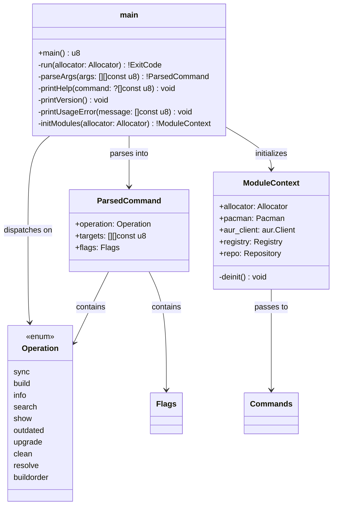

## Class-Level Design: `main.zig`

The entry point module. It owns the startup/shutdown lifecycle — parsing CLI arguments, initializing all core modules, dispatching to the correct command, formatting fatal errors, and returning an exit code. This is intentionally the **shallowest module**: its job is to translate the outside world (argv, environment) into the structured `Commands` API, then get out of the way.

### Class Diagram



### Internal Architecture

The module follows a **two-function pattern**: the actual `pub fn main()` is a thin wrapper that calls `run()`, catches any unhandled errors, formats them, and returns an exit code. This pattern separates "exit code generation" from "error propagation" — `run()` can use normal Zig error handling (`try`), while `main()` translates those into process exit codes.

```
main()  →  run()  →  parseArgs()  →  initModules()  →  commands.execute()
  ↑                                                          |
  └──── catch: format error to stderr, return exit code ─────┘
```

#### Why not use Zig's `std.process.ArgIterator` with comptime parsing

Zig's standard library offers `std.process.ArgIterator` but no built-in argument parser (unlike Go's `flag` or Rust's `clap`). Since aurodle has a flat command structure (no nested subcommands), a hand-written parser is simpler than pulling in a third-party dependency — and aligns with the "no external dependencies" constraint. The argument grammar is regular enough that a single-pass parser handles it cleanly.

### Method Implementations

#### `main() u8`

```zig
/// Entry point. Returns process exit code.
///
/// The u8 return type matches Zig's convention for main — the build system
/// translates it into std.process.exit(). Using u8 instead of !void lets us
/// control exit codes precisely (0, 1, 2, 3, 128).
pub fn main() u8 {
    // Use a general purpose allocator for the whole process lifetime.
    // GPA gives leak detection in debug builds — helpful during development.
    var gpa = std.heap.GeneralPurposeAllocator(.{}){};
    defer {
        const check = gpa.deinit();
        if (check == .leak) {
            std.log.err("memory leak detected", .{});
        }
    }
    const allocator = gpa.allocator();

    const result = run(allocator) catch |err| {
        // Unhandled error — something we didn't anticipate.
        // Format it and return general error.
        std.io.getStdErr().writer().print(
            "error: unexpected failure: {}\n",
            .{err},
        ) catch {};
        return 1;
    };

    return @intFromEnum(result);
}
```

**Why GPA, not arena or page allocator:** The General Purpose Allocator gives per-allocation tracking and leak detection in debug builds (essential during development), while being fast enough for a CLI tool. An arena would also work but provides no leak detection. The page allocator is too coarse. In release builds, GPA degrades gracefully to a thin wrapper over `malloc`.

#### `run(allocator: Allocator) !ExitCode`

The core logic, separated from `main()` so it can use normal error handling.

```zig
/// Core execution logic.
///
/// 1. Parse argv into a structured command
/// 2. Validate preconditions (not root, etc.)
/// 3. Initialize all core modules
/// 4. Dispatch to the appropriate command handler
/// 5. Return an exit code
fn run(allocator: Allocator) !ExitCode {
    const args = try std.process.argsAlloc(allocator);
    defer std.process.argsFree(allocator, args);

    // Skip argv[0] (the program name)
    const user_args = if (args.len > 1) args[1..] else args[0..0];

    // Parse arguments
    const parsed = parseArgs(user_args) catch |err| switch (err) {
        error.UnknownCommand => {
            printUsageError("unknown command");
            return .usage_error;
        },
        error.UnknownFlag => {
            printUsageError("unknown flag");
            return .usage_error;
        },
        error.MissingArgument => {
            printUsageError("missing required argument");
            return .usage_error;
        },
        error.HelpRequested => {
            printHelp(null);
            return .success;
        },
        error.VersionRequested => {
            printVersion();
            return .success;
        },
        else => return err,
    };

    // Handle command-specific help: `aurodle sync --help`
    if (parsed.flags.help) {
        printHelp(parsed.operation.name());
        return .success;
    }

    // Precondition: refuse to run build operations as root (FR-9)
    if (parsed.operation.isBuildOperation()) {
        if (std.os.linux.geteuid() == 0) {
            std.io.getStdErr().writer().writeAll(
                "error: building as root is not allowed. makepkg will refuse to run.\n",
            ) catch {};
            return .general_error;
        }
    }

    // Initialize all core modules
    var ctx = try initModules(allocator);
    defer ctx.deinit();

    // Precondition: verify aurpkgs repository is configured (FR-14)
    if (parsed.operation.needsRepo()) {
        if (!try ctx.repo.isConfigured()) {
            const stderr = std.io.getStdErr().writer();
            stderr.writeAll(
                \\error: local repository 'aurpkgs' is not configured in pacman.conf.
                \\
                \\Add the following to /etc/pacman.conf:
                \\
                \\  [aurpkgs]
                \\  SigLevel = Optional TrustAll
                \\  Server = file:///var/cache/aurodle/aurpkgs
                \\
                \\Then run: sudo pacman -Sy
                \\
            ) catch {};
            return .general_error;
        }
    }

    // Dispatch to command handler
    var commands = Commands.init(
        allocator,
        &ctx.pacman,
        &ctx.aur_client,
        &ctx.registry,
        &ctx.repo,
        parsed.flags,
    );
    defer commands.deinit();

    return switch (parsed.operation) {
        .sync => commands.sync(parsed.targets),
        .build => commands.build(parsed.targets),
        .info => commands.info(parsed.targets),
        .search => commands.search(parsed.targets[0]),
        .show => commands.show(parsed.targets[0]),
        .outdated => commands.outdated(if (parsed.targets.len > 0) parsed.targets else null),
        .upgrade => commands.upgrade(if (parsed.targets.len > 0) parsed.targets else null),
        .clean => commands.clean(),
        .resolve => commands.resolve(parsed.targets),
        .buildorder => commands.buildorder(parsed.targets),
    };
}
```

**Why precondition checks live in main, not commands:** The "running as root" check and "repo configured" check are **startup-time validations** — they should fail fast before any real work begins. Putting them in individual commands would mean duplicating the check across every command that builds (sync, build, upgrade). The entry point is the natural gatekeeper.

#### `parseArgs(args: [][]const u8) !ParsedCommand`

Single-pass argument parser. The grammar is intentionally flat: `aurodle <command> [flags] [targets...]`.

```zig
const ParseError = error{
    UnknownCommand,
    UnknownFlag,
    MissingArgument,
    HelpRequested,
    VersionRequested,
};

/// Parse raw argv into a structured command.
///
/// Grammar:
///   aurodle <command> [flags...] [targets...]
///   aurodle --help | --version
///
/// Flags can appear anywhere after the command (mixed with targets).
/// Single-dash short flags: -s, -q, -h, -v
/// Double-dash long flags: --noconfirm, --needed, --quiet, --help
/// Flag with value: --by <field>, --sort <field>, --format <string>
fn parseArgs(args: []const []const u8) ParseError!ParsedCommand {
    if (args.len == 0) {
        return ParseError.HelpRequested;
    }

    // Check for global flags before command
    if (std.mem.eql(u8, args[0], "--help") or std.mem.eql(u8, args[0], "-h")) {
        return ParseError.HelpRequested;
    }
    if (std.mem.eql(u8, args[0], "--version") or std.mem.eql(u8, args[0], "-v")) {
        return ParseError.VersionRequested;
    }

    // First non-flag argument is the command
    const operation = Operation.fromString(args[0]) orelse {
        return ParseError.UnknownCommand;
    };

    var flags = Flags{};
    var targets = std.ArrayList([]const u8).init(allocator);
    var i: usize = 1;

    while (i < args.len) : (i += 1) {
        const arg = args[i];

        if (std.mem.startsWith(u8, arg, "--")) {
            // Long flags
            if (std.mem.eql(u8, arg, "--help")) {
                flags.help = true;
            } else if (std.mem.eql(u8, arg, "--noconfirm")) {
                flags.noconfirm = true;
            } else if (std.mem.eql(u8, arg, "--noshow")) {
                flags.noshow = true;
            } else if (std.mem.eql(u8, arg, "--needed")) {
                flags.needed = true;
            } else if (std.mem.eql(u8, arg, "--rebuild")) {
                flags.rebuild = true;
            } else if (std.mem.eql(u8, arg, "--quiet")) {
                flags.quiet = true;
            } else if (std.mem.eql(u8, arg, "--raw")) {
                flags.raw = true;
            } else if (std.mem.eql(u8, arg, "--asdeps")) {
                flags.asdeps = true;
            } else if (std.mem.eql(u8, arg, "--asexplicit")) {
                flags.asexplicit = true;
            } else if (std.mem.eql(u8, arg, "--devel")) {
                flags.devel = true;
            } else if (std.mem.eql(u8, arg, "--by")) {
                i += 1;
                if (i >= args.len) return ParseError.MissingArgument;
                flags.by = SearchField.fromString(args[i]) orelse
                    return ParseError.UnknownFlag;
            } else if (std.mem.eql(u8, arg, "--sort")) {
                i += 1;
                if (i >= args.len) return ParseError.MissingArgument;
                flags.sort = SortField.fromString(args[i]) orelse
                    return ParseError.UnknownFlag;
            } else if (std.mem.eql(u8, arg, "--rsort")) {
                i += 1;
                if (i >= args.len) return ParseError.MissingArgument;
                flags.rsort = SortField.fromString(args[i]) orelse
                    return ParseError.UnknownFlag;
            } else if (std.mem.eql(u8, arg, "--format")) {
                i += 1;
                if (i >= args.len) return ParseError.MissingArgument;
                flags.format_str = args[i];
            } else {
                return ParseError.UnknownFlag;
            }
        } else if (arg.len > 1 and arg[0] == '-') {
            // Short flags — each character is a flag
            for (arg[1..]) |ch| {
                switch (ch) {
                    'h' => flags.help = true,
                    'q' => flags.quiet = true,
                    's' => {}, // reserved for future: could mean --syncdeps
                    else => return ParseError.UnknownFlag,
                }
            }
        } else {
            // Positional argument = target
            try targets.append(arg);
        }
    }

    // Validate: commands that require targets
    if (operation.requiresTargets() and targets.items.len == 0) {
        return ParseError.MissingArgument;
    }

    return ParsedCommand{
        .operation = operation,
        .targets = try targets.toOwnedSlice(),
        .flags = flags,
    };
}
```

**Why a single-pass hand-written parser:** The grammar is flat — one command, some flags, some targets. There are no subcommands, no flag groups, no mutually exclusive sets complex enough to warrant a parsing library. A single pass through argv handles everything. The if-else chain for flags is verbose but exhaustive and obvious — exactly the kind of code that's easy to audit and extend.

**Why flags can appear anywhere after the command:** Users don't want to remember "do flags go before or after targets?" Allowing `aurodle sync --needed foo` and `aurodle sync foo --needed` both work. This matches pacman's behavior.

#### `Operation` enum and helpers

```zig
const Operation = enum {
    sync,
    build,
    info,
    search,
    show,
    outdated,
    upgrade,
    clean,
    resolve,
    buildorder,

    /// Parse a command string into an Operation.
    fn fromString(s: []const u8) ?Operation {
        const map = std.StaticStringMap(Operation).initComptime(.{
            .{ "sync", .sync },
            .{ "build", .build },
            .{ "info", .info },
            .{ "search", .search },
            .{ "show", .show },
            .{ "outdated", .outdated },
            .{ "upgrade", .upgrade },
            .{ "clean", .clean },
            .{ "resolve", .resolve },
            .{ "buildorder", .buildorder },
            // Short aliases
            .{ "S", .sync },
            .{ "B", .build },
            .{ "Qi", .info },
            .{ "Ss", .search },
            .{ "Qu", .outdated },
            .{ "U", .upgrade },
        });
        return map.get(s);
    }

    /// Human-readable name for help text.
    fn name(self: Operation) []const u8 {
        return @tagName(self);
    }

    /// Does this operation build packages?
    /// Used for the "don't run as root" precondition.
    fn isBuildOperation(self: Operation) bool {
        return switch (self) {
            .sync, .build, .upgrade => true,
            else => false,
        };
    }

    /// Does this operation need the aurpkgs repository?
    /// Used for the "repo configured" precondition.
    fn needsRepo(self: Operation) bool {
        return switch (self) {
            .sync, .build, .upgrade, .clean => true,
            else => false,
        };
    }

    /// Does this operation require at least one target argument?
    fn requiresTargets(self: Operation) bool {
        return switch (self) {
            .sync, .build, .info, .search, .show, .resolve, .buildorder => true,
            .outdated, .upgrade, .clean => false,
        };
    }
};
```

**Why `StaticStringMap` for command lookup:** Zig's `std.StaticStringMap` generates a compile-time perfect hash for string lookups. For 16 entries (10 commands + 6 aliases), this is a single array indexing operation at runtime — faster than a chain of `std.mem.eql` comparisons and more maintainable than a hand-tuned lookup.

**Why short aliases (`S`, `B`, `Qu`):** These mirror pacman's flag conventions for users who have muscle memory. `S` for sync, `Qu` for query-updates (outdated). They're intentionally undocumented in help text — they're convenience shortcuts for experienced users, not the primary interface.

#### `initModules(allocator: Allocator) !ModuleContext`

Module initialization with deterministic teardown ordering.

```zig
const ModuleContext = struct {
    allocator: Allocator,
    pacman: Pacman,
    aur_client: aur.Client,
    registry: Registry,
    repo: Repository,

    /// Deinitialize in reverse order of initialization.
    /// This respects dependency edges:
    ///   registry depends on pacman + aur_client
    ///   so registry must be deinitialized first.
    fn deinit(self: *ModuleContext) void {
        self.registry.deinit();
        self.repo.deinit();
        self.aur_client.deinit();
        self.pacman.deinit();
    }
};

/// Initialize all core modules.
///
/// Initialization order matters:
/// 1. Pacman (opens libalpm handle, registers databases)
/// 2. AUR client (opens HTTP connection pool)
/// 3. Registry (takes pointers to pacman + aur)
/// 4. Repository (resolves paths, checks filesystem)
///
/// If any step fails, previously initialized modules are cleaned up.
fn initModules(allocator: Allocator) !ModuleContext {
    var pacman = try Pacman.init(allocator);
    errdefer pacman.deinit();

    var aur_client = aur.Client.init(allocator);
    errdefer aur_client.deinit();

    var registry = Registry.init(allocator, &pacman, &aur_client);
    errdefer registry.deinit();

    var repo = try Repository.init(allocator);
    errdefer repo.deinit();

    return ModuleContext{
        .allocator = allocator,
        .pacman = pacman,
        .aur_client = aur_client,
        .registry = registry,
        .repo = repo,
    };
}
```

**Why `errdefer` chaining for cleanup:** If `Repository.init` fails, we need to clean up the already-initialized pacman, aur_client, and registry. Zig's `errdefer` handles this automatically — each `errdefer` fires only if a later step returns an error. This avoids the manual cleanup spaghetti common in C (`goto cleanup_pacman`, `goto cleanup_aur`).

#### `printHelp(command: ?[]const u8) void`

```zig
/// Print help text for the tool or a specific command.
fn printHelp(command: ?[]const u8) void {
    const stdout = std.io.getStdOut().writer();

    if (command) |cmd| {
        // Command-specific help
        const help_text = commandHelp(cmd);
        stdout.writeAll(help_text) catch {};
        return;
    }

    // General help
    stdout.writeAll(
        \\aurodle — AUR package manager for Arch Linux
        \\
        \\Usage: aurodle <command> [options] [targets...]
        \\
        \\Commands:
        \\  sync <packages...>     Install AUR packages (resolve, clone, build, install)
        \\  build <packages...>    Build packages into local repository
        \\  info <packages...>     Display AUR package information
        \\  search <term>          Search AUR packages
        \\  show <package>         Display package build files
        \\  resolve <packages...>  Show dependency tree
        \\  buildorder <pkgs...>   Show build order (machine-readable)
        \\  outdated [packages...] List outdated AUR packages
        \\  upgrade [packages...]  Upgrade outdated AUR packages
        \\  clean                  Remove stale cache files
        \\
        \\Global options:
        \\  -h, --help             Show this help (or command help)
        \\  -v, --version          Show version
        \\  -q, --quiet            Reduce output verbosity
        \\
        \\Build options:
        \\  --noconfirm            Skip confirmation prompts
        \\  --noshow               Skip build file review
        \\  --needed               Skip up-to-date packages
        \\  --rebuild              Force rebuild
        \\  --asdeps               Install as dependency
        \\  --asexplicit           Install as explicitly installed
        \\
        \\Search options:
        \\  --by <field>           Search by: name, name-desc, maintainer
        \\  --sort <field>         Sort by: name, votes, popularity
        \\  --rsort <field>        Reverse sort
        \\  --raw                  Output raw JSON
        \\
    ) catch {};
}

/// Return command-specific help text.
fn commandHelp(cmd: []const u8) []const u8 {
    const map = std.StaticStringMap([]const u8).initComptime(.{
        .{ "sync",
            \\Usage: aurodle sync [options] <packages...>
            \\
            \\Install AUR packages through the full workflow:
            \\  resolve dependencies → clone → review → build → install
            \\
            \\Options:
            \\  --needed       Skip packages already at current version
            \\  --rebuild      Force rebuild even if up-to-date
            \\  --noconfirm    Skip confirmation prompt
            \\  --noshow       Skip build file review
            \\  --asdeps       Mark installed packages as dependencies
            \\  --asexplicit   Mark installed packages as explicitly installed
            \\
        },
        .{ "search",
            \\Usage: aurodle search [options] <term>
            \\
            \\Search AUR packages by name and description.
            \\
            \\Options:
            \\  --by <field>   Search by: name, name-desc, maintainer, depends
            \\  --sort <f>     Sort results by: name, votes, popularity
            \\  --rsort <f>    Reverse sort
            \\  --raw          Output raw JSON from AUR
            \\
        },
        // Additional commands follow the same pattern
    });
    return map.get(cmd) orelse "No help available for this command.\n";
}
```

**Why comptime string map for help text:** Each command's help text is a compile-time constant — no allocation, no formatting, no runtime cost. The `\\` multiline string syntax is Zig's raw string literal, which preserves indentation without escape sequences. This is the most readable way to embed large text blocks in Zig.

#### `printVersion() void`

```zig
/// Print version information.
///
/// Version is embedded at compile time from build.zig.zon.
/// In development builds (version "0.0.0"), we append the git commit hash
/// if available, giving output like: "aurodle 0.0.0-g3a7f2c1"
fn printVersion() void {
    const version = @import("builtin").version;
    const stdout = std.io.getStdOut().writer();

    stdout.print("aurodle {d}.{d}.{d}", .{
        version.major,
        version.minor,
        version.patch,
    }) catch {};

    // In dev builds, append git info if the build system embedded it
    if (@hasDecl(@import("build_options"), "git_hash")) {
        const hash = @import("build_options").git_hash;
        stdout.print("-g{s}", .{hash}) catch {};
    }

    stdout.writeByte('\n') catch {};
}
```

**Why conditional git hash:** Release builds get a clean `aurodle 1.0.0`. Development builds get `aurodle 0.0.0-g3a7f2c1` so developers can identify exactly which commit they're running. The `@hasDecl` check means the code compiles cleanly even when the build system doesn't provide git info (e.g., building from a tarball without `.git`). This requires a small addition to `build.zig` to pass build options — documented in the build integration section below.

#### `printUsageError(message: []const u8) void`

```zig
/// Print a usage error with a hint to use --help.
fn printUsageError(message: []const u8) void {
    const stderr = std.io.getStdErr().writer();
    stderr.print("error: {s}\n", .{message}) catch {};
    stderr.writeAll("Try 'aurodle --help' for usage information.\n") catch {};
}
```

### Build Integration

`main.zig` depends on two build-time inputs that `build.zig` must provide:

1. **Version from `build.zig.zon`**: Zig automatically makes the `.version` field available via `@import("builtin").version` when the build system is properly configured. The current `build.zig` already handles this.

2. **Git hash (optional)**: For development version strings, the build system can optionally embed the current git commit:

```zig
// Addition to build.zig for git hash embedding:
const options = b.addOptions();

// Try to get git hash for dev builds
if (b.run(&.{ "git", "rev-parse", "--short", "HEAD" })) |output| {
    options.addOption([]const u8, "git_hash", std.mem.trim(u8, output, "\n"));
}

// Pass to the executable module
exe.root_module.addOptions("build_options", options);
```

This is a **Phase 2 enhancement** — the initial build works without it. `printVersion()` gracefully handles the missing `build_options` module via `@hasDecl`.

### Error Semantics

`main.zig` is the **error boundary** between Zig's error system and Unix exit codes. Every error that can escape `run()` is caught and mapped:

| Error Source | Exit Code | User Message |
|---|---:|---|
| `parseArgs: UnknownCommand` | 2 | "unknown command" + help hint |
| `parseArgs: UnknownFlag` | 2 | "unknown flag" + help hint |
| `parseArgs: MissingArgument` | 2 | "missing required argument" + help hint |
| `initModules: AlpmInitFailed` | 1 | "failed to initialize pacman database: {}" |
| `repo.isConfigured: false` | 1 | Setup instructions with copy-paste config |
| `geteuid() == 0` + build op | 1 | "building as root is not allowed" |
| Commands returns `ExitCode` | 0/1/2/3/128 | (commands handle their own output) |
| Any unhandled error | 1 | "unexpected failure: {}" |

**Why exit code 2 for usage errors:** This is the Unix convention (also used by `bash`, `grep`, `curl`). It lets scripts distinguish "I gave bad arguments" (2) from "the operation failed" (1). FR-15 specifies this explicitly.

### Testing Strategy

`main.zig` tests focus on argument parsing — the most error-prone part. Module initialization and dispatch are tested indirectly through commands.zig integration tests.

```zig
test "parseArgs: basic sync command" {
    const parsed = try parseArgs(&.{ "sync", "foo", "bar" });
    try testing.expectEqual(Operation.sync, parsed.operation);
    try testing.expectEqual(@as(usize, 2), parsed.targets.len);
    try testing.expectEqualStrings("foo", parsed.targets[0]);
    try testing.expectEqualStrings("bar", parsed.targets[1]);
}

test "parseArgs: flags mixed with targets" {
    const parsed = try parseArgs(&.{ "sync", "--needed", "foo", "--noconfirm" });
    try testing.expectEqual(Operation.sync, parsed.operation);
    try testing.expectEqual(@as(usize, 1), parsed.targets.len);
    try testing.expectEqualStrings("foo", parsed.targets[0]);
    try testing.expect(parsed.flags.needed);
    try testing.expect(parsed.flags.noconfirm);
}

test "parseArgs: search with --by flag" {
    const parsed = try parseArgs(&.{ "search", "--by", "maintainer", "foo" });
    try testing.expectEqual(Operation.search, parsed.operation);
    try testing.expect(parsed.flags.by != null);
}

test "parseArgs: empty args shows help" {
    const result = parseArgs(&.{});
    try testing.expectError(ParseError.HelpRequested, result);
}

test "parseArgs: --help before command" {
    const result = parseArgs(&.{"--help"});
    try testing.expectError(ParseError.HelpRequested, result);
}

test "parseArgs: --version flag" {
    const result = parseArgs(&.{"--version"});
    try testing.expectError(ParseError.VersionRequested, result);
}

test "parseArgs: unknown command" {
    const result = parseArgs(&.{"frobnicate"});
    try testing.expectError(ParseError.UnknownCommand, result);
}

test "parseArgs: unknown flag" {
    const result = parseArgs(&.{ "sync", "--turbo" });
    try testing.expectError(ParseError.UnknownFlag, result);
}

test "parseArgs: missing target for sync" {
    const result = parseArgs(&.{"sync"});
    try testing.expectError(ParseError.MissingArgument, result);
}

test "parseArgs: outdated with no targets is valid" {
    const parsed = try parseArgs(&.{"outdated"});
    try testing.expectEqual(Operation.outdated, parsed.operation);
    try testing.expectEqual(@as(usize, 0), parsed.targets.len);
}

test "parseArgs: short aliases" {
    const parsed = try parseArgs(&.{ "S", "foo" });
    try testing.expectEqual(Operation.sync, parsed.operation);
}

test "parseArgs: combined short flags" {
    const parsed = try parseArgs(&.{ "search", "-q", "foo" });
    try testing.expect(parsed.flags.quiet);
}

test "Operation.isBuildOperation" {
    try testing.expect(Operation.sync.isBuildOperation());
    try testing.expect(Operation.build.isBuildOperation());
    try testing.expect(Operation.upgrade.isBuildOperation());
    try testing.expect(!Operation.info.isBuildOperation());
    try testing.expect(!Operation.search.isBuildOperation());
    try testing.expect(!Operation.clean.isBuildOperation());
}

test "Operation.requiresTargets" {
    try testing.expect(Operation.sync.requiresTargets());
    try testing.expect(!Operation.outdated.requiresTargets());
    try testing.expect(!Operation.upgrade.requiresTargets());
    try testing.expect(!Operation.clean.requiresTargets());
}
```

### Complexity Budget

| Component | Est. Lines | Justification |
|---|---:|---|
| `main()` | ~15 | GPA setup + error catch |
| `run()` | ~60 | Parse → validate → init → dispatch |
| `parseArgs()` | ~80 | Single-pass argv parser with all flags |
| `Operation` enum + helpers | ~50 | fromString, isBuildOperation, needsRepo, requiresTargets |
| `ModuleContext` + `initModules` | ~35 | Module wiring with errdefer chain |
| `printHelp` + `commandHelp` | ~80 | Help text (mostly string literals) |
| `printVersion` | ~15 | Version formatting |
| `printUsageError` | ~5 | Error + hint |
| Types (`ParsedCommand`, `ParseError`) | ~15 | Struct and error set definitions |
| Tests | ~80 | Argument parsing coverage |
| **Total** | **~435** | Medium module: appropriate for an entry point |

This is a healthy size for an entry point — substantial enough to justify its existence (not a trivial dispatcher), but not so large that it needs splitting. The `main.zig` module will likely stay stable as the project grows, since new commands are added to `commands.zig` (just a new case in the dispatch switch), and new flags are added to `parseArgs` (just a new else-if branch).

