## Class-Level Design: `repo.zig`

The repository module manages the local pacman repository that makes AUR packages installable via standard `pacman -S`. It hides the entire lifecycle: directory creation, package file discovery after builds, file copying, `repo-add` invocation, `$PKGDEST` resolution from makepkg.conf, split package handling, and pacman.conf validation. The module is designed so that callers never think about filesystem layout or external tool invocation — they say "add these built packages" and the repository handles the rest.

### Class Diagram

```mermaid
classDiagram
    class Repository {
        -allocator: Allocator
        -repo_dir: []const u8
        -db_path: []const u8
        -log_dir: []const u8
        -cache_dir: []const u8
        +init(allocator: Allocator) !Repository
        +deinit() void
        +ensureExists() !void
        +addPackages(pkg_paths: [][]const u8) !void
        +addBuiltPackages(build_dir: []const u8) ![][]const u8
        +isConfigured() !bool
        +configInstructions() []const u8
        +listPackages() ![]RepoPackage
        +clean(installed_names: [][]const u8) !CleanResult
        -runRepoAdd(pkg_paths: [][]const u8) !void
        -copyToRepo(src: []const u8) ![]const u8
        -findBuiltPackages(build_dir: []const u8) ![][]const u8
        -resolvePkgdest() ![]const u8
        -parseMakepkgConf() !MakepkgConfig
    }

    class RepoPackage {
        +name: []const u8
        +version: []const u8
        +filename: []const u8
    }

    class CleanResult {
        +removed_clones: [][]const u8
        +removed_packages: [][]const u8
        +removed_logs: [][]const u8
        +bytes_freed: u64
    }

    class MakepkgConfig {
        +pkgdest: ?[]const u8
        +pkgext: []const u8
        +builddir: ?[]const u8
    }

    class RepoError {
        <<error set>>
        NotConfigured
        RepoAddFailed
        PackageNotFound
        CopyFailed
        DatabaseCorrupted
    }

    Repository --> RepoPackage : lists
    Repository --> CleanResult : produces
    Repository ..> MakepkgConfig : reads
    Repository ..> RepoError : returns on failure
```



### Filesystem Layout

The repository manages a fixed directory structure:

```
~/.cache/aurodle/
├── aurpkgs/                          # Repository directory
│   ├── aurpkgs.db -> aurpkgs.db.tar.xz    # Symlink (created by repo-add)
│   ├── aurpkgs.db.tar.xz                   # Database file
│   ├── aurpkgs.files -> aurpkgs.files.tar.xz
│   ├── aurpkgs.files.tar.xz                # Files database
│   ├── yay-12.3.5-1-x86_64.pkg.tar.zst    # Built packages
│   ├── paru-2.0.3-1-x86_64.pkg.tar.zst
│   └── ...
├── logs/                             # Build logs
│   ├── yay.log
│   └── paru.log
├── yay/                              # Clone directories (managed by git.zig)
│   ├── PKGBUILD
│   └── .git/
└── paru/
    ├── PKGBUILD
    └── .git/
```

All paths are derived from the hardcoded cache root `~/.cache/aurodle/`. The repository name `aurpkgs` is a constant — not configurable in v1.

### Internal Constants and State

```zig
const Repository = struct {
    allocator: Allocator,

    /// Expanded absolute paths (~ resolved at init time)
    repo_dir: []const u8,   // ~/.cache/aurodle/aurpkgs/
    db_path: []const u8,    // ~/.cache/aurodle/aurpkgs/aurpkgs.db.tar.xz
    log_dir: []const u8,    // ~/.cache/aurodle/logs/
    cache_dir: []const u8,  // ~/.cache/aurodle/

    /// Cached makepkg.conf values (parsed once at init)
    makepkg_conf: MakepkgConfig,

    pub const REPO_NAME = "aurpkgs";
    pub const DB_FILENAME = "aurpkgs.db.tar.xz";
    pub const CACHE_ROOT = ".cache/aurodle";

    const MakepkgConfig = struct {
        /// Where makepkg puts built packages. Null = build directory.
        pkgdest: ?[]const u8,
        /// Package file extension (e.g., ".pkg.tar.zst")
        pkgext: []const u8,
        /// Custom build directory. Null = default.
        builddir: ?[]const u8,
    };
};
```

### Method Internals

#### `init(allocator: Allocator) !Repository`

Resolves all paths and parses makepkg.conf once. Does NOT create directories — that's `ensureExists()`.

```zig
pub fn init(allocator: Allocator) !Repository {
    const home = std.posix.getenv("HOME") orelse return error.NoHomeDirectory;

    const cache_dir = try std.fs.path.join(allocator, &.{ home, CACHE_ROOT });
    const repo_dir = try std.fs.path.join(allocator, &.{ cache_dir, REPO_NAME });
    const db_path = try std.fs.path.join(allocator, &.{ repo_dir, DB_FILENAME });
    const log_dir = try std.fs.path.join(allocator, &.{ cache_dir, "logs" });

    const makepkg_conf = parseMakepkgConf(allocator) catch MakepkgConfig{
        .pkgdest = null,
        .pkgext = ".pkg.tar.zst",
        .builddir = null,
    };

    return .{
        .allocator = allocator,
        .repo_dir = repo_dir,
        .db_path = db_path,
        .log_dir = log_dir,
        .cache_dir = cache_dir,
        .makepkg_conf = makepkg_conf,
    };
}
```

**Why parse makepkg.conf at init:** `$PKGDEST` determines where makepkg places built packages. We need to know this before we can find packages after a build. Parsing once at init avoids re-reading the file after every build. If parsing fails (file missing, unreadable), we fall back to sensible defaults — the build directory is the fallback for `$PKGDEST`, and `.pkg.tar.zst` is Arch's default `$PKGEXT`.

#### `ensureExists() !void`

Creates the repository directory and log directory if they don't exist. Idempotent — safe to call every time before a build.

```zig
/// Create repository and log directories if they don't exist.
/// Does NOT create the database file — repo-add creates it on first package add.
pub fn ensureExists(self: *Repository) !void {
    try std.fs.makeDirAbsolute(self.cache_dir) catch |err| switch (err) {
        error.PathAlreadyExists => {},
        else => return err,
    };
    try std.fs.makeDirAbsolute(self.repo_dir) catch |err| switch (err) {
        error.PathAlreadyExists => {},
        else => return err,
    };
    try std.fs.makeDirAbsolute(self.log_dir) catch |err| switch (err) {
        error.PathAlreadyExists => {},
        else => return err,
    };
}
```

**Why not create the database:** `repo-add` creates the `.db.tar.xz` file automatically when the first package is added. Pre-creating an empty database would require knowing the correct tar format, compression, and internal structure. Delegating to `repo-add` is both simpler and guaranteed correct.

#### `addBuiltPackages(build_dir: []const u8) ![][]const u8`

This is the most complex method. After `makepkg` finishes, the caller provides the build directory (pkgbase clone dir). The method must:

1. **Determine where built packages are** — `$PKGDEST` or the build directory
2. **Find all `.pkg.tar.*` files** — split packages produce multiple files
3. **Copy them to the repository directory** — packages must live in the repo dir for pacman to serve them
4. **Run `repo-add -R`** — update the database and remove old versions
5. **Return the list of added package files** — for logging and display

```zig
/// Find built packages after a makepkg run, copy them to the repository,
/// and update the database. Returns the filenames of added packages.
///
/// Handles split packages: a single makepkg invocation may produce
/// multiple .pkg.tar.* files (e.g., python-attrs + python-attrs-tests).
pub fn addBuiltPackages(self: *Repository, build_dir: []const u8) ![][]const u8 {
    // Step 1: Determine where to look for built packages
    const search_dir = self.makepkg_conf.pkgdest orelse build_dir;

    // Step 2: Find all .pkg.tar.* files in the search directory
    const pkg_files = try self.findBuiltPackages(search_dir);
    if (pkg_files.len == 0) {
        return error.PackageNotFound;
    }

    // Step 3: Copy each package to the repository directory
    var repo_paths = std.ArrayList([]const u8).init(self.allocator);
    for (pkg_files) |src_path| {
        const dest = try self.copyToRepo(src_path);
        try repo_paths.append(dest);
    }

    // Step 4: Run repo-add on all copied packages at once
    try self.runRepoAdd(repo_paths.items);

    return repo_paths.toOwnedSlice();
}

/// Find .pkg.tar.* files in the given directory.
/// Uses the PKGEXT from makepkg.conf to match the correct extension.
fn findBuiltPackages(self: *Repository, dir_path: []const u8) ![][]const u8 {
    var results = std.ArrayList([]const u8).init(self.allocator);

    var dir = try std.fs.openDirAbsolute(dir_path, .{ .iterate = true });
    defer dir.close();

    var it = dir.iterate();
    while (try it.next()) |entry| {
        if (entry.kind != .file) continue;

        // Match against PKGEXT (e.g., ".pkg.tar.zst")
        if (std.mem.endsWith(u8, entry.name, self.makepkg_conf.pkgext)) {
            const full_path = try std.fs.path.join(
                self.allocator,
                &.{ dir_path, entry.name },
            );
            try results.append(full_path);
        }
    }

    return results.toOwnedSlice();
}
```

**Why copy instead of moving or symlinking:** pacman serves packages from the repository directory. If `$PKGDEST` points elsewhere (e.g., `/home/packages`), the files must be in `~/.cache/aurodle/aurpkgs/` for pacman to find them. Copying is the safest approach — it works regardless of filesystem boundaries (can't hardlink across mounts), and `repo-add -R` handles removing old versions from the repo dir.

#### `copyToRepo(src: []const u8) ![]const u8`

Copies a single package file to the repository directory. Returns the destination path.

```zig
/// Copy a package file to the repository directory.
/// If a file with the same name already exists, it is overwritten
/// (this handles rebuild scenarios).
fn copyToRepo(self: *Repository, src_path: []const u8) ![]const u8 {
    const filename = std.fs.path.basename(src_path);
    const dest_path = try std.fs.path.join(self.allocator, &.{ self.repo_dir, filename });

    // Copy with overwrite
    try std.fs.copyFileAbsolute(src_path, dest_path, .{});

    return dest_path;
}
```

#### `runRepoAdd(pkg_paths: []const []const u8) !void`

Invokes `repo-add -R` as an external process. The `-R` flag is critical — it removes old versions of the same package from the repository directory.

```zig
/// Run `repo-add -R <db_path> <pkg1> <pkg2> ...`
///
/// -R (--remove): Remove old package files from disk when updating their
/// entry in the database. Without this, old versions accumulate.
///
/// repo-add creates the database file if it doesn't exist, and creates
/// the .db symlink pointing to the actual .db.tar.xz file.
fn runRepoAdd(self: *Repository, pkg_paths: []const []const u8) !void {
    // Build argv: ["repo-add", "-R", db_path, pkg1, pkg2, ...]
    var argv = std.ArrayList([]const u8).init(self.allocator);
    defer argv.deinit();

    try argv.append("repo-add");
    try argv.append("-R");
    try argv.append(self.db_path);
    try argv.appendSlice(pkg_paths);

    const result = try utils.runCommand(self.allocator, argv.items);

    if (result.exit_code != 0) {
        // Log stderr for debugging
        std.log.err("repo-add failed (exit {d}): {s}", .{
            result.exit_code,
            result.stderr,
        });
        return error.RepoAddFailed;
    }
}
```

**Why `repo-add` and not direct database manipulation:** The pacman repository database format (`aurpkgs.db.tar.xz`) is a tar archive containing desc files for each package. Generating this correctly requires matching pacman's exact format — entry structure, field ordering, compression. `repo-add` is the canonical tool for this. Re-implementing it would be fragile and break on pacman updates.

#### `isConfigured() !bool`

Checks whether the `[aurpkgs]` section exists in `/etc/pacman.conf`. This is a prerequisite for all build/install operations.

```zig
/// Check if the [aurpkgs] repository is configured in pacman.conf.
/// This reads pacman.conf and looks for a [aurpkgs] section.
pub fn isConfigured(self: *Repository) !bool {
    _ = self;
    const conf = std.fs.openFileAbsolute("/etc/pacman.conf", .{}) catch return false;
    defer conf.close();

    var buf_reader = std.io.bufferedReader(conf.reader());
    const reader = buf_reader.reader();
    var line_buf: [1024]u8 = undefined;

    while (reader.readUntilDelimiter(&line_buf, '\n')) |line| {
        const trimmed = std.mem.trim(u8, line, " \t");
        if (std.mem.eql(u8, trimmed, "[aurpkgs]")) return true;
    } else |err| switch (err) {
        error.EndOfStream => {},
        else => return err,
    }

    return false;
}
```

#### `configInstructions() []const u8`

Returns copy-pasteable instructions for configuring the repository. This is a compile-time constant — no allocation needed.

```zig
/// Copy-pasteable pacman.conf configuration for the aurpkgs repository.
/// Displayed when isConfigured() returns false.
pub fn configInstructions() []const u8 {
    return
        \\Add the following to /etc/pacman.conf:
        \\
        \\[aurpkgs]
        \\SigLevel = Optional TrustAll
        \\Server = file:///home/$USER/.cache/aurodle/aurpkgs
        \\
        \\Then run: sudo pacman -Sy
    ;
}
```

**Note:** The `$USER` in the Server line is intentional — pacman.conf doesn't expand `~`, so the actual home path must be used. The instructions use `$USER` as a placeholder; the command-layer error message will substitute the actual username.

#### `parseMakepkgConf() !MakepkgConfig`

Reads `PKGDEST`, `PKGEXT`, and `BUILDDIR` from makepkg.conf. These are bash-style variable assignments.

```zig
/// Parse makepkg.conf for PKGDEST, PKGEXT, and BUILDDIR.
/// Checks /etc/makepkg.conf then ~/.makepkg.conf (user overrides system).
fn parseMakepkgConf(allocator: Allocator) !MakepkgConfig {
    var config = MakepkgConfig{
        .pkgdest = null,
        .pkgext = ".pkg.tar.zst", // Arch default
        .builddir = null,
    };

    // System config first, then user config (user overrides)
    const paths = [_][]const u8{
        "/etc/makepkg.conf",
        // ~/.makepkg.conf — resolved at call time
    };

    for (paths) |path| {
        parseMakepkgConfFile(allocator, path, &config) catch continue;
    }

    // Also check user config
    if (std.posix.getenv("HOME")) |home| {
        const user_conf = try std.fs.path.join(allocator, &.{ home, ".makepkg.conf" });
        defer allocator.free(user_conf);
        parseMakepkgConfFile(allocator, user_conf, &config) catch {};
    }

    // Environment variables override config files
    if (std.posix.getenv("PKGDEST")) |v| config.pkgdest = v;
    if (std.posix.getenv("PKGEXT")) |v| config.pkgext = v;
    if (std.posix.getenv("BUILDDIR")) |v| config.builddir = v;

    return config;
}

/// Parse a single makepkg.conf file for relevant variables.
/// Format: VARNAME=value or VARNAME="value" (bash-style, no complex expansion)
fn parseMakepkgConfFile(
    allocator: Allocator,
    path: []const u8,
    config: *MakepkgConfig,
) !void {
    const file = try std.fs.openFileAbsolute(path, .{});
    defer file.close();

    var buf_reader = std.io.bufferedReader(file.reader());
    const reader = buf_reader.reader();
    var line_buf: [1024]u8 = undefined;

    while (reader.readUntilDelimiter(&line_buf, '\n')) |line| {
        const trimmed = std.mem.trim(u8, line, " \t");
        if (trimmed.len == 0 or trimmed[0] == '#') continue;

        if (parseAssignment(trimmed, "PKGDEST")) |val| {
            config.pkgdest = try allocator.dupe(u8, stripQuotes(val));
        } else if (parseAssignment(trimmed, "PKGEXT")) |val| {
            config.pkgext = try allocator.dupe(u8, stripQuotes(val));
        } else if (parseAssignment(trimmed, "BUILDDIR")) |val| {
            config.builddir = try allocator.dupe(u8, stripQuotes(val));
        }
    } else |err| switch (err) {
        error.EndOfStream => {},
        else => return err,
    }
}

/// Parse "KEY=value" and return value if key matches.
fn parseAssignment(line: []const u8, key: []const u8) ?[]const u8 {
    if (!std.mem.startsWith(u8, line, key)) return null;
    if (line.len <= key.len or line[key.len] != '=') return null;
    return line[key.len + 1 ..];
}

/// Strip surrounding single or double quotes from a value.
fn stripQuotes(val: []const u8) []const u8 {
    if (val.len >= 2) {
        if ((val[0] == '"' and val[val.len - 1] == '"') or
            (val[0] == '\'' and val[val.len - 1] == '\''))
        {
            return val[1 .. val.len - 1];
        }
    }
    return val;
}
```

**Why parse makepkg.conf ourselves instead of sourcing it:** makepkg.conf is a bash script (`source /etc/makepkg.conf`). Fully evaluating it would require a bash interpreter — variable expansion, conditionals, function calls. Instead, we parse only the three variables we need (`PKGDEST`, `PKGEXT`, `BUILDDIR`) with simple line-by-line matching. This handles 99% of real configs. Edge cases (e.g., `PKGDEST="${HOME}/packages"`) are handled by checking environment variables as overrides — users who set complex values in makepkg.conf typically also export them.

#### `listPackages() ![]RepoPackage`

Lists all packages currently in the repository by scanning the directory. Used for display and cleanup operations.

```zig
pub const RepoPackage = struct {
    name: []const u8,
    version: []const u8,
    filename: []const u8,
};

/// List all packages in the repository directory.
/// Parses package filenames to extract name and version.
/// Filename format: {pkgname}-{pkgver}-{arch}.pkg.tar.{comp}
pub fn listPackages(self: *Repository) ![]RepoPackage {
    var packages = std.ArrayList(RepoPackage).init(self.allocator);

    var dir = std.fs.openDirAbsolute(self.repo_dir, .{ .iterate = true }) catch |err| switch (err) {
        error.FileNotFound => return packages.toOwnedSlice(), // empty repo
        else => return err,
    };
    defer dir.close();

    var it = dir.iterate();
    while (try it.next()) |entry| {
        if (entry.kind != .file) continue;
        if (!std.mem.indexOf(u8, entry.name, ".pkg.tar.") != null) continue;

        // Skip database files
        if (std.mem.startsWith(u8, entry.name, "aurpkgs.")) continue;

        if (parsePackageFilename(entry.name)) |parsed| {
            try packages.append(.{
                .name = try self.allocator.dupe(u8, parsed.name),
                .version = try self.allocator.dupe(u8, parsed.version),
                .filename = try self.allocator.dupe(u8, entry.name),
            });
        }
    }

    return packages.toOwnedSlice();
}

/// Parse "pkgname-pkgver-arch.pkg.tar.ext" into name and version.
/// Package names can contain hyphens, so we scan from the right:
///   yay-bin-12.3.5-1-x86_64.pkg.tar.zst
///        ^^^^^^^^^^^              → version = "12.3.5-1"
///   ^^^^^^                       → name = "yay-bin"
///                   ^^^^^^       → arch = "x86_64"
fn parsePackageFilename(filename: []const u8) ?struct { name: []const u8, version: []const u8 } {
    // Strip .pkg.tar.* suffix
    const pkg_idx = std.mem.indexOf(u8, filename, ".pkg.tar.") orelse return null;
    const stem = filename[0..pkg_idx];

    // Work backwards: last hyphen separates arch, next separates pkgrel,
    // next separates pkgver, everything before is pkgname.
    // Format: name-ver-rel-arch

    // Find arch (last segment)
    const arch_sep = std.mem.lastIndexOf(u8, stem, "-") orelse return null;
    const before_arch = stem[0..arch_sep];

    // Find pkgrel
    const rel_sep = std.mem.lastIndexOf(u8, before_arch, "-") orelse return null;
    const before_rel = before_arch[0..rel_sep];

    // Find pkgver
    const ver_sep = std.mem.lastIndexOf(u8, before_rel, "-") orelse return null;

    return .{
        .name = stem[0..ver_sep],
        .version = stem[ver_sep + 1 .. arch_sep], // "pkgver-pkgrel"
    };
}
```

**Why parse filenames from the right:** Package names can contain hyphens (`lib32-glibc`, `python-attrs-tests`), but the version-release-arch suffix always has exactly three hyphen-separated segments counting from the right. Parsing left-to-right would require knowing where the name ends, which is ambiguous. Right-to-left parsing unambiguously identifies `arch`, then `pkgrel`, then `pkgver`, and everything remaining is the package name.

#### `clean(installed_names: [][]const u8) !CleanResult`

Removes stale clone directories, orphaned package files, and old build logs. The caller provides the list of currently installed package names (from `pacman.zig`) so the method can determine what's stale.

```zig
pub const CleanResult = struct {
    removed_clones: [][]const u8,
    removed_packages: [][]const u8,
    removed_logs: [][]const u8,
    bytes_freed: u64,
};

/// Remove stale artifacts from the cache.
///
/// "Stale" means:
/// - Clone directories for packages not currently installed
/// - Package files not referenced by the repository database
/// - Build logs older than 7 days
///
/// Does NOT actually delete — returns what would be removed.
/// The caller (commands.zig) displays this and prompts for confirmation,
/// then calls cleanExecute() to perform the actual deletion.
pub fn clean(self: *Repository, installed_names: [][]const u8) !CleanResult {
    var result = CleanResult{
        .removed_clones = &.{},
        .removed_packages = &.{},
        .removed_logs = &.{},
        .bytes_freed = 0,
    };

    // Build set of installed names for O(1) lookup
    var installed = std.StringHashMapUnmanaged(void){};
    defer installed.deinit(self.allocator);
    for (installed_names) |name| {
        try installed.put(self.allocator, name, {});
    }

    // Find stale clones: directories in cache_dir that aren't installed
    var stale_clones = std.ArrayList([]const u8).init(self.allocator);
    var cache = try std.fs.openDirAbsolute(self.cache_dir, .{ .iterate = true });
    defer cache.close();

    var it = cache.iterate();
    while (try it.next()) |entry| {
        if (entry.kind != .directory) continue;
        // Skip known non-clone directories
        if (std.mem.eql(u8, entry.name, "aurpkgs")) continue;
        if (std.mem.eql(u8, entry.name, "logs")) continue;

        if (!installed.contains(entry.name)) {
            try stale_clones.append(try self.allocator.dupe(u8, entry.name));
        }
    }
    result.removed_clones = try stale_clones.toOwnedSlice();

    // Find stale logs
    var stale_logs = std.ArrayList([]const u8).init(self.allocator);
    if (std.fs.openDirAbsolute(self.log_dir, .{ .iterate = true })) |*log_dir| {
        defer log_dir.close();
        var log_it = log_dir.iterate();
        while (try log_it.next()) |entry| {
            if (entry.kind != .file) continue;
            // Remove logs for packages that aren't installed
            const stem = std.fs.path.stem(entry.name);
            if (!installed.contains(stem)) {
                try stale_logs.append(try self.allocator.dupe(u8, entry.name));
            }
        }
    } else |_| {}
    result.removed_logs = try stale_logs.toOwnedSlice();

    return result;
}

/// Execute the actual deletion after user confirmation.
pub fn cleanExecute(self: *Repository, plan: CleanResult) !void {
    for (plan.removed_clones) |name| {
        const path = try std.fs.path.join(self.allocator, &.{ self.cache_dir, name });
        defer self.allocator.free(path);
        std.fs.deleteTreeAbsolute(path) catch |err| {
            std.log.warn("Failed to remove clone {s}: {}", .{ name, err });
        };
    }

    for (plan.removed_logs) |name| {
        const path = try std.fs.path.join(self.allocator, &.{ self.log_dir, name });
        defer self.allocator.free(path);
        std.fs.deleteFileAbsolute(path) catch |err| {
            std.log.warn("Failed to remove log {s}: {}", .{ name, err });
        };
    }
}
```

**Why separate `clean` from `cleanExecute`:** This follows the requirements' upfront prompting philosophy (NFR-4). The user sees exactly what will be deleted before anything is removed. The two-phase approach (plan → confirm → execute) prevents accidental data loss and matches how `pacman -Sc` works.

### Error Semantics

Like the registry, the repository defines errors out of existence where possible:

| Situation | Approach | Rationale |
|-----------|----------|-----------|
| Repo directory doesn't exist | `ensureExists()` creates it | Caller never sees "missing directory" |
| Database file doesn't exist | `repo-add` creates it on first use | No separate "init database" step |
| Package already in repo | `repo-add` updates the entry | Idempotent — rebuilds just work |
| Old version of package exists | `-R` flag removes it automatically | No manual cleanup needed |
| `$PKGDEST` not set | Fall back to build directory | Most users don't customize this |
| makepkg.conf missing | Use Arch defaults | Tool works out of the box |

Genuine errors that cannot be eliminated:

| Error | Meaning | Recovery |
|-------|---------|----------|
| `NotConfigured` | `[aurpkgs]` not in pacman.conf | Display `configInstructions()` |
| `RepoAddFailed` | `repo-add` returned nonzero | Log stderr, report to user |
| `PackageNotFound` | No `.pkg.tar.*` files after build | Check `$PKGDEST`, log makepkg output |
| `CopyFailed` | Can't write to repo directory | Check permissions, disk space |

### Atomicity Considerations

The requirements (NFR-2) specify that partial writes must not corrupt the database. The design relies on `repo-add`'s built-in atomicity:

1. `repo-add` writes to a temporary file, then atomically renames it to the database path
2. If `repo-add` is interrupted (SIGINT), the old database remains intact
3. If `repo-add` fails, the package file is already in the repo dir but not in the database — a subsequent successful `repo-add` will pick it up

The only non-atomic operation is `copyToRepo` — if it's interrupted mid-copy, a partial `.pkg.tar.*` file remains. This is harmless: `repo-add` will either skip it (if it's invalid) or it will be overwritten on the next build. The partial file is cleaned up by `repo-add -R` when a valid version is added.

### Testing Strategy

```zig
test "ensureExists creates directory structure" {
    const tmp = testing.tmpDir(.{});
    defer tmp.cleanup();

    var repo = Repository.initWithRoot(testing.allocator, tmp.path);
    defer repo.deinit();

    try repo.ensureExists();

    // Verify directories exist
    try testing.expect(dirExists(repo.repo_dir));
    try testing.expect(dirExists(repo.log_dir));
}

test "addBuiltPackages finds and copies split packages" {
    const tmp = testing.tmpDir(.{});
    defer tmp.cleanup();

    // Create fake built packages in a "build" directory
    const build_dir = try tmp.join("build");
    try std.fs.makeDirAbsolute(build_dir);
    try createEmptyFile(try tmp.join("build/python-attrs-23.1-1-x86_64.pkg.tar.zst"));
    try createEmptyFile(try tmp.join("build/python-attrs-tests-23.1-1-x86_64.pkg.tar.zst"));

    var repo = Repository.initWithRoot(testing.allocator, tmp.path);
    defer repo.deinit();
    try repo.ensureExists();

    // Mock repo-add (test-only: skip actual invocation)
    repo.mock_repo_add = true;

    const added = try repo.addBuiltPackages(build_dir);
    defer testing.allocator.free(added);

    // Both split packages should be found and copied
    try testing.expectEqual(@as(usize, 2), added.len);

    // Verify files exist in repo directory
    for (added) |path| {
        try testing.expect(fileExists(path));
    }
}

test "parsePackageFilename handles hyphenated names" {
    const result = parsePackageFilename("lib32-glibc-2.39-1-x86_64.pkg.tar.zst");
    try testing.expect(result != null);
    try testing.expectEqualStrings("lib32-glibc", result.?.name);
    try testing.expectEqualStrings("2.39-1", result.?.version);
}

test "parsePackageFilename handles epoch versions" {
    const result = parsePackageFilename("python-3:3.12.1-1-x86_64.pkg.tar.zst");
    try testing.expect(result != null);
    try testing.expectEqualStrings("python", result.?.name);
    // Epoch is part of the version string
    try testing.expectEqualStrings("3:3.12.1-1", result.?.version);
}

test "isConfigured detects aurpkgs section" {
    // Write a test pacman.conf
    const tmp = testing.tmpDir(.{});
    defer tmp.cleanup();
    const conf_path = try tmp.join("pacman.conf");
    try std.fs.cwd().writeFile(conf_path,
        \\[options]
        \\HoldPkg = pacman glibc
        \\
        \\[core]
        \\Include = /etc/pacman.d/mirrorlist
        \\
        \\[aurpkgs]
        \\SigLevel = Optional TrustAll
        \\Server = file:///home/user/.cache/aurodle/aurpkgs
    );

    var repo = Repository.initWithConfPath(testing.allocator, conf_path);
    defer repo.deinit();

    try testing.expect(try repo.isConfigured());
}

test "clean identifies stale clones" {
    const tmp = testing.tmpDir(.{});
    defer tmp.cleanup();

    // Create clone dirs
    try std.fs.makeDirAbsolute(try tmp.join("yay"));     // installed
    try std.fs.makeDirAbsolute(try tmp.join("paru"));    // not installed → stale
    try std.fs.makeDirAbsolute(try tmp.join("aurpkgs")); // repo dir → skip
    try std.fs.makeDirAbsolute(try tmp.join("logs"));    // log dir → skip

    var repo = Repository.initWithRoot(testing.allocator, tmp.path);
    defer repo.deinit();

    const result = try repo.clean(&.{"yay"});

    try testing.expectEqual(@as(usize, 1), result.removed_clones.len);
    try testing.expectEqualStrings("paru", result.removed_clones[0]);
}

test "parseMakepkgConf reads PKGDEST with quotes" {
    const tmp = testing.tmpDir(.{});
    defer tmp.cleanup();
    const conf_path = try tmp.join("makepkg.conf");
    try std.fs.cwd().writeFile(conf_path,
        \\PKGDEST="/home/user/packages"
        \\PKGEXT='.pkg.tar.zst'
    );

    const config = try parseMakepkgConfFromPath(testing.allocator, conf_path);
    try testing.expectEqualStrings("/home/user/packages", config.pkgdest.?);
    try testing.expectEqualStrings(".pkg.tar.zst", config.pkgext);
}
```

### Complexity Budget

| Internal concern | Lines (est.) | Justification |
|-----------------|-------------|---------------|
| `Repository` struct + constants | ~25 | State, paths, MakepkgConfig |
| `init()` + path resolution | ~25 | Home expansion, path joins |
| `ensureExists()` | ~15 | Idempotent directory creation |
| `addBuiltPackages()` | ~30 | Orchestrate find → copy → repo-add |
| `findBuiltPackages()` | ~25 | Directory scan with PKGEXT matching |
| `copyToRepo()` | ~10 | File copy with overwrite |
| `runRepoAdd()` | ~20 | Argv construction + process exec |
| `isConfigured()` | ~20 | pacman.conf line scan |
| `configInstructions()` | ~10 | Compile-time string constant |
| `listPackages()` + `parsePackageFilename()` | ~50 | Directory scan + right-to-left parse |
| `parseMakepkgConf()` + helpers | ~60 | Two-file parse + env override |
| `clean()` + `cleanExecute()` | ~55 | Stale detection + two-phase delete |
| Tests | ~120 | Filesystem-based with tmp dirs |
| **Total** | **~465** | 6 public methods, ~465 internal lines |

