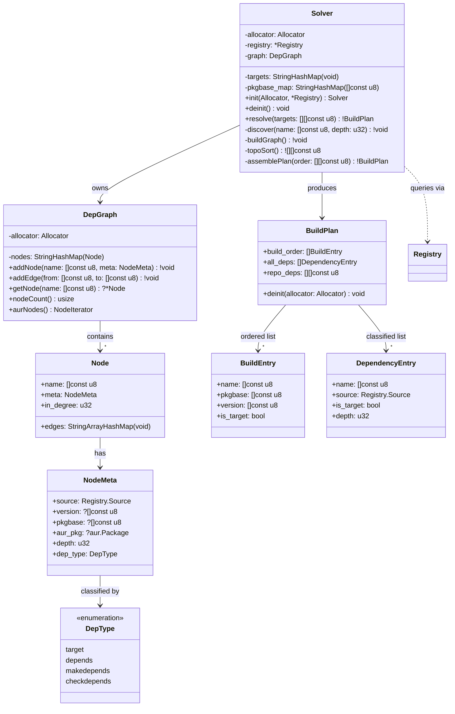

## Class-Level Design: `solver.zig`

The solver is aurodle's most algorithmically complex module. It takes a list of target package names and produces a ready-to-execute `BuildPlan` — an ordered sequence of packages to build, plus classified metadata for display. Internally, it runs a three-phase pipeline: **discovery → graph construction → topological sort**.

### Class Diagram



### Three-Phase Pipeline

The solver's `resolve()` method is a pipeline of three distinct phases, each with a clear input/output boundary:

```
resolve(["foo", "bar"])
  │
  ├─ Phase 1: DISCOVERY ──────────────────────────────
  │   Input:  target names
  │   Output: populated DepGraph with all reachable nodes
  │   Method: recursive DFS with cycle detection
  │
  ├─ Phase 2: TOPOLOGICAL SORT ───────────────────────
  │   Input:  DepGraph (only AUR nodes + edges)
  │   Output: ordered list of package names
  │   Method: Kahn's algorithm (BFS-based)
  │
  └─ Phase 3: PLAN ASSEMBLY ──────────────────────────
      Input:  ordered names + graph metadata
      Output: BuildPlan struct
      Method: pkgbase deduplication, classification
```

### Phase 1: Discovery

Discovery is a depth-first traversal that starts from the targets and recursively follows `depends` and `makedepends` edges. Each discovered package is classified via the registry and added as a node in the dependency graph.

```zig
/// Recursively discover all dependencies for a package.
/// Uses gray/black coloring for cycle detection:
///   - absent = white (unvisited)
///   - in `visiting` set = gray (on current DFS path)
///   - in `graph.nodes` with edges populated = black (fully processed)
fn discover(self: *Solver, name: []const u8, depth: u32) !void {
    // Cycle detection: if we're already visiting this node, we have a cycle
    if (self.visiting.contains(name)) {
        return error.CircularDependency;
    }

    // Already fully processed
    if (self.graph.getNode(name)) |node| {
        if (node.meta.fully_resolved) return;
    }

    // Mark as visiting (gray)
    try self.visiting.put(name, {});
    defer _ = self.visiting.remove(name);

    // Classify via registry
    const resolution = try self.registry.resolve(name);

    const meta = NodeMeta{
        .source = resolution.source,
        .version = resolution.version,
        .pkgbase = if (resolution.aur_pkg) |p| p.pkgbase else null,
        .aur_pkg = resolution.aur_pkg,
        .depth = depth,
        .dep_type = if (self.targets.contains(name)) .target else .depends,
    };

    try self.graph.addNode(name, meta);

    // Only recurse into AUR packages — repo/satisfied packages
    // have their deps handled by pacman, not by us.
    if (resolution.source == .aur) {
        if (resolution.aur_pkg) |pkg| {
            // Follow depends
            for (pkg.depends) |dep| {
                const dep_name = parseName(dep);
                try self.discover(dep_name, depth + 1);
                try self.graph.addEdge(name, dep_name);
            }

            // Follow makedepends
            for (pkg.makedepends) |dep| {
                const dep_name = parseName(dep);
                try self.discover(dep_name, depth + 1);
                try self.graph.addEdge(name, dep_name);
            }
        }
    }

    if (resolution.source == .unknown) {
        // Fail fast: unknown dependency in a required position
        return error.UnresolvableDependency;
    }

    // Mark as fully resolved (black)
    if (self.graph.getNode(name)) |node| {
        node.meta.fully_resolved = true;
    }
}
```

**Key design decisions in discovery:**

1. **Only recurse into AUR packages.** If `libfoo` is in the official repos, we don't need to resolve *its* dependencies — pacman handles that transitively when `makepkg -s` installs it. This dramatically prunes the graph.

2. **Cycle detection uses the visiting set, not graph coloring.** The `visiting` set is a `StringHashMap` that tracks the current DFS path. This is more explicit than repurposing graph node states and doesn't leak algorithm concerns into the `DepGraph` data structure.

3. **Fail fast on unknown.** If a dependency can't be found anywhere, we error immediately during discovery rather than building a partial graph and discovering the problem later during sort. This gives the user the clearest error — "package X depends on Y, which isn't found" — with full context of where in the tree the failure occurred.

### Phase 2: Topological Sort (Kahn's Algorithm)

After discovery, the graph contains all reachable packages. The topological sort operates only on AUR nodes (repos/satisfied nodes have no build ordering requirements from our perspective).

```zig
/// Kahn's algorithm: BFS-based topological sort.
/// Returns AUR packages in build order (dependencies before dependents).
///
/// Algorithm:
///   1. Compute in-degree for each AUR node
///   2. Seed queue with zero in-degree nodes
///   3. Process queue: emit node, decrement neighbors' in-degree
///   4. If unprocessed nodes remain, they form a cycle
fn topoSort(self: *Solver) ![][]const u8 {
    var in_degree = std.StringHashMapUnmanaged(u32){};
    defer in_degree.deinit(self.allocator);

    var queue = std.ArrayList([]const u8).init(self.allocator);
    defer queue.deinit();

    var result = std.ArrayList([]const u8).init(self.allocator);

    // Step 1: Initialize in-degrees for AUR nodes only
    var it = self.graph.aurNodes();
    while (it.next()) |node| {
        var degree: u32 = 0;

        // Count incoming edges from other AUR nodes
        var all_nodes = self.graph.aurNodes();
        while (all_nodes.next()) |other| {
            if (other.edges.contains(node.name)) {
                degree += 1;
            }
        }

        try in_degree.put(self.allocator, node.name, degree);

        // Step 2: Seed queue with zero in-degree nodes
        if (degree == 0) {
            try queue.append(node.name);
        }
    }

    // Step 3: BFS — process zero in-degree nodes
    var head: usize = 0;
    while (head < queue.items.len) {
        const current = queue.items[head];
        head += 1;

        try result.append(current);

        // Decrement in-degree of all AUR neighbors
        const node = self.graph.getNode(current).?;
        for (node.edges.keys()) |neighbor| {
            if (in_degree.getPtr(neighbor)) |deg| {
                deg.* -= 1;
                if (deg.* == 0) {
                    try queue.append(neighbor);
                }
            }
        }
    }

    // Step 4: Cycle detection — if we didn't process all AUR nodes, there's a cycle
    const aur_count = blk: {
        var count: usize = 0;
        var counter = self.graph.aurNodes();
        while (counter.next()) |_| count += 1;
        break :blk count;
    };

    if (result.items.len != aur_count) {
        // Find the cycle for error reporting
        const cycle = try self.findCycle(in_degree);
        return ResolutionError.circularDependency(cycle);
    }

    return result.toOwnedSlice();
}
```

**Why Kahn's over DFS-based topological sort:**

Kahn's algorithm makes cycle detection a free byproduct — if the result has fewer nodes than the input, there's a cycle. No extra pass needed. DFS-based sort requires separate back-edge detection. For a build system where cycles are the most important error to report clearly, having the detection integrated into the primary algorithm simplifies the code.

### Phase 3: Plan Assembly

The final phase transforms the raw topological order into the `BuildPlan` struct that commands consume. This is where **pkgbase deduplication** happens.

```zig
/// Transform sorted node list into a BuildPlan.
///
/// Critical operation: pkgbase deduplication.
/// Multiple pkgnames can share a pkgbase (split packages).
/// Example: python-attrs and python-attrs-tests are both in pkgbase "python-attrs".
/// We only need to build the pkgbase once — both .pkg.tar files are produced.
fn assemblePlan(self: *Solver, order: []const []const u8) !BuildPlan {
    var build_order = std.ArrayList(BuildEntry).init(self.allocator);
    var all_deps = std.ArrayList(DependencyEntry).init(self.allocator);
    var repo_deps = std.ArrayList([]const u8).init(self.allocator);

    // Track seen pkgbases to avoid duplicate builds
    var seen_pkgbase = std.StringHashMapUnmanaged(void){};
    defer seen_pkgbase.deinit(self.allocator);

    // Build order: only AUR packages, deduplicated by pkgbase
    for (order) |name| {
        const node = self.graph.getNode(name).?;
        const pkgbase = node.meta.pkgbase orelse name;

        if (!seen_pkgbase.contains(pkgbase)) {
            try seen_pkgbase.put(self.allocator, pkgbase, {});
            try build_order.append(.{
                .name = name,
                .pkgbase = pkgbase,
                .version = node.meta.version orelse "unknown",
                .is_target = self.targets.contains(name),
            });
        }
    }

    // All deps: every node in the graph, for display purposes
    var node_it = self.graph.nodes.valueIterator();
    while (node_it.next()) |node| {
        try all_deps.append(.{
            .name = node.name,
            .source = node.meta.source,
            .is_target = self.targets.contains(node.name),
            .depth = node.meta.depth,
        });
    }

    // Repo deps: packages from sync DBs that makepkg -s will install
    node_it = self.graph.nodes.valueIterator();
    while (node_it.next()) |node| {
        if (node.meta.source == .repos) {
            try repo_deps.append(node.name);
        }
    }

    return BuildPlan{
        .build_order = try build_order.toOwnedSlice(),
        .all_deps = try all_deps.toOwnedSlice(),
        .repo_deps = try repo_deps.toOwnedSlice(),
    };
}
```

### DepGraph Data Structure

The dependency graph is a simple adjacency list representation using hash maps. Each node stores its outgoing edges (packages it depends on) and metadata from resolution.

```zig
const DepGraph = struct {
    nodes: std.StringHashMapUnmanaged(Node),
    allocator: Allocator,

    const Node = struct {
        name: []const u8,
        meta: NodeMeta,
        /// Outgoing edges: packages this node depends on.
        /// Stored as name → void for O(1) lookup.
        edges: std.StringArrayHashMapUnmanaged(void),
        fully_resolved: bool,
    };

    pub fn addNode(self: *DepGraph, name: []const u8, meta: NodeMeta) !void {
        const result = try self.nodes.getOrPut(self.allocator, name);
        if (!result.found_existing) {
            result.value_ptr.* = .{
                .name = name,
                .meta = meta,
                .edges = .{},
                .fully_resolved = false,
            };
        }
    }

    pub fn addEdge(self: *DepGraph, from: []const u8, to: []const u8) !void {
        if (self.nodes.getPtr(from)) |node| {
            try node.edges.put(self.allocator, to, {});
        }
    }

    /// Iterator over only AUR-source nodes (the ones we need to build).
    pub fn aurNodes(self: *DepGraph) AurNodeIterator {
        return .{ .inner = self.nodes.valueIterator() };
    }

    const AurNodeIterator = struct {
        inner: std.StringHashMapUnmanaged(Node).ValueIterator,

        pub fn next(self: *AurNodeIterator) ?*Node {
            while (self.inner.next()) |node| {
                if (node.meta.source == .aur) return node;
            }
            return null;
        }
    };
};
```

**Why `StringArrayHashMap` for edges:** Insertion-ordered iteration means the build order is deterministic for the same input. `StringHashMap` iterates in hash order, which varies across runs. Determinism matters for reproducible builds and testable output.

### Error Reporting

The solver produces rich, context-aware error messages. Each error type carries the information needed for an actionable message:

```zig
pub const ResolutionError = union(enum) {
    /// A required dependency wasn't found in any source.
    unresolvable: struct {
        dependency: []const u8,
        required_by: []const u8,
        dep_type: DepType,
    },

    /// A circular dependency was detected.
    circular: struct {
        /// The cycle path, e.g., ["A", "B", "C", "A"]
        cycle: []const []const u8,
    },

    pub fn format(self: ResolutionError, writer: anytype) !void {
        switch (self) {
            .unresolvable => |e| {
                try writer.print(
                    \\Error: Dependency Resolution: Unresolvable dependency
                    \\  Package '{s}' requires '{s}' ({s})
                    \\  Not found in: installed packages, official repositories, or AUR
                    \\  Solution: Check the package name or install the dependency manually
                , .{ e.required_by, e.dependency, @tagName(e.dep_type) });
            },
            .circular => |e| {
                try writer.writeAll("Error: Dependency Resolution: Circular dependency detected\n");
                try writer.writeAll("  Cycle: ");
                for (e.cycle, 0..) |name, i| {
                    if (i > 0) try writer.writeAll(" → ");
                    try writer.writeAll(name);
                }
                try writer.writeAll("\n  Solution: Report to package maintainer or use --nodeps\n");
            },
        }
    }
};
```

### Worked Example

To illustrate the full pipeline, consider `aurodle sync foo` where `foo` depends on `bar` (AUR) and `zlib` (repos), and `bar` depends on `baz` (AUR):

```
Phase 1: Discovery
──────────────────
discover("foo", depth=0)
  ├─ registry.resolve("foo") → { source=.aur, pkgbase="foo" }
  ├─ graph.addNode("foo", {aur, target, depth=0})
  ├─ foo.depends = ["bar", "zlib>=1.3"]
  │
  ├─ discover("bar", depth=1)
  │   ├─ registry.resolve("bar") → { source=.aur, pkgbase="bar" }
  │   ├─ graph.addNode("bar", {aur, depends, depth=1})
  │   ├─ bar.depends = ["baz"]
  │   │
  │   ├─ discover("baz", depth=2)
  │   │   ├─ registry.resolve("baz") → { source=.aur, pkgbase="baz" }
  │   │   ├─ graph.addNode("baz", {aur, depends, depth=2})
  │   │   ├─ baz.depends = ["glibc"]
  │   │   │
  │   │   ├─ discover("glibc", depth=3)
  │   │   │   ├─ registry.resolve("glibc") → { source=.satisfied }
  │   │   │   ├─ graph.addNode("glibc", {satisfied, depth=3})
  │   │   │   └─ (satisfied → don't recurse)
  │   │   │
  │   │   └─ graph.addEdge("baz", "glibc")
  │   │
  │   └─ graph.addEdge("bar", "baz")
  │
  ├─ discover("zlib", depth=1)
  │   ├─ registry.resolve("zlib>=1.3") → { source=.repos, version="1.3.1" }
  │   ├─ graph.addNode("zlib", {repos, depth=1})
  │   └─ (repos → don't recurse)
  │
  ├─ graph.addEdge("foo", "bar")
  └─ graph.addEdge("foo", "zlib")

Resulting graph (AUR nodes only for sort):
  baz → (no AUR deps)
  bar → baz
  foo → bar

Phase 2: Topological Sort (Kahn's)
───────────────────────────────────
In-degrees: baz=0, bar=1, foo=1
Queue seed: [baz]

Step 1: emit "baz", decrement bar → in_degree=0, queue=[bar]
Step 2: emit "bar", decrement foo → in_degree=0, queue=[foo]
Step 3: emit "foo"

Result: ["baz", "bar", "foo"]
All nodes processed → no cycle ✓

Phase 3: Plan Assembly
──────────────────────
build_order: [
  { name="baz", pkgbase="baz", version="0.1", is_target=false },
  { name="bar", pkgbase="bar", version="2.0", is_target=false },
  { name="foo", pkgbase="foo", version="1.5", is_target=true },
]
all_deps: [
  { name="foo",   source=.aur,       is_target=true,  depth=0 },
  { name="bar",   source=.aur,       is_target=false, depth=1 },
  { name="zlib",  source=.repos,     is_target=false, depth=1 },
  { name="baz",   source=.aur,       is_target=false, depth=2 },
  { name="glibc", source=.satisfied, is_target=false, depth=3 },
]
repo_deps: ["zlib"]
```

### pkgbase Deduplication Detail

Split packages are a subtle case that the plan assembly phase must handle. Consider `python-attrs` and `python-attrs-tests` — both live in pkgbase `python-attrs`. Building `python-attrs` produces *both* `.pkg.tar` files.

```
Scenario: foo depends on python-attrs, bar depends on python-attrs-tests

Discovery:
  python-attrs       → { source=.aur, pkgbase="python-attrs" }
  python-attrs-tests → { source=.aur, pkgbase="python-attrs" }

Topo sort:
  [..., "python-attrs", ..., "python-attrs-tests", ...]

Plan assembly (with pkgbase dedup):
  seen_pkgbase = {}
  "python-attrs"       → pkgbase "python-attrs" NOT seen → ADD to build_order, mark seen
  "python-attrs-tests"  → pkgbase "python-attrs" ALREADY seen → SKIP

build_order: [{ name="python-attrs", pkgbase="python-attrs", ... }]
  → One build invocation, both packages produced and added to repo via repo-add
```

Without this deduplication, aurodle would invoke `makepkg` twice in the same directory, wasting time and potentially causing conflicts.

### Testing Strategy

The solver is testable in isolation through mock registry injection:

```zig
test "linear dependency chain produces correct build order" {
    var mock_reg = MockRegistry.init(testing.allocator);
    defer mock_reg.deinit();

    // foo → bar → baz (all AUR)
    mock_reg.addAurPackage("foo", &.{"bar"}, &.{});
    mock_reg.addAurPackage("bar", &.{"baz"}, &.{});
    mock_reg.addAurPackage("baz", &.{}, &.{});

    var solver = Solver.init(testing.allocator, &mock_reg);
    defer solver.deinit();

    const plan = try solver.resolve(&.{"foo"});
    defer plan.deinit(testing.allocator);

    // Build order must be: baz, bar, foo (deps before dependents)
    try testing.expectEqual(@as(usize, 3), plan.build_order.len);
    try testing.expectEqualStrings("baz", plan.build_order[0].name);
    try testing.expectEqualStrings("bar", plan.build_order[1].name);
    try testing.expectEqualStrings("foo", plan.build_order[2].name);

    // foo is the only target
    try testing.expect(!plan.build_order[0].is_target);
    try testing.expect(!plan.build_order[1].is_target);
    try testing.expect(plan.build_order[2].is_target);
}

test "cycle detection reports clear error" {
    var mock_reg = MockRegistry.init(testing.allocator);
    defer mock_reg.deinit();

    // A → B → C → A (cycle)
    mock_reg.addAurPackage("A", &.{"B"}, &.{});
    mock_reg.addAurPackage("B", &.{"C"}, &.{});
    mock_reg.addAurPackage("C", &.{"A"}, &.{});

    var solver = Solver.init(testing.allocator, &mock_reg);
    defer solver.deinit();

    const result = solver.resolve(&.{"A"});
    try testing.expectError(error.CircularDependency, result);
}

test "repo dependencies are not recursed into" {
    var mock_reg = MockRegistry.init(testing.allocator);
    defer mock_reg.deinit();

    // foo (AUR) → zlib (repos)
    // zlib has its own deps, but we shouldn't resolve them
    mock_reg.addAurPackage("foo", &.{"zlib"}, &.{});
    mock_reg.addRepoPackage("zlib", "1.3.1");

    var solver = Solver.init(testing.allocator, &mock_reg);
    defer solver.deinit();

    const plan = try solver.resolve(&.{"foo"});
    defer plan.deinit(testing.allocator);

    // Only foo in build order (zlib is a repo dep)
    try testing.expectEqual(@as(usize, 1), plan.build_order.len);
    try testing.expectEqualStrings("foo", plan.build_order[0].name);

    // zlib appears in repo_deps
    try testing.expectEqual(@as(usize, 1), plan.repo_deps.len);
    try testing.expectEqualStrings("zlib", plan.repo_deps[0]);
}

test "split packages deduplicated by pkgbase" {
    var mock_reg = MockRegistry.init(testing.allocator);
    defer mock_reg.deinit();

    // Two pkgnames, same pkgbase
    mock_reg.addAurPackageWithBase("python-attrs", "python-attrs", &.{}, &.{});
    mock_reg.addAurPackageWithBase("python-attrs-tests", "python-attrs", &.{}, &.{});

    // target depends on both
    mock_reg.addAurPackage("foo", &.{ "python-attrs", "python-attrs-tests" }, &.{});

    var solver = Solver.init(testing.allocator, &mock_reg);
    defer solver.deinit();

    const plan = try solver.resolve(&.{"foo"});
    defer plan.deinit(testing.allocator);

    // Only one build entry for pkgbase "python-attrs", plus foo
    var pkgbase_count: usize = 0;
    for (plan.build_order) |entry| {
        if (std.mem.eql(u8, entry.pkgbase, "python-attrs")) pkgbase_count += 1;
    }
    try testing.expectEqual(@as(usize, 1), pkgbase_count);
}
```

### Complexity Budget

| Internal concern | Lines (est.) | Justification |
|-----------------|-------------|---------------|
| `DepGraph` data structure | ~80 | Adjacency list with typed nodes |
| `discover()` recursive DFS | ~60 | Core traversal with cycle check |
| `topoSort()` Kahn's algorithm | ~50 | Standard BFS topo sort |
| `assemblePlan()` with pkgbase dedup | ~50 | Transform + deduplication |
| `parseName()` dep string → name | ~15 | Strip version constraint (reuse from registry) |
| `ResolutionError` formatting | ~40 | Structured error messages |
| `resolve()` orchestrator | ~20 | Three-phase pipeline glue |
| Tests | ~150 | Comprehensive coverage |
| **Total** | **~465** | Deep module: 1 public method, ~465 internal lines |

This is a healthy depth ratio — one public method (`resolve`) hiding ~465 lines of graph algorithms, error handling, and deduplication logic.

