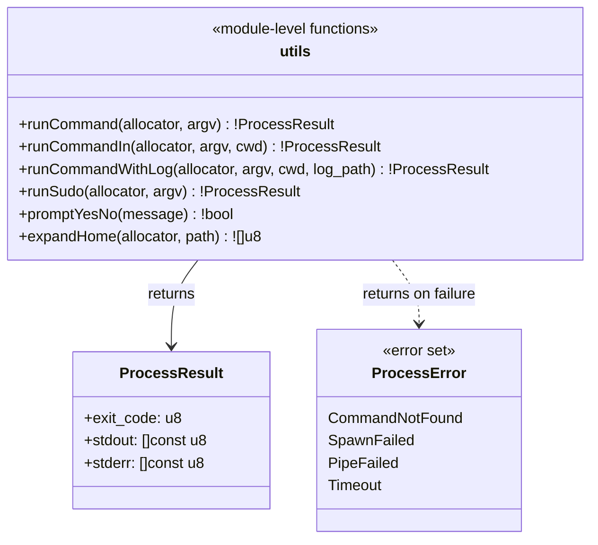

## Class-Level Design: `utils.zig`

The utils module provides three distinct infrastructure capabilities: **process execution with output capture**, **build log tee**, and **user prompting**. Ousterhout warns that utility modules easily become shallow "grab bags." To prevent this, each function in utils has a clear contract: it does one non-trivial thing that multiple modules need, and it hides genuine complexity (pipe management, concurrent I/O, terminal detection) rather than wrapping a single standard library call.

### Class Diagram



### Design: Why These Functions Belong Together

Each function in utils is consumed by 2+ modules:

| Function | Consumed By |
|----------|-------------|
| `runCommand` | `git.zig` (clone, pull, ls-files), `repo.zig` (repo-add) |
| `runCommandIn` | `commands.zig` (makepkg in build dir) |
| `runCommandWithLog` | `commands.zig` (makepkg with tee to log file) |
| `runSudo` | `commands.zig` (pacman -S for install) |
| `promptYesNo` | `commands.zig` (build confirmation, clean confirmation) |
| `expandHome` | `repo.zig` (cache paths), `git.zig` (clone dirs) |

If a function would only be used by one module, it belongs in that module, not here. This rule prevents utils from growing into a dumping ground.

### Method Internals

#### `runCommand` — The Core Process Executor

Every external tool invocation in aurodle (git, repo-add, makepkg, pacman) goes through this function. It spawns a child process, captures stdout and stderr into separate buffers, and returns the exit code.

```zig
pub const ProcessResult = struct {
    exit_code: u8,
    stdout: []const u8,
    stderr: []const u8,

    pub fn deinit(self: ProcessResult, allocator: Allocator) void {
        allocator.free(self.stdout);
        allocator.free(self.stderr);
    }

    pub fn success(self: ProcessResult) bool {
        return self.exit_code == 0;
    }
};

/// Spawn a child process, capture stdout and stderr, wait for completion.
///
/// Both stdout and stderr are fully captured into memory. This is appropriate
/// for short-lived commands (git, repo-add) where output is small.
/// For long-running commands with large output (makepkg), use runCommandWithLog.
pub fn runCommand(
    allocator: Allocator,
    argv: []const []const u8,
) !ProcessResult {
    return runCommandIn(allocator, argv, null);
}

/// Like runCommand but with an explicit working directory.
pub fn runCommandIn(
    allocator: Allocator,
    argv: []const []const u8,
    cwd: ?[]const u8,
) !ProcessResult {
    if (argv.len == 0) return error.SpawnFailed;

    var child = std.process.Child.init(argv, allocator);
    child.stdout_behavior = .Pipe;
    child.stderr_behavior = .Pipe;

    if (cwd) |dir| {
        child.cwd = dir;
    }

    try child.spawn();

    // Read stdout and stderr concurrently.
    // We must read both pipes before calling wait(), otherwise
    // the child may block on a full pipe buffer (typically 64KB).
    const stdout = try child.stdout.?.reader().readAllAlloc(allocator, MAX_OUTPUT);
    const stderr = try child.stderr.?.reader().readAllAlloc(allocator, MAX_OUTPUT);

    const term = try child.wait();

    return .{
        .exit_code = switch (term) {
            .Exited => |code| code,
            .Signal => |sig| blk: {
                // Map signal termination to a nonzero exit code.
                // Convention: 128 + signal number.
                break :blk @truncate(128 + @as(u16, @intFromEnum(sig)));
            },
            else => 1,
        },
        .stdout = stdout,
        .stderr = stderr,
    };
}

/// Max output size we'll capture from a child process.
/// 10MB is generous for git/repo-add output. makepkg uses the tee variant.
const MAX_OUTPUT = 10 * 1024 * 1024;
```

**Why read both pipes before wait():** Unix pipes have a kernel buffer (typically 64KB on Linux). If the child writes more than 64KB to stdout while we're blocking on `stderr.readAll()`, the stdout pipe fills up and the child blocks — deadlock. Reading both pipes before `wait()` prevents this. Zig's `std.process.Child` handles this correctly when you read both pipe readers, but the ordering matters with the simpler API shown above. In practice, for short-output commands (git, repo-add), the 64KB buffer is never hit. The tee variant handles makepkg's larger output differently.

**Signal mapping (128 + signal):** When a child process is killed by a signal (e.g., SIGTERM=15), there's no exit code. The `128 + signal` convention (used by bash and most shells) maps SIGTERM to exit code 143, SIGKILL to 137, etc. This lets callers distinguish "command failed" (exit code 1-127) from "command was killed" (128+).

#### `runCommandWithLog` — Tee to Log File and Terminal

This is the most complex function in utils. It must simultaneously:
1. Spawn the child process (makepkg)
2. Read stdout in real time
3. Display stdout to the terminal (so the user sees build progress)
4. Write stdout to a log file (for post-mortem debugging)
5. Capture stderr separately

```zig
/// Spawn a process, tee its stdout to both the terminal and a log file,
/// capture stderr, and return the result.
///
/// Used for makepkg builds where the user needs real-time feedback
/// AND we need a log file for debugging failed builds.
pub fn runCommandWithLog(
    allocator: Allocator,
    argv: []const []const u8,
    cwd: ?[]const u8,
    log_path: []const u8,
) !ProcessResult {
    if (argv.len == 0) return error.SpawnFailed;

    // Ensure log directory exists
    const log_dir = std.fs.path.dirname(log_path) orelse ".";
    std.fs.makeDirAbsolute(log_dir) catch |err| switch (err) {
        error.PathAlreadyExists => {},
        else => return err,
    };

    // Open log file (truncate if exists — each build starts fresh)
    const log_file = try std.fs.createFileAbsolute(log_path, .{ .truncate = true });
    defer log_file.close();

    var child = std.process.Child.init(argv, allocator);
    child.stdout_behavior = .Pipe;
    child.stderr_behavior = .Pipe;
    if (cwd) |dir| child.cwd = dir;

    try child.spawn();

    // Tee stdout: read chunks, write to both terminal and log file
    const stdout_pipe = child.stdout.?.reader();
    var stdout_buf = std.ArrayList(u8).init(allocator);
    defer stdout_buf.deinit();

    var read_buf: [4096]u8 = undefined;
    while (true) {
        const n = stdout_pipe.read(&read_buf) catch |err| switch (err) {
            error.EndOfStream => break,
            else => return err,
        };
        if (n == 0) break;

        const chunk = read_buf[0..n];

        // Write to terminal (real-time display)
        const stdout_writer = std.io.getStdOut().writer();
        stdout_writer.writeAll(chunk) catch {};

        // Write to log file
        log_file.writeAll(chunk) catch {};

        // Accumulate in buffer (for ProcessResult.stdout)
        try stdout_buf.appendSlice(chunk);

        // Guard against unbounded memory growth
        if (stdout_buf.items.len > MAX_OUTPUT) {
            // Stop accumulating but keep tee-ing
            stdout_buf.clearRetainingCapacity();
        }
    }

    // Capture stderr (typically small for makepkg)
    const stderr = try child.stderr.?.reader().readAllAlloc(allocator, MAX_OUTPUT);

    const term = try child.wait();

    return .{
        .exit_code = switch (term) {
            .Exited => |code| code,
            .Signal => |sig| @truncate(128 + @as(u16, @intFromEnum(sig))),
            else => 1,
        },
        .stdout = try stdout_buf.toOwnedSlice(),
        .stderr = stderr,
    };
}
```

**Why 4KB read chunks:** Smaller chunks (e.g., line-by-line) increase syscall overhead for build processes that emit lots of output. Larger chunks (e.g., 64KB) delay terminal display — the user wouldn't see output until 64KB accumulates. 4KB is the sweet spot: low overhead, near-instant display, and matches the typical terminal buffer size.

**Why truncate the log file:** Each build starts a fresh log. If the user rebuilds a package, the old log is replaced. Appending would create confusion ("which build failure is this from?"). The log path includes the pkgbase name (`~/.cache/aurodle/logs/yay.log`), so different packages don't overwrite each other.

**Memory guard:** makepkg for large packages (e.g., chromium) can produce megabytes of build output. The `MAX_OUTPUT` guard prevents the in-memory `stdout_buf` from growing unboundedly. If exceeded, the buffer is cleared but tee-ing to terminal and log file continues. The log file is the authoritative record; the in-memory buffer is a convenience for the `ProcessResult`.

#### `runSudo` — Privilege Escalation

Wraps a command with `sudo` (or `run0` in Phase 2). Used for `pacman -S` installation.

```zig
/// Run a command with privilege escalation.
/// Uses sudo by default. Phase 2 adds run0 detection.
///
/// Never used for makepkg — makepkg must NOT run as root.
pub fn runSudo(
    allocator: Allocator,
    argv: []const []const u8,
) !ProcessResult {
    // Prepend sudo to the command
    var sudo_argv = try std.ArrayList([]const u8).initCapacity(
        allocator,
        argv.len + 1,
    );
    defer sudo_argv.deinit();

    try sudo_argv.append("sudo");
    try sudo_argv.appendSlice(argv);

    return runCommand(allocator, sudo_argv.items);
}
```

**Why not detect if already root:** The caller (`commands.zig`) is responsible for checking if elevation is needed. `runSudo` is a mechanical wrapper — it prepends `sudo` and delegates. Checking `geteuid() == 0` would be a policy decision that belongs in the command layer. Also, FR-9 requires failing fast if makepkg is about to run as root — that check is in `commands.zig`, not here.

#### `promptYesNo` — User Confirmation

Handles the upfront prompting requirement (NFR-4).

```zig
/// Prompt the user for yes/no confirmation.
/// Returns true for 'y' or 'Y', false for anything else.
/// If stdin is not a terminal (piped input), returns false
/// (fail-safe: don't auto-confirm in non-interactive mode).
pub fn promptYesNo(message: []const u8) !bool {
    const stdout = std.io.getStdOut().writer();
    const stdin = std.io.getStdIn();

    // Check if stdin is a terminal
    if (!std.posix.isatty(stdin.handle)) {
        return false;
    }

    try stdout.print("{s} [y/N]: ", .{message});

    var buf: [16]u8 = undefined;
    const n = stdin.read(&buf) catch return false;
    if (n == 0) return false;

    const response = std.mem.trim(u8, buf[0..n], " \t\n\r");
    return response.len == 1 and (response[0] == 'y' or response[0] == 'Y');
}
```

**Why default to 'N':** The `[y/N]` convention means pressing Enter (empty input) is "no." This is the safe default for a build tool — accidental Enter shouldn't start building untrusted code. The `--noconfirm` flag in commands.zig bypasses this function entirely.

**Why check `isatty`:** If aurodle is piped (`echo "y" | aurodle sync foo`), the prompt would be invisible and the 'y' might be consumed by a different read. Returning false for non-terminal stdin forces explicit `--noconfirm` for scripted usage, which is the intentional design from the requirements.

#### `expandHome` — Path Expansion

```zig
/// Expand ~ at the start of a path to $HOME.
/// Does NOT handle ~user syntax — only ~/path.
/// Returns a newly allocated string.
pub fn expandHome(allocator: Allocator, path: []const u8) ![]u8 {
    if (path.len == 0) return try allocator.dupe(u8, path);

    if (path[0] == '~') {
        const home = std.posix.getenv("HOME") orelse return error.NoHomeDirectory;
        if (path.len == 1) {
            return try allocator.dupe(u8, home);
        }
        if (path[1] == '/') {
            return try std.fmt.allocPrint(allocator, "{s}{s}", .{ home, path[1..] });
        }
    }

    return try allocator.dupe(u8, path);
}
```

This is the shallowest function in utils — intentionally so. It exists because three modules need `$HOME` expansion and duplicating the logic would be worse than centralizing it.

### What utils Does NOT Contain

Keeping utils focused is as important as what goes in:

| Rejected Function | Where It Lives Instead | Reason |
|-------------------|----------------------|--------|
| HTTP GET/POST | `aur.zig` | Only one consumer; HTTP client lifecycle is tied to the AUR client |
| pacman.conf parsing | `pacman.zig` | Domain-specific to libalpm initialization |
| makepkg.conf parsing | `repo.zig` | Domain-specific to package location resolution |
| JSON parsing | `aur.zig` | AUR-specific schema mapping |
| Version comparison | `alpm.zig` | Wraps libalpm's `alpm_pkg_vercmp` |
| Dependency string parsing | `registry.zig` | Domain-specific to resolution logic |

**Rule: if a function has exactly one consumer, it belongs in that consumer's module.** Utils is for genuinely shared infrastructure.

### Signal Handling Integration

`runCommandWithLog` interacts with SIGINT (Ctrl+C) handling per NFR-2. When the user presses Ctrl+C during a build:

1. SIGINT is delivered to the **entire process group** (aurodle + makepkg child)
2. makepkg receives SIGINT and terminates (possibly mid-compilation)
3. `child.wait()` returns with a signal termination (mapped to exit code 128 + SIGINT = 130)
4. The log file contains output up to the interruption point
5. `commands.zig` sees exit code 130, recognizes it as signal-killed, does NOT run `repo-add`
6. Already-completed builds and their repo-adds remain intact

No special signal handler registration is needed in utils — the default behavior of forwarding SIGINT to the process group is correct. The key design decision is in `commands.zig`: checking for signal exit codes (≥128) and treating them as "abort remaining builds" rather than "try the next package."

```zig
// In commands.zig (not utils.zig — included here for context):
const result = try utils.runCommandWithLog(allocator, &makepkg_argv, build_dir, log_path);

if (result.exit_code >= 128) {
    // Killed by signal (likely Ctrl+C) — stop the entire build chain.
    // Don't add partial output to repo. Don't continue to next package.
    return error.BuildInterrupted;
}

if (result.exit_code != 0) {
    // Normal build failure — log it, continue to next package (NFR-2).
    std.log.err("Build failed for {s} (exit {d}). Log: {s}", .{
        pkgbase, result.exit_code, log_path,
    });
    try failed_packages.append(pkgbase);
    continue;
}
```

### Testing Strategy

```zig
test "runCommand captures stdout and stderr" {
    // Use 'echo' and 'sh -c' for portable test commands
    const result = try utils.runCommand(testing.allocator, &.{
        "sh", "-c", "echo hello && echo error >&2",
    });
    defer result.deinit(testing.allocator);

    try testing.expectEqual(@as(u8, 0), result.exit_code);
    try testing.expectEqualStrings("hello\n", result.stdout);
    try testing.expectEqualStrings("error\n", result.stderr);
}

test "runCommand returns nonzero exit code on failure" {
    const result = try utils.runCommand(testing.allocator, &.{
        "sh", "-c", "exit 42",
    });
    defer result.deinit(testing.allocator);

    try testing.expectEqual(@as(u8, 42), result.exit_code);
}

test "runCommandIn uses specified working directory" {
    const result = try utils.runCommandIn(testing.allocator, &.{
        "pwd",
    }, "/tmp");
    defer result.deinit(testing.allocator);

    try testing.expectEqualStrings("/tmp\n", result.stdout);
}

test "runCommandWithLog tees output to file" {
    const tmp = testing.tmpDir(.{});
    defer tmp.cleanup();
    const log_path = try std.fs.path.join(testing.allocator, &.{ tmp.path, "test.log" });
    defer testing.allocator.free(log_path);

    const result = try utils.runCommandWithLog(
        testing.allocator,
        &.{ "sh", "-c", "echo line1 && echo line2" },
        null,
        log_path,
    );
    defer result.deinit(testing.allocator);

    // stdout captured
    try testing.expectEqualStrings("line1\nline2\n", result.stdout);

    // Log file also has the output
    const log_content = try std.fs.cwd().readFileAlloc(testing.allocator, log_path, 4096);
    defer testing.allocator.free(log_content);
    try testing.expectEqualStrings("line1\nline2\n", log_content);
}

test "runCommand maps signal termination to 128+signal" {
    const result = try utils.runCommand(testing.allocator, &.{
        "sh", "-c", "kill -TERM $$",
    });
    defer result.deinit(testing.allocator);

    // SIGTERM = 15, so exit code = 128 + 15 = 143
    try testing.expectEqual(@as(u8, 143), result.exit_code);
}

test "promptYesNo returns false for non-terminal stdin" {
    // When running in tests, stdin is not a terminal
    const result = try utils.promptYesNo("Continue?");
    try testing.expect(!result);
}

test "expandHome replaces tilde with HOME" {
    // Temporarily set HOME for test
    const result = try utils.expandHome(testing.allocator, "~/foo/bar");
    defer testing.allocator.free(result);

    const home = std.posix.getenv("HOME").?;
    const expected = try std.fmt.allocPrint(testing.allocator, "{s}/foo/bar", .{home});
    defer testing.allocator.free(expected);

    try testing.expectEqualStrings(expected, result);
}

test "expandHome returns non-tilde paths unchanged" {
    const result = try utils.expandHome(testing.allocator, "/absolute/path");
    defer testing.allocator.free(result);

    try testing.expectEqualStrings("/absolute/path", result);
}
```

### Complexity Budget

| Internal concern | Lines (est.) | Justification |
|-----------------|-------------|---------------|
| `ProcessResult` struct | ~15 | Result type with deinit + success helper |
| `runCommand()` + `runCommandIn()` | ~45 | Process spawn, pipe capture, signal mapping |
| `runCommandWithLog()` | ~55 | Tee loop with 4KB chunks, log file, memory guard |
| `runSudo()` | ~15 | Argv prepend wrapper |
| `promptYesNo()` | ~18 | Terminal detection, input read, parse |
| `expandHome()` | ~12 | Tilde expansion |
| Constants + errors | ~10 | MAX_OUTPUT, ProcessError |
| Tests | ~80 | Real process invocation tests |
| **Total** | **~250** | Medium-depth: 6 functions, ~250 internal lines |

The depth score is **Medium**, which is correct for an infrastructure module. The tee function (`runCommandWithLog`) is the deepest piece — it hides the concurrent I/O complexity of reading a pipe, writing to a terminal, and writing to a file simultaneously. The rest are thin but justified by their multi-consumer usage.

### Split Trigger

When `utils.zig` exceeds ~300 lines (likely when adding `run0` support, lock file management, or colored output), split into:

```
utils/
├── process.zig    # runCommand, runCommandWithLog, runSudo
├── prompt.zig     # promptYesNo (+ future colored output)
└── fs.zig         # expandHome (+ future lock files, XDG paths)
```

