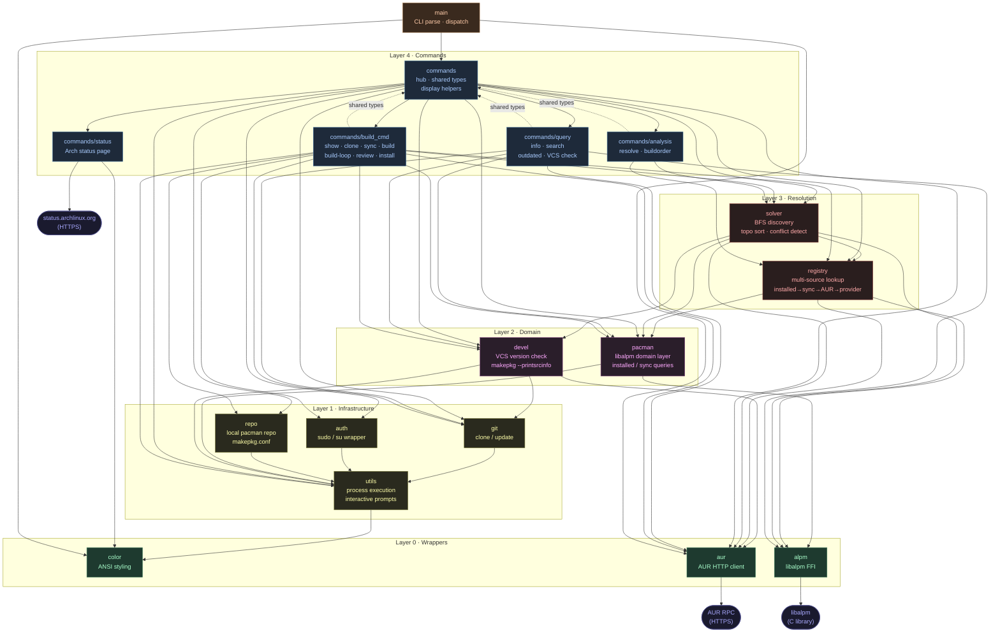

# Aurodle — Module Dependency Graph

> Generated from actual `@import` statements. `color.zig` is omitted as an edge target
> (every module uses it for terminal styling; drawing those edges would obscure the real
> structure). `root.zig` is omitted (test-discovery only).

## Cycle

`commands.zig` and its three submodules (`query`, `build_cmd`, `analysis`) form a **bidirectional dependency**:

- `commands.zig` imports the submodules to re-export them (enabling `root.zig` to discover their tests via `refAllDecls`).
- The submodules import `commands.zig` to access shared types (`Commands`, `ExitCode`, `Flags`, `BuildResult`, etc.) and display helpers (`displayPlan`, `handleResolveError`).

Zig resolves this within a single compilation unit, so it compiles, but it makes the two sides impossible to reason about in isolation.

## Bypass of the Registry Abstraction

`solver.zig` imports `alpm` and `pacman` directly, bypassing the `registry` layer it also depends on. This couples the solver to the concrete database backend — the comptime-generic `SolverImpl` only abstracts the `Registry`, not the underlying alpm calls for conflict checking.
