# Aurodle — Module Dependency Graph

> Reflects the codebase after Phase 8 improvements (centralized test imports + acyclicity fix).
> Supersedes `module-graph_status9.md`.
> Sentrux scan: 2026-05-12, quality signal 6747/10000.
>
> `color.zig` is omitted as an edge target (every module uses it; drawing those
> edges would obscure the real structure). `root.zig` is omitted (test-discovery
> only). Test-only files (`solver/mocks.zig`, `registry/mocks.zig`, `solver/tests.zig`,
> `registry/tests.zig`, `repo/tests.zig`, `git/tests.zig`, `pacman/tests.zig`,
> `aur/tests.zig`) are shown with dashed borders and not drawn as edge targets.

```mermaid
flowchart TD
    %% ── External systems ──────────────────────────────────────────────────
    C_libalpm(["libalpm\n(C library)"])
    AUR_API(["AUR RPC\n(HTTPS)"])
    AUR_status(["status.archlinux.org\n(HTTPS)"])

    %% ── Layer 0 — Thin wrappers / primitives ─────────────────────────────
    subgraph L0["Layer 0 · Wrappers"]
        color["color\nANSI styling"]
        alpm["alpm\nlibalpm FFI"]
        aur["aur\nAUR HTTP client"]
        provider["provider\nProviderCandidate\nProviderChooserFn\nProviderSelection"]
        source["source\nSource enum"]
    end

    %% ── Layer 1 — Infrastructure ──────────────────────────────────────────
    subgraph L1["Layer 1 · Infrastructure"]
        utils["utils\nprocess execution\ninteractive prompts"]
        plan["plan\nBuildPlan · BuildEntry\nDependencyEntry · Conflict"]
        git["git\nclone / update\nresolveCacheRoot"]
        auth["auth\nsudo / su wrapper"]
        repo["repo\nlocal pacman repo\nrefreshAurpkgsSyncDb"]
        makepkg["makepkg\nmakepkg.conf parsing"]
        repo_conf["repo_conf\nrepo name derivation"]
        version["version\nVersionConstraint\ncheckVersion"]
        pacman_conf["pacman_conf\nPacmanConf\nregisterSyncDbs"]
    end

    %% ── Layer 2 — Domain ─────────────────────────────────────────────────
    subgraph L2["Layer 2 · Domain"]
        pacman["pacman\nlibalpm domain layer\ninstalled / sync queries"]
        devel["devel\nVCS version check\nmakepkg --printsrcinfo"]
        dep_spec["dep_spec\nDepSpec\nparseDep"]
    end

    %% ── Layer 3 — Resolution ─────────────────────────────────────────────
    subgraph L3["Layer 3 · Resolution"]
        registry["registry\nmulti-source lookup\ninstalled→sync→AUR→provider\n+ vercmp · isVcsPackage"]

        subgraph solver_grp["solver (façade + sub-modules)"]
            solver["solver.zig\norchestrator\ntypes · BFS · plan assembly\nre-exports plan types"]
            s_graph["solver/graph\nDepGraph · alias resolution"]
            s_topo["solver/topo\nKahn topo sort"]
            s_conflicts["solver/conflicts\nconflict detection\nConflict (from plan.zig)"]
        end

        subgraph solver_tests["solver/tests.zig (unit tests)"]
            s_tests["solver/tests\nSolverImpl(MockRegistry)"]
        end

        subgraph registry_tests["registry/tests.zig (unit tests)"]
            r_tests["registry/tests\nRegistryImpl(MockPacman,\nMockAurClient)"]
        end
    end

    %% ── Layer 4 — Commands ───────────────────────────────────────────────
    subgraph L4["Layer 4 · Commands"]
        types["commands/types\nshared types · Flags\nExitCode · I/O helpers"]
        q_ctx["commands/query_context\nQueryContext"]
        b_ctx["commands/build_context\nBuildContext"]
        display["commands/display\ndisplayPlan\ndisplayInstallList"]
        outdated["commands/outdated\ncollectOutdated\ncheckDevelPackages"]
        commands["commands.zig\npure router\nre-exports sub-modules only"]

        query["commands/query\ninfo · search\noutdated · VCS check"]
        analysis["commands/analysis\nresolve · buildorder"]
        status["commands/status\nArch status page"]

        build_cmd["build_cmd.zig\norchestrator\nclone · sync · upgrade"]
        b_execute["build_execute\nmakepkg · makechrootpkg\nfailure propagation"]
        b_install["build_install\npacman invocations\nprovider selection · cache purge"]
        b_review["build_review\nPKGBUILD review\ndiff · conflict prompts"]
    end

    %% ── Layer 5 — Entry point ────────────────────────────────────────────
    main["main\nCLI parse · dispatch"]

    %% ── Test files (dashed, wired through root.zig) ──────────────────────
    subgraph repo_tests["repo/tests.zig (integration tests)"]
        rt["repo/tests\nRepository filesystem tests"]
    end

    subgraph git_tests["git/tests.zig (integration tests)"]
        gt["git/tests\nGit operation tests"]
    end

    subgraph pacman_tests["pacman/tests.zig (integration tests)"]
        pt["pacman/tests\nPacman integration tests"]
    end

    subgraph aur_tests["aur/tests.zig (JSON parsing tests)"]
        at["aur/tests\nAUR RPC JSON tests"]
    end

    %% ── External links ───────────────────────────────────────────────────
    alpm --> C_libalpm
    aur  --> AUR_API
    status --> AUR_status

    %% ── Layer 0 edges ────────────────────────────────────────────────────
    plan --> source & provider

    %% ── Layer 1 edges ────────────────────────────────────────────────────
    git   --> utils
    auth  --> utils
    repo  --> utils & makepkg & repo_conf
    utils --> provider
    makepkg --> utils
    repo_conf --> utils
    version --> source
    pacman_conf --> alpm & utils

    %% ── Layer 2 edges ────────────────────────────────────────────────────
    pacman --> alpm & repo & pacman_conf & version
    devel  --> aur & git & utils
    dep_spec --> source & provider

    %% ── Layer 3 edges ────────────────────────────────────────────────────
    registry    --> aur & alpm & devel & pacman & provider & source & dep_spec
    solver      --> registry & plan & s_graph & s_topo & s_conflicts
    s_graph     --> source & aur
    s_topo      --> s_graph
    s_conflicts --> s_graph & registry & plan
    s_tests     --> solver & solver/mocks
    r_tests     --> registry & registry/mocks

    %% ── Layer 4 — commands hub (re-exports only, no back-link) ───────────
    commands --> query & build_cmd & analysis & status

    %% ── types: shared types + I/O helpers ───────────────────────────────
    types --> aur & registry & repo & pacman & utils & auth

    %% ── query context ────────────────────────────────────────────────────
    q_ctx --> types & aur

    %% ── build context ────────────────────────────────────────────────────
    b_ctx --> types & aur & pacman & registry & repo & auth

    %% ── display: plan rendering ─────────────────────────────────────────
    display --> types & plan & devel & pacman

    %% ── outdated: AUR diff + VCS probe ──────────────────────────────────
    outdated --> types & registry & devel & pacman & git

    %% ── submodules ───────────────────────────────────────────────────────
    query     --> types & q_ctx & registry & aur & devel & pacman & outdated
    analysis  --> types & registry & solver & display
    build_cmd --> types & b_ctx & display & outdated & aur & git & devel & solver & repo & pacman & utils
    b_execute --> types & git & devel & plan & repo & utils & auth
    b_install --> types & registry & repo & pacman & utils
    b_review  --> types & git & plan & utils

    %% ── entry point ──────────────────────────────────────────────────────
    main --> commands & aur & pacman & registry & repo & auth & utils & git

    %% ── test file edges (dashed, not targets) ───────────────────────────
    rt --> repo
    gt --> git
    pt --> pacman
    at --> aur

    %% ── styling ──────────────────────────────────────────────────────────
    classDef external  fill:#1a1a2e,stroke:#4a4a8a,color:#aaaaff
    classDef prim      fill:#1e3a2f,stroke:#3a7a5a,color:#aaffcc
    classDef infra     fill:#2a2a1e,stroke:#7a7a3a,color:#ffffaa
    classDef domain    fill:#2a1e2a,stroke:#7a3a7a,color:#ffaaff
    classDef resolv    fill:#2a1e1e,stroke:#8a3a3a,color:#ffaaaa
    classDef cmd       fill:#1e2a3a,stroke:#3a6a9a,color:#aaccff
    classDef entry     fill:#3a2a1e,stroke:#9a6a3a,color:#ffccaa
    classDef testonly  fill:#1a1a1a,stroke:#5a5a5a,color:#aaaaaa,stroke-dasharray: 5 5

    class C_libalpm,AUR_API,AUR_status external
    class color,alpm,aur,provider,source prim
    class utils,plan,git,auth,repo,makepkg,repo_conf,version,pacman_conf infra
    class pacman,devel,dep_spec domain
    class registry,solver,s_graph,s_topo,s_conflicts resolv
    class commands,types,q_ctx,b_ctx,display,outdated,query,build_cmd,b_execute,b_install,b_review,analysis,status cmd
    class main entry
    class s_tests,r_tests,rt,gt,pt,at testonly
```



## Depth chain (10 levels)

The longest file-to-file dependency path after Phase 8:

```
color       level  1   (Layer 0 — leaf)
provider    level  2   (Layer 0)
utils/plan  level  3   (Layer 1)
git         level  4   (Layer 1)
devel       level  5   (Layer 2)
registry    level  6   (Layer 3)
s_conflicts level  7   (Layer 3)
solver      level  8   (Layer 3)
analysis/   level  9   (Layer 4)  ← build_cmd and query also at depth 9
build_cmd/
query
commands    level 10   (Layer 4 hub)
main        level 10   (Layer 5)
```

Depth dropped from 13 to 10 because removing parent-module → test-file imports eliminated the cycle-induced depth inflation.

## What changed since status9

### Structural changes (Phase 6–8)

| Change | Before | After |
|---|---|---|
| `repo.zig` test wiring | No test block | `test { _ = @import("repo/tests.zig"); }` added, then removed |
| `git.zig` test wiring | No test block | `test { _ = @import("git/tests.zig"); }` added, then removed |
| `pacman.zig` test wiring | No test block | `test { _ = @import("pacman/tests.zig"); }` added, then removed |
| `aur.zig` | 601 lines with 15 inline tests | 388 lines; tests moved to `aur/tests.zig` (220 lines) |
| `solver.zig` | `test { _ = @import("solver/tests.zig"); }` | Test block removed |
| `registry.zig` | `test { _ = @import("registry/tests.zig"); }` | Test block removed |
| `root.zig` | 33 lines, refs 10 modules | 39 lines, refs 10 modules + 6 test files |
| `aur.zig` internals | `RpcResponse`, `RpcPackage`, etc. private | Made `pub` for test accessibility |

### Metric shifts

| Metric | status9 | status10 | Change |
|---|---|---|---|
| Quality signal | 4964 → 5227* | 6747 | +1520 (+29.1%) |
| Acyclicity raw | 2 | 0 | −2 inversions |
| Depth | 13 | 10 | −3 levels |
| Propagation cost | 27.98% → 26.31%* | 21.43% | −4.88pp |
| Same-level edges | 4 | 0 | −4 |
| Clusters | 2 | 0 | −2 |
| Files | 112 | 118 | +6 (test files added) |
| Import edges | 163 | 176 | +13 |

\* status9 was measured before the Phase 6 wiring fix and Phase 8 acyclicity refactor.

### DSM

| Metric | status9 | status10 |
|---|---|---|
| Above diagonal | 0 | 0 |
| Below diagonal | 159 | 176 |
| Same level | 4 | 0 |
| Clusters | 2 (2 files each at levels 6, 8) | 0 |

Zero cycles remain. Zero same-level edges for the first time. Perfect acyclicity score.

## Recommended next steps

### Immediate (Low Effort)
1. **Monitor modularity** — the new bottleneck. Propagation cost is at 21.43%; keep it below 22%.

### Medium Term
2. **Evaluate `pacman.zig` domain split** — at 643 lines it's the largest production file. Consider `pacman/query.zig` and `pacman/installed.zig`.
3. **Evaluate `main.zig` size** — at 749 lines it's the second largest. CLI parsing could move to `src/args.zig`, but this is a structural change, not just test extraction.

### Long Term / Monitor
4. **Keep acyclicity at 0** — any new test file should be imported from `root.zig`, never from its parent module.
5. **Depth optimization** — only if propagation cost rises above 22% again.
