# Aurodle — Module Dependency Graph

> Reflects the codebase as of 2026-04 after the Issue #1–#5 refactors.
> `color.zig` is omitted as an edge target (every module uses it; drawing those
> edges would obscure the real structure). `root.zig` is omitted (test-discovery
> only). Test-only files (`solver/mocks.zig`, `registry/mocks.zig`) are shown with
> dashed borders and not drawn as edge targets.

```mermaid
flowchart TD
    %% ── External systems ──────────────────────────────────────────────────
    C_libalpm(["libalpm\n(C library)"])
    AUR_API(["AUR RPC\n(HTTPS)"])
    AUR_status(["status.archlinux.org\n(HTTPS)"])

    %% ── Layer 0 — Thin wrappers / primitives ─────────────────────────────
    subgraph L0["Layer 0 · Wrappers"]
        color["color\nANSI styling"]
        alpm["alpm\nlibalpm FFI"]
        aur["aur\nAUR HTTP client"]
    end

    %% ── Layer 1 — Infrastructure ──────────────────────────────────────────
    subgraph L1["Layer 1 · Infrastructure"]
        utils["utils\nprocess execution\ninteractive prompts"]
        git["git\nclone / update"]
        auth["auth\nsudo / su wrapper"]
        repo["repo\nlocal pacman repo\nmakepkg.conf"]
    end

    %% ── Layer 2 — Domain ─────────────────────────────────────────────────
    subgraph L2["Layer 2 · Domain"]
        pacman["pacman\nlibalpm domain layer\ninstalled / sync queries"]
        devel["devel\nVCS version check\nmakepkg --printsrcinfo"]
    end

    %% ── Layer 3 — Resolution ─────────────────────────────────────────────
    subgraph L3["Layer 3 · Resolution"]
        registry["registry\nmulti-source lookup\ninstalled→sync→AUR→provider\n+ vercmp · isVcsPackage"]

        subgraph solver_grp["solver (façade + sub-modules)"]
            solver["solver.zig\norchestrator\ntypes · BFS · plan assembly"]
            s_graph["solver/graph\nDepGraph · alias resolution"]
            s_topo["solver/topo\nKahn topo sort"]
            s_conflicts["solver/conflicts\nconflict detection\nConflict type"]
        end
    end

    %% ── Layer 4 — Commands ───────────────────────────────────────────────
    subgraph L4["Layer 4 · Commands"]
        context["commands/context\nCommands struct\nshared types · display helpers"]
        commands["commands.zig\nthin hub\nre-exports only"]

        query["commands/query\ninfo · search\noutdated · VCS check"]
        analysis["commands/analysis\nresolve · buildorder"]
        status["commands/status\nArch status page"]

        subgraph build_grp["build_cmd (orchestrator + phases)"]
            build_cmd["build_cmd.zig\norchestrator\nclone · sync · upgrade"]
            b_build["build_cmd/build\nmakepkg · makechrootpkg\nfailure propagation"]
            b_install["build_cmd/install\npacman invocations\nauth · cache purge"]
            b_review["build_cmd/review\nPKGBUILD review\ndiff · conflict prompts"]
        end
    end

    %% ── Layer 5 — Entry point ────────────────────────────────────────────
    main["main\nCLI parse · dispatch"]

    %% ── External links ───────────────────────────────────────────────────
    alpm --> C_libalpm
    aur  --> AUR_API
    status --> AUR_status

    %% ── Layer 1 edges ────────────────────────────────────────────────────
    git   --> utils
    auth  --> utils
    repo  --> utils
    utils -. "⚠ upward: ProviderCandidate type" .-> registry

    %% ── Layer 2 edges ────────────────────────────────────────────────────
    pacman --> alpm & repo
    devel  --> aur & git & utils

    %% ── Layer 3 edges ────────────────────────────────────────────────────
    registry --> aur & alpm & devel & pacman
    solver   --> registry
    s_graph  --> registry & aur
    s_topo   --> s_graph
    s_conflicts --> s_graph & registry

    %% ── Layer 4 — commands hub (re-exports only, no back-link) ───────────
    commands --> context
    commands --> query & build_cmd & analysis & status

    %% ── context: everything the commands layer needs ─────────────────────
    context --> aur & registry & solver & repo & pacman & devel & git & utils & auth

    %% ── submodules import context (not commands — cycle is gone) ─────────
    query     --> context & aur & alpm & git & devel & pacman
    analysis  --> context & registry & solver
    build_cmd --> context & query & aur & git & devel & solver & repo & pacman & utils
    b_build   --> context & git & devel & solver & repo & utils & auth
    b_install --> context & registry & repo & pacman & auth & utils
    b_review  --> context & git & solver & utils

    %% ── entry point ──────────────────────────────────────────────────────
    main --> commands & aur & pacman & registry & repo & auth & utils & git

    %% ── styling ──────────────────────────────────────────────────────────
    classDef external  fill:#1a1a2e,stroke:#4a4a8a,color:#aaaaff
    classDef prim      fill:#1e3a2f,stroke:#3a7a5a,color:#aaffcc
    classDef infra     fill:#2a2a1e,stroke:#7a7a3a,color:#ffffaa
    classDef domain    fill:#2a1e2a,stroke:#7a3a7a,color:#ffaaff
    classDef resolv    fill:#2a1e1e,stroke:#8a3a3a,color:#ffaaaa
    classDef cmd       fill:#1e2a3a,stroke:#3a6a9a,color:#aaccff
    classDef entry     fill:#3a2a1e,stroke:#9a6a3a,color:#ffccaa

    class C_libalpm,AUR_API,AUR_status external
    class color,alpm,aur prim
    class utils,git,auth,repo infra
    class pacman,devel domain
    class registry,solver,s_graph,s_topo,s_conflicts resolv
    class commands,context,query,build_cmd,b_build,b_install,b_review,analysis,status cmd
    class main entry
```

## What changed since status1

**Cycles — eliminated**

- `commands.zig` is now a 29-line re-exporter that imports `context.zig`.
- Sub-commands (`query`, `build_cmd`, `analysis`) import `context.zig` for shared
  types — not `commands.zig`. There are no back-links.

**Solver bypass — eliminated**

- `solver.zig` previously imported `alpm` and `devel` directly. Both are now
  accessed as namespace functions on `RegistryT` (`vercmp`, `isVcsPackage`),
  keeping the solver's only external dependency `registry`.

## Remaining issue

**`utils.zig` → `registry.zig` upward edge**

`promptProviderChoice` in `utils.zig` takes a `[]ProviderCandidate` parameter,
pulling `ProviderCandidate` from `registry.zig`. This creates a cross-layer
dependency (L1 → L3) and a compile cycle through
`utils → registry → pacman → repo → utils`.

**Root cause:** `ProviderCandidate` is defined in `registry.zig` but consumed by
a utility function that belongs in layer 1.

**Refactor direction:** move `ProviderCandidate` (and `ProviderChooserFn`) to a
small `providers.zig` module below layer 1, or inline the type into `utils.zig`
directly.

**`commands/query.zig` → `alpm` direct edge**

`query.zig` calls `alpm.Handle.init()` and `alpm.vercmp()` directly, bypassing
the `pacman`/`registry` abstraction. The same `vercmp` pattern that was fixed in
`solver` applies here.
