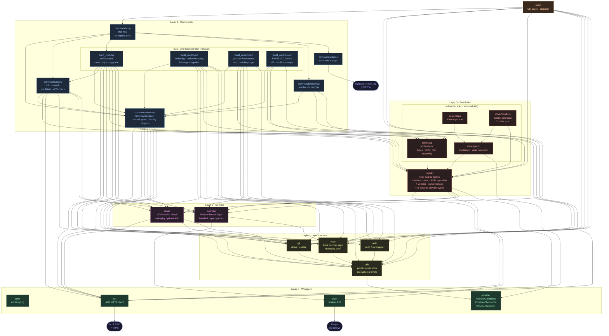

# Aurodle — Module Dependency Graph

> Reflects the codebase as of 2026-04 after the Issue A–B refactors.
> `color.zig` is omitted as an edge target (every module uses it; drawing those
> edges would obscure the real structure). `root.zig` is omitted (test-discovery
> only). Test-only files (`solver/mocks.zig`, `registry/mocks.zig`) are shown with
> dashed borders and not drawn as edge targets.

## What changed since status2

**Cycle — eliminated**

- `utils.zig` no longer imports `registry.zig`. `ProviderCandidate`,
  `ProviderChooserFn`, and `ProviderSelection` were moved to `provider.zig`
  (Layer 0). Both `utils` and `registry` now depend on `provider`; the
  `utils → registry → pacman → repo → utils` compile cycle is gone.
- The dashed warning edge `utils -. "⚠ upward: ProviderCandidate type" .-> registry`
  is replaced by two clean downward edges: `utils --> provider` and
  `registry --> provider`.

**`query → alpm` bypass — eliminated**

- `query.zig` no longer imports `alpm.zig`. The `query → alpm` edge is gone.
- `query → registry` is new: `vercmp` is now called as
  `PackageRegistry.vercmp()` (same pattern as `solver`).
- `query → pacman` was already present (for `InstalledPackage`); it now also
  provides installed-version lookups via `self.pacman.installedVersion()`,
  replacing the ad-hoc second `alpm.Handle` that `info` and `search` were
  constructing independently.

## Remaining issues

None. The graph has no upward edges and no abstraction-bypass imports.
Every module accesses only its own layer and the layers directly below it
through the designated gateway (`registry` for version comparison and VCS
detection; `pacman` for installed-package queries).
