# Aurodle — Module Dependency Graph

> Reflects the codebase as of 2026-05 after the Issues G and G′ refactors.
> Supersedes `module-graph_status5.md`.
> Sentrux scan: 2026-05-03, quality signal 6581/10000.
>
> `color.zig` is omitted as an edge target (every module uses it; drawing those
> edges would obscure the real structure). `root.zig` is omitted (test-discovery
> only). Test-only files (`solver/mocks.zig`, `registry/mocks.zig`) are shown with
> dashed borders and not drawn as edge targets.

```mermaid
flowchart TD
    %% ── External systems ──────────────────────────────────────────────────
    C_libalpm(["libalpm\n(C library)"])
    AUR_API(["AUR RPC\n(HTTPS)"])
    AUR_status(["status.archlinux.org\n(HTTPS)"])

    %% ── Layer 0 — Thin wrappers / primitives ─────────────────────────────
    subgraph L0["Layer 0 · Wrappers"]
        color["color\nANSI styling"]
        alpm["alpm\nlibalpm FFI"]
        aur["aur\nAUR HTTP client"]
        provider["provider\nProviderCandidate\nProviderChooserFn\nProviderSelection"]
        source["source\nSource enum"]
    end

    %% ── Layer 1 — Infrastructure ──────────────────────────────────────────
    subgraph L1["Layer 1 · Infrastructure"]
        utils["utils\nprocess execution\ninteractive prompts"]
        plan["plan\nBuildPlan · BuildEntry\nDependencyEntry · Conflict"]
        git["git\nclone / update\nresolveCacheRoot"]
        auth["auth\nsudo / su wrapper"]
        repo["repo\nlocal pacman repo\nmakepkg.conf\nrefreshAurpkgsSyncDb"]
    end

    %% ── Layer 2 — Domain ─────────────────────────────────────────────────
    subgraph L2["Layer 2 · Domain"]
        pacman["pacman\nlibalpm domain layer\ninstalled / sync queries"]
        devel["devel\nVCS version check\nmakepkg --printsrcinfo"]
    end

    %% ── Layer 3 — Resolution ─────────────────────────────────────────────
    subgraph L3["Layer 3 · Resolution"]
        registry["registry\nmulti-source lookup\ninstalled→sync→AUR→provider\n+ vercmp · isVcsPackage\n+ re-exports provider + Source"]

        subgraph solver_grp["solver (façade + sub-modules)"]
            solver["solver.zig\norchestrator\ntypes · BFS · plan assembly\nre-exports plan types"]
            s_graph["solver/graph\nDepGraph · alias resolution"]
            s_topo["solver/topo\nKahn topo sort"]
            s_conflicts["solver/conflicts\nconflict detection\nConflict (from plan.zig)"]
        end
    end

    %% ── Layer 4 — Commands ───────────────────────────────────────────────
    subgraph L4["Layer 4 · Commands"]
        context["commands/context\nCommands struct\nshared types · I/O helpers"]
        display["commands/display\ndisplayPlan\ndisplayInstallList"]
        outdated["commands/outdated\ncollectOutdated\ncheckDevelPackages"]
        commands["commands.zig\nthin hub\nre-exports only"]

        query["commands/query\ninfo · search\noutdated · VCS check"]
        analysis["commands/analysis\nresolve · buildorder"]
        status["commands/status\nArch status page"]

        subgraph build_grp["build_cmd (orchestrator + phases)"]
            build_cmd["build_cmd.zig\norchestrator\nclone · sync · upgrade"]
            b_build["build_cmd/build\nmakepkg · makechrootpkg\nfailure propagation"]
            b_install["build_cmd/install\npacman invocations\nprovider selection · cache purge"]
            b_review["build_cmd/review\nPKGBUILD review\ndiff · conflict prompts"]
        end
    end

    %% ── Layer 5 — Entry point ────────────────────────────────────────────
    main["main\nCLI parse · dispatch"]

    %% ── External links ───────────────────────────────────────────────────
    alpm --> C_libalpm
    aur  --> AUR_API
    status --> AUR_status

    %% ── Layer 0 edges ────────────────────────────────────────────────────
    plan --> source & provider

    %% ── Layer 1 edges ────────────────────────────────────────────────────
    git   --> utils
    auth  --> utils
    repo  --> utils
    utils --> provider

    %% ── Layer 2 edges ────────────────────────────────────────────────────
    pacman --> alpm & repo
    devel  --> aur & git & utils

    %% ── Layer 3 edges ────────────────────────────────────────────────────
    registry    --> aur & alpm & devel & pacman & provider & source
    solver      --> registry & plan
    s_graph     --> source & aur
    s_topo      --> s_graph
    s_conflicts --> s_graph & registry & plan

    %% ── Layer 4 — commands hub (re-exports only, no back-link) ───────────
    commands --> context & display
    commands --> query & build_cmd & analysis & status

    %% ── context: shared types + I/O helpers (no deep imports) ───────────
    context --> aur & registry & repo & pacman & utils & auth

    %% ── display: plan rendering (imports plan for BuildPlan types) ───────
    display --> context & plan & devel & pacman

    %% ── outdated: AUR diff + VCS probe ──────────────────────────────────
    outdated --> context & registry & devel & pacman & git

    %% ── submodules ───────────────────────────────────────────────────────
    query     --> context & registry & aur & devel & pacman & outdated
    analysis  --> context & registry & solver & display
    build_cmd --> context & display & outdated & aur & git & devel & solver & repo & pacman & utils
    b_build   --> context & git & devel & plan & repo & utils & auth
    b_install --> context & registry & repo & pacman & utils
    b_review  --> context & git & plan & utils

    %% ── entry point ──────────────────────────────────────────────────────
    main --> commands & aur & pacman & registry & repo & auth & utils & git

    %% ── styling ──────────────────────────────────────────────────────────
    classDef external  fill:#1a1a2e,stroke:#4a4a8a,color:#aaaaff
    classDef prim      fill:#1e3a2f,stroke:#3a7a5a,color:#aaffcc
    classDef infra     fill:#2a2a1e,stroke:#7a7a3a,color:#ffffaa
    classDef domain    fill:#2a1e2a,stroke:#7a3a7a,color:#ffaaff
    classDef resolv    fill:#2a1e1e,stroke:#8a3a3a,color:#ffaaaa
    classDef cmd       fill:#1e2a3a,stroke:#3a6a9a,color:#aaccff
    classDef entry     fill:#3a2a1e,stroke:#9a6a3a,color:#ffccaa

    class C_libalpm,AUR_API,AUR_status external
    class color,alpm,aur,provider,source prim
    class utils,plan,git,auth,repo infra
    class pacman,devel domain
    class registry,solver,s_graph,s_topo,s_conflicts resolv
    class commands,context,display,outdated,query,build_cmd,b_build,b_install,b_review,analysis,status cmd
    class main entry
```



## Depth chain (11 levels)

The longest file-to-file dependency path, down from 12 in status5:

```
color       level  1   (Layer 0 — leaf)
provider    level  2   (Layer 0)
utils/plan  level  3   (Layer 1)  ← plan.zig sits here; imports only source + provider
git         level  4   (Layer 1)
devel       level  5   (Layer 2)
registry    level  6   (Layer 3)
s_conflicts level  7   (Layer 3)
solver      level  8   (Layer 3)
analysis/   level  9   (Layer 4)  ← build_cmd and query also at depth 9
build_cmd/
query
commands    level 10   (Layer 4 hub)
main        level 11   (Layer 5)
```

One level was saved since status5:
- Issue G introduced `plan.zig` (depth 3); `display.zig` dropped from depth 9 → 8 (imports plan instead of solver); `analysis.zig` dropped from 10 → 9.
- Issue G′ moved `refreshAurpkgsSyncDb` to `repo.zig` (anytype auth), severing the hidden `build.zig → install.zig` import; `b_build` dropped from depth 9 → 8; `build_cmd` from 10 → 9; `commands` from 11 → 10; `main` from 12 → **11**.

## What changed since status5

| Change | Details |
|---|---|
| **New** `plan.zig` (Layer 1) | Holds `BuildPlan`, `BuildEntry`, `DependencyEntry`, `Conflict`; imports only `source.zig` + `provider.zig` (depth 3) |
| `solver` edges | Added `→ plan` (re-exports plan types); no longer defines them inline |
| `s_conflicts` edges | Added `→ plan` (imports `Conflict` from plan.zig instead of defining it locally) |
| `display` edges | Replaced `→ solver` with `→ plan`; no longer pulls in solver machinery |
| `b_build` edges | Replaced `→ solver` with `→ plan`; removed `→ b_install` (hidden import, now gone) |
| `b_review` edges | Replaced `→ solver` with `→ plan` |
| `b_install` edges | Removed `→ auth` (only needed for `refreshAurpkgsSyncDb`, which moved out) |
| `repo` surface | Added `refreshAurpkgsSyncDb` free function (anytype auth — no new import edge) |

## Remaining issues

| Issue | Edge | Type | Expected gain |
|---|---|---|---|
| H | 96/119 cross-module edges (81%) | Modularity plateau | No obvious low-cost structural win; reflects domain coupling in hub modules |
| — | `solver(8)` imported by analysis/build_cmd/query for `Solver` type | Depth floor at 11 | Splitting solver into types + logic layers would allow display to stay at 8 while analysis/build_cmd drop to 9; no net gain without further structural changes |
