# Aurodle — Module Dependency Graph

> Reflects the codebase after the modularization refactor documented in `STRUCTURE_ANALYSIS_status7.md`.
> Supersedes `module-graph_status7.md`.
> Sentrux scan: 2026-05-07, quality signal 4964/10000.
>
> `color.zig` is omitted as an edge target (every module uses it; drawing those
> edges would obscure the real structure). `root.zig` is omitted (test-discovery
> only). Test-only files (`solver/mocks.zig`, `registry/mocks.zig`, `solver/tests.zig`,
> `registry/tests.zig`) are shown with dashed borders and not drawn as edge targets.

```mermaid
flowchart TD
    %% ── External systems ──────────────────────────────────────────────────
    C_libalpm(["libalpm\n(C library)"])
    AUR_API(["AUR RPC\n(HTTPS)"])
    AUR_status(["status.archlinux.org\n(HTTPS)"])

    %% ── Layer 0 — Thin wrappers / primitives ─────────────────────────────
    subgraph L0["Layer 0 · Wrappers"]
        color["color\nANSI styling"]
        alpm["alpm\nlibalpm FFI"]
        aur["aur\nAUR HTTP client"]
        provider["provider\nProviderCandidate\nProviderChooserFn\nProviderSelection"]
        source["source\nSource enum"]
    end

    %% ── Layer 1 — Infrastructure ──────────────────────────────────────────
    subgraph L1["Layer 1 · Infrastructure"]
        utils["utils\nprocess execution\ninteractive prompts"]
        plan["plan\nBuildPlan · BuildEntry\nDependencyEntry · Conflict"]
        git["git\nclone / update\nresolveCacheRoot"]
        auth["auth\nsudo / su wrapper"]
        repo["repo\nlocal pacman repo\nrefreshAurpkgsSyncDb"]
        makepkg["makepkg\nmakepkg.conf parsing"]
        repo_conf["repo_conf\nrepo name derivation"]
        version["version\nVersionConstraint\ncheckVersion"]
        pacman_conf["pacman_conf\nPacmanConf\nregisterSyncDbs"]
    end

    %% ── Layer 2 — Domain ─────────────────────────────────────────────────
    subgraph L2["Layer 2 · Domain"]
        pacman["pacman\nlibalpm domain layer\ninstalled / sync queries"]
        devel["devel\nVCS version check\nmakepkg --printsrcinfo"]
        dep_spec["dep_spec\nDepSpec\nparseDep"]
    end

    %% ── Layer 3 — Resolution ─────────────────────────────────────────────
    subgraph L3["Layer 3 · Resolution"]
        registry["registry\nmulti-source lookup\ninstalled→sync→AUR→provider\n+ vercmp · isVcsPackage"]

        subgraph solver_grp["solver (façade + sub-modules)"]
            solver["solver.zig\norchestrator\ntypes · BFS · plan assembly\nre-exports plan types"]
            s_graph["solver/graph\nDepGraph · alias resolution"]
            s_topo["solver/topo\nKahn topo sort"]
            s_conflicts["solver/conflicts\nconflict detection\nConflict (from plan.zig)"]
        end

        subgraph solver_tests["solver/tests.zig (unit tests)"]
            s_tests["solver/tests\nSolverImpl(MockRegistry)"]
        end

        subgraph registry_tests["registry/tests.zig (unit tests)"]
            r_tests["registry/tests\nRegistryImpl(MockPacman,\nMockAurClient)"]
        end
    end

    %% ── Layer 4 — Commands ───────────────────────────────────────────────
    subgraph L4["Layer 4 · Commands"]
        types["commands/types\nshared types · Flags\nExitCode · I/O helpers"]
        q_ctx["commands/query_context\nQueryContext"]
        b_ctx["commands/build_context\nBuildContext"]
        display["commands/display\ndisplayPlan\ndisplayInstallList"]
        outdated["commands/outdated\ncollectOutdated\ncheckDevelPackages"]
        commands["commands.zig\nthin hub\nre-exports only"]

        query["commands/query\ninfo · search\noutdated · VCS check"]
        analysis["commands/analysis\nresolve · buildorder"]
        status["commands/status\nArch status page"]

        build_cmd["build_cmd.zig\norchestrator\nclone · sync · upgrade"]
        b_execute["build_execute\nmakepkg · makechrootpkg\nfailure propagation"]
        b_install["build_install\npacman invocations\nprovider selection · cache purge"]
        b_review["build_review\nPKGBUILD review\ndiff · conflict prompts"]
    end

    %% ── Layer 5 — Entry point ────────────────────────────────────────────
    main["main\nCLI parse · dispatch"]

    %% ── External links ───────────────────────────────────────────────────
    alpm --> C_libalpm
    aur  --> AUR_API
    status --> AUR_status

    %% ── Layer 0 edges ────────────────────────────────────────────────────
    plan --> source & provider

    %% ── Layer 1 edges ────────────────────────────────────────────────────
    git   --> utils
    auth  --> utils
    repo  --> utils & makepkg & repo_conf
    utils --> provider
    makepkg --> utils
    repo_conf --> utils
    version --> source
    pacman_conf --> alpm & utils

    %% ── Layer 2 edges ────────────────────────────────────────────────────
    pacman --> alpm & repo & pacman_conf & version
    devel  --> aur & git & utils
    dep_spec --> source & provider

    %% ── Layer 3 edges ────────────────────────────────────────────────────
    registry    --> aur & alpm & devel & pacman & provider & source & dep_spec
    solver      --> registry & plan & s_graph & s_topo & s_conflicts
    s_graph     --> source & aur
    s_topo      --> s_graph
    s_conflicts --> s_graph & registry & plan
    s_tests     --> solver & solver/mocks
    r_tests     --> registry & registry/mocks

    %% ── Layer 4 — commands hub (re-exports only, no back-link) ───────────
    commands --> types & display & query & build_cmd & analysis & status

    %% ── types: shared types + I/O helpers ───────────────────────────────
    types --> aur & registry & repo & pacman & utils & auth

    %% ── query context ────────────────────────────────────────────────────
    q_ctx --> types & aur

    %% ── build context ────────────────────────────────────────────────────
    b_ctx --> types & aur & pacman & registry & repo & auth

    %% ── display: plan rendering ─────────────────────────────────────────
    display --> types & plan & devel & pacman

    %% ── outdated: AUR diff + VCS probe ──────────────────────────────────
    outdated --> types & registry & devel & pacman & git

    %% ── submodules ───────────────────────────────────────────────────────
    query     --> types & q_ctx & registry & aur & devel & pacman & outdated
    analysis  --> types & registry & solver & display
    build_cmd --> types & b_ctx & display & outdated & aur & git & devel & solver & repo & pacman & utils
    b_execute --> types & git & devel & plan & repo & utils & auth
    b_install --> types & registry & repo & pacman & utils
    b_review  --> types & git & plan & utils

    %% ── entry point ──────────────────────────────────────────────────────
    main --> commands & aur & pacman & registry & repo & auth & utils & git

    %% ── styling ──────────────────────────────────────────────────────────
    classDef external  fill:#1a1a2e,stroke:#4a4a8a,color:#aaaaff
    classDef prim      fill:#1e3a2f,stroke:#3a7a5a,color:#aaffcc
    classDef infra     fill:#2a2a1e,stroke:#7a7a3a,color:#ffffaa
    classDef domain    fill:#2a1e2a,stroke:#7a3a7a,color:#ffaaff
    classDef resolv    fill:#2a1e1e,stroke:#8a3a3a,color:#ffaaaa
    classDef cmd       fill:#1e2a3a,stroke:#3a6a9a,color:#aaccff
    classDef entry     fill:#3a2a1e,stroke:#9a6a3a,color:#ffccaa
    classDef testonly  fill:#1a1a1a,stroke:#5a5a5a,color:#aaaaaa,stroke-dasharray: 5 5

    class C_libalpm,AUR_API,AUR_status external
    class color,alpm,aur,provider,source prim
    class utils,plan,git,auth,repo,makepkg,repo_conf,version,pacman_conf infra
    class pacman,devel,dep_spec domain
    class registry,solver,s_graph,s_topo,s_conflicts resolv
    class commands,types,q_ctx,b_ctx,display,outdated,query,build_cmd,b_execute,b_install,b_review,analysis,status cmd
    class main entry
    class s_tests,r_tests testonly
```



## Depth chain (13 levels)

The longest file-to-file dependency path after the refactor:

```
color       level  1   (Layer 0 — leaf)
provider    level  2   (Layer 0)
utils/plan  level  3   (Layer 1)
git         level  4   (Layer 1)
devel       level  5   (Layer 2)
registry    level  6   (Layer 3)
s_conflicts level  7   (Layer 3)
solver      level  8   (Layer 3)
analysis/   level  9   (Layer 4)  ← build_cmd and query also at depth 9
build_cmd/
query
commands    level 10   (Layer 4 hub)
main        level 13   (Layer 5)
```

Depth increased from 11 to 13 because:
- New extracted infrastructure files (`version.zig`, `pacman_conf.zig`, `makepkg.zig`, `repo_conf.zig`) add intermediate layers
- Test files (`solver/tests.zig`, `registry/tests.zig`) create additional depth paths
- The structural chain through `solver.zig` (depth 8) → `analysis/build_cmd/query` (depth 9) → `commands` (depth 10) → `main` (depth 13) is now 3 levels longer at the top due to new intermediate modules

## What changed since status7

### Structural changes (Phases 1–4)

| Change | Before | After |
|---|---|---|
| `root.zig` | 12 public re-exports | 2 public re-exports + 10 private imports for test discovery |
| `commands/context.zig` | 312-line monolithic `Commands` struct | Deleted; replaced by `types.zig` + `query_context.zig` + `build_context.zig` |
| `commands/build_cmd/` | 3-level nested subdirectory | Flattened to `build_execute.zig`, `build_install.zig`, `build_review.zig` |
| `solver.zig` | 1,623 lines | 426 lines; tests moved to `solver/tests.zig` |
| `registry.zig` | 1,111 lines | 444 lines; tests moved to `registry/tests.zig` |
| `repo.zig` | 1,344 lines | 951 lines; `makepkg.zig` + `repo_conf.zig` extracted |
| `pacman.zig` | 977 lines | 810 lines; `version.zig` + `pacman_conf.zig` extracted |

### Metric shifts

| Metric | status7 | status8 | Change |
|---|---|---|---|
| Files | 99 | 111 | +12 |
| Import edges | 121 | 162 | +41 |
| Quality signal | 0.5725 | 0.4964 | -7.6% |
| Cross-module edges | 80% | 72% | -8% (better boundaries) |
| Test coverage | 0 / 68 | 22 / 77 | +28.6% |
| Depth | 11 | 13 | +2 |
| Propagation cost | 27.23% | 27.98% | +0.75% |

### DSM

| Metric | status7 | status8 |
|---|---|---|
| Above diagonal | 0 | 0 |
| Below diagonal | 119 | 156 |
| Same level | 2 | 6 |
| Clusters | 1 (2 files at level 10) | 3 (2 files each at levels 6, 8, 10) |

Zero cycles remain. The 3 acyclicity inversions are minor same-level dependencies from test files and `root.zig`'s test discovery block.

## Remaining issues

| Issue | Detail | Type | Expected gain |
|---|---|---|---|
| N | 3 acyclicity inversions (score 2500) | Test-file layering | Minor; monitor only |
| O | Depth floor at 13 | Structural chain through solver | Would require splitting solver into types + logic layers |
| P | `commands.zig` still re-exports 12+ types | Thin indirection layer | Could be eliminated by direct imports in `main.zig` |
